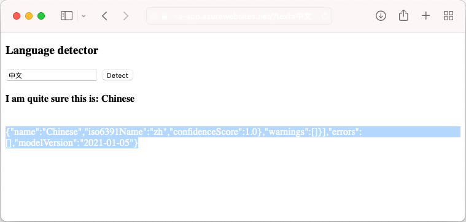

1. Configure the Azure AI services secrets as app settings `CS_ACCOUNT_NAME` and `CS_ACCOUNT_KEY`.

    ```azurecli-interactive
    # Get subscription key for Cognitive Services resource
    csKey1=$(az cognitiveservices account keys list --resource-group $groupName --name $csResourceName --query key1 --output tsv)

    az webapp config appsettings set --resource-group $groupName --name $appName --settings CS_ACCOUNT_NAME="$csResourceName" CS_ACCOUNT_KEY="$csKey1"
    ````

1. In the browser, navigate to your deploy app at `<app-name>.azurewebsites.net` and try out the language detector with strings in various languages.

    

    If you look at the application code, you may notice the debug output for the detection results in the same font color as the background. You can see it by trying to highlight the white space directly below the result.

## Secure back-end connectivity

At the moment, connection secrets are stored as app settings in your App Service app. This approach is already securing connection secrets from your application codebase. However, any contributor who can manage your app can also see the app settings. In this step, you move the connection secrets to a key vault, and lock down access so that only you can manage it and only the App Service app can read it using its managed identity.

1. Create a key vault. Replace *\<vault-name>* with a unique name.

    ```azurecli-interactive
    # Save app name as variable for convenience
    vaultName=<vault-name>

    az keyvault create --resource-group $groupName --name $vaultName --location $region --sku standard --enable-rbac-authorization
    ```

    The `--enable-rbac-authorization` parameter [sets Azure role-based access control (RBAC) as the permission model](../../../key-vault/general/rbac-guide.md#using-azure-rbac-secret-key-and-certificate-permissions-with-key-vault). This setting by default invalidates all access policies permissions.

1. Give yourself the *Key Vault Secrets Officer* RBAC role for the vault.
    
    ```azurecli-interactive
    vaultResourceId=$(az keyvault show --name $vaultName --query id --output tsv)
    myId=$(az ad signed-in-user show --query id --output tsv)
    az role assignment create --role "Key Vault Secrets Officer" --assignee-object-id $myId --assignee-principal-type User --scope $vaultResourceId
    ```

1. Enable the system-assigned managed identity for your app, and give it the *Key Vault Secrets User* RBAC role for the vault.

    ```azurecli-interactive
    az webapp identity assign --resource-group $groupName --name $appName --scope $vaultResourceId --role  "Key Vault Secrets User"
    ```

1. Add the Azure AI services resource name and subscription key as secrets to the vault, and save their IDs as environment variables for the next step.

    ```azurecli-interactive
    csResourceKVUri=$(az keyvault secret set --vault-name $vaultName --name csresource --value $csResourceName --query id --output tsv)
    csKeyKVUri=$(az keyvault secret set --vault-name $vaultName --name cskey --value $csKey1 --query id --output tsv)
    ```

1. Previously, you set the secrets as app settings `CS_ACCOUNT_NAME` and `CS_ACCOUNT_KEY` in your app. Now, set them as [key vault references](../../app-service-key-vault-references.md) instead.

    ```azurecli-interactive
    az webapp config appsettings set --resource-group $groupName --name $appName --settings CS_ACCOUNT_NAME="@Microsoft.KeyVault(SecretUri=$csResourceKVUri)" CS_ACCOUNT_KEY="@Microsoft.KeyVault(SecretUri=$csKeyKVUri)"
    ```

1. In the browser, navigate to `<app-name>.azurewebsites.net` again. If you get detection results back, then you're connecting to the Azure AI services endpoint with key vault references.

Congratulations, your app is now connecting to Azure AI services using secrets kept in your key vault, without any changes to your application code.

## Clean up resources

In the preceding steps, you created Azure resources in a resource group. If you don't expect to need these resources in the future, delete the resource group by running the following command in the Cloud Shell:

```azurecli-interactive
az group delete --name $groupName
```

This command may take a minute to run.

## Next steps

- [Tutorial: Isolate back-end communication with Virtual Network integration](../../tutorial-networking-isolate-vnet.md)
- [Integrate your app with an Azure virtual network](../../overview-vnet-integration.md)
- [App Service networking features](../../networking-features.md)
