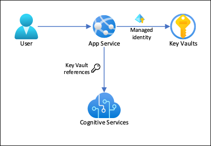

[Azure App Service](../../overview.md) can use [managed identities](../../overview-managed-identity.md) to connect to back-end services without a connection string, which eliminates connection secrets to manage and keeps your back-end connectivity secure in a production environment. For back-end services that don't support managed identities and still requires connection secrets, you can use Key Vault to manage connection secrets. This tutorial uses Azure AI services as an example to show you how it's done in practice. When you're finished, you have an app that makes programmatic calls to Azure AI services, without storing any connection secrets inside App Service.

* [Sample application](https://github.com/Azure-Samples/app-service-language-detector)

> [!TIP]
> Azure AI services do [support authentication through managed identities](../../../ai-services/authentication.md#authorize-access-to-managed-identities), but this tutorial uses the [subscription key authentication](../../../ai-services/authentication.md#authenticate-with-a-single-service-resource-key) to demonstrate how you could connect to an Azure service that doesn't support managed identities from App Services.



With this architecture: 

- Connectivity to Key Vault is secured by managed identities
- App Service accesses the secrets using [Key Vault references](../../app-service-key-vault-references.md) as app settings.
- Access to the key vault is restricted to the app. App contributors, such as administrators, may have complete control of the App Service resources, and at the same time have no access to the Key Vault secrets.
- If your application code already accesses connection secrets with app settings, no change is required.

What you will learn:

> [!div class="checklist"]
> * Enable managed identities
> * Use managed identities to connect to Key Vault
> * Use Key Vault references
> * Access Azure AI services

## Prerequisites

Prepare your environment for the Azure CLI.

[!INCLUDE [azure-cli-prepare-your-environment-no-header.md](~/articles/reusable-content/azure-cli/azure-cli-prepare-your-environment-no-header.md)]

<a name='create-app-with-connectivity-to-cognitive-services'></a>

## Create app with connectivity to Azure AI services

1. Create a resource group to contain all of your resources:

    ```azurecli-interactive
    # Save resource group name as variable for convenience
    groupName=myKVResourceGroup
    region=westeurope

    az group create --name $groupName --location $region
    ```

1. Create an Azure AI services resource. Replace *\<cs-resource-name>* with a unique name of your choice.

    ```azurecli-interactive
    # Save resource name as variable for convenience. 
    csResourceName=<cs-resource-name>

    az cognitiveservices account create --resource-group $groupName --name $csResourceName --location $region --kind TextAnalytics --sku F0 --custom-domain $csResourceName
    ```

    > [!NOTE]
    > `--sku F0` creates a free tier Azure AI services resource. Each subscription is limited to a quota of one free-tier `TextAnalytics` resource. If you're already over the quota, use `--sku S` instead.
