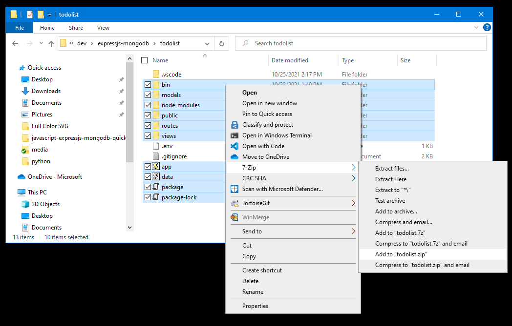

Applications can be deployed to Azure by creating a ZIP file of the application artifacts and uploading the ZIP file to Azure. ZIP files can be uploaded to Azure using the Azure CLI or a HTTP client like [Postman](https://www.postman.com/downloads/) or [cURL](https://curl.se/).

There are two approaches of deploying a ZIP file to Azure:

* Deploying a ZIP file that contains all artifacts (such as node_modules) needed for the application.
* Deploying a ZIP file only containing the application source code and making use of Azure's build automation.

In this tutorial, you will enable build automation in Azure App Service. By enabling build automation, App Service will run build tasks like `npm` for you such that you only need to include your application source code in your zip file.

#### Enable build automation

To enable build automation, set the `SCM_DO_BUILD_DURING_DEPLOYMENT` app setting in either the Azure portal or Azure CLI.

##### [Azure portal](#tab/deploy-instructions-azportal)

| Instructions    | Screenshot |
|:----------------|-----------:|
| [!INCLUDE [Enable build automation from Azure portal 1](<./build-settings-azure-portal-1.md>)] | :::image type="content" source="../../media/tutorial-nodejs-mongodb-app/build-settings-azure-portal-1-240px.png" alt-text="A screenshot showing the app settings for a web app and how to add a new setting in the Azure portal." lightbox="../../media/tutorial-nodejs-mongodb-app/build-settings-azure-portal-1.png"::: |
| [!INCLUDE [Enable build automation from Azure portal 2](<./build-settings-azure-portal-2.md>)] | :::image type="content" source="../../media/tutorial-nodejs-mongodb-app/build-settings-azure-portal-2-240px.png" alt-text="A screenshot showing the dialog box used to add an app settings in the Azure portal." lightbox="../../media/tutorial-nodejs-mongodb-app/build-settings-azure-portal-2.png"::: |

##### [Azure CLI](#tab/deploy-instructions-azcli)

Use the [az webapp config appsettings set](/cli/azure/webapp/config/appsettings#az-webapp-config-appsettings-set) command to set the `SCM_DO_BUILD_DURING_DEPLOYMENT` setting to a value of `true`.

[!INCLUDE [Azure CLI build automation commands](<./deploy-zip-build-settings.md>)]

---

#### Create a ZIP file of your application

Create a ZIP file of your application. You only need to include the application source code and should not include any files or directories that start with a dot (`.`) such as `.env`, `.gitignore`, `.github`, or `.vscode`. You also should not include the `node_modules` directory since you enabled build automation in the last step.

##### [Linux/Mac](#tab/deploy-zip-linux-mac)

On Linux or Mac, you can use the built in `zip` utility to create a ZIP file.

```bash
zip -r <file-name>.zip . -x '.??*'
```

##### [Windows](#tab/deploy-zip-windows)

On Windows, use a program like 7-Zip to create a ZIP file needed to deploy the application.



---

#### Upload the ZIP file to Azure

Once you have a ZIP file, the file can be uploaded to Azure using either Azure CLI or an HTTP client like Postman or cURL.

##### [Azure CLI](#tab/deploy-instructions--zip-azcli)

The [az webapp deploy](/cli/azure/webapp#az-webapp-deploy) command can be used to upload and deploy a zip file to Azure.

[!INCLUDE [Azure CLI deploy commands](<./deploy-zip-cli-commands.md>)]

##### [Postman](#tab/deploy-instructions--zip-postman)

To use [Postman](https://www.postman.com/downloads/) to upload your ZIP file to Azure, you will need the deployment username and password for your App Service. These credentials can be obtained from the Azure portal.

1. On the page for the web app, select **Deployment center** from the menu on the left side of the page.
1. Select the **FTPS credentials** tab.
1. The **Username** and **Password** are shown under the **Application scope** heading.  For zip file deployments, only use the part of the username after the `\` character that starts with a `$`, for example `$msdocs-python-webapp-quickstart-123`. These credentials will be needed when uploading your zip file with Postman.

:::image type="content" source="../../media/tutorial-nodejs-mongodb-app/deploy-zip-azure-portal-get-username-600px.png" alt-text="A screenshot showing the location of the deployment credentials in the Azure portal." lightbox="../../media/tutorial-nodejs-mongodb-app/deploy-zip-azure-portal-get-username.png":::

In Postman, upload your file using the following steps.

| Instructions    | Screenshot |
|:----------------|-----------:|
| [!INCLUDE [Postman upload step 1](<./deploy-zip-postman-1.md>)] | :::image type="content" source="../../media/tutorial-nodejs-mongodb-app/deploy-zip-postman-1-240px.png" alt-text="A screenshot showing how to configure Postman with the HTTP method and deployment endpoint." lightbox="../../media/tutorial-nodejs-mongodb-app/deploy-zip-postman-1.png"::: |
| [!INCLUDE [Postman upload step 2](<./deploy-zip-postman-2.md>)] | :::image type="content" source="../../media/tutorial-nodejs-mongodb-app/deploy-zip-postman-2-240px.png" alt-text="A screenshot showing how to enter the deployment credentials in Postman." lightbox="../../media/tutorial-nodejs-mongodb-app/deploy-zip-postman-2.png"::: |
| [!INCLUDE [Postman upload step 3](<./deploy-zip-postman-3.md>)] | :::image type="content" source="../../media/tutorial-nodejs-mongodb-app/deploy-zip-postman-3-240px.png" alt-text="A screenshot showing how to set the upload type to binary and select the file to upload in Postman." lightbox="../../media/tutorial-nodejs-mongodb-app/deploy-zip-postman-3.png"::: |
| [!INCLUDE [Postman upload step 4](<./deploy-zip-postman-4.md>)] | :::image type="content" source="../../media/tutorial-nodejs-mongodb-app/deploy-zip-postman-4-240px.png" alt-text="A screenshot showing how to send a request to upload the zip file in Postman." lightbox="../../media/tutorial-nodejs-mongodb-app/deploy-zip-postman-4.png"::: |

Depending on your network bandwidth, files usually take between 10 and 30 seconds to upload to Azure.

##### [cURL](#tab/deploy-instructions--zip-curl)

To use cURL to upload your ZIP file to Azure, you will need the deployment username and password for your App Service. These credentials can be obtained from the Azure portal.

1. On the page for the web app, select **Deployment center** from the menu on the left side of the page.
1. Select the **FTPS credentials** tab.
1. The **Username** and **Password** are shown under the **Application scope** heading.  For zip file deployments, only use the part of the username after the `\` character that starts with a `$`, for example `$msdocs-python-webapp-quickstart-123`. These credentials will be needed in the cURL command.

:::image type="content" source="../../media/tutorial-nodejs-mongodb-app/deploy-zip-azure-portal-get-username-600px.png" alt-text="A screenshot showing the location of the deployment credentials in the Azure portal." lightbox="../../media/tutorial-nodejs-mongodb-app/deploy-zip-azure-portal-get-username.png":::

Run the following `curl` command to upload your zip file to Azure and deploy your application.

[!INCLUDE [cURL commands](<./deploy-zip-curl-commands.md>)]

Depending on your network bandwidth, files usually take between 10 and 30 seconds to upload to Azure.

---
