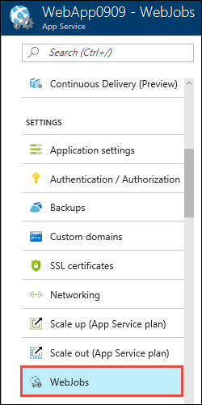
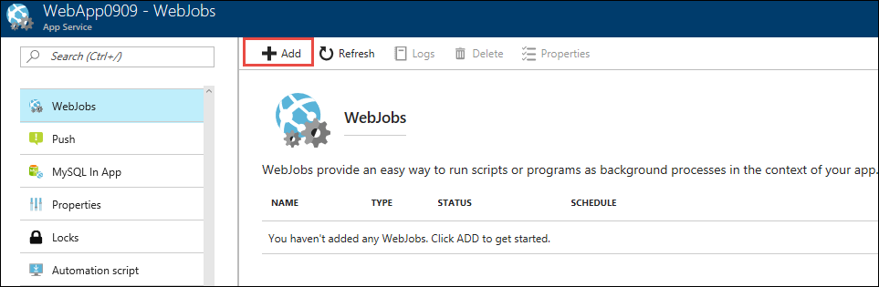
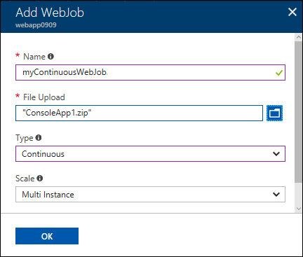
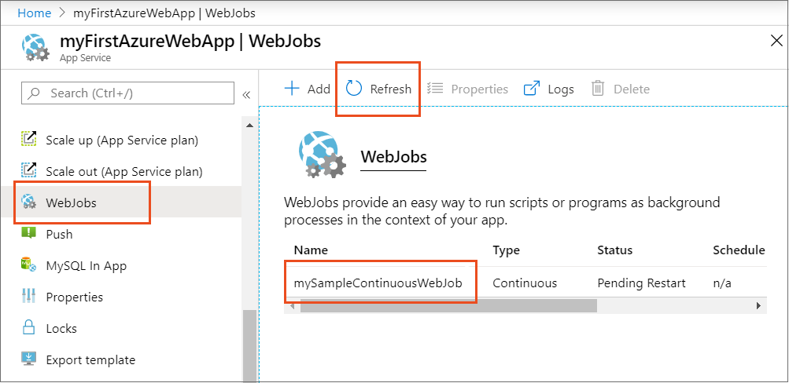
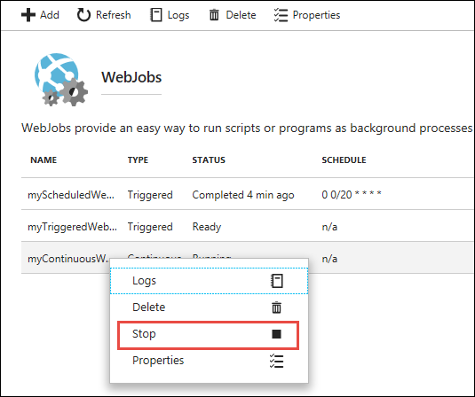

---
author: ggailey777
ms.assetid: af01771e-54eb-4aea-af5f-f883ff39572b
ms.topic: include
ms.date: 10/16/2018
ms.title: include
ROBOTS: NOINDEX,NOFOLLOW
---

##  Create a continuous WebJob

1. Got to the [Azure portal](https://portal.azure.com).
1. Go to your **App Service** of your <abbr title="Your app resource may be a web app, API app, or mobile app.">App resource</abbr>.
1. Select **WebJobs**.

   

1. In the **WebJobs** page, select **Add**.

    

1. Use the **Add WebJob** settings as specified in the table.

   

   | Setting      | Sample value   | 
   | ------------ | ----------------- | 
   | <abbr title="A name that is unique within an App Service app. Must start with a letter or a number and cannot contain special characters other than `-` and `_`.">Name</abbr> | myContinuousWebJob | 
   | <abbr title=" A *.zip* file that contains your executable or script file as well as any supporting files needed to run the program or script.">File Upload</abbr> | ConsoleApp.zip |
   | <abbr title="Types include continuous, triggered.">Type</abbr> | Continuous | 
   | <abbr title="Available only for Continuous WebJobs. Determines whether the program or script runs on all instances or just one instance. The option to run on multiple instances doesn't apply to the Free or Shared pricing tiers.">Scale</abbr> | Multi instance | 

1. Click **OK**.

    The new WebJob appears on the **WebJobs** page.

    

1. **To stop or restart** a continuous WebJob, right-click the WebJob in the list and click **Stop** or **Start**.

   
