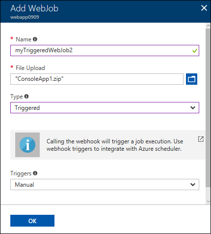
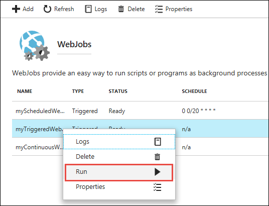

---
author: ggailey777
ms.assetid: af01771e-54eb-4aea-af5f-f883ff39572b
ms.topic: include
ms.date: 10/16/2018
ms.title: include
ROBOTS: NOINDEX,NOFOLLOW
---

##  Create a manually triggered WebJob

1. Got to the [Azure portal](https://portal.azure.com).
1. Go to your **App Service** of your <abbr title="Your app resource may be a web app, API app, or mobile app.">App resource</abbr>.
1. Select **WebJobs**.

    

2. In the **WebJobs** page, select **Add**.

   

3. Use the **Add WebJob** settings as specified in the table.

    
    
    | Setting      | Sample value   | 
    | ------------ | ----------------- | 
   | <abbr title="A name that is unique within an App Service app. Must start with a letter or a number and cannot contain special characters other than `-` and `_`.">Name</abbr> | myTriggeredWebJob | 
    | <abbr title="A *.zip* file that contains your executable or script file as well as any supporting files needed to run the program or script.">File Upload</abbr> | ConsoleApp.zip |
    | <abbr title="Types include continuous, triggered.">Type</abbr> | Triggered | 
    | <abbr title="Types include scheduled or manual">Triggers</a> | Manual | |

4. Click **OK**. 

   The new WebJob appears on the **WebJobs** page.

   

7. **To run a manual WebJob**, right-click its name in the list and click **Run**.
   
    

