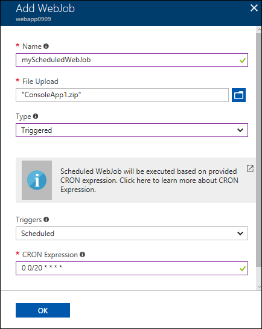

---
author: ggailey777
ms.assetid: af01771e-54eb-4aea-af5f-f883ff39572b
ms.topic: include
ms.date: 10/16/2018
ms.title: include
ROBOTS: NOINDEX,NOFOLLOW
---


## <a name="CreateScheduledCRON"></a> Create a scheduled WebJob


1. Got to the [Azure portal](https://portal.azure.com).
1. Go to your **App Service** of your <abbr title="Your app resource may be a web app, API app, or mobile app.">App resource</abbr>.
1. Select **WebJobs**.

   

1. In the **WebJobs** page, select **Add**.

    

1. Use the **Add WebJob** settings as specified in the table.

    
    
    | Setting      | Sample value   |
    | ------------ | ----------------- | 
    | <abbr title="A name that is unique within an App Service app. Must start with a letter or a number and cannot contain special characters other than `-` and `_`.">Name</a> | myScheduledWebJob |  |
    | <abbr title="A *.zip* file that contains your executable or script file as well as any supporting files needed to run the program or script.">File Upload</abbr> | ConsoleApp.zip |
    | <abbr title="Types include continuous, triggered.">Type</abbr> | Triggered |
    | <abbr title="For the scheduling to work reliably, enable the Always On feature. Always On is available only in the Basic, Standard, and Premium pricing tiers.">Triggers</a> | Scheduled |
    | CRON Expression</a> | 0 0/20 * * * * | 
    
    <br>
    
    <details>
     <summary>Learn more about CRON Expressions</summary>
     <a name="#ncrontab-expressions"></a>
    
     You can enter a [NCRONTAB expression](../../azure-functions/functions-bindings-timer.md#ncrontab-expressions) in the portal or include a `settings.job` file at the root of your WebJob *.zip* file, as in the following example:
     
     ```json
     {
         "schedule": "0 */15 * * * *"
     }
     ```
     
     To learn more, see [Scheduling a triggered WebJob](../webjobs-dotnet-deploy-vs.md#scheduling-a-triggered-webjob).
     
     [!INCLUDE [webjobs-cron-timezone-note](../../../includes/webjobs-cron-timezone-note.md)]
     </details>
     <br>

1. Click **OK**.

    The new WebJob appears on the **WebJobs** page.
    
    
