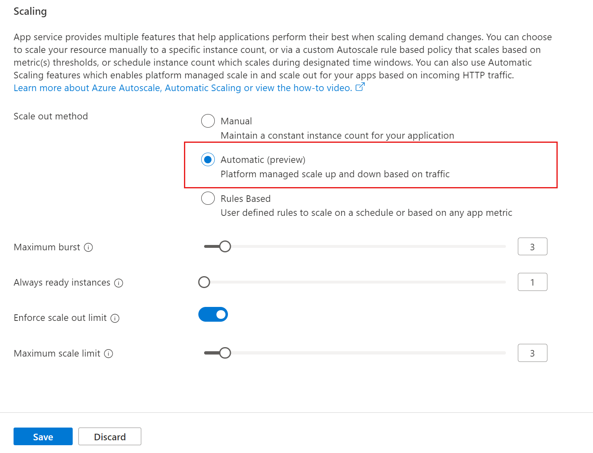
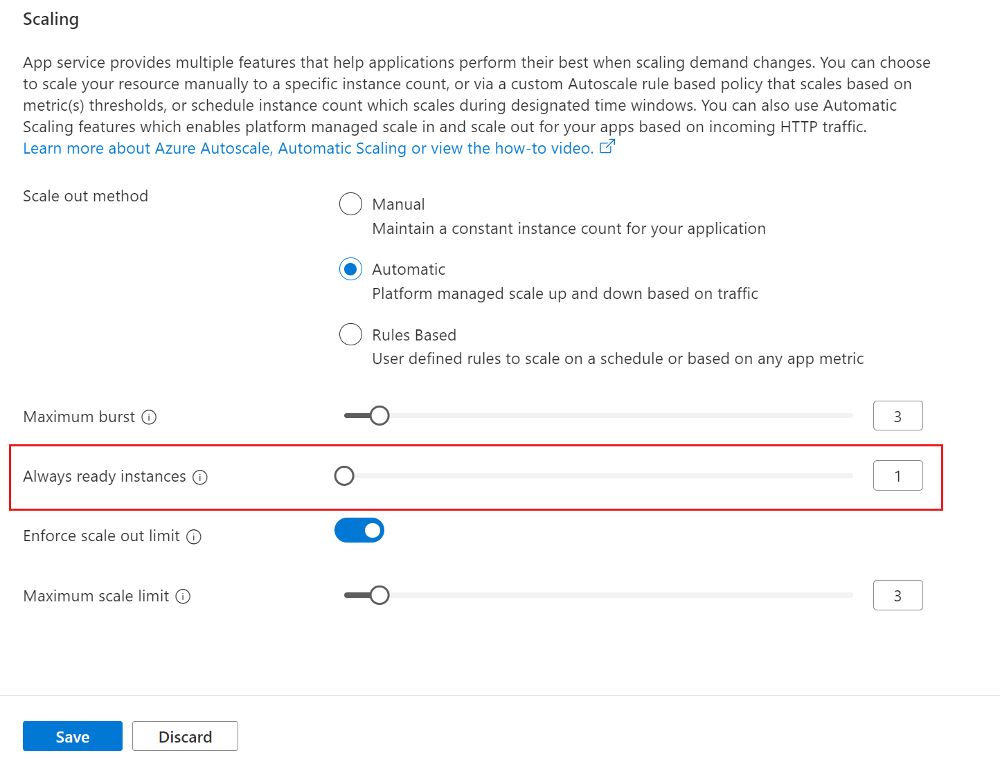
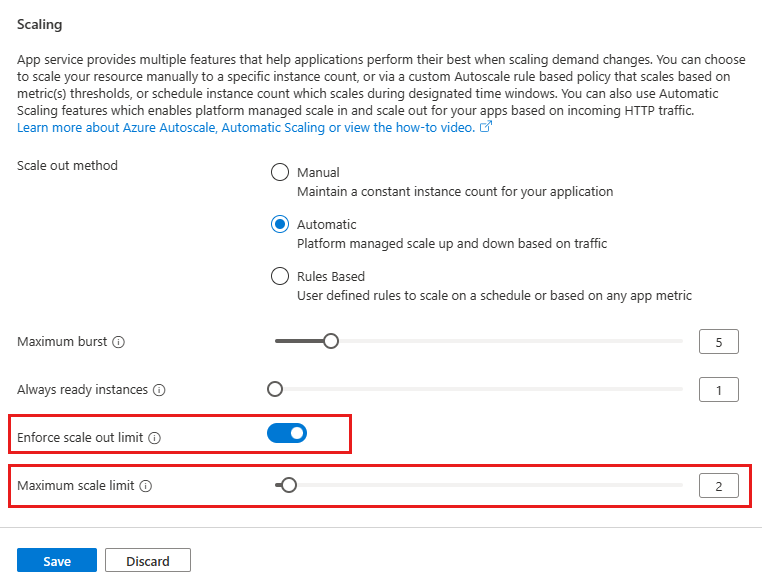
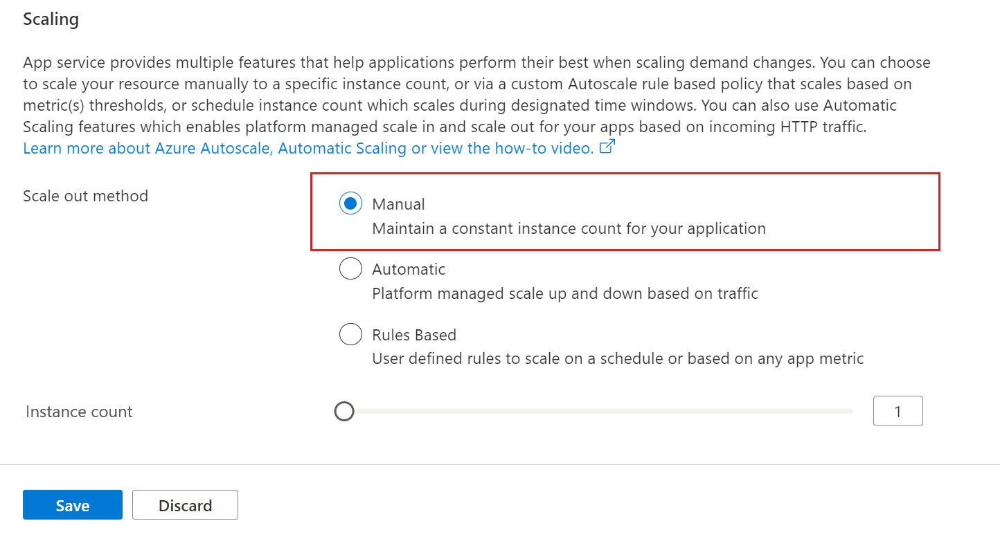

# Automatic scaling in Azure App Service

> [!NOTE]
> Automatic scaling is in preview.
>

App Service has an automatic scaling capability that adjusts the number of running instances of your application based on incoming HTTP requests. This ensures that your web applications can handle varying levels of traffic. You have control over scaling settings, such as defining the minimum and maximum number of instances per web app, to optimize performance and avoid bottlenecks. The platform also addresses cold start issues with pre-warmed instances that act as a buffer when scaling out, ensuring smooth performance transitions. automatic scaling is available for the Premium Pv2 and Pv3 pricing tiers, and charges are calculated per second using existing billing meters. Pre-warmed instances are also charged per second.

## How automatic scaling works

It's common to deploy multiple web apps to a single App Service Plan. You can enable automatic scaling for an App Service Plan and configure a range of instances for each of the web apps. As your web app starts receiving incoming HTTP traffic, the App Service monitors the load on the web apps and adds instances. Your web app can scale out to the maximum number of instances defined for the App Service Plan (maximum burst) or a fewer instances if a web app minimum is defined (always ready instances). Resources may be shared when multiple web apps within the App Service Plan are required to scale out simultaneously.

Here are a few scenarios where you should use scale automatically:

- You don't want to set up autoscale rules based on resource metrics.
- You want your web apps within the same App Service Plan to scale differently and independently of each other.
- A web app is connected to backend data sources like databases or legacy systems, which may not be able to scale as fast as the web app. Scaling automatically allows you to set the maximum number of instances your App Service Plan can scale to. This setting helps where the backend is a bottleneck to scaling and is overwhelmed by the web app.

> [!IMPORTANT]
> [`Always ON`](./configure-common.md?tabs=portal#configure-general-settings) needs to be disabled to use automatic scaling.
>

## Enable automatic scaling

When you enable automatic scaling, you can define maximum number of instances your App Service Plan can scale out to based on incoming HTTP requests. This is called the __maximum burst__. All web apps within this App Service Plan can scale out up to the maximum burst defined for the App Service Plan. For a premium v2 & v3 App Service Plans you can define a value of up to 30 instances as the maximum burst. Maximum burst value should be greater than or equal to the value of number of workers for the App Service Plan. 

#### [Azure portal](#tab/azure-portal)

1. In your App Service web app's left menu, select **Scale out (App Service Plan)**.



2. Select **Automatic (preview)** and then select the **Save** button.

#### [Azure CLI](#tab/azure-cli)

The following command enables automatic scaling for your existing App Service Plan and web apps within this plan:

```azurecli-interactive
az appservice plan update --name <AppServicePlan> --resource-group <RESOURCE_GROUP> --elastic-scale true --max-elastic-worker-count <YOUR_MAX_BURST> 
```

- `--elastic-scale true` enables automatic scaling.
- `<YOUR_MAX_BURST>` should be equal to or greater than number of workers in your App Service Plan, and less than or equal to the maximum instances allowed for your App Service Plan.

>[!NOTE]
> If you receive an error message `Operation returned an invalid status 'Bad Request'`, try using a different resource group or create a new one.
>

--- 

## Set minimum number of instances

__Always ready instances__ is an app-level setting to specify the minimum number of instances. If load exceeds what the always ready instances can handle, additional instances are added (up to the specified __maximum burst__ for the App Service Plan).

#### [Azure portal](#tab/azure-portal)

1. In your App Service web app's left menu, select **Scale out (App Service Plan)**.



2. Update the **Always ready instances** number and then select the **Save** button.

#### [Azure CLI](#tab/azure-cli)
```azurecli-interactive
 az webapp update --resource-group <RESOURCE_GROUP> --name <APP_NAME> --minimum-elastic-instance-count <ALWAYS_READY_COUNT> 
```

---

## Update pre-warmed instances

The __pre-warmed instance__ count setting provides warmed instances as a buffer during HTTP scale and activation events. Pre-warmed instances continue to buffer until the maximum scale-out limit is reached. The default pre-warmed instance count is 1 and, for most scenarios, this value should remain as 1.

#### [Azure portal](#tab/azure-portal)

You can't change the pre-warmed instance count setting in the portal, you must instead use the Azure CLI.

#### [Azure CLI](#tab/azure-cli)

You can modify the number of pre-warmed instances for an app using the Azure CLI.

```azurecli-interactive
 az webapp update --resource-group <RESOURCE_GROUP> --name <APP_NAME> --prewarmed-instance-count <PREWARMED_COUNT>
```

---

## Set maximum number of instances (web app)

__Maximum scale limit__ sets the maximum number of instances a web app can scale to. This is most common for cases where a downstream component like a database has limited throughput. The per-app maximum by default is unrestricted up to the app maximum,but you can set a value between 1 and the __maximum burst__ defined for the App Service Plan.

#### [Azure portal](#tab/azure-portal)

1. In your App Service web app's left menu, select **Scale out (App Service Plan)**.



2. Select **Enforce scale out limit** and update the **Always ready instances**.

3. Select the **Save** button.

#### [Azure CLI](#tab/azure-cli)

You can't change the maximum scale limit in Azure CLI, you must instead use the Azure portal.

---


## Disable automatic scaling

#### [Azure portal](#tab/azure-portal)

1. In your App Service web app's left menu, select **Scale out (App Service Plan)**.



2. Select **Manual** and then select the **Save** button.   

#### [Azure CLI](#tab/azure-cli)
The following command disables automatic scaling for your existing App Service Plan and all web apps within this plan:

```azurecli-interactive
az appservice plan update --resource-group <ResourceGroup> --name <AppServicePlan> --elastic-scale false 
```

- Replace `<ResourceGroup>` with the Resource Group name.
- Replace `<AppServicePlan>` with the App Service Plan name.
- Set the `--elastic-scale` argument to false to disable automatic scaling.

--- 

## Frequently asked questions
- [What App Service platforms are supported?](#what-app-service-platforms-support-automatic-scaling)
- [How is automatic scaling different than autoscale?](#how-is-automatic-scaling-different-than-autoscale)
- [How does automatic scaling work with existing Auto scale rules?](#how-does-automatic-scaling-work-with-existing-autoscale-rules)
- [Does automatic scaling support Azure Function apps?](#does-automatic-scaling-support-azure-function-apps)
- [How to monitor the current instance count and instance history?](#how-to-monitor-the-current-instance-count-and-instance-history)

### What App Service platforms support automatic scaling?
- Automatic scaling is currently supported for all app types in Azure App Service. It's supported in Windows, Linux and Windows container.
- Automatic scaling is available only for Azure App Services Premium Pv2 and Pv3 pricing tiers.     

### How is automatic scaling different than autoscale?
Automatic scaling is a new scaling option in App Service that automatically handles web app scaling decisions for you. **[Azure autoscale](../azure-monitor/autoscale/autoscale-overview.md)** is a pre-existing Azure capability for defining schedule-based and resource-based scaling rules for your App Service Plans. 

A quick comparison of various scale out and scale in options available for App Service web apps:

| | **Manual scaling** | **Auto scaling** | **Automatic scaling** |
| --- | --- | --- | --- |
| Available pricing Tiers	| Basic and Up | Standard and Up | Premium v2 and Premium v3 |
|Rule Based Scaling	|No	|Yes	|No(Scale out & in managed by the platform based on incoming HTTP traffic)|
|Schedule Based Scaling	|No	|Yes	|No|
|Always Ready Instances | No. Your web app will always run on the number of manually scaled instances.	| No. Your web app will run on other instances available during the scale out operation, based on threshold defined for auto scale rules. | Yes (Minimum of 1) |
|Prewarmed Instances	|No	|No	|Yes (Defaulted to 1) |
|Per-App Maximum	|No	|No	|Yes|

### How does automatic scaling work with existing autoscale rules?
Once automatic scaling for web apps is configured, existing Azure autoscale rules and schedules will not work. Applications can use either automatic scaling, or autoscale, but not both.

### Does automatic scaling support Azure Function apps?
No. You can only have Azure App Service web apps in the App Service Plan where you wish to enable automatic scaling. If you have existing Azure Functions apps in the same App Service Plan, or if you create new Azure Functions apps, then automatic scaling is disabled. For Functions, it's recommended to use the Azure Functions Premium plan instead.

### How to monitor the current instance count and instance history?
Use Application Insights [Live Metrics](../azure-monitor/app/live-stream.md) to check the current instance count, and [performanceCounters](../azure-functions/analyze-telemetry-data.md#query-telemetry-data) to check the instance count history.

<a name="Next Steps"></a>

## More resources

* [Scale instance count manually or automatically](../azure-monitor/autoscale/autoscale-get-started.md)
* [Configure PremiumV3 tier for App Service](app-service-configure-premium-tier.md)
* [Tutorial: Run a load test to identify performance bottlenecks in a web app](../load-testing/tutorial-identify-bottlenecks-azure-portal.md)