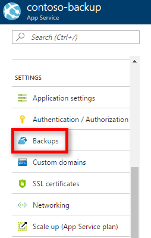
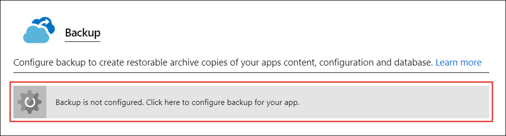
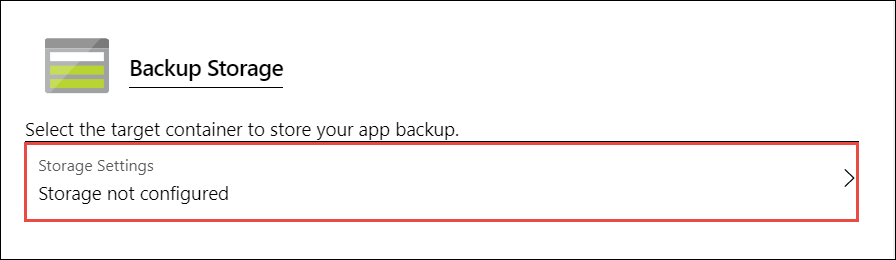
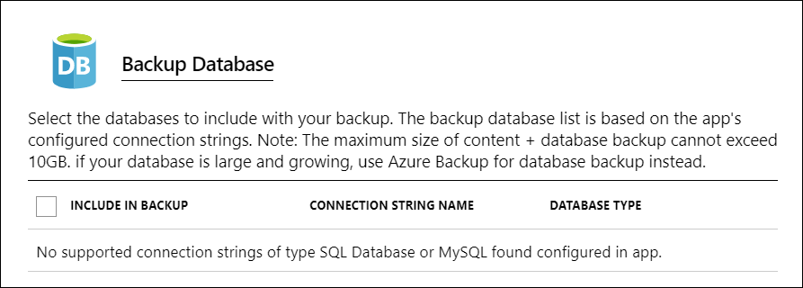
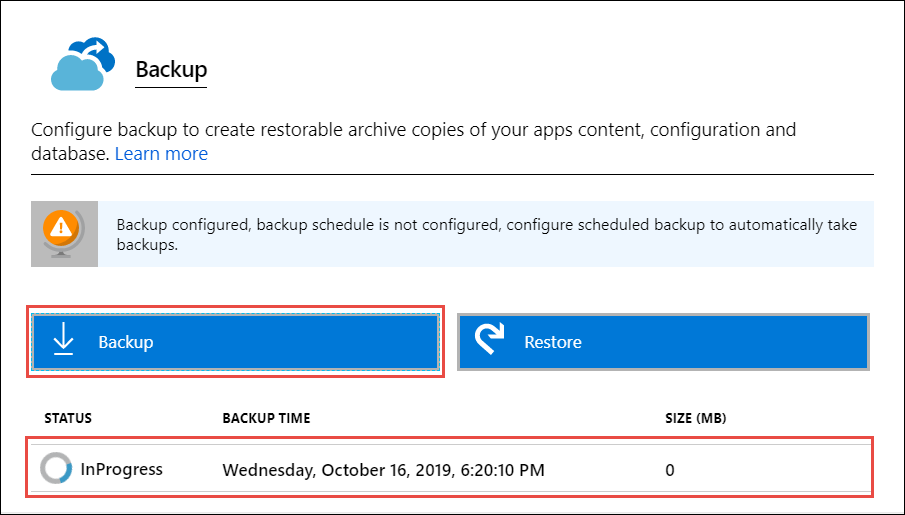
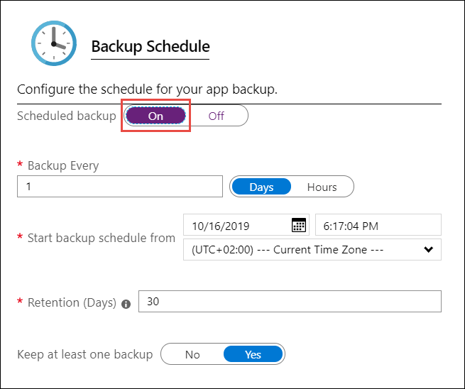
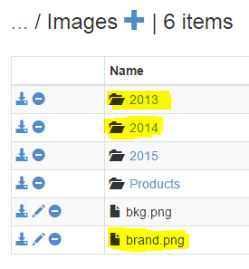

# Back up your app in Azure
The Backup and Restore feature in [Azure App Service](overview.md) lets you easily
create app backups manually or on a schedule. You can configure the backups to be retained up to an indefinite amount of time. You can restore the app to a snapshot of a previous state by overwriting the existing app or restoring to another app.

For information on restoring an app from backup, see [Restore an app in Azure](web-sites-restore.md).

<a name="whatsbackedup"></a>

## What gets backed up
App Service can back up the following information to an Azure storage account and container that you have configured your app to use. 

* App configuration
* File content
* Database connected to your app

The following database solutions are supported with backup feature: 

- [SQL Database](https://azure.microsoft.com/services/sql-database/)
- [Azure Database for MySQL](https://azure.microsoft.com/services/mysql)
- [Azure Database for PostgreSQL](https://azure.microsoft.com/services/postgresql)
- [MySQL in-app](https://azure.microsoft.com/blog/mysql-in-app-preview-app-service/)
 

> [!NOTE]
> Each backup is a complete offline copy of your app, not an incremental update.
>

<a name="requirements"></a>

## Requirements and restrictions
* The Backup and Restore feature requires the App Service plan to be in the **Standard**, **Premium** or **Isolated** tier. For more information about scaling your App Service plan to use a higher tier, see [Scale up an app in Azure](manage-scale-up.md). **Premium** and **Isolated** tiers allow a greater number of daily back ups than **Standard** tier.
* You need an Azure storage account and container in the same subscription as the app that you want to back up. For more information on Azure storage accounts, see [Azure storage account overview](https://docs.microsoft.com/azure/storage/common/storage-account-overview).
* Backups can be up to 10 GB of app and database content. If the backup size exceeds this limit, you get an error.
* Backups of TLS enabled Azure Database for MySQL is not supported. If a backup is configured, you will get failed backups.
* Backups of TLS enabled Azure Database for PostgreSQL is not supported. If a backup is configured, you will get failed backups.
* In-app MySQL databases are automatically backed up without any configuration. If you make manually settings for in-app MySQL databases, such as adding connection strings, the backups may not work correctly.
* Using a firewall enabled storage account as the destination for your backups is not supported. If a backup is configured, you will get failed backups.


<a name="manualbackup"></a>

## Create a manual backup
1. In the [Azure portal](https://portal.azure.com), navigate to your app's page, select **Backups**. The **Backups** page is displayed.

    

    > [!NOTE]
    > If you see the following message, click it to upgrade your App Service plan before you can proceed with backups.
    > For more information, see [Scale up an app in Azure](manage-scale-up.md).
    > 
    > 
    > 

2. In the **Backup** page, select **Backup is not configured. Click here to configure backup for your app**.

    

3. In the **Backup Configuration** page, click **Storage not configured** to configure a storage account.

    

4. Choose your backup destination by selecting a **Storage Account** and **Container**. The storage account must belong to the same subscription as the app you want to back up. If you wish, you can create a new storage account or a new container in the respective pages. When you're done, click **Select**.

5. In the **Backup Configuration** page that is still left open, you can configure **Backup Database**, then select the databases you want to include in the backups (SQL database or MySQL), then click **OK**.

    

    > [!NOTE]
    > For a database to appear in this list, its connection string must exist in the **Connection strings** section of the **Application settings** page for your app. 
    >
    > In-app MySQL databases are automatically backed up without any configuration. If you make manually settings for in-app MySQL databases, such as adding connection strings, the backups may not work correctly.
    > 
    > 

6. In the **Backup Configuration** page, click **Save**.
7. In the **Backups** page, click **Backup**.

    

    You see a progress message during the backup process.

Once the storage account and container is configured, you can initiate a manual backup at any time.

<a name="automatedbackups"></a>

## Configure automated backups
1. In the **Backup Configuration** page, set **Scheduled backup** to **On**. 

    

2. Configure the backup schedule as desired and select **OK**.

<a name="partialbackups"></a>

## Configure Partial Backups
Sometimes you don't want to back up everything on your app. Here are a few examples:

* You [set up weekly backups](#configure-automated-backups) of your app that contains static content that never changes, such as old blog posts or images.
* Your app has over 10 GB of content (that's the max amount you can back up at a time).
* You don't want to back up the log files.

Partial backups allow you choose exactly which files you want to back up.

> [!NOTE]
> Individual databases in the backup can be 4GB max but the total max size of the backup is 10GB

### Exclude files from your backup
Suppose you have an app that contains log files and static images that have been backup once and are not going to change. In such cases, you can exclude those folders and files from being stored in your future backups. To exclude files and folders from your backups, create a `_backup.filter` file in the `D:\home\site\wwwroot` folder of your app. Specify the list of files and folders you want to exclude in this file. 

You can access your files by navigating to `https://<app-name>.scm.azurewebsites.net/DebugConsole`. If prompted, sign in to your Azure account.

Identify the folders that you want to exclude from your backups. For example, you want to filter out the highlighted folder and files.



Create a file called `_backup.filter` and put the preceding list in the file, but remove `D:\home`. List one directory or file per line. So the content of the file should be:

 ```
\site\wwwroot\Images\brand.png
\site\wwwroot\Images\2014
\site\wwwroot\Images\2013
```

Upload `_backup.filter` file to the `D:\home\site\wwwroot\` directory of your site using [ftp](deploy-ftp.md) or any other method. If you wish, you can create the file directly using Kudu `DebugConsole` and insert the content there.

Run backups the same way you would normally do it, [manually](#create-a-manual-backup) or [automatically](#configure-automated-backups). Now, any files and folders that are specified in `_backup.filter` is excluded from the future backups scheduled or manually initiated. 

> [!NOTE]
> You restore partial backups of your site the same way you would [restore a regular backup](web-sites-restore.md). The restore process does the right thing.
> 
> When a full backup is restored, all content on the site is replaced with whatever is in the backup. If a file is on the site, but not in the backup it gets deleted. But when a partial backup is restored, any content that is located in one of the blacklisted directories, or any blacklisted file, is left as is.
> 


<a name="aboutbackups"></a>

## How backups are stored
After you have made one or more backups for your app, the backups are visible on the **Containers** page of your storage account, and your app. In the storage account, each backup consists of a`.zip` file that contains the backup data and an `.xml` file that contains a manifest of the `.zip` file contents. You can unzip and browse these files if you want to access your backups without actually performing an app restore.

The database backup for the app is stored in the root of the .zip file. For a SQL database, this is a BACPAC file (no file extension) and can be imported. To create a SQL database based on the BACPAC export, see [Import a BACPAC File to Create a New User Database](https://technet.microsoft.com/library/hh710052.aspx).

> [!WARNING]
> Altering any of the files in your **websitebackups** container can cause the backup to become invalid and therefore non-restorable.
> 
> 

## Automate with scripts

You can automate backup management with scripts, using the [Azure CLI](/cli/azure/install-azure-cli) or [Azure PowerShell](/powershell/azure/overview).

For samples, see:

- [Azure CLI samples](samples-cli.md)
- [Azure PowerShell samples](samples-powershell.md)

<a name="nextsteps"></a>

## Next Steps
For information on restoring an app from a backup, see [Restore an app in Azure](web-sites-restore.md). 
