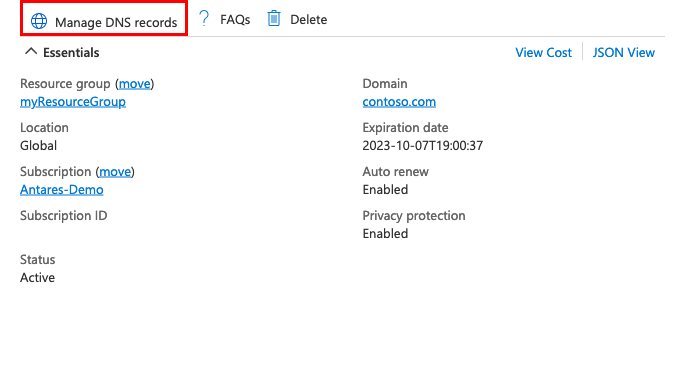

# Buy an App Service domain and configure an app with it

App Service domains are custom domains that are managed directly in Azure. They make it easy to manage custom domains for [Azure App Service](overview.md). This article shows you how to buy an App Service domain and configure an App Service app with it.

## Prerequisites

* [Create an App Service app](./index.yml), or use an app that you created for another tutorial. The app should be in an Azure Public region. At this time, Azure National Clouds are not supported.
* To use an App Service domain, the app's [App Service plan](overview-hosting-plans.md) must be a paid tier and not **Free (F1)**. See [Scale up an app](manage-scale-up.md#scale-up-your-pricing-tier) to update the tier.
* [Remove the spending limit on your subscription](../cost-management-billing/manage/spending-limit.md#remove).

## Buy and map an App Service domain

For pricing information on App Service domains, visit the [App Service Pricing page](https://azure.microsoft.com/pricing/details/app-service/windows/) and scroll down to App Service Domain.

1. In the [Azure portal](https://portal.azure.com), navigate to your app's management page.
1. In the left menu for your app, select **Custom domains**.
1. Select **Buy App Service domain**.

    :::image type="content" source="./media/app-service-web-tutorial-custom-domain/add-app-service-domain.png" alt-text="A screenshot showing how to open the App Service domain wizard." border="true":::

    > [!NOTE]
    > You can also create an App Service domain independently from an app by going to the App Service Domains view and select **Add**, or navigating to [the create page directly](https://portal.azure.com/#create/Microsoft.Domain). But since it's independent from your app, you won't be able to assign hostnames like `www` to your app as if you launch it from your app's **Custom domains** page.

1. In the **Basics** tab, configure the settings using the following table:

   | Setting  | Description |
   | -------- | ----------- |
   | **Subscription** | The subscription to use to buy the domain. |
   | **Resource Group** | The resource group to put the domain in. For example, the resource group your app is in. |
   | **Domain** | Type the domain you want. For example, **contoso.com**. If the domain you want isn't available, you can select from a list of suggestions of available domains, or try a different domain. |

    > [!NOTE]
    > The following [top-level domains](https://wikipedia.org/wiki/Top-level_domain) are supported by App Service domains: _com_, _net_, _co.uk_, _org_, _nl_, _in_, _biz_, _org.uk_, and _co.in_.
    >
    >
    
1. Select **Next: Contact information** and supply your information as required by [ICANN](https://lookup.icann.org/) for the domain registration. 

    It's important that you fill out all required fields with as much accuracy as possible. Incorrect data for contact information can result in failure to buy the domain.

1. Select **Next: Hostname assignment** and verify the default hostnames to map to your app:

   | Hostname  | Description |
   | -------- | ----------- |
   | **root(@)** | The root or apex subdomain. If you buy the `contoso.com` domain, then it's the root domain. Select **No** if you don't want to map it to your app. |
   | **'www' subdomain** | If you buy the `contoso.com` domain, the `www` subdomain would be `www.contoso.com`. Select **No** if you don't want to map it to your app. |

    > [!NOTE]
    > If you didn't launch the App Service domain wizard from an app's **Custom domains** page, you won't see this tab. You can still add them later by following the steps at [Map a hostname manually](#map-a-hostname-manually).

1. Select **Next: Advanced** and configure the optional settings:  

   | Setting  | Description |
   | -------- | ----------- |
   | **Auto renewal** | Your App Service domain is registered to you at one-year increments. Enable auto renewal so that your domain registration doesn't expire and that you retain ownership of the domain. Your Azure subscription is automatically charged the yearly domain registration fee at the time of renewal. If you leave it disabled, you must [renew it manually](#renew-the-domain). |
   | **Privacy protection** | Enabled by default. Privacy protection hides your domain registration contact information from the WHOIS database. Privacy protection is already included in the yearly domain registration fee. To opt out, select **Disable**. |

1. Select **Next: Tags** and set the tags you want for your App Service domain. Tagging isn't required for using App Service domains, but is a [feature in Azure that helps you manage your resources](../azure-resource-manager/management/tag-resources.md).

1. Select **Next: Review + create** and review your domain order. When finished, select **Create**.

    > [!NOTE]
    > App Service Domains use GoDaddy for domain registration and Azure DNS to host the domains. In addition to the yearly domain registration fee, usage charges for Azure DNS apply. For information, see [Azure DNS Pricing](https://azure.microsoft.com/pricing/details/dns/).
    >
    >

1. When the domain registration is complete, you see a **Go to resource** button. Select it to see its management page.

    :::image type="content" source="./media/app-service-web-tutorial-custom-domain/deployment-complete.png" alt-text="A screenshot showing App Service domain creation completed." border="true":::

You're now ready to assign an App Service app to this custom domain.

> [!NOTE]
> Depending on the subscription type, a sufficient payment history may be required prior to creating an App Service domain. 

## Map a hostname manually

If launched from an app's **Custom domains** page, the App Service domain wizard already lets you map the root domain (like `contoso.com`) and the `www` subdomain (like `www.contoso.com`) to your app. You can map any other subdomain to your app, like `shoppingcart` (as in `shoppingcart.contoso.com`).

1. In the [Azure portal](https://portal.azure.com), navigate to your app's management page.
1. In the left menu for your app, select **Custom domains**.
1. Select **Add custom domain**.

    :::image type="content" source="./media/app-service-web-tutorial-custom-domain/add-custom-domain.png" alt-text="A screenshot showing how to open the Add custom domain dialog." border="true":::

1. For **Domain provider**, select **App Service Domain**.

1. For **TLS/SSL certificate**, select **App Service Managed Certificate** if your app is in **Basic** tier or higher. If you want to remain in **Shared** tier, or if you want to use your own certificate, select **Add certificate later**.

1. For **TLS/SSL type**, select the binding type you want.

    [!INCLUDE [Certificate binding types](../../includes/app-service-ssl-binding-types.md)]

1. In **App Service Domain**, select an App Service domain in your subscription.

    > [!NOTE]
    > To map from an App Service domain in a different subscription, see [Map an externally purchased domain](app-service-web-tutorial-custom-domain.md). In this case, Azure DNS is the external domain provider, and you need to add the required DNS records manually.
    >

1. In **Domain type**, configure the domain type you want to map:

   | Domain type  | Description |
   | -------- | ----------- |
   | **Root domain** | The root or apex subdomain. If you buy the `contoso.com` domain, then it's the root domain. |
   | **Subdomain** | In the **Subdomain** textbox, specify a subdomain like `www` or `shoppingcart`. |

1. Select **Add**.

    :::image type="content" source="./media/app-service-web-tutorial-custom-domain/map-app-service-domain-to-app.png" alt-text="A screenshot showing how to map an App Service domain in the Add custom domain dialog." border="true":::

1. You should see the custom domain added to the list. You may also see a red X with **No binding**. 

    If you selected **App Service Managed Certificate** earlier, wait a few minutes for App Service to create the managed certificate for your custom domain. When the process is complete, the red X becomes a green check mark with **Secured**. If you selected **Add certificate later**, this red X will remain until you [add a private certificate for the domain](configure-ssl-certificate.md) and [configure the binding](configure-ssl-bindings.md).

    :::image type="content" source="./media/app-service-web-tutorial-custom-domain/add-app-service-domain-hostname-complete.png" alt-text="A screenshot showing the custom domains page with the new secured custom domain." border="true":::

    > [!NOTE]
    > Unless you configure a certificate binding for your custom domain, Any HTTPS request from a browser to the domain will receive an error or warning, depending on the browser.

1. Test the mapping by navigating to it (like `shoppingcart.contoso.com`) in the browser.

## Renew the domain

The App Service domain you bought is valid for one year from the time of purchase. You can configure to renew your domain automatically, which will charge your payment method when your domain renews the following year. You can also manually renew your domain name.

If you want to configure automatic renewal, or if you want to manually renew your domain, follow the steps here.

1. In the search bar, search for and select **App Service Domains**.

    :::image type="content" source="./media/app-service-web-tutorial-custom-domain/view-app-service-domains.png" alt-text="A screenshot showing how to open the App Service domain view." border="true":::

1. Select the domain you want to configure.

1. From the left navigation of the domain, select **Domain renewal**. To start renewing your domain automatically, select **On**, otherwise select **Off**. The setting takes effect immediately. If automatic renewal is enabled, on the day after your domain expiration date, Azure attempts to bill you for the domain name renewal.

    :::image type="content" source="./media/custom-dns-web-site-buydomains-web-app/dncmntask-cname-buydomains-autorenew.png" alt-text="Screenshot that shows the option to automatically renew your domain." border="true":::

    > [!NOTE]
    > When navigating away from the page, disregard the "Your unsaved edits will be discarded" error by selecting **OK**.
    >

To manually renew your domain, select **Renew domain**. However, this button isn't active until 90 days before the domain's expiration date.

If your domain renewal is successful, you receive an email notification within 24 hours. 

## Manage custom DNS records

In Azure, DNS records for an App Service Domain are managed using [Azure DNS](https://azure.microsoft.com/services/dns/). You can add, remove, and update DNS records, just like for an externally purchased domain. To manage custom DNS records:

1. In the search bar, search for and select **App Service Domains**.

    :::image type="content" source="./media/app-service-web-tutorial-custom-domain/view-app-service-domains.png" alt-text="A screenshot showing how to open the App Service domain view in the manage custom DNS records section." border="true":::

1. Select the domain you want to configure.

1. From the **Overview** page, select **Manage DNS records**.

    

For information on how to edit DNS records, see [How to manage DNS Zones in the Azure portal](../dns/dns-operations-dnszones-portal.md).

## Cancel purchase (delete domain)

After you purchase the App Service Domain, you have five days to cancel your purchase for a full refund. After five days, you can delete the App Service Domain, but can't receive a refund.

1. In the search bar, search for and select **App Service Domains**.

    :::image type="content" source="./media/app-service-web-tutorial-custom-domain/view-app-service-domains.png" alt-text="A screenshot showing how to open the App Service domain view in the manage custom DNS records section." border="true":::

1. Select the domain you want to configure.

1. In the domain's left navigation, select **Locks**. 

    A delete lock has been created for your domain. As long as a delete lock exists, you can't delete the App Service domain.

1. Select **Delete** to remove the lock.

1. In the domain's left navigation, select **Overview**. 

1. If the cancellation period on the purchased domain hasn't elapsed, select **Cancel purchase**. Otherwise, you see a **Delete** button instead. To delete the domain without a refund, select **Delete**.

    :::image type="content" source="./media/custom-dns-web-site-buydomains-web-app/dncmntask-cname-buydomains-cancel.png" alt-text="Screenshot that shows where to delete or cancel a purchased domain." border="true":::

1. Confirm the operation by selecting **Yes**.

    After the operation is complete, the domain is released from your subscription and available for anyone to purchase again. 

## Frequently asked questions

- [Why do I see "This subscription does not have the billing support to purchase an App Service domain"?](#why-do-i-see-this-subscription-does-not-have-the-billing-support-to-purchase-an-app-service-domain)
- [Why do I get a SubscriptionExceededMaxDomainLimit error when creating an App Service domain?](#why-do-i-get-a-subscriptionexceededmaxdomainlimit-error-when-creating-an-app-service-domain)
- [How do I direct the default URL to a custom directory?](#how-do-i-direct-the-default-url-to-a-custom-directory)

#### Why do I see "This subscription does not have the billing support to purchase an App Service domain"?

Free subscriptions, which don't require a confirmed credit card, do not have the permissions to buy App Service domains in Azure.

#### Why do I get a SubscriptionExceededMaxDomainLimit error when creating an App Service domain?

The number of App Service domains a subscription can have depends on the subscription type. Subscriptions that have a monthly credit allotment, like Visual Studio Enterprise Subscription, have a limit of 1 App Service domain. To increase your limit, convert to a pay-per-use subscription.

#### How do I direct the default URL to a custom directory?

This is not a DNS resolution scenario. By default, App Service directs web requests to the root directory of your app code. To direct them to a subdirectory, such as `public`, see [Redirect to a custom directory](configure-common.md#redirect-to-a-custom-directory).

## Next steps

Learn how to bind a custom TLS/SSL certificate to App Service.

> [!div class="nextstepaction"]
> [Secure a custom DNS name with a TLS binding in Azure App Service](configure-ssl-bindings.md)
