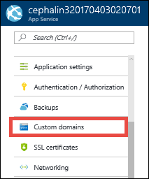
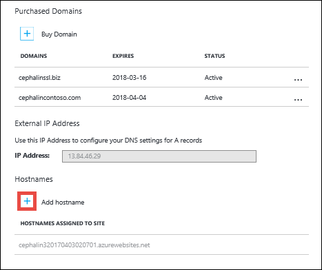
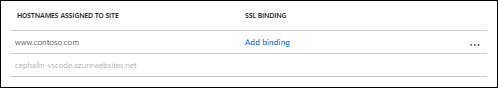
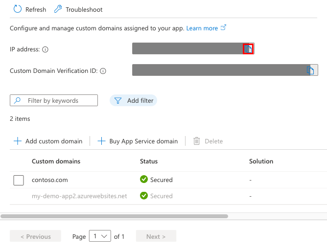

# Migrate an active DNS name to Azure App Service

This article shows you how to migrate an active DNS name to [Azure App Service](../app-service/overview.md) without any downtime.

When you migrate a live site and its DNS domain name to App Service, that DNS name is already serving live traffic. You can avoid downtime in DNS resolution during the migration by binding the active DNS name to your App Service app preemptively.

If you're not worried about downtime in DNS resolution, see [Map an existing custom DNS name to Azure App Service](app-service-web-tutorial-custom-domain.md).

## Prerequisites

To complete this how-to:

- [Make sure that your App Service app is not in FREE tier](app-service-web-tutorial-custom-domain.md#checkpricing).

## Bind the domain name preemptively

When you bind a custom domain preemptively, you accomplish both of the following before making any changes to
your DNS records:

- Verify domain ownership
- Enable the domain name for your app

When you finally migrate your custom DNS name from the old site to the App Service app, there will be no downtime in DNS resolution.

[!INCLUDE [Access DNS records with domain provider](../../includes/app-service-web-access-dns-records.md)]

### Create domain verification record

To verify domain ownership, Add a TXT record. The TXT record maps from _awverify.&lt;subdomain>_ to _&lt;appname>.azurewebsites.net_. 

The TXT record you need depends on the DNS record you want to migrate. For examples, see the following table (`@` typically represents the root domain):

| DNS record example | TXT Host | TXT Value |
| - | - | - |
| \@ (root) | _awverify_ | _&lt;appname>.azurewebsites.net_ |
| www (sub) | _awverify.www_ | _&lt;appname>.azurewebsites.net_ |
| \* (wildcard) | _awverify.\*_ | _&lt;appname>.azurewebsites.net_ |

In your DNS records page, note the record type of the DNS name you want to migrate. App Service supports mappings from CNAME and A records.

> [!NOTE]
> For certain providers, such as CloudFlare, `awverify.*` is not a valid record. Use `*` only instead.

> [!NOTE]
> Wildcard `*` records won't validate subdomains with an existing CNAME's record. You may need to explicitly create a TXT record for each subdomain.

### Enable the domain for your app

In the [Azure portal](https://portal.azure.com), in the left navigation of the app page, select **Custom domains**. 

In the **Custom domains** page, select the **+** icon next to **Add hostname**.

Type the fully qualified domain name that you added the TXT record for, such as `www.contoso.com`. For a wildcard domain (like \*.contoso.com), you can use any DNS name that matches the wildcard domain. 

Select **Validate**.

The **Add hostname** button is activated. 

Make sure that **Hostname record type** is set to the DNS record type you want to migrate.

Select **Add hostname**.

It might take some time for the new hostname to be reflected in the app's **Custom domains** page. Try refreshing the browser to update the data.

Your custom DNS name is now enabled in your Azure app. 

## Remap the active DNS name

The only thing left to do is remapping your active DNS record to point to App Service. Right now, it still points to your old site.

### Copy the app's IP address (A record only)

If you are remapping a CNAME record, skip this section. 

To remap an A record, you need the App Service app's external IP address, which is shown in the **Custom domains** page.

Close the **Add hostname** page by selecting **X** in the upper-right corner. 

In the **Custom domains** page, copy the app's IP address.

### Update the DNS record

Back in the DNS records page of your domain provider, select the DNS record to remap.

For the `contoso.com` root domain example, remap the A or CNAME record like the examples in the following table: 

| FQDN example | Record type | Host | Value |
| - | - | - | - |
| contoso.com (root) | A | `@` | IP address from [Copy the app's IP address](#info) |
| www\.contoso.com (sub) | CNAME | `www` | _&lt;appname>.azurewebsites.net_ |
| \*.contoso.com (wildcard) | CNAME | _\*_ | _&lt;appname>.azurewebsites.net_ |

Save your settings.

DNS queries should start resolving to your App Service app immediately after DNS propagation happens.

## Active domain in Azure

You can migrate an active custom domain in Azure, between subscriptions or within the same subscription. However, such a migration without downtime requires the source app and the target app are assigned the same custom domain at a certain time. Therefore, you need to make sure that the two apps are not deployed to the same deployment unit (internally known as a webspace). A domain name can be assigned to only one app in each deployment unit.

You can find the deployment unit for your app by looking at the domain name of the FTP/S URL `<deployment-unit>.ftp.azurewebsites.windows.net`. Check and make sure the deployment unit is different between the source app and the target app. The deployment unit of an app is determined by the [App Service plan](overview-hosting-plans.md) it's in. It's selected randomly by Azure when you create the plan and can't be changed. Azure only makes sure two plans are in the same deployment unit when you [create them in the same resource group *and* the same region](app-service-plan-manage.md#create-an-app-service-plan), but it doesn't have any logic to make sure plans are in different deployment units. The only way for you to create a plan in a different deployment unit is to keep creating a plan in a new resource group or region until you get a different deployment unit.

## Next steps

Learn how to bind a custom TLS/SSL certificate to App Service.

> [!div class="nextstepaction"]
> [Secure a custom DNS name with a TLS binding in Azure App Service](configure-ssl-bindings.md)
