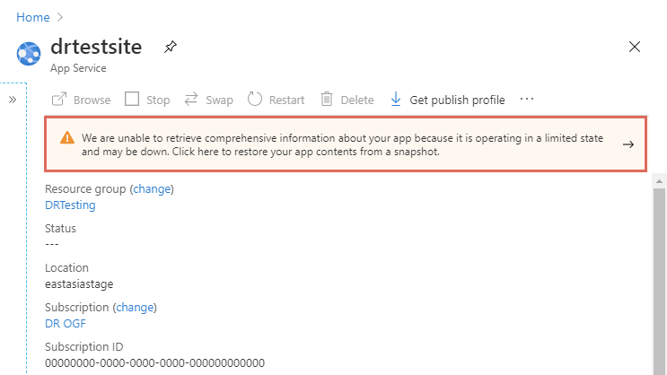
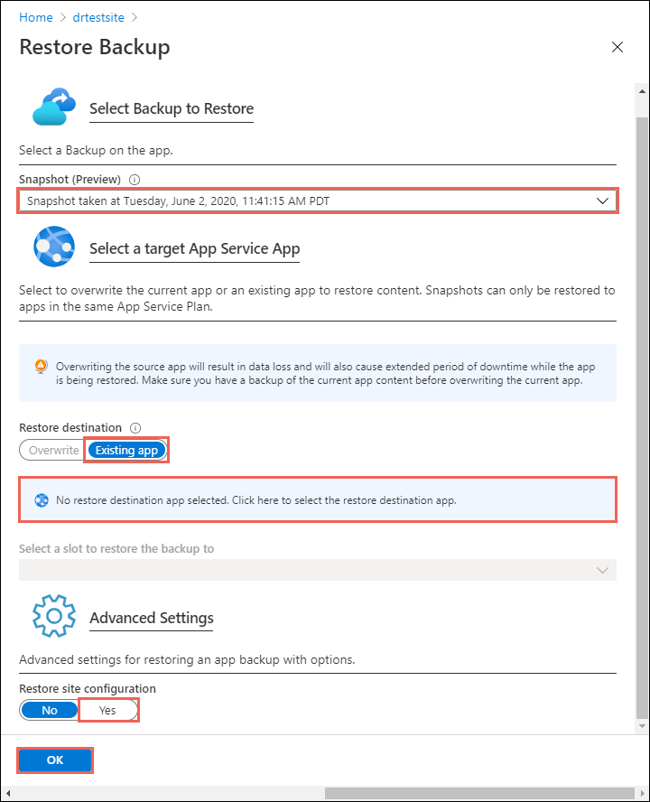
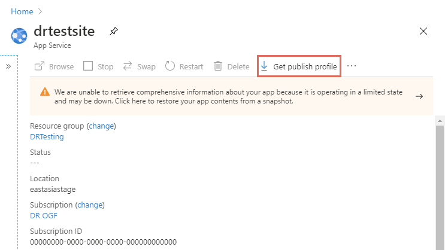
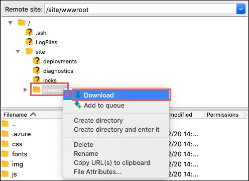

# Move an App Service app to another region

> [!IMPORTANT]
> **Beginning 31 March 2025, we'll no longer place Azure App Service web applications in disaster recovery mode in the event of a disaster in an Azure region.** We strongly encourage you to implement [commonly used disaster recovery techniques](./overview-disaster-recovery.md) to prevent loss of functionality or data for your web apps if there's a regional disaster.

This article describes how to bring App Service resources back online in a different Azure region during a disaster that impacts an entire Azure region. When a disaster brings an entire Azure region offline, all App Service apps hosted in that region are placed in disaster recovery mode. Features are available to help you restore the app to a different region or recover files from the impacted app.

App Service resources are region-specific and can't be moved across regions. You must restore the app to a new app in a different region, and then create mirroring configurations or resources for the new app.


## Prerequisites

- None. [Restoring an automatic backup](manage-backup.md#restore-a-backup) usually requires **Standard** or **Premium** tier, but in disaster recovery mode, it's automatically enabled for your impacted app, regardless which tier the impacted app is in.

## Prepare

Identify all the App Service resources that the impacted app currently uses. For example:

- App Service apps
- [App Service plans](overview-hosting-plans.md)
- [Deployment slots](deploy-staging-slots.md)
- [Custom domains purchased in Azure](manage-custom-dns-buy-domain.md)
- [TLS/SSL certificates](configure-ssl-certificate.md)
- [Azure Virtual Network integration](./overview-vnet-integration.md)
- [Hybrid connections](app-service-hybrid-connections.md).
- [Managed identities](overview-managed-identity.md)
- [Backup settings](manage-backup.md)

Certain resources, such as imported certificates or hybrid connections, contain integration with other Azure services. For information on how to move those resources across regions, see the documentation for the respective services.

## Restore app to a different region

1. Create a new App Service app in a *different* Azure region than the impacted app. This is the target app in the disaster recovery scenario.

1. In the [Azure portal](https://portal.azure.com), navigate to the impacted app's management page. In a failed Azure region, the impacted app shows a warning text. Click the warning text.

    

1. In the **Restore Backup** page, configure the restore operation according to the following table. When finished, click **OK**.

   | Setting | Value | Description |
   |-|-|-|
   | **Snapshot (Preview)** | Select a snapshot. | The two most recent snapshots are available. |
   | **Restore destination** | **Existing app** | Click the note below that says **Click here to change the restore destination app** and select the target app. In a disaster scenario, you can only restore the snapshot to an app in a different Azure region. |
   | **Restore site configuration** | **Yes** | |

    

3. Configure [everything else](#prepare) in the target app to mirror the impacted app and verify your configuration.

4. When you're ready for the custom domain to point to the target app, [remap the domain name](manage-custom-dns-migrate-domain.md#4-remap-the-active-dns-name).

## Recover app content only

If you only want to recover the files from the impacted app without restoring it, use the following steps:

1. In the [Azure portal](https://portal.azure.com), navigate to the impacted app's management page and click **Get publish profile**.

    

1. Open the downloaded file and find the publishing profile that contains `ReadOnly - FTP` in its name. This is the disaster recovery profile. For example:

    ```xml
    <publishProfile profileName="%app-name% - ReadOnly - FTP" publishMethod="FTP" publishUrl="ftp://%ftp-site%/site/wwwroot" ftpPassiveMode="True" userName="%app-name%\$%app-name%" userPWD="" destinationAppUrl="http://%app-name%.azurewebsites.net" SQLServerDBConnectionString="" mySQLDBConnectionString="" hostingProviderForumLink="" controlPanelLink="http://windows.azure.com" webSystem="WebSites">
        <databases />
    </publishProfile>
    ```
    
    Copy three attribute values: 
        
    - `publishUrl`: the FTP hostname
    - `userName` and `userPWD`: the FTP credentials

1. Use the FTP client of your choice, connect to the impacted app's FTP host using the hostname and credentials.

1. Once connected, download the entire */site/wwwroot* folder. The following screenshot shows how you download in [FileZilla](https://filezilla-project.org/).

    

## Next steps
[Backup and restore](manage-backup.md)
