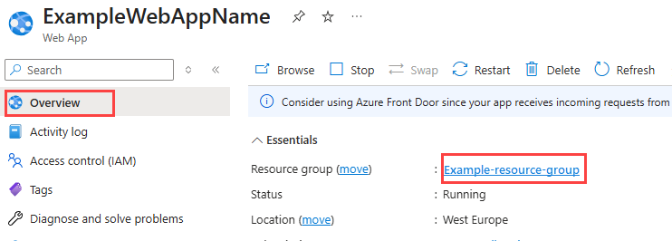
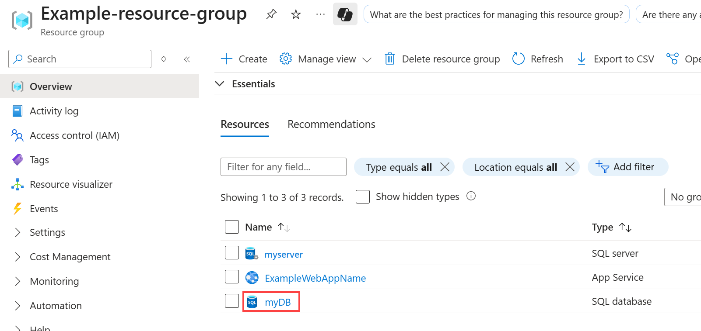

# Scale up an app in Azure App Service

This article shows you how to scale your app in Azure App Service. There are two workflows for scaling, scale up and scale out, and this article explains the scale up workflow.

* [Scale up](https://en.wikipedia.org/wiki/Scalability#Horizontal_and_vertical_scaling): Get more CPU, memory, disk space, and extra features
  like dedicated virtual machines (VMs), custom domains and certificates, staging slots, autoscaling, and more. You scale up by changing the pricing tier of the
  App Service plan that your app belongs to.
* [Scale out](https://en.wikipedia.org/wiki/Scalability#Horizontal_and_vertical_scaling): Increase the number of VM instances that run your app.
  You can scale out to as many as 30 instances, depending on your pricing tier. [App Service Environments](environment/intro.md)
  in **Isolated** tier further increases your scale-out count to 100 instances. For more information about scaling out, see
  [Scale instance count manually or automatically](../azure-monitor/autoscale/autoscale-get-started.md). There, you find out how
  to use autoscaling, which is to scale instance count automatically based on predefined rules and schedules.

>[!IMPORTANT]
> [App Service now offers an automatic scale-out option to handle varying incoming HTTP requests.](./manage-automatic-scaling.md)
>

The scale settings take only seconds to apply and affect all apps in your [App Service plan](../app-service/overview-hosting-plans.md).
They don't require you to change your code or redeploy your application.

For information about the pricing and features of individual App Service plans, see [App Service Pricing Details](https://azure.microsoft.com/pricing/details/web-sites/).  

> [!NOTE]
> Before you switch an App Service plan from the **Free** tier, you must first remove the [spending limits](https://azure.microsoft.com/pricing/spending-limits/) in place for your Azure subscription. To view or change options for your Microsoft Azure App Service subscription, see [Microsoft Azure Subscriptions][azuresubscriptions].
> 
> 

## Scale up your pricing tier

> [!NOTE]
> To scale up to Premium V3 tier, see [Configure Premium V3 tier for App Service](app-service-configure-premium-tier.md).

1. In your browser, open the [Azure portal](https://portal.azure.com).

1. In the left navigation of your App Service app page, select **Scale up (App Service plan)**.

    :::image type="content" source="media/manage-scale-up/scale-up-tier-portal.png" alt-text="Screenshot showing how to scale up your app service plan.":::

1. Select one of the pricing tiers and select **Select**.

    :::image type="content" source="media/manage-scale-up/explore-pricing-plans.png" alt-text="Screenshot showing the Explore pricing plans page with a Premium V3 plan selected.":::

    When the operation is complete, you see a notification pop-up with a green success check mark.

## Scale related resources
If your app depends on other services, such as Azure SQL Database or Azure Storage, you can scale up these resources separately. These resources aren't managed by the App Service plan.

1. In the **Overview** page for your app, select the **Resource group** link.
   
    

2. In the **Summary** part of the **Resource group** page, select a resource that you want to scale. The following screenshot
   shows a SQL Database resource.
   
    

    To scale up the related resource, see the documentation for the specific resource type. For example, to scale up a single SQL Database, see [Scale single database resources in Azure SQL Database](/azure/azure-sql/database/single-database-scale). To scale up an Azure Database for MySQL resource, see [Scale MySQL resources](../mysql/concepts-pricing-tiers.md#scale-resources).

## Compare pricing tiers

For detailed information, such as VM sizes for each pricing tier, see [App Service Pricing Details](https://azure.microsoft.com/pricing/details/app-service).

For a table of service limits, quotas, and constraints, and supported features in each tier, see [App Service limits](../azure-resource-manager/management/azure-subscription-service-limits.md#app-service-limits).

## More resources

* [Scale instance count manually or automatically](../azure-monitor/autoscale/autoscale-get-started.md)
* [Configure Premium V3 tier for App Service](app-service-configure-premium-tier.md)
* [Tutorial: Run a load test to identify performance bottlenecks in a web app](../load-testing/tutorial-identify-bottlenecks-azure-portal.md)
<!-- LINKS -->
[vmsizes]:https://azure.microsoft.com/pricing/details/app-service/
[SQLaccountsbilling]:https://go.microsoft.com/fwlink/?LinkId=234930
[azuresubscriptions]:https://account.windowsazure.com/subscriptions

<!-- IMAGES -->
[ChooseWHP]: ./media/web-sites-scale/scale1ChooseWHP.png
[ResourceGroup]: ./media/web-sites-scale/scale10ResourceGroup.png
[ScaleDatabase]: ./media/web-sites-scale/scale11SQLScale.png
[GeoReplication]: ./media/web-sites-scale/scale12SQLGeoReplication.png
