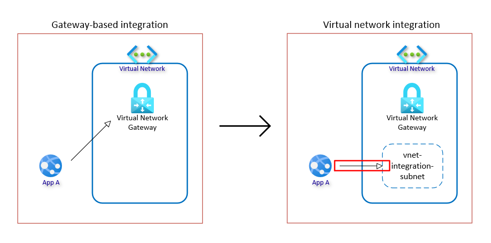

# Migrate from gateway-based virtual network integration

There are two ways in App Service to integration with a virtual network. One way is gateway-based integration using a virtual network gateway that establishes a point-to-site VPN connection from the app to the virtual network. The other way is now just known as virtual network integration since more than 99% of all integrations are using this method. Virtual network integration has several advantages over gateway-based integration. The only edge case scenario is when you need to connect directly to a virtual network in a different region and aren't able to set up peerings.

Gateway-based integration can't be used in the following scenarios:

* With a virtual network connected with ExpressRoute.
* From a Linux app.
* From a Windows container.
* To access service endpoint-secured resources.
* To resolve App Settings referencing a network protected Key Vault.
* With a coexistence gateway that supports both ExpressRoute and point-to-site or site-to-site VPNs.

| Feature | Virtual network integration| Gateway-based integration |
| :--------: | :------------: | :------------: |
| Gateway required | No   |  Yes   |
| Bandwidth limit | Virtual machine limit |  SSTP Point-to-site VPN limit |
| Connect up to  | Two subnets per plan | Five virtual networks per plan  |
| Route tables, NSG, NAT gateway support | Yes |  No |
| OS Support | Windows, Linux, and Windows Container  | Windows only  |
| Access service endpoints |  Yes | No  |
| Resolve network protected Key Vault app settings |  Yes | No  |
| Co-connect to virtual network with Express Route | Yes | No |
| Connect directly to virtual network in different region | Only through global peerings | Yes |

## Migration path and planning

The complexity and planning of migration varies based on your current setup. 

## Same region migration

If you're connecting to a gateway in the same region as your app, the migration is simple. First you need to select or create a subnet in the virtual network where the apps integrates going forward.

Then all you need to do is run a command to configure the virtual network integration.

Migrating from gateway-based to regional virtual network integration is a simple disconnect/connect operation. Before making the switch, make sure you have a subnet configured for your apps. You can either have one per plan or take advantage of the new multi-plan subnet join feature to connect apps from different plans to the same subnet. You should spend a little time planning your subnet address range. The general recommendation is to have double the IPs as the expected maximum planned instances of your plan(s). You should also delegate the subnet(s) to `Microsoft.Web/serverFarms`.

## Post configurations

After moving to regional virtual network integration you now have some new options you can take advantage of. You can decide if configuration options like backup/restore and image pull for container based workloads should be [routed through the virtual network](https://learn.microsoft.com/azure/app-service/overview-vnet-integration#configuration-routing). You can also define Network Security Groups or User Defined Routes for the individual subnets and you can increase SNAT ports and get a deterministic outbound public source IP by attaching a NAT gateway to the subnet.