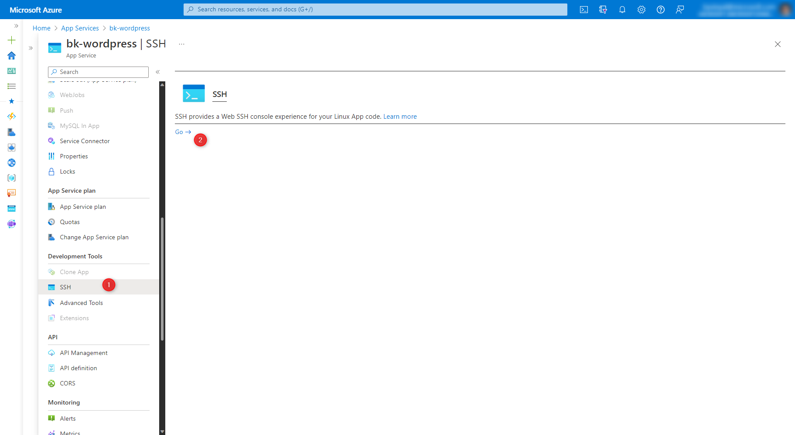
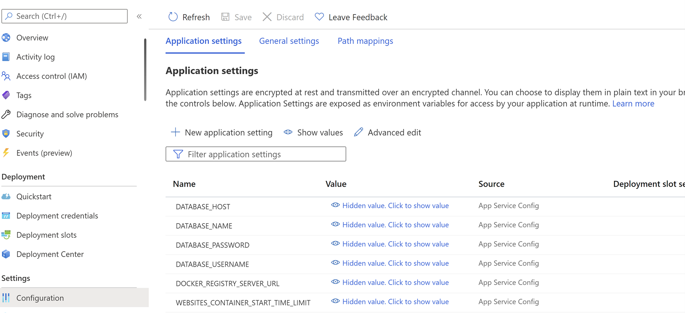

# Migrate WordPress on App Service on Linux

This article describes two ways to migrate WordPress from App Service on Windows or external hosting providers to App Service on Linux. 

> [!NOTE]
> Migrate the content to a test instance, validate all scenarios, and if everything works as expected, swap this instance to the production slot.
>

 You can migrate your site to WordPress on Azure App Service in two ways:

 1. WordPress plugin: All-In-One WP Migration
 2. Manual process of migration

## Migrate WordPress with All-In-One WP Migration plugin

This plugin is popular for migrating sites with ease. This approach is recommended for sites less than 256MB. If it's more, you can either **purchase the premium version** of the plugin or **migrate manually** using the steps outlined in [manual migration process](#manual-migration-process).

By default, the file upload size for WordPress on Linux App Services is limited to 50MB, and it can be increased up to 256MB (Maximum Limit). To change the file upload  limit, add the following [Application Settings](configure-common.md?tabs=portal) in the App Service and save it.

|    Application Setting Name    | Default Value | New Value   |
|--------------------------------|---------------|-------------|
|    UPLOAD_MAX_FILESIZE         |      50M      |   256M      |
|    POST_MAX_SIZE               |      128M     |   256M      |

> [!IMPORTANT]
> Install All-In-One Migration plugin on both source and target sites.
>

### Export the data at source site

1. Launch WordPress Admin page.
1. Open All-In-One WP Migration plugin.
1. Click on 'Export' option and specify the export type as file.
1. Download the bundle.

### Import the data at destination site

1. Launch WordPress Admin page
1. Open All-In-One WP Migration plugin
1. Click on import option on the destination site, and upload the file downloaded in previous section
1. Empty the caches in W3TC plugin (or any other caches) and validate the content of the site.
    - Click on the **Performance** option given in the left sidebar of the admin panel to open the W3TC plugin.
    - Then click on the **Dashboard** option shown below it.
    - On the dashboard, you will see a button with the label **Empty All Caches**.

## Manual migration process

The prerequisite is that the WordPress on Linux Azure App Service must have been created with an appropriate hosting plan from here: [WordPress on Linux App Service](https://aka.ms/linux-wordpress).

### Manually export the data at source site

> [!NOTE]
> Depending on the size of your content and your internet connection, this operation could take several minutes.
>

1. Download the **wp-content** folder from the source site. You can use popular FTP tools like [FileZilla](https://filezilla-project.org/download.php?type=client) to connect to the web server and download the content.

1. Export the contents of the source database into an SQL file. You can perform this task either using MySQL client tools like HeidiSQL, [MySQL workbench](https://dev.mysql.com/downloads/workbench/), [PhpMyAdmin](https://docs.phpmyadmin.net/en/latest/setup.html) or through command line interface. For more information on exporting the database, refer to the following [documentation](https://dev.mysql.com/doc/workbench/en/wb-admin-export-import-management.html).

### Manually import the data at destination site

1. Create a new Wordpress app using our [WordPress on Linux App Service template](https://aka.ms/linux-wordpress)

2. Open an SSH session using **WebSSH** from the Azure portal.


3. Delete the existing content of **/home/site/wwwroot/wp-content** folder using the following command.

   ```bash
   rm -rf /home/site/wwwroot/wp-content/* 
   ```

4. Upload the new contents of **wp-content** folder using the File Manager. Click on the label that says '**Drag a File/Folder here to upload, or click to select one**'.

5. You can either [use an existing MySQL database](https://github.com/Azure/wordpress-linux-appservice/blob/main/WordPress/using_an_existing_mysql_database.md) or migrate the content to a new Azure MySQL Flexible Server created by App Service on Linux. 


> [!NOTE]
> Azure Database for MySQL - Single Server is on the road to retirement by 16 September 2024. If your existing MySQL database is hosted on Azure Database for MySQL - Single Server, consider migrating to Azure Database for MySQL - Flexible Server using the following steps, or using [Azure Database Migration Service (DMS)](../mysql/single-server/whats-happening-to-mysql-single-server.md#migrate-from-single-server-to-flexible-server).
>

6. If you migrate the database, import the SQL file downloaded from the source database into the database of your newly created WordPress site. You can do it via the PhpMyAdmin dashboard available at **\<sitename\>.azurewebsites.net/phpmyadmin**. If you're unable to one single large SQL file, separate the files into parts and try uploading again. Steps to import the database through phpmyadmin are described [here](https://docs.phpmyadmin.net/en/latest/import_export.html#import).

7. Launch the Azure Portal and navigate to your **App Service -> Configuration** blade. Update the database name in the **Application Settings** of App Service and save it. This will restart your App and the new changes will get reflected.  [Learn more: WordPress Application Settings](https://github.com/Azure/wordpress-linux-appservice/blob/main/WordPress/wordpress_application_settings.md)

    |    Application Setting Name    | Update Required?                         |
    |--------------------------------|------------------------------------------|
    |    DATABASE_NAME               |      Yes, replace with the source (exported) database name |
    |    DATABASE_HOST               |      Not Required                        |
    |    DATABASE_USERNAME           |      Not Required                        |
    |    DATABASE_PASSWORD           |      Not Required                        |

    

## Post migration actions

### Install recommended plugins

It's an optional step, after the site migration it is recommended to validate that you have the default recommended/equivalent plugins activated and configured accurate as before. If you're prohibited from not configuring them as per your organization governing policies, then you can uninstall the plugins.

- The W3TC plugin should be activated and configured properly to use the local Redis cache server and Azure CDN/Blob Storage (if it was configured to use them originally). For more information on how to configure these, refer to the following documentations:

  - [Local Redis Cache](https://github.com/Azure/wordpress-linux-appservice/blob/main/WordPress/wordpress_local_redis_cache.md)
  - [Azure CDN](https://github.com/Azure/wordpress-linux-appservice/blob/main/WordPress/wordpress_azure_cdn.md)
  - [Azure Blob Storage](https://github.com/Azure/wordpress-linux-appservice/blob/main/WordPress/wordpress_azure_blob_storage.md)

- WP Smush plugin is activated and configured properly for image optimization. See [Image Compression](https://github.com/Azure/wordpress-linux-appservice/blob/main/WordPress/wordpress_image_compression.md) for more information on configuration.

### Recommended WordPress settings

The following WordPress settings are recommended. However, when the users migrate their custom sites, is it up to them to decide whether to use these settings or not.

1. Open the WordPress Admin dashboard.
2. Set the permalink structure to 'day and name', as it performs better compared to the plain permalinks that use the format **?p=123**.
3. Under the comment settings, enable the option to break comments into pages.
4. Show excerpts instead of the full post in the feed.

## Search and replace (paths and domains)

One common issue that users face during migration is that some of the contents of their old site use absolute urls/paths instead of relative ones. To resolve this issue, you can use plugins like [Search and Replace](https://wordpress.org/plugins/search-replace/) to update the database records.

## Configuring custom domain

To configure your site with a custom domain follow the steps described here: Tutorial: [Map existing custom DNS name](app-service-web-tutorial-custom-domain.md?tabs=a%2Cazurecli)

## Migrating custom domain

When you migrate a live site and its DNS domain name to App Service, that DNS name is already serving live traffic. You can avoid DNS resolution downtime by binding the active DNS name to your app as described in [Migrate an active DNS name](manage-custom-dns-migrate-domain.md).

## Updating SSL certificates

If your site is configured with SSL certs, then follow [Add and manage TLS/SSL certificates](configure-ssl-certificate.md?tabs=apex%2Cportal) to configure SSL.

Next steps:
[At-scale assessment of .NET web apps](/training/modules/migrate-app-service-migration-assistant/)