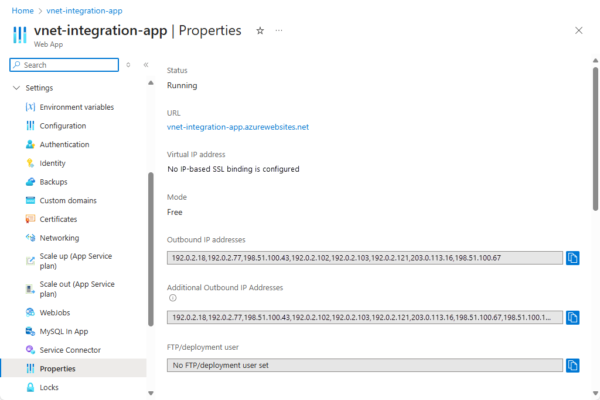
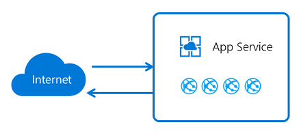
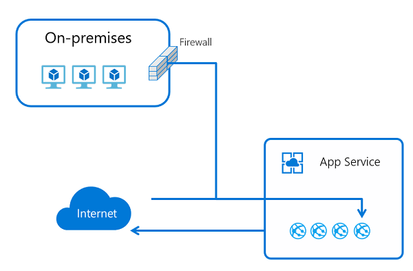
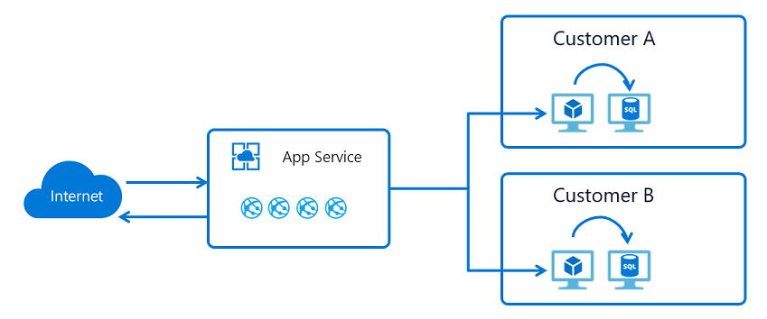
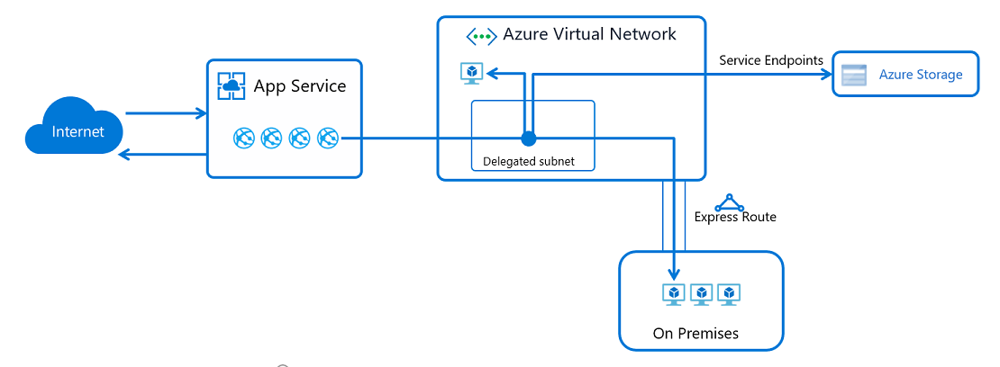
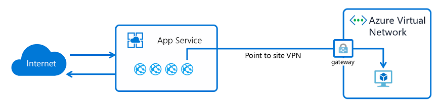
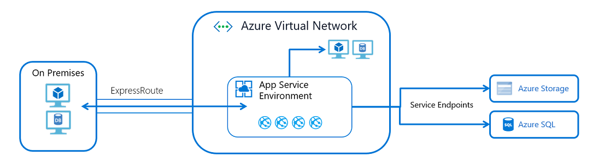
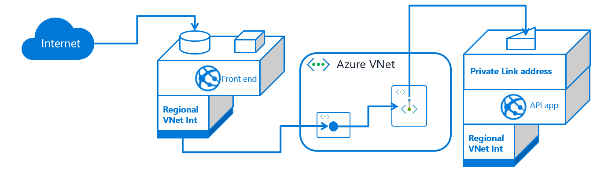
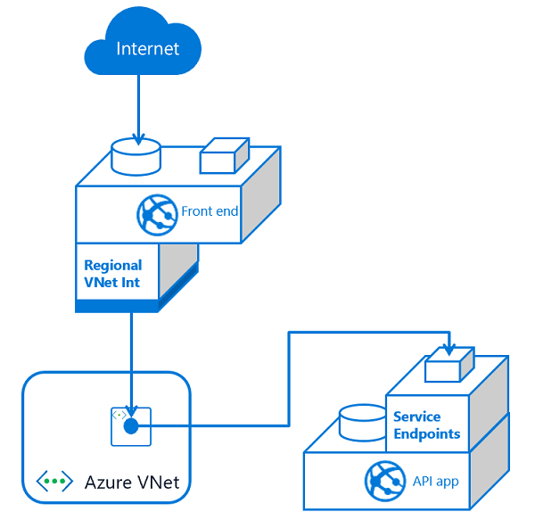

# App Service networking features

You can deploy applications in Azure App Service in multiple ways. By default, apps hosted in App Service are accessible directly through the internet and can reach only internet-hosted endpoints. But for many applications, you need to control the inbound and outbound network traffic. There are several features in App Service to help you meet those needs. The challenge is knowing which feature to use to solve a given problem. This article will help you determine which feature to use, based on some example use cases.

There are two main deployment types for Azure App Service: 
- The multi-tenant public service hosts App Service plans in the Free, Shared, Basic, Standard, Premium, PremiumV2, and PremiumV3 pricing SKUs. 
- The single-tenant App Service Environment (ASE) hosts Isolated SKU App Service plans directly in your Azure virtual network. 

The features you use will depend on whether you're in the multi-tenant service or in an ASE. 

> [!NOTE]
> Networking features are not available for [apps deployed in Azure Arc](overview-arc-integration.md).

## Multi-tenant App Service networking features 

Azure App Service is a distributed system. The roles that handle incoming HTTP or HTTPS requests are called *front ends*. The roles that host the customer workload are called *workers*. All the roles in an App Service deployment exist in a multi-tenant network. Because there are many different customers in the same App Service scale unit, you can't connect the App Service network directly to your network. 

Instead of connecting the networks, you need features to handle the various aspects of application communication. The features that handle requests *to* your app can't be used to solve problems when you're making calls *from* your app. Likewise, the features that solve problems for calls from your app can't be used to solve problems to your app.  

| Inbound features | Outbound features |
|---------------------|-------------------|
| App-assigned address | Hybrid Connections |
| Access restrictions | Gateway-required virtual network integration |
| Service endpoints | Virtual network integration |
| Private endpoints ||

Other than noted exceptions, you can use all of these features together. You can mix the features to solve your problems.

## Use cases and features

For any given use case, there might be a few ways to solve the problem. Choosing the best feature sometimes goes beyond the use case itself. The following inbound use cases suggest how to use App Service networking features to solve problems with controlling traffic going to your app:
 
| Inbound use case | Feature |
|---------------------|-------------------|
| Support IP-based SSL needs for your app | App-assigned address |
| Support unshared dedicated inbound address for your app | App-assigned address |
| Restrict access to your app from a set of well-defined addresses | Access restrictions |
| Restrict access to your app from resources in a virtual network | Service endpoints   Internal Load Balancer (ILB) ASE   Private endpoints |
| Expose your app on a private IP in your virtual network | ILB ASE   Private endpoints   Private IP for inbound traffic on an Application Gateway instance with service endpoints |
| Protect your app with a web application firewall (WAF) | Application Gateway and ILB ASE   Application Gateway with private endpoints   Application Gateway with service endpoints   Azure Front Door with access restrictions |
| Load balance traffic to your apps in different regions | Azure Front Door with access restrictions | 
| Load balance traffic in the same region | [Application Gateway with service endpoints](./networking/app-gateway-with-service-endpoints.md) | 

The following outbound use cases suggest how to use App Service networking features to solve outbound access needs for your app:

| Outbound use case | Feature |
|---------------------|-------------------|
| Access resources in an Azure virtual network in the same region | Virtual network integration   ASE |
| Access resources in an Azure virtual network in a different region | virtual network integration and virtual network peering   Gateway-required virtual network integration   ASE and virtual network peering |
| Access resources secured with service endpoints | virtual network integration   ASE |
| Access resources in a private network that's not connected to Azure | Hybrid Connections |
| Access resources across Azure ExpressRoute circuits | virtual network integration   ASE | 
| Secure outbound traffic from your web app | virtual network integration and network security groups   ASE | 
| Route outbound traffic from your web app | virtual network integration and route tables   ASE | 

### Default networking behavior

Azure App Service scale units support many customers in each deployment. The Free and Shared SKU plans host customer workloads on multi-tenant workers. The Basic and higher plans host customer workloads that are dedicated to only one App Service plan. If you have a Standard App Service plan, all the apps in that plan will run on the same worker. If you scale out the worker, all the apps in that App Service plan will be replicated on a new worker for each instance in your App Service plan. 

#### Outbound addresses

The worker VMs are broken down in large part by the App Service plans. The Free, Shared, Basic, Standard, and Premium plans all use the same worker VM type. The PremiumV2 plan uses another VM type. PremiumV3 uses yet another VM type. When you change the VM family, you get a different set of outbound addresses. If you scale from Standard to PremiumV2, your outbound addresses will change. If you scale from PremiumV2 to PremiumV3, your outbound addresses will change. In some older scale units, both the inbound and outbound addresses will change when you scale from Standard to PremiumV2. 

There are many addresses that are used for outbound calls. The outbound addresses used by your app for making outbound calls are listed in the properties for your app. These addresses are shared by all the apps running on the same worker VM family in the App Service deployment. If you want to see all the addresses that your app might use in a scale unit, there's property called `possibleOutboundAddresses` that will list them. 

App Service has many endpoints that are used to manage the service.  Those addresses are published in a separate document and are also in the `AppServiceManagement` IP service tag. The `AppServiceManagement` tag is used only in App Service Environments where you need to allow such traffic. The App Service inbound addresses are tracked in the `AppService` IP service tag. There's no IP service tag that contains the outbound addresses used by App Service. 

### App-assigned address 

The app-assigned address feature is an offshoot of the IP-based SSL capability. You access it by setting up SSL with your app. You can use this feature for IP-based SSL calls. You can also use it to give your app an address that only it has. 

When you use an app-assigned address, your traffic still goes through the same front-end roles that handle all the incoming traffic into the App Service scale unit. But the address that's assigned to your app is used only by your app. Use cases for this feature:

* Support IP-based SSL needs for your app.
* Set a dedicated address for your app that's not shared.

To learn how to set an address on your app, see [Add a TLS/SSL certificate in Azure App Service](./configure-ssl-certificate.md). 

### Access restrictions 

Access restrictions let you filter *inbound* requests. The filtering action takes place on the front-end roles that are upstream from the worker roles where your apps are running. Because the front-end roles are upstream from the workers, you can think of access restrictions as network-level protection for your apps. For more information about access restrictions, see [Access restrictions overview](./overview-access-restrictions.md).

This feature allows you to build a list of allow and deny rules that are evaluated in priority order. It's similar to the network security group (NSG) feature in Azure networking. You can use this feature in an ASE or in the multi-tenant service. When you use it with an ILB ASE, you can restrict access from private address blocks. To learn how to enable this feature, see [Configuring access restrictions](./app-service-ip-restrictions.md).

> [!NOTE]
> Up to 512 access restriction rules can be configured per app. 

### Private endpoint

Private endpoint is a network interface that connects you privately and securely to your Web App by Azure private link. Private endpoint uses a private IP address from your virtual network, effectively bringing the web app into your virtual network. This feature is only for *inbound* flows to your web app.
For more information, see
[Using private endpoints for Azure Web App](./networking/private-endpoint.md).

Some use cases for this feature:

* Restrict access to your app from resources in a virtual network. 
* Expose your app on a private IP in your virtual network. 
* Protect your app with a WAF.

Private endpoints prevent data exfiltration because the only thing you can reach across the private endpoint is the app with which it's configured. 
 
### Hybrid Connections

App Service Hybrid Connections enables your apps to make *outbound* calls to specified TCP endpoints. The endpoint can be on-premises, in a virtual network, or anywhere that allows outbound traffic to Azure on port 443. To use the feature, you need to install a relay agent called Hybrid Connection Manager on a Windows Server 2012 or newer host. Hybrid Connection Manager needs to be able to reach Azure Relay at port 443. You can download Hybrid Connection Manager from the App Service Hybrid Connections UI in the portal. 

App Service Hybrid Connections is built on the Azure Relay Hybrid Connections capability. App Service uses a specialized form of the feature that only supports making outbound calls from your app to a TCP host and port. This host and port only need to resolve on the host where Hybrid Connection Manager is installed. 

When the app, in App Service, does a DNS lookup on the host and port defined in your hybrid connection, the traffic automatically redirects to go through the hybrid connection and out of Hybrid Connection Manager. To learn more, see [App Service Hybrid Connections](./app-service-hybrid-connections.md).

This feature is commonly used to:

* Access resources in private networks that aren't connected to Azure with a VPN or ExpressRoute.
* Support the migration of on-premises apps to App Service without the need to move supporting databases.  
* Provide access with improved security to a single host and port per hybrid connection. Most networking features open access to a network. With Hybrid Connections, you can only reach the single host and port.
* Cover scenarios not covered by other outbound connectivity methods.
* Perform development in App Service in a way that allows the apps to easily use on-premises resources. 

Because this feature enables access to on-premises resources without an inbound firewall hole, it's popular with developers. The other outbound App Service networking features are related to Azure Virtual Network. Hybrid Connections doesn't depend on going through a virtual network. It can be used for a wider variety of networking needs. 

App Service Hybrid Connections is unaware of what you're doing on top of it. So you can use it to access a database, a web service, or an arbitrary TCP socket on a mainframe. The feature essentially tunnels TCP packets. 

Hybrid Connections is popular for development, but it's also used in production applications. It's great for accessing a web service or database, but it's not appropriate for situations that involve creating many connections. 

### Virtual network integration

App Service virtual network integration enables your app to make *outbound* requests into an Azure virtual network. 

The virtual network integration feature enables you to place the back end of your app in a subnet in a Resource Manager virtual network. The virtual network must be in the same region as your app. This feature isn't available from an App Service Environment, which is already in a virtual network. Use cases for this feature:

* Access resources in Resource Manager virtual networks in the same region.
* Access resources in peered virtual networks, including cross region connections.
* Access resources that are secured with service endpoints. 
* Access resources that are accessible across ExpressRoute or VPN connections.
* Access resources in private networks without the need and cost of a Virtual Network gateway.
* Help to secure all outbound traffic.
* Force tunnel all outbound traffic.

To learn more, see [App Service virtual network integration](./overview-vnet-integration.md).

#### Gateway-required virtual network integration 

Gateway-required virtual network integration was the first edition of virtual network integration in App Service. The feature works by connecting the host your app is running on to a Virtual Network gateway on your virtual network by using a point-to-site VPN. When you configure the feature, your app gets one of the point-to-site assigned addresses assigned to each instance.

Gateway required integration allows you to connect directly to a virtual network in another region without peering and to connect to a classic virtual network. The feature is limited to App Service Windows plans and doesn't work with ExpressRoute-connected virtual networks. It's recommended to use the regional virtual network integration. For more information on this feature, see [App Service virtual network integration](./configure-gateway-required-vnet-integration.md). 

### App Service Environment 

An App Service Environment (ASE) is a single-tenant deployment of the Azure App Service that runs in your virtual network. Some cases such for this feature:

* Access resources in your virtual network.
* Access resources across ExpressRoute.
* Expose your apps with a private address in your virtual network. 
* Access resources across service endpoints. 
* Access resources across private endpoints. 

With an ASE, you don't need to use virtual network integration because the ASE is already in your virtual network. If you want to access resources like SQL or Azure Storage over service endpoints, enable service endpoints on the ASE subnet. If you want to access resources in the virtual network or private endpoints in the virtual network, you don't need to do any extra configuration. If you want to access resources across ExpressRoute, you're already in the virtual network, and don't need to configure anything on the ASE or the apps in it. 

Because the apps in an ILB ASE can be exposed on a private IP address, you can easily add WAF devices to expose just the apps that you want to the internet and help keep the rest secure. This feature can help make the development of multi-tier applications easier. 

Some things aren't currently possible from the multi-tenant service but are possible from an ASE. Here are some examples:

* Host your apps in a single-tenant service. 
* Scale up to many more instances than are possible in the multi-tenant service. 
* Load private CA client certificates for use by your apps with private CA-secured endpoints.
* Force TLS 1.2 across all apps hosted in the system without any ability to disable it at the app level. 

The ASE provides the best story around isolated and dedicated app hosting, but it does involve some management challenges. Some things to consider before you use an operational ASE:
 
 * An ASE runs inside your virtual network, but it does have dependencies outside the virtual network. Those dependencies must be allowed. For more information, see [Networking considerations for an App Service Environment](./environment/network-info.md).
 * An ASE doesn't scale immediately like the multi-tenant service. You need to anticipate scaling needs rather than reactively scaling. 
 * An ASE does have a higher up-front cost. To get the most out of your ASE, you should plan to put many workloads into one ASE rather than using it for small efforts.
 * The apps in an ASE can't selectively restrict access to some apps in the ASE and not others.
 * An ASE is in a subnet, and any networking rules apply to all the traffic to and from that ASE. If you want to assign inbound traffic rules for just one app, use access restrictions. 

## Combining features 

The features noted for the multi-tenant service can be used together to solve more elaborate use cases. Two of the more common use cases are described here, but that's just examples. By understanding what the various features do, you can meet nearly all your system architecture needs.

### Place an app into a virtual network

You might wonder how to put an app into a virtual network. If you put your app into a virtual network, the inbound and outbound endpoints for the app are within the virtual network. An ASE is the best way to solve this problem. But you can meet most of your needs within the multi-tenant service by combining features. For example, you can host intranet-only applications with private inbound and outbound addresses by:

* Creating an application gateway with private inbound and outbound addresses.
* Securing inbound traffic to your app with service endpoints. 
* Using the virtual network integration feature so the back end of your app is in your virtual network. 

This deployment style won't give you a dedicated address for outbound traffic to the internet or the ability to lock down all outbound traffic from your app. It will give you a much of what you would only otherwise get with an ASE. 

### Create multi-tier applications

A multi-tier application is an application in which the API back-end apps can be accessed only from the front-end tier. There are two ways to create a multi-tier application. Both start by using virtual network integration to connect your front-end web app to a subnet in a virtual network. Doing so will enable your web app to make calls into your virtual network. After your front-end app is connected to the virtual network, you need to decide how to lock down access to your API application. You can:

* Host both the front end and the API app in the same ILB ASE, and expose the front-end app to the internet by using an application gateway.
* Host the front end in the multi-tenant service and the back end in an ILB ASE.
* Host both the front end and the API app in the multi-tenant service.

If you're hosting both the front end and API app for a multi-tier application, you can:

- Expose your API application by using private endpoints in your virtual network:

  

- Use service endpoints to ensure inbound traffic to your API app comes only from the subnet used by your front-end web app:

  

Here are some considerations to help you decide which method to use:

* When you use service endpoints, you only need to secure traffic to your API app to the integration subnet. Service endpoints help to secure the API app, but you could still have data exfiltration from your front-end app to other apps in the app service.
* When you use private endpoints, you have two subnets at play, which adds complexity. Also, the private endpoint is a top-level resource and adds management overhead. The benefit of using private endpoints is that you don't have the possibility of data exfiltration. 

Either method will work with multiple front ends. On a small scale, service endpoints are easier to use because you simply enable service endpoints for the API app on the front-end integration subnet. As you add more front-end apps, you need to adjust every API app to include service endpoints with the integration subnet. When you use private endpoints, there's more complexity, but you don't have to change anything on your API apps after you set a private endpoint. 

### Line-of-business applications

Line-of-business (LOB) applications are internal applications that aren't normally exposed for access from the internet. These applications are called from inside corporate networks where access can be strictly controlled. If you use an ILB ASE, it's easy to host your line-of-business applications. If you use the multi-tenant service, you can either use private endpoints or use service endpoints combined with an application gateway. There are two reasons to use an application gateway with service endpoints instead of using private endpoints:
* You need WAF protection on your LOB apps.
* You want to load balance to multiple instances of your LOB apps.

If neither of these needs apply, you're better off using private endpoints. With private endpoints available in App Service, you can expose your apps on private addresses in your virtual network. The private endpoint you place in your virtual network can be reached across ExpressRoute and VPN connections. 

Configuring private endpoints will expose your apps on a private address, but you'll need to configure DNS to reach that address from on-premises. To make this configuration work, you'll need to forward the Azure DNS private zone that contains your private endpoints to your on-premises DNS servers. Azure DNS private zones don't support zone forwarding, but you can support zone forwarding by using [Azure DNS private resolver](../dns/dns-private-resolver-overview.md).

## App Service ports

If you scan App Service, you'll find several ports that are exposed for inbound connections. There's no way to block or control access to these ports in the multi-tenant service. Here's the list of exposed ports:

| Use | Port or ports |
|----------|-------------|
|  HTTP/HTTPS  | 80, 443 |
|  Management | 454, 455 |
|  FTP/FTPS    | 21, 990, 10001-10300 |
|  Visual Studio remote debugging  |  4020, 4022, 4024 |
|  Web Deploy service | 8172 |
|  Infrastructure use | 7654, 1221 |