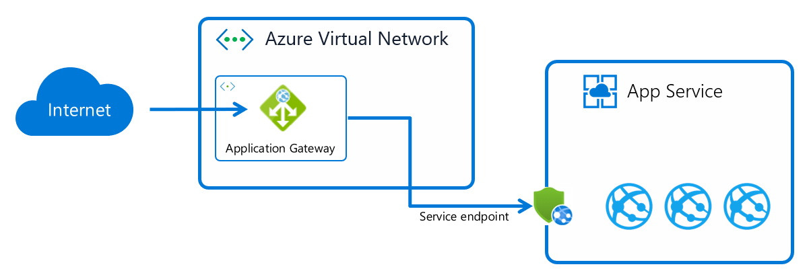
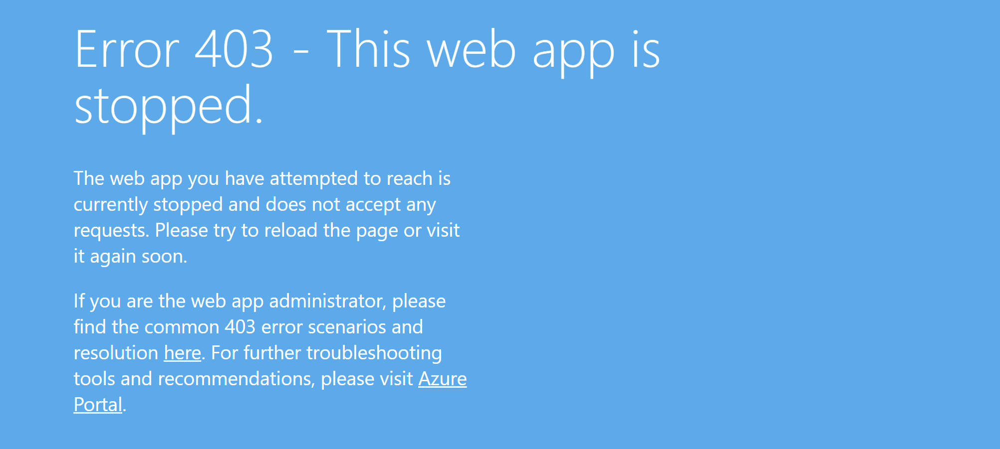

# Application Gateway integration with service endpoints
There are three variations of App Service that require slightly different configuration of the integration with Azure Application Gateway. The variations include regular App Service - also known as multi-tenant, Internal Load Balancer (ILB) App Service Environment (ASE) and External ASE. This article will walk through how to configure it with App Service (multi-tenant) and discuss considerations about ILB, and External ASE.

## Integration with App Service (multi-tenant)
App Service (multi-tenant) has a public internet facing endpoint. Using [service endpoints](../../virtual-network/virtual-network-service-endpoints-overview.md) you can allow traffic only from a specific subnet within an Azure Virtual Network and block everything else. In the following scenario, we'll use this functionality to ensure that an App Service instance can only receive traffic from a specific Application Gateway instance.



There are two parts to this configuration besides creating the App Service and the Application Gateway. The first part is enabling service endpoints in the subnet of the Virtual Network where the Application Gateway is deployed. Service endpoints will ensure all network traffic leaving the subnet towards the App Service will be tagged with the specific subnet ID. The second part is to set an access restriction of the specific web app to ensure that only traffic tagged with this specific subnet ID is allowed. You can configure it using different tools depending on preference.

## Using Azure portal
With Azure portal, you follow four steps to provision and configure the setup. If you have existing resources, you can skip the first steps.
1. Create an App Service using one of the Quickstarts in the App Service documentation, for example [.Net Core Quickstart](../../app-service/app-service-web-get-started-dotnet.md)
2. Create an Application Gateway using the [portal Quickstart](../../application-gateway/quick-create-portal.md), but skip the Add backend targets section.
3. Configure [App Service as a backend in Application Gateway](../../application-gateway/configure-web-app-portal.md), but skip the Restrict access section.
4. Finally create the [access restriction using service endpoints](../../app-service/app-service-ip-restrictions.md#service-endpoints).

You can now access the App Service through Application Gateway, but if you try to access the App Service directly, you should receive a 403 HTTP error indicating that the web site is stopped.



## Using Azure Resource Manager template
The [Resource Manager deployment template][template-app-gateway-app-service-complete] will provision a complete scenario. The scenario consists of an App Service instance locked down with service endpoints and access restriction to only receive traffic from Application Gateway. The template includes many Smart Defaults and unique postfixes added to the resource names for it to be simple. To override them, you'll have to clone the repo or download the template and edit it. 

To apply the template you can use the Deploy to Azure button found in the description of the template, or you can use appropriate PowerShell/CLI.

## Using Azure Command Line Interface
The [Azure CLI sample](../../app-service/scripts/cli-integrate-app-service-with-application-gateway.md) will provision an App Service locked down with service endpoints and access restriction to only receive traffic from Application Gateway. If you only need to isolate traffic to an existing App Service from an existing Application Gateway, the following command is sufficient.

```azurecli-interactive
az webapp config access-restriction add --resource-group myRG --name myWebApp --rule-name AppGwSubnet --priority 200 --subnet mySubNetName --vnet-name myVnetName
```

In the default configuration, the command will ensure both setup of the service endpoint configuration in the subnet and the access restriction in the App Service.

## Considerations for ILB ASE
ILB ASE isn't exposed to the internet and traffic between the instance and an Application Gateway is therefore already isolated to the Virtual Network. The following [how-to guide](../environment/integrate-with-application-gateway.md) configures an ILB ASE and integrates it with an Application Gateway using Azure portal. 

If you want to ensure that only traffic from the Application Gateway subnet is reaching the ASE, you can configure a Network security group (NSG) which affect all web apps in the ASE. For the NSG, you are able to specify the subnet IP range and optionally the ports (80/443). Make sure you don't override the [required NSG rules](../environment/network-info.md#network-security-groups) for ASE to function correctly.

To isolate traffic to an individual web app you'll need to use ip-based access restrictions as service endpoints will not work for ASE. The IP address should be the private IP of the Application Gateway instance.

## Considerations for External ASE
External ASE has a public facing load balancer like multi-tenant App Service. Service endpoints don't work for ASE, and that's why you'll have to use ip-based access restrictions using the public IP of the Application Gateway instance. To create an External ASE using the Azure portal, you can follow this [Quickstart](../environment/create-external-ase.md)

[template-app-gateway-app-service-complete]: https://github.com/Azure/azure-quickstart-templates/tree/master/201-web-app-with-app-gateway-v2/ "Azure Resource Manager template for complete scenario"

## Considerations for kudu/scm site
The scm site, also known as kudu, is an admin site, which exists for every web app. It isn't possible to reverse proxy the scm site and you most likely also want to lock it down to individual IP addresses or a specific subnet.

If you want to use the same access restrictions as the main site, you can inherit the settings using the following command.

```azurecli-interactive
az webapp config access-restriction set --resource-group myRG --name myWebApp --use-same-restrictions-for-scm-site
```

If you want to set individual access restrictions for the scm site, you can add access restrictions using the --scm-site flag like shown below.

```azurecli-interactive
az webapp config access-restriction add --resource-group myRG --name myWebApp --scm-site --rule-name KudoAccess --priority 200 --ip-address 208.130.0.0/16
```

## Next steps
For more information on the App Service Environment, see [App Service Environment documentation](https://docs.microsoft.com/azure/app-service/environment).

To further secure your web app, information about Web Application Firewall on Application Gateway can be found in the [Azure Web Application Firewall documentation](../../web-application-firewall/ag/ag-overview.md).