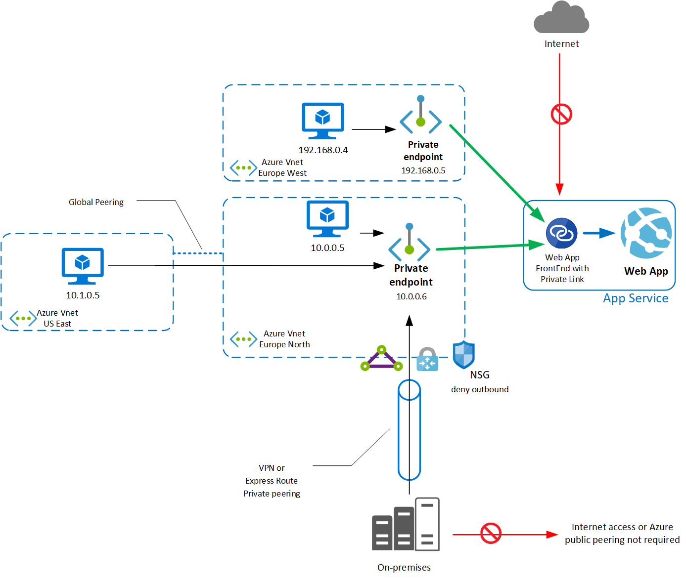

# Using Private Endpoints for Azure Web App

> [!IMPORTANT]
> Private Endpoint is available for Windows and Linux Web App, containerized or not, hosted on these App Service Plans : **Isolated**, **PremiumV2**, **PremiumV3**, **Functions Premium** (sometimes referred to as the Elastic Premium plan). 

You can use Private Endpoint for your Azure Web App to allow clients located in your private network to securely access the app over Private Link. The Private Endpoint uses an IP address from your Azure VNet address space. Network traffic between a client on your private network and the Web App traverses over the VNet and a Private Link on the Microsoft backbone network, eliminating exposure from the public Internet.

Using Private Endpoint for your Web App enables you to:

- Secure your Web App by configuring the Private Endpoint, eliminating public exposure.
- Securely connect to Web App from on-premises networks that connect to the VNet using a VPN or ExpressRoute private peering.
- Avoid any data exfiltration from your VNet. 

If you just need a secure connection between your VNet and your Web App, a Service Endpoint is the simplest solution. 
If you also need to reach the web app from on-premises through an Azure Gateway, a regionally peered VNet, or a globally peered VNet, Private Endpoint is the solution.  

For more information, see [Service Endpoints][serviceendpoint].

## Conceptual overview

A Private Endpoint is a special network interface (NIC) for your Azure Web App in a Subnet in your Virtual Network (VNet).
When you create a Private Endpoint for your Web App, it provides secure connectivity between clients on your private network and your Web App. The Private Endpoint is assigned an IP Address from the IP address range of your VNet.
The connection between the Private Endpoint and the Web App uses a secure [Private Link][privatelink]. Private Endpoint is only used for incoming flows to your Web App. Outgoing flows will not use this Private Endpoint, but you can inject outgoing flows to your network in a different subnet through the [VNet integration feature][vnetintegrationfeature].

The Subnet where you plug the Private Endpoint can have other resources in it, you don't need a dedicated empty Subnet.
You can also deploy the Private Endpoint in a different region than the Web App. 

> [!Note]
>The VNet integration feature cannot use the same subnet as Private Endpoint, this is a limitation of the VNet integration feature.

From a security perspective:

- When you enable Private Endpoints to your Web App, you disable all public access.
- You can enable multiple Private Endpoints in others VNets and Subnets, including VNets in other regions.
- The IP address of the Private Endpoint NIC must be dynamic, but will remain the same until you delete the Private Endpoint.
- The NIC of the Private Endpoint cannot have an NSG associated.
- The Subnet that hosts the Private Endpoint can have an NSG associated, but you must disable the network policies enforcement for the Private Endpoint: see [Disable network policies for private endpoints][disablesecuritype]. As a result, you cannot filter by any NSG the access to your Private Endpoint.
- When you enable Private Endpoint to your Web App, the [access restrictions][accessrestrictions] configuration of the Web App is not evaluated.
- You can eliminate the data exfiltration risk from the VNet by removing all NSG rules where destination is tag Internet or Azure services. When you deploy a Private Endpoint for a Web App, you can only reach this specific Web App through the Private Endpoint. If you have another Web App, you must deploy another dedicated Private Endpoint for this other Web App.

In the Web HTTP logs of your Web App, you will find the client source IP. This feature is implemented using the TCP Proxy protocol, forwarding the client IP property up to the Web App. For more information, see [Getting connection Information using TCP Proxy v2][tcpproxy].

  > [!div class="mx-imgBorder"]
  > 

## DNS

When you use Private Endpoint for Web App, the requested URL must match the name of your Web App. By default mywebappname.azurewebsites.net.

By default, without Private Endpoint, the public name of your web app is a canonical name to the cluster.
For example, the name resolution will be:

|Name |Type |Value |
|-----|-----|------|
|mywebapp.azurewebsites.net|CNAME|clustername.azurewebsites.windows.net|
|clustername.azurewebsites.windows.net|CNAME|cloudservicename.cloudapp.net|
|cloudservicename.cloudapp.net|A|40.122.110.154| 

When you deploy a Private Endpoint, we update the DNS entry to point to the canonical name mywebapp.privatelink.azurewebsites.net.
For example, the name resolution will be:

|Name |Type |Value |Remark |
|-----|-----|------|-------|
|mywebapp.azurewebsites.net|CNAME|mywebapp.privatelink.azurewebsites.net|
|mywebapp.privatelink.azurewebsites.net|CNAME|clustername.azurewebsites.windows.net|
|clustername.azurewebsites.windows.net|CNAME|cloudservicename.cloudapp.net|
|cloudservicename.cloudapp.net|A|40.122.110.154|<--This public IP is not your Private Endpoint, you will receive a 403 error|

You must setup a private DNS server or an Azure DNS private zone, for tests you can modify the host entry of your test machine.
The DNS zone that you need to create is: **privatelink.azurewebsites.net**. Register the record for your Web App with a A record and the Private Endpoint IP.
For example, the name resolution will be:

|Name |Type |Value |Remark |
|-----|-----|------|-------|
|mywebapp.azurewebsites.net|CNAME|mywebapp.privatelink.azurewebsites.net|<--Azure creates this entry in Azure Public DNS to point the app service to the privatelink and this is managed by us|
|mywebapp.privatelink.azurewebsites.net|A|10.10.10.8|<--You manage this entry in your DNS system to point to your Private Endpoint IP address|

After this DNS configuration you can reach your Web App privately with the default name mywebappname.azurewebsites.net. You must use this name, because the default certificate is issued for *.azurewebsites.net.

If you need to use a custom DNS name, you must add the custom name in your Web App. 
The custom name must be validated like any custom name, using public DNS resolution. 
For more information, see [custom DNS validation][dnsvalidation].

For the Kudu console, or Kudu REST API (deployment with Azure DevOps self-hosted agents for example), you must create two records in your Azure DNS private zone or your custom DNS server. 

| Name | Type | Value |
|-----|-----|-----|
| mywebapp.privatelink.azurewebsites.net | A | PrivateEndpointIP | 
| mywebapp.scm.privatelink.azurewebsites.net | A | PrivateEndpointIP | 

## Pricing

For pricing details, see [Azure Private Link pricing][pricing].

## Limitations

When you use Azure Function in Elastic Premium Plan with Private Endpoint, to run or execute the function in Azure Web portal, you must have direct network access or you will receive an HTTP 403 error. In other words, your browser must be able to reach the Private Endpoint to execute the function from the Azure Web portal. 

You can connect up to 100 Private Endpoints to a particular Web App.

Remote Debugging functionality is not available when Private Endpoint is enabled for the Web App. The recommendation is to deploy the code to a slot and remote debug it there.

FTP access is provided through the inbound public IP address. Private Endpoint does not support FTP access to the Web App.

There is a known limitation affecting Private Endpoints and traffic routing with slots. As of April 2021, automatic and manual request routing between slots will result in a "403 Access Denied". This limitation will be removed in a future release.

We are improving Private Link feature and Private Endpoint regularly, check [this article][pllimitations] for up-to-date information about limitations.

## Next steps

- To deploy Private Endpoint for your Web App through the portal, see [How to connect privately to a Web App with the Portal][howtoguide1]
- To deploy Private Endpoint for your Web App using Azure CLI, see [How to connect privately to a Web App with Azure CLI][howtoguide2]
- To deploy Private Endpoint for your Web App using PowerShell, see [How to connect privately to a Web App with PowerShell][howtoguide3]
- To deploy Private Endpoint for your Web App using Azure template, see [How to connect privately to a Web App with Azure template][howtoguide4]
- End-to-end example, how to connect a frontend web app to a secured backend web app with VNet injection and private endpoint with ARM template, see this [quickstart][howtoguide5]
- End-to-end example, how to connect a frontend web app to a secured backend web app with VNet injection and private endpoint with terraform, see this [sample][howtoguide6]

<!--Links-->
[serviceendpoint]: ../../virtual-network/virtual-network-service-endpoints-overview.md
[privatelink]: ../../private-link/private-link-overview.md
[vnetintegrationfeature]: ../web-sites-integrate-with-vnet.md
[disablesecuritype]: ../../private-link/disable-private-endpoint-network-policy.md
[accessrestrictions]: ../app-service-ip-restrictions.md
[tcpproxy]: ../../private-link/private-link-service-overview.md#getting-connection-information-using-tcp-proxy-v2
[dnsvalidation]: ../app-service-web-tutorial-custom-domain.md
[pllimitations]: ../../private-link/private-endpoint-overview.md#limitations
[pricing]: https://azure.microsoft.com/pricing/details/private-link/
[howtoguide1]: ../../private-link/tutorial-private-endpoint-webapp-portal.md
[howtoguide2]: ../scripts/cli-deploy-privateendpoint.md
[howtoguide3]: ../scripts/powershell-deploy-private-endpoint.md
[howtoguide4]: ../scripts/template-deploy-private-endpoint.md
[howtoguide5]: https://github.com/Azure/azure-quickstart-templates/tree/master/101-webapp-privateendpoint-vnet-injection
[howtoguide6]: ../scripts/terraform-secure-backend-frontend.md
