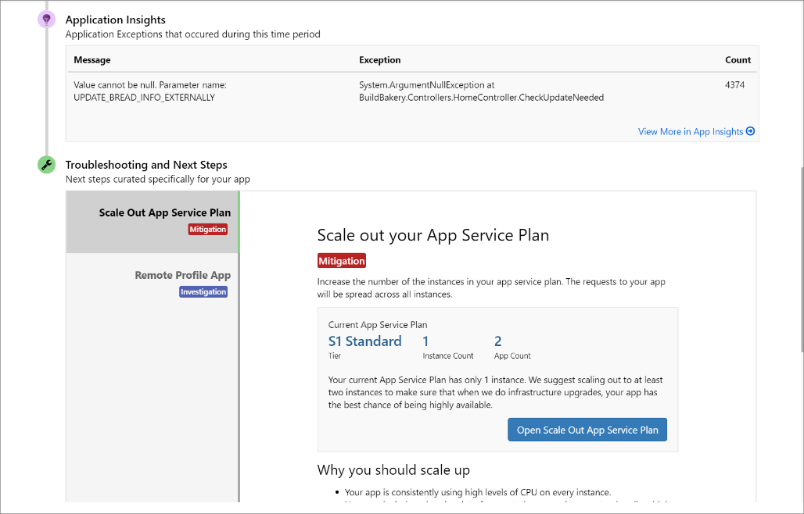
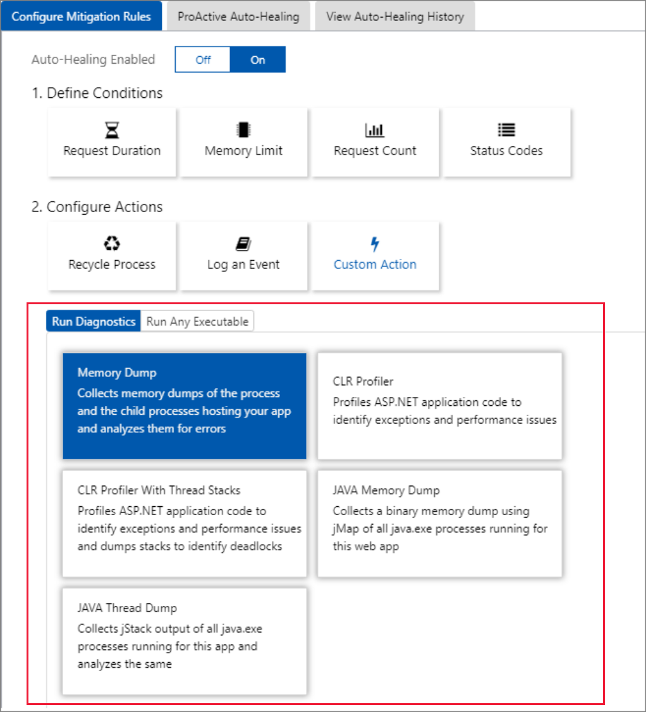
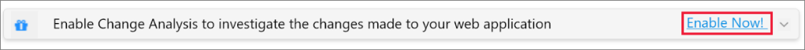
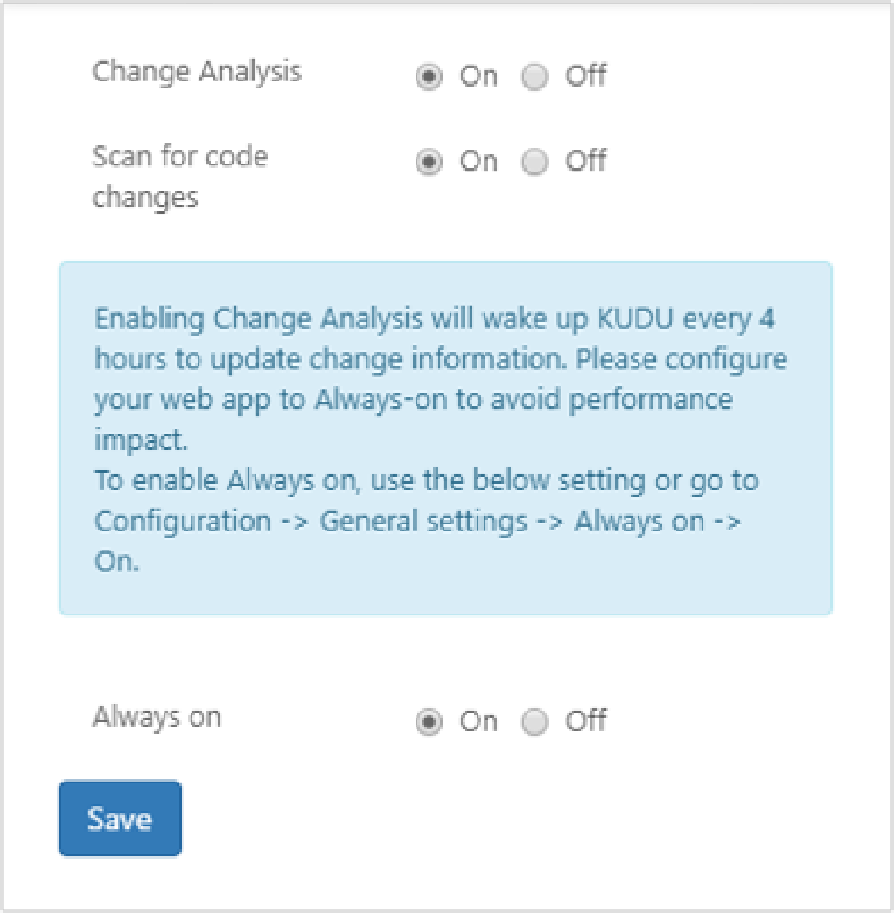
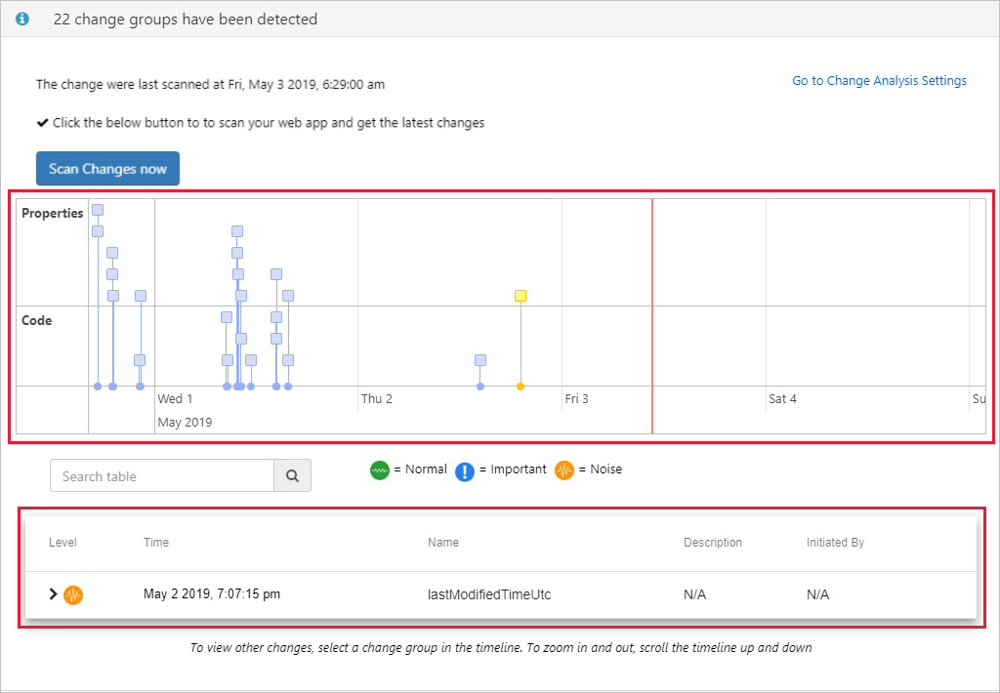
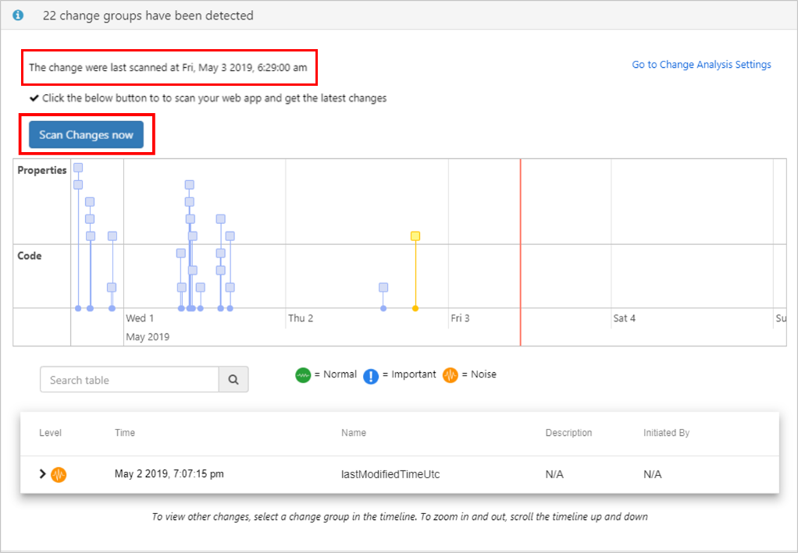
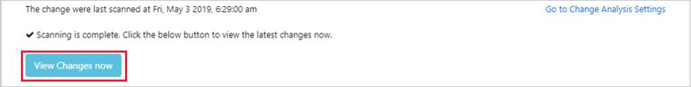

# Azure App Service Diagnostics Overview

When you’re running a web application, you want to be prepared for any issues that may arise, from 500 errors to your users telling you that your site is down. App Service Diagnostics is an intelligent and interactive experience to help you troubleshoot your web app with no configuration required. When you do run into issues with your web app, App Service Diagnostics will point out what’s wrong to guide you to the right information to more easily and quickly troubleshoot and resolve the issue.

Although this experience is most helpful when you’re having issues with your web app within the last 24 hours, all the diagnostic graphs will always be available for you to analyze.

App Service Diagnostics works for not only your app on Windows, but also apps on [Linux/containers](https://docs.microsoft.com/en-us/azure/app-service/containers/app-service-linux-intro), [App Service Environment](https://docs.microsoft.com/en-us/azure/app-service/environment/intro), and [Azure Functions](https://docs.microsoft.com/en-us/azure/azure-functions/functions-overview).

## Opening App Service Diagnostics

To access App Service Diagnostics, navigate to your App Service web app or App Service Environment in the [Azure portal](https://portal.azure.com). In the left navigation, click on **Diagnose and solve problems**.

For Azure Functions, navigate to your function app, and in the top navigation, click on **Platform features** and select **Diagnose and solve problems** from the **Resource management** section.

In the App Service Diagnostics homepage, you can choose the category that best describes the issue with your app by using the keywords in each homepage tile. This is also where you will find **Diagnostic Tools** for Windows apps. [See more details below](##Diagnostic-Tools-(Only-for-Windows-app))

## Interacting with Genie

Once you select a homepage category that best aligns with your app's problem, App Service Diagnostics' guided experience, Genie, will help you through diagnosing and solving problem with your app. You can use the tile shortcuts provided by Genie to view the full diagnostic report of the problem category that you are interested. The tile shortcuts provide you a direct way of accessing your diagnostic metrics.

After clicking on these tiles, you will see a list of topics related to the issue described in the tile. These topics provide snippets of notable information from the full report. You can click on any of these topics to investigate the issues further. Also, you can click on **View Full Report** to explore all the topics on a single page.

## Diagnostic report

After you choose to investigate the issue further by clicking on the list of topics, you can view more details about the topic often supplemented with graphs and markdowns. Diagnostic report can be a powerful tool for pinpointing the problem with your app. If you have found the information you need or you want to look at other detectors, you can simply close the detector tab and go back to the Genie interface to further investigate other problem areas.

## Health checkup 

If you don't know what’s wrong with your web app or don’t know where to start troubleshooting your issues, the health checkup is a good place to start. The health checkup will analyze your web applications to give you a quick, interactive overview that points out what’s healthy and what’s wrong, telling you where to look to investigate the issue. Its intelligent and interactive interface provides you with guidance through the troubleshooting process. Health checkup is integrated with the Genie experience for Windows apps and web app down detector for Linux apps.

### Health checkup graphs

- **Requests and Errors:** A graph that shows the number of requests made over the last 24 hours along with HTTP server errors.
- **App Performance:** A graph that shows response time over the last 24 hours for various percentile groups.
- **CPU Usage:** A graph that shows the overall percent CPU usage per instance over the last 24 hours.  
- **Memory Usage:** A graph that shows the overall percent physical memory usage per instance over the last 24 hours.

### Investigating application code issues (Only for Windows app)

Because many app issues are related to issues in your application code, App Service diagnostics integrates with [Application Insights](https://docs.microsoft.com/en-us/azure/azure-monitor/app/app-insights-overview) to highlight exceptions and dependency issues to correlate with the selected downtime. Application Insights does have to be enabled separately.

To view Application Insights exceptions and dependencies, select the **Web App Down** or **Web App Slow** tile shortcuts.

### Troubleshooting steps (Only for Windows app)

If an issue is detected with a specific problem category within the last 24 hours, you can view the full diagnostic report and App Service Diagnostics may prompt you to view more troubleshooting advice and next steps for a more guided experience.

## Diagnostic Tools (Only for Windows app)

Diagnostics Tools include more advanced diagnostic tools that will help you investigate issues related to application code issues, slowness, and connection strings and proactive tools that will help you mitigate issues with CPU usage, requests and memory.

### Proactive CPU Monitoring

Proactive CPU Monitoring provides you an easy, proactive way to take an action when your app or child process for your app is consuming high CPU resources. You can set your own rules for monitoring CPU by configuring CPU threshold, threshold seconds, monitoring frequency, configure action, maximum actions, and maximum duration. CPU monitoring supports 4 action modes. This tool can be used to temporarily mitigate a high CPU issue until the real cause for the unexpected issue is found.

- **Collect:** Whenever any of the processes consume CPU greater than CPU Threshold and the duration exceeds threshold seconds, a memory dump will be collected.
- **Kill:** Whenever the processes consume CPU greater than CPU Threshold and the duration exceeds threshold seconds, processes will be killed.
- **CollectAndKill:** Whenever the processes consume CPU greater than CPU Threshold and the duration exceeds threshold seconds, a memory dump will be collected and the processes will be killed.
- **CollectKillAndAnalyze:** Whenever the processes consume CPU greater than CPU Threshold and the duration exceeds threshold seconds, a memory dump will be collected and the processes will be killed. After all the memory dumps are collected, the dumps will be analyzed one by one.

### Proactive Auto-Healing

Like Proactive CPU monitoring, Proactive Auto-Healing offers an easy, proactive approach to mitigating unexpected behavior of your app. You can set your own rules based on request count, slow request, memory limit, and HTTP status code to trigger mitigation actions below. This tool can be used to temporarily mitigate an unexpected behavior until the real cause for the issue is found.

- **Recycling Process:** Whenever defined auto-healing condition is met, the worker process will be recycled in an overlapping manner.
- **Log an Event:** Whenever defined auto-healing condition is met, an event will be logged in eventlog.xml file. (Found inside your web app’s Log Files folder)
- **Custom Action:** Whenever defined auto-healing condition is met, configured diagnostic action or executable will be performed. See the diagram below for more details.

## Change Analysis

In a fast-paced development environment, sometimes it may be difficult to keep track of all the changes made to your app and let alone pinpoint on a change that caused an unhealthy behavior. Change Analysis can help you narrow down on the changes made to your app to facilitate trouble-shooting experience.

### Finding Change Analysis

Change Analysis is embedded in detectors so you can use it concurrently with information from other detectors.

### How to enable Change Analysis

Upon opening a detector page, you will see a message to enable Change Analysis. You can access the Change Analysis Settings by clicking on the **Enable Now** button.

Enable Change Analysis for your main web app by toggling on the Change Analysis. This will enable you to get property changes. Once Change Analysis is enabled, turn on **Scan code for changes** which will enable you to get code changes. By enabling **Scan code for changes**, your app’s Kudu will trigger a snapshot every 4 hours to capture the changes made between those time intervals. It’s best practice to enable **Always on** along with **Scan code for changes** to prevent waking up Kudu for snapshots and to minimize the impact on your application. To disable Change Analysis, you can access the **Change Analysis Settings** in the Change Analysis information in the detector page.

### Navigating through the change group timeline

Once Change Analysis is enabled, you will be able to see a **change group timeline** embedded in detectors. A change group is a group of changes captured at the same time stamp and is represented by a square box on the timeline. You can click on each change group to view individual changes in the **change chart** below. You can also use the search bar to filter for changes that have your search term.

You can also expand each row of change to view the difference between the old values and the new values.

Above the timeline group is the **last scanned time stamp** that shows the last time the timeline was updated. If you wish to find out about changes made after the last scanned time, click **Scan changes now**. (This may take a few minutes) 

After scanning is complete, you can update the timeline by clicking on **View changes now.**

### Change Analysis in Practice

Now, let’s walk you through a scenario where Change Analysis can come in very handy. For example, suppose you have noticed some downtime in your app caused by a change in app setting but you don't know what has caused the issue. First, open a detector page with Change Analysis like App Crash. Browse through the change group timeline to see if there were any changes made before the app started crashing. If you don’t find any changes on the timeline that could be related to the issue, click **Scan changes now** to update the timeline with the most recent changes. After the scanning completes, click **View changes now** to populate the timeline with the new change groups. You notice there is one change group that occurred right before the app started crashing. You can click on the change group to look at the change details. Expand the changes to view the differences. You will find that you accidentally deleted the connection string when you last made your code changes.  
