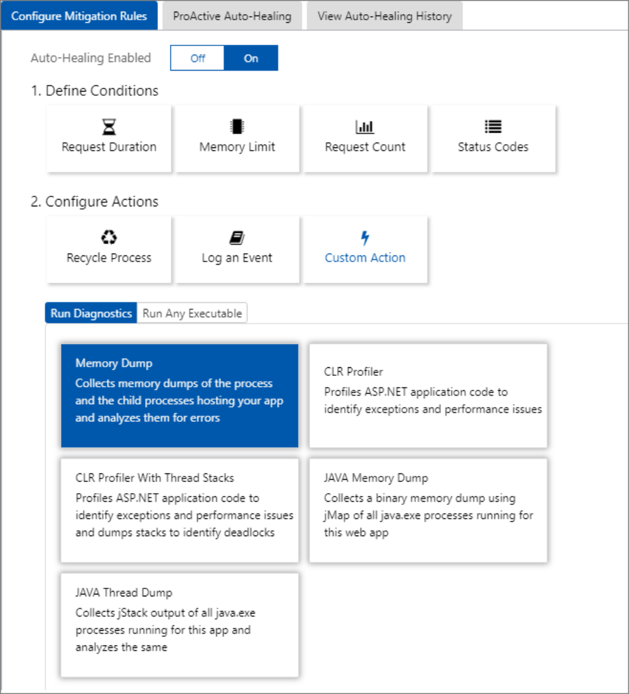
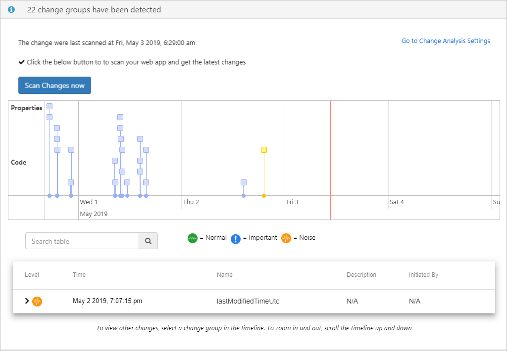

# Azure App Service diagnostics overview

When you’re running a web application, you want to be prepared for any issues that may arise, from 500 errors to your users telling you that your site is down. App Service diagnostics is an intelligent and interactive experience to help you troubleshoot your app with no configuration required. When you do run into issues with your app, App Service diagnostics points out what’s wrong to guide you to the right information to more easily and quickly troubleshoot and resolve the issue.

Although this experience is most helpful when you’re having issues with your app within the last 24 hours, all the diagnostic graphs are always available for you to analyze.

App Service diagnostics works for not only your app on Windows, but also apps on [Linux/containers](https://docs.microsoft.com/azure/app-service/containers/app-service-linux-intro), [App Service Environment](https://docs.microsoft.com/azure/app-service/environment/intro), and [Azure Functions](https://docs.microsoft.com/azure/azure-functions/functions-overview).

## Open App Service diagnostics

To access App Service diagnostics, navigate to your App Service web app or App Service Environment in the [Azure portal](https://portal.azure.com). In the left navigation, click on **Diagnose and solve problems**.

For Azure Functions, navigate to your function app, and in the top navigation, click on **Platform features**, and select **Diagnose and solve problems** from the **Resource management** section.

In the App Service diagnostics homepage, you can choose the category that best describes the issue with your app by using the keywords in each homepage tile. Also, this page is where you can find **Diagnostic Tools** for Windows apps. See [Diagnostic tools (only for Windows app)](#diagnostic-tools-only-for-windows-app).

## Interactive interface

Once you select a homepage category that best aligns with your app's problem, App Service diagnostics' interactive interface, Genie, can guide you through diagnosing and solving problem with your app. You can use the tile shortcuts provided by Genie to view the full diagnostic report of the problem category that you are interested. The tile shortcuts provide you a direct way of accessing your diagnostic metrics.

After clicking on these tiles, you can see a list of topics related to the issue described in the tile. These topics provide snippets of notable information from the full report. You can click on any of these topics to investigate the issues further. Also, you can click on **View Full Report** to explore all the topics on a single page.

## Diagnostic report

After you choose to investigate the issue further by clicking on a topic, you can view more details about the topic often supplemented with graphs and markdowns. Diagnostic report can be a powerful tool for pinpointing the problem with your app.

## Health checkup

If you don't know what’s wrong with your app or don’t know where to start troubleshooting your issues, the health checkup is a good place to start. The health checkup analyzes your applications to give you a quick, interactive overview that points out what’s healthy and what’s wrong, telling you where to look to investigate the issue. Its intelligent and interactive interface provides you with guidance through the troubleshooting process. Health checkup is integrated with the Genie experience for Windows apps and web app down diagnostic report for Linux apps.

### Health checkup graphs

There are four different graphs in the health checkup.

- **requests and errors:** A graph that shows the number of requests made over the last 24 hours along with HTTP server errors.
- **app performance:** A graph that shows response time over the last 24 hours for various percentile groups.
- **CPU usage:** A graph that shows the overall percent CPU usage per instance over the last 24 hours.  
- **memory usage:** A graph that shows the overall percent physical memory usage per instance over the last 24 hours.

### Investigate application code issues (only for Windows app)

Because many app issues are related to issues in your application code, App Service diagnostics integrates with [Application Insights](https://docs.microsoft.com/azure/azure-monitor/app/app-insights-overview) to highlight exceptions and dependency issues to correlate with the selected downtime. Application Insights has to be enabled separately.

To view Application Insights exceptions and dependencies, select the **web app down** or **web app slow** tile shortcuts.

### Troubleshooting steps (only for Windows app)

If an issue is detected with a specific problem category within the last 24 hours, you can view the full diagnostic report, and App Service diagnostics may prompt you to view more troubleshooting advice and next steps for a more guided experience.

## Diagnostic tools (only for Windows app)

Diagnostics Tools include more advanced diagnostic tools that help you investigate application code issues, slowness, connection strings, and more. and proactive tools that help you mitigate issues with CPU usage, requests, and memory.

### Proactive CPU monitoring

Proactive CPU monitoring provides you an easy, proactive way to take an action when your app or child process for your app is consuming high CPU resources. You can set your own CPU threshold rules to temporarily mitigate a high CPU issue until the real cause for the unexpected issue is found.

### Proactive auto-healing

Like proactive CPU monitoring, proactive auto-healing offers an easy, proactive approach to mitigating unexpected behavior of your app. You can set your own rules based on request count, slow request, memory limit, and HTTP status code to trigger mitigation actions. This tool can be used to temporarily mitigate an unexpected behavior until the real cause for the issue is found. For more information on proactive auto-healing, visit [Announcing the new auto healing experience in app service diagnostics](https://azure.github.io/AppService/2018/09/10/Announcing-the-New-Auto-Healing-Experience-in-App-Service-Diagnostics.html).

## Change analysis (only for Windows app)

In a fast-paced development environment, sometimes it may be difficult to keep track of all the changes made to your app and let alone pinpoint on a change that caused unhealthy behavior. Change analysis can help you narrow down on the changes made to your app to facilitate trouble-shooting experience. Change analysis is found in **Application Changes** and also embedded in a diagnostic report such as **Application Crashes** so you can use it concurrently with other metrics.

Change analysis has to be enabled before using the feature. For more information on change analysis, visit [Announcing the new change analysis experience in App Service Diagnostics](https://azure.github.io/AppService/2019/05/07/Announcing-the-new-change-analysis-experience-in-App-Service-Diagnostics-Analysis.html).

