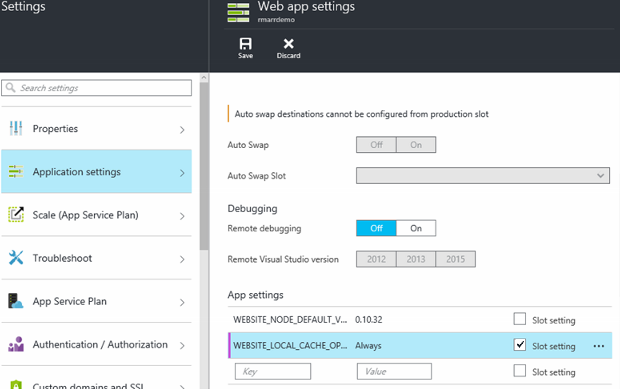

# Azure App Service Local Cache overview

> [!NOTE]
> Local cache is not supported in Function apps or containerized App Service apps, such as in [Windows Containers](app-service-web-get-started-windows-container.md) or on [App Service on Linux](containers/app-service-linux-intro.md).


Azure App Service content is stored on Azure Storage and is surfaced in a durable manner as a content share. This design is intended to work with a variety of apps and has the following attributes:  

* The content is shared across multiple virtual machine (VM) instances of the app.
* The content is durable and can be modified by running apps.
* Log files and diagnostic data files are available under the same shared content folder.
* Publishing new content directly updates the content folder. You can immediately view the same content through the SCM website and the running app (typically some technologies such as ASP.NET do initiate an app restart on some file changes to get the latest content).

While many apps use one or all of these features, some apps just need a high-performance, read-only content store that they can run from with high availability. These apps can benefit from a VM instance of a specific local cache.

The Azure App Service Local Cache feature provides a web role view of your content. This content is a write-but-discard cache of your storage content that is created asynchronously on-site startup. When the cache is ready, the site is switched to run against the cached content. Apps that run on Local Cache have the following benefits:

* They are immune to latencies that occur when they access content on Azure Storage.
* They are immune to the planned upgrades or unplanned downtimes and any other disruptions with Azure Storage that occur on servers that serve the content share.
* They have fewer app restarts due to storage share changes.

## How the local cache changes the behavior of App Service
* _D:\home_ points to the local cache, which is created on the VM instance when the app starts up. _D:\local_ continues to point to the temporary VM-specific storage.
* The local cache contains a one-time copy of the _/site_ and _/siteextensions_ folders of the shared content store, at _D:\home\site_ and _D:\home\siteextensions_, respectively. The files are copied to the local cache when the app starts. The size of the two folders for each app is limited to 1 GB by default, but can be increased to 2 GB. Note that as the cache size increases, it will take longer to load the cache. If the copied files exceed the size of the local cache, App Service silently ignores local cache and read from the remote file share.
* The local cache is read-write. However, any modification is discarded when the app moves virtual machines or gets restarted. Do not use the local cache for apps that store mission-critical data in the content store.
* _D:\home\LogFiles_ and _D:\home\Data_ contain log files and app data. The two subfolders are stored locally on the VM instance, and are copied to the shared content store periodically. Apps can persist log files and data by writing them to these folders. However, the copy to the shared content store is best-effort, so it is possible for log files and data to be lost due to a sudden crash of a VM instance.
* [Log streaming](troubleshoot-diagnostic-logs.md#stream-logs) is affected by the best-effort copy. You could observe up to a one-minute delay in the streamed logs.
* In the shared content store, there is a change in the folder structure of the _LogFiles_ and _Data_ folders for apps that use the local cache. There are now subfolders in them that follow the naming pattern of "unique identifier" + time stamp. Each of the subfolders corresponds to a VM instance where the app is running or has run.
* Other folders in _D:\home_ remain in the local cache and are not copied to the shared content store.
* App deployment through any supported method publishes directly to the durable shared content store. To refresh the _D:\home\site_ and _D:\home\siteextensions_ folders in the local cache, the app needs to be restarted. To make the lifecycle seamless, see the information later in this article.
* The default content view of the SCM site continues to be that of the shared content store.

## Enable Local Cache in App Service
You configure Local Cache by using a combination of reserved app settings. You can configure these app settings by using the following methods:

* [Azure portal](#Configure-Local-Cache-Portal)
* [Azure Resource Manager](#Configure-Local-Cache-ARM)

### Configure Local Cache by using the Azure portal
<a name="Configure-Local-Cache-Portal"></a>

You enable Local Cache on a per-web-app basis by using this app setting:
`WEBSITE_LOCAL_CACHE_OPTION` = `Always`  



### Configure Local Cache by using Azure Resource Manager
<a name="Configure-Local-Cache-ARM"></a>

```json

...

{
    "apiVersion": "2015-08-01",
    "type": "config",
    "name": "appsettings",
    "dependsOn": [
        "[resourceId('Microsoft.Web/sites/', variables('siteName'))]"
    ],

    "properties": {
        "WEBSITE_LOCAL_CACHE_OPTION": "Always",
        "WEBSITE_LOCAL_CACHE_SIZEINMB": "1000"
    }
}

...
```

## Change the size setting in Local Cache
By default, the local cache size is **1 GB**. This includes the /site and /siteextensions folders that are copied from the content store, as well as any locally created logs and data folders. To increase this limit, use the app setting `WEBSITE_LOCAL_CACHE_SIZEINMB`. You can increase the size up to **2 GB** (2000 MB) per app. Note that it will take longer to load local cache as the size increases.

## Best practices for using App Service Local Cache
We recommend that you use Local Cache in conjunction with the [Staging Environments](../app-service/deploy-staging-slots.md) feature.

* Add the *sticky* app setting `WEBSITE_LOCAL_CACHE_OPTION` with the value `Always` to your **Production** slot. If you're using `WEBSITE_LOCAL_CACHE_SIZEINMB`, also add it as a sticky setting to your Production slot.
* Create a **Staging** slot and publish to your Staging slot. You typically don't set the staging slot to use Local Cache to enable a seamless build-deploy-test lifecycle for staging if you get the benefits of Local Cache for the production slot.
* Test your site against your Staging slot.  
* When you are ready, issue a [swap operation](../app-service/deploy-staging-slots.md#Swap) between your Staging and Production slots.  
* Sticky settings include name and sticky to a slot. So when the Staging slot gets swapped into Production, it inherits the Local Cache app settings. The newly swapped Production slot will run against the local cache after a few minutes and will be warmed up as part of slot warmup after swap. So when the slot swap is complete, your Production slot is running against the local cache.

## Frequently asked questions (FAQ)

### How can I tell if Local Cache applies to my app?
If your app needs a high-performance, reliable content store, does not use the content store to write critical data at runtime, and is less than 2 GB in total size, then the answer is "yes"! To get the total size of your /site and /siteextensions folders, you can use the site extension "Azure Web Apps Disk Usage."

### How can I tell if my site has switched to using Local Cache?
If you're using the Local Cache feature with Staging Environments, the swap operation does not complete until Local Cache is warmed up. To check if your site is running against Local Cache, you can check the worker process environment variable `WEBSITE_LOCALCACHE_READY`. Use the instructions on the [worker process environment variable](https://github.com/projectkudu/kudu/wiki/Process-Threads-list-and-minidump-gcdump-diagsession#process-environment-variable) page to access the worker process environment variable on multiple instances.  

### I just published new changes, but my app does not seem to have them. Why?
If your app uses Local Cache, then you need to restart your site to get the latest changes. Don’t want to publish changes to a production site? See the slot options in the previous best practices section.

### Where are my logs?
With Local Cache, your logs and data folders do look a little different. However, the structure of your subfolders remains the same, except that the subfolders are nestled under a subfolder with the format "unique VM identifier" + time stamp.

### I have Local Cache enabled, but my  app still gets restarted. Why is that? I thought Local Cache helped with frequent app restarts.
Local Cache does help prevent storage-related app restarts. However, your app could still undergo restarts during planned infrastructure upgrades of the VM. The overall app restarts that you experience with Local Cache enabled should be fewer.

### Does Local Cache exclude any directories from being copied to the faster local drive?
As part of the step that copies the storage content, any folder that is named repository is excluded. This helps with scenarios where your site content may contain a source control repository that may not be needed in day to day operation of the app. 
