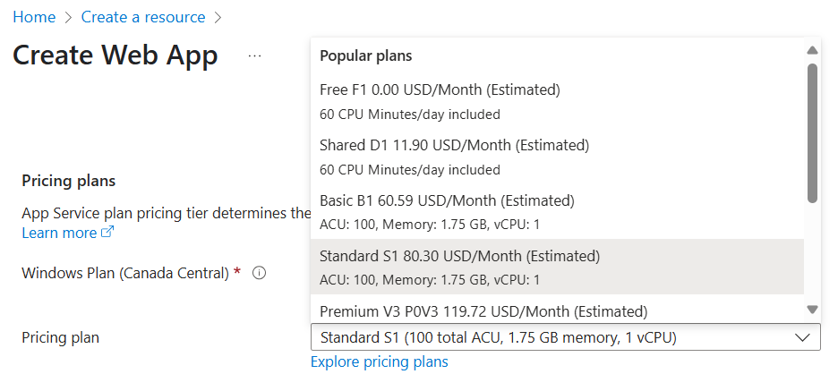

# Plan and manage costs for Azure App Service

<!-- Check out the following published examples:
- [https://learn.microsoft.com/azure/cosmos-db/plan-manage-costs](../cosmos-db/plan-manage-costs.md)
- [https://learn.microsoft.com/azure/storage/common/storage-plan-manage-costs](../storage/common/storage-plan-manage-costs.md)
- [https://learn.microsoft.com/azure/machine-learning/concept-plan-manage-cost](../machine-learning/concept-plan-manage-cost.md)
-->

<!-- Note for Azure service writer: Links to Cost Management articles are full URLS with the ?WT.mc_id=costmanagementcontent_docsacmhorizontal_-inproduct-learn campaign suffix. Leave those URLs intact. They're used to measure traffic to Cost Management articles.
-->

<!-- Note for Azure service writer: Modify the following for your service. -->

This article describes how you plan for and manage costs for Azure App Service. First, you use the Azure pricing calculator to help plan for App Service costs before you add any resources for the service to estimate costs. Next, as you add Azure resources, review the estimated costs. After you've started using App Service resources, use [Cost Management](../cost-management-billing/index.yml?WT.mc_id=costmanagementcontent_docsacmhorizontal_-inproduct-learn) features to set budgets and monitor costs. You can also review forecasted costs and identify spending trends to identify areas where you might want to act. Costs for Azure App Service are only a portion of the monthly costs in your Azure bill. Although this article explains how to plan for and manage costs for App Service, you're billed for all Azure services and resources used in your Azure subscription, including the third-party services.

## Understand the full billing model for Azure App Service

Azure App Service runs on Azure infrastructure that accrues costs when you deploy new resources. It's important to understand that there could be other infrastructure costs that might accrue.

### How you're charged for Azure App Service

When you create or use App Service resources, you're charged for the following meters:

- You're charged an hourly rate based on the pricing tier of your App Service plan, prorated to the second.
- The charge is applied to each scaled-out instance in your plan, based on the amount of time that the VM instance is allocated. 

Other cost resources for App Service are (see [App Service pricing](https://azure.microsoft.com/pricing/details/app-service/) for details):

- [App Service domains](manage-custom-dns-buy-domain.md)  Your subscription is charged for the domain registration on a yearly basis, if you enable automatic renewal.
- [App Service certificates](configure-ssl-app-service-certificate.md)  One-time charge at the time of purchase. If you have multiple subdomains to secure, you can reduce cost by purchasing one wildcard certificate instead of multiple standard certificates.
- [IP-based SSL binding](configure-ssl-bindings.md)  The binding is configured on a certificate at the app level. Costs are accrued for each binding. For **Standard** tier and higher, the first IP-based binding isn't charged.

At the end of your billing cycle, the charges for each VM instance. Your bill or invoice shows a section for all App Service costs. There's a separate line item for each meter.

### Other costs that might accrue with Azure App Service

Depending on which feature you use in App Service, the following cost-accruing resources may be created:

- **Isolated tier**  A [Virtual Network](../virtual-network/index.yml) is required for an App Service environment and is charged separately.
- **Backup**  A [Storage account](../storage/index.yml) is required to make backups and is charged separately.
- **Diagnostic logs**  You can select [Storage account](../storage/index.yml) as the logging option, or integrate with [Azure Log Analytics](../azure-monitor/logs/log-analytics-tutorial.md). These services are charged separately.
- **App Service certificates**  Certificates you purchase in Azure must be maintained in [Azure Key Vault](../key-vault/index.yml), which is charged separately.

### Costs that might accrue after resource deletion

When you delete all apps in an App Service plan, the plan continues to accrue charges based on its configured pricing tier and number of instances. To avoid unwanted charges, delete the plan or scale it down to **Free** tier.

After you delete Azure App Service resources, resources from related Azure services might continue to exist. They continue to accrue costs until you delete them. For example:

- The Virtual Network that you created for an **Isolated** tier App Service plan
- Storage accounts you created to store backups or diagnostic logs
- Key Vault you created to store App Service certificates
- Log Analytic namespaces you created to ship diagnostic logs
- [Instance or stamp reservations](#azure-reservations) for App Service that haven't expired yet

### Using Azure Prepayment with Azure App Service

You can pay for Azure App Service charges with your Azure Prepayment credit. However, you can't use Azure Prepayment credit to pay for charges for third-party products and services, including those from the Azure Marketplace.

## Estimate costs

An easy way to estimate and optimize your App Service cost beforehand is by using the [Azure pricing calculator](https://azure.microsoft.com/pricing/calculator/).

To use the pricing calculator, select **App Service** in the **Products** tab. Then, scroll down to work with the calculator. The following screenshot is an example and doesn't reflect current pricing.

### Review estimated costs in the Azure portal

When you create an App Service app or an App Service plan, you can see the estimated costs.

To create an app and view the estimated price:

1. On the create page, scroll down to **App Service plan**, and select **Create new**.
1. Specify a name and select **OK**.
1. Next to **Sku and size**, select **Change size**.
1. Review the estimated price shown in the summary. The following screenshot is an example and doesn't reflect current pricing.

    

If your Azure subscription has a spending limit, Azure prevents you from spending over your credit amount. As you create and use Azure resources, your credits are used. When you reach your credit limit, the resources that you deployed are disabled for the rest of that billing period. You can't change your credit limit, but you can remove it. For more information about spending limits, see [Azure spending limit](../cost-management-billing/manage/spending-limit.md?WT.mc_id=costmanagementcontent_docsacmhorizontal_-inproduct-learn).

## Optimize costs

At a basic level, App Service apps are charged by the App Service plan that hosts them. The costs associated with your App Service deployment depend on a few main factors:

- **Pricing tier**  Otherwise known as the SKU of the App Service plan. Higher tiers provide more CPU cores, memory, storage, or features, or combinations of them.
- **Instance count**  dedicated tiers (Basic and higher) can be scaled out, and each scaled out instance accrues costs.
- **Stamp fee**  In the Isolated tier, a flat fee is accrued on your App Service environment, regardless of how many apps or worker instances are hosted.

An App Service plan can host more than one app. Depending on your deployment, you could save costs hosting more apps on one App Service plans (i.e. hosting your apps on fewer App Service plans).

For details, see [App Service plan overview](overview-hosting-plans.md)

### Non-production workloads

To test App Service or your solution while accruing low or minimal cost, you can begin by using the two entry-level pricing tiers, **Free** and **Shared**, which are hosted on shared instances. To test your app on dedicated instances with better performance, you can upgrade to **Basic** tier, which supports both Windows and Linux apps. 

> [!NOTE]
> **Azure Dev/Test Pricing**  To test pre-production workloads that require higher tiers (all tiers except for **Isolated**), Visual Studio subscribers can also take advantage of the [Azure Dev/Test Pricing](https://azure.microsoft.com/pricing/dev-test/), which offers significant discounts.
>
> Both the **Free** and **Shared** tier, as well as the Azure Dev/Test Pricing discounts, don't carry a financially backed SLA.

### Production workloads

Production workloads come with the recommendation of the dedicated **Standard** pricing tier or higher. While the price goes up for higher tiers, it also gives you more memory and storage and higher-performing hardware, giving you higher app density per compute instance. That translates to lower instance count for the same number of apps, and therefore lower cost. In fact, **Premium V3** (the highest non-**Isolated** tier) is the most cost effective way to serve your app at scale. To add to the savings, you can get deep discounts on [Premium V3 reservations](#azure-reservations).

> [!NOTE]
> **Premium V3** supports both Windows containers and Linux containers. 

Once you choose the pricing tier you want, you should minimize the idle instances. In a scale-out deployment, you can waste money on underutilized compute instances. You should [configure autoscaling](../azure-monitor/autoscale/autoscale-get-started.md), available in **Standard** tier and higher. By creating scale-out schedules, as well as metric-based scale-out rules, you only pay for the instances you really need at any given time.

### Azure Reservations

If you plan to utilize a known minimum number of compute instances for one year or more, you should take advantage of **Premium V3** tier and drive down the instance cost drastically by reserving those instances in 1-year or 3-year increments. The monthly cost savings can be as much as 55% per instance. Two types of reservations are possible:

- **Windows (or platform agnostic)**  Can apply to Windows or Linux instances in your subscription.
- **Linux specific**  Applies only to Linux instances in your subscription.

The reserved instance pricing applies to the applicable instances in your subscription, up to the number of instances that you reserve. The reserved instances are a billing matter and aren't tied to specific compute instances. If you run fewer instances than you reserve at any point during the reservation period, you still pay for the reserved instances. If you run more instances than you reserve at any point during the reservation period, you pay the normal accrued cost for the additional instances.

The **Isolated** tier (App Service environment) also supports 1-year and 3-year reservations at reduced pricing. For more information, see [How reservation discounts apply to Azure App Service](../cost-management-billing/reservations/reservation-discount-app-service.md).

## Monitor costs

As you use Azure resources with App Service, you incur costs. Azure resource usage unit costs vary by time intervals (seconds, minutes, hours, and days). As soon as App Service use starts, costs are incurred and you can see the costs in [cost analysis](../cost-management-billing/costs/quick-acm-cost-analysis.md?WT.mc_id=costmanagementcontent_docsacmhorizontal_-inproduct-learn).

When you use cost analysis, you view App Service costs in graphs and tables for different time intervals. Some examples are by day, current and prior month, and year. You also view costs against budgets and forecasted costs. Switching to longer views over time can help you identify spending trends. And you see where overspending might have occurred. If you've created budgets, you can also easily see where they're exceeded.
    
To view App Service costs in cost analysis:

1. Sign in to the Azure portal.
2. Open the scope in the Azure portal and select **Cost analysis** in the menu. For example, go to **Subscriptions**, select a subscription from the list, and then select  **Cost analysis** in the menu. Select **Scope** to switch to a different scope in cost analysis.
3. By default, cost for services are shown in the first donut chart. Select the area in the chart labeled App Service.

Actual monthly costs are shown when you initially open cost analysis. Here's an example showing all monthly usage costs.

To narrow costs for a single service, like App Service, select **Add filter** and then select **Service name**. Then, select **App Service**.

Here's an example showing costs for just App Service.

In the preceding example, you see the current cost for the service. Costs by Azure regions (locations) and App Service costs by resource group are also shown. From here, you can explore costs on your own.

## Create budgets

<!-- Note to Azure service writer: Modify the following as needed for your service. -->

You can create [budgets](../cost-management-billing/costs/tutorial-acm-create-budgets.md?WT.mc_id=costmanagementcontent_docsacmhorizontal_-inproduct-learn) to manage costs and create [alerts](../cost-management-billing/costs/cost-mgt-alerts-monitor-usage-spending.md?WT.mc_id=costmanagementcontent_docsacmhorizontal_-inproduct-learn) that automatically notify stakeholders of spending anomalies and overspending risks. Alerts are based on spending compared to budget and cost thresholds. Budgets and alerts are created for Azure subscriptions and resource groups, so they're useful as part of an overall cost monitoring strategy. 

Budgets can be created with filters for specific resources or services in Azure if you want more granularity present in your monitoring. Filters help ensure that you don't accidentally create new resources that cost you extra money. For more information about the filter options available when you create a budget, see [Group and filter options](../cost-management-billing/costs/group-filter.md?WT.mc_id=costmanagementcontent_docsacmhorizontal_-inproduct-learn).

## Export cost data

You can also [export your cost data](../cost-management-billing/costs/tutorial-export-acm-data.md?WT.mc_id=costmanagementcontent_docsacmhorizontal_-inproduct-learn) to a storage account. This is helpful when you need or others to do more data analysis for costs. For example, a finance team can analyze the data using Excel or Power BI. You can export your costs on a daily, weekly, or monthly schedule and set a custom date range. Exporting cost data is the recommended way to retrieve cost datasets.

## Next steps

- Learn more on how pricing works with Azure Storage. See [App Service pricing](https://azure.microsoft.com/pricing/details/app-service/).
- Learn [how to optimize your cloud investment with Azure Cost Management](../cost-management-billing/costs/cost-mgt-best-practices.md?WT.mc_id=costmanagementcontent_docsacmhorizontal_-inproduct-learn).
- Learn more about managing costs with [cost analysis](../cost-management-billing/costs/quick-acm-cost-analysis.md?WT.mc_id=costmanagementcontent_docsacmhorizontal_-inproduct-learn).
- Learn about how to [prevent unexpected costs](../cost-management-billing/cost-management-billing-overview.md?WT.mc_id=costmanagementcontent_docsacmhorizontal_-inproduct-learn).
- Take the [Cost Management](/training/paths/control-spending-manage-bills?WT.mc_id=costmanagementcontent_docsacmhorizontal_-inproduct-learn) guided learning course.

<!-- Insert links to other articles that might help users save and manage costs for you service here.

Create a table of contents entry for the article in the How-to guides section where appropriate. -->
