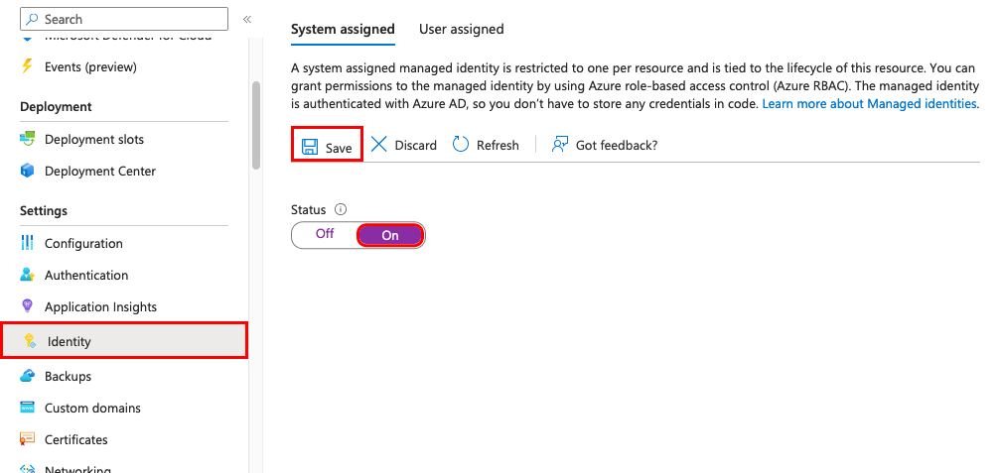
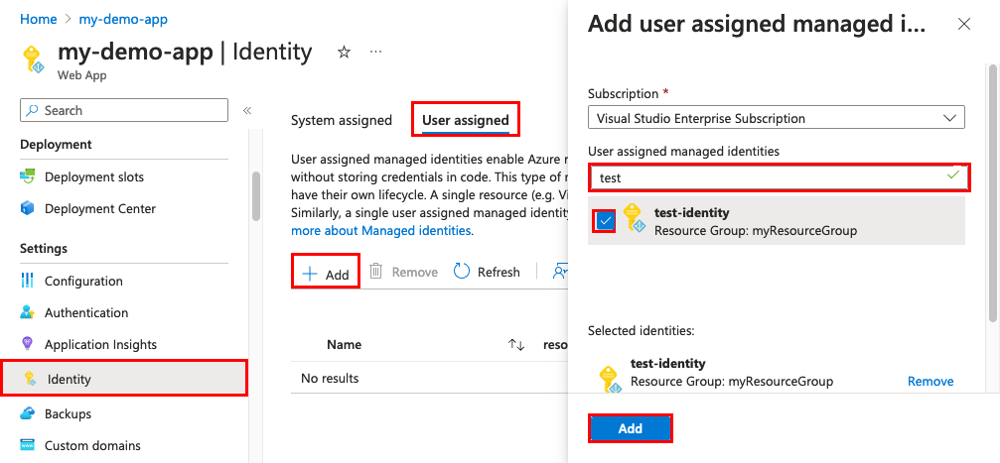

# How to use managed identities for App Service and Azure Functions

This article shows you how to create a managed identity for App Service and Azure Functions applications and how to use it to access other resources. 

> [!IMPORTANT] 
> Because [managed identities don't support cross-directory scenarios](../active-directory/managed-identities-azure-resources/managed-identities-faq.md#can-i-use-a-managed-identity-to-access-a-resource-in-a-different-directorytenant), they won't behave as expected if your app is migrated across subscriptions or tenants. To recreate the managed identities after such a move, see [Will managed identities be recreated automatically if I move a subscription to another directory?](../active-directory/managed-identities-azure-resources/managed-identities-faq.md#will-managed-identities-be-recreated-automatically-if-i-move-a-subscription-to-another-directory). Downstream resources also need to have access policies updated to use the new identity.

> [!NOTE]
> Managed identities are not available for [apps deployed in Azure Arc](overview-arc-integration.md).

[!INCLUDE [app-service-managed-identities](../../includes/app-service-managed-identities.md)]

The managed identity configuration is specific to the slot. To configure a managed identity for a deployment slot in the portal, navigate to the slot first. To find the managed identity for your web app or deployment slot in your Microsoft Entra tenant from the Azure portal, search for it directly from the **Overview** page of your tenant. Usually, the slot name is similar to `<app-name>/slots/<slot-name>`.

## Add a system-assigned identity

# [Azure portal](#tab/portal)

1. In the left navigation of your app's page, scroll down to the **Settings** group.

1. Select **Identity**.

1. Within the **System assigned** tab, switch **Status** to **On**. Click **Save**.

    

# [Azure CLI](#tab/cli)

Run the `az webapp identity assign` command to create a system-assigned identity:

```azurecli-interactive
az webapp identity assign --name myApp --resource-group myResourceGroup
```

# [Azure PowerShell](#tab/ps)

#### For App Service

Run the `Set-AzWebApp -AssignIdentity` command to create a system-assigned identity for App Service:

```azurepowershell-interactive
Set-AzWebApp -AssignIdentity $true -Name <app-name> -ResourceGroupName <group-name> 
```

#### For Functions

Run the `Update-AzFunctionApp -IdentityType` command to create a system-assigned identity for a function app:

```azurepowershell-interactive
Update-AzFunctionApp -Name $functionAppName -ResourceGroupName $resourceGroupName -IdentityType SystemAssigned
```

# [ARM template](#tab/arm)

An Azure Resource Manager template can be used to automate deployment of your Azure resources. To learn more about deploying to App Service and Functions, see [Automating resource deployment in App Service](../app-service/deploy-complex-application-predictably.md) and [Automating resource deployment in Azure Functions](../azure-functions/functions-infrastructure-as-code.md).

Any resource of type `Microsoft.Web/sites` can be created with an identity by including the following property in the resource definition:

```json
"identity": {
    "type": "SystemAssigned"
}
```

Adding the system-assigned type tells Azure to create and manage the identity for your application.

For example, a web app's template might look like the following JSON:

```json
{
    "apiVersion": "2022-03-01",
    "type": "Microsoft.Web/sites",
    "name": "[variables('appName')]",
    "location": "[resourceGroup().location]",
    "identity": {
        "type": "SystemAssigned"
    },
    "properties": {
        "name": "[variables('appName')]",
        "serverFarmId": "[resourceId('Microsoft.Web/serverfarms', variables('hostingPlanName'))]",
        "hostingEnvironment": "",
        "clientAffinityEnabled": false,
        "alwaysOn": true
    },
    "dependsOn": [
        "[resourceId('Microsoft.Web/serverfarms', variables('hostingPlanName'))]"
    ]
}
```

When the site is created, it has the following additional properties:

```json
"identity": {
    "type": "SystemAssigned",
    "tenantId": "<tenant-id>",
    "principalId": "<principal-id>"
}
```

The tenantId property identifies what Microsoft Entra tenant the identity belongs to. The principalId is a unique identifier for the application's new identity. Within Microsoft Entra ID, the service principal has the same name that you gave to your App Service or Azure Functions instance.

If you need to reference these properties in a later stage in the template, you can do so via the [`reference()` template function](../azure-resource-manager/templates/template-functions-resource.md#reference) with the `'Full'` flag, as in this example:

```json
{
    "tenantId": "[reference(resourceId('Microsoft.Web/sites', variables('appName')), '2018-02-01', 'Full').identity.tenantId]",
    "objectId": "[reference(resourceId('Microsoft.Web/sites', variables('appName')), '2018-02-01', 'Full').identity.principalId]",
}
```

-----

## Add a user-assigned identity

Creating an app with a user-assigned identity requires that you create the identity and then add its resource identifier to your app config.

# [Azure portal](#tab/portal)

First, you'll need to create a user-assigned identity resource.

1. Create a user-assigned managed identity resource according to [these instructions](../active-directory/managed-identities-azure-resources/how-to-manage-ua-identity-portal.md#create-a-user-assigned-managed-identity).

1. In the left navigation for your app's page, scroll down to the **Settings** group.

1. Select **Identity**.

1. Select **User assigned** > **Add**.

1. Search for the identity you created earlier, select it, and select **Add**.

    
    
    Once you select **Add**, the app restarts.

# [Azure CLI](#tab/cli)

1. Create a user-assigned identity.

    ```azurepowershell-interactive
    az identity create --resource-group <group-name> --name <identity-name>
    ```

1. Run the `az webapp identity assign` command to assign the identity to the app.

    ```azurepowershell-interactive
    az webapp identity assign --resource-group <group-name> --name <app-name> --identities <identity-id>
    ```

# [Azure PowerShell](#tab/ps)

#### For App Service 

Adding a user-assigned identity in App Service is currently not supported.

#### For Functions

1. Create a user-assigned identity.

    ```azurepowershell-interactive
    Install-Module -Name Az.ManagedServiceIdentity -AllowPrerelease
    $userAssignedIdentity = New-AzUserAssignedIdentity -Name $userAssignedIdentityName -ResourceGroupName <group-name>
    ```

1. Run the `Update-AzFunctionApp -IdentityType UserAssigned -IdentityId` command to assign the identity in Functions:

    ```azurepowershell-interactive
    Update-AzFunctionApp -Name <app-name> -ResourceGroupName <group-name> -IdentityType UserAssigned -IdentityId $userAssignedIdentity.Id
    ```

# [ARM template](#tab/arm)

An Azure Resource Manager template can be used to automate deployment of your Azure resources. To learn more about deploying to App Service and Functions, see [Automating resource deployment in App Service](../app-service/deploy-complex-application-predictably.md) and [Automating resource deployment in Azure Functions](../azure-functions/functions-infrastructure-as-code.md).

Any resource of type `Microsoft.Web/sites` can be created with an identity by including the following block in the resource definition, replacing `<resource-id>` with the resource ID of the desired identity:

```json
"identity": {
    "type": "UserAssigned",
    "userAssignedIdentities": {
        "<resource-id>": {}
    }
}
```

> [!NOTE]
> An application can have both system-assigned and user-assigned identities at the same time. In this case, the `type` property would be `SystemAssigned,UserAssigned`

Adding the user-assigned type tells Azure to use the user-assigned identity specified for your application.

For example, a web app's template might look like the following JSON:

```json
{
    "apiVersion": "2022-03-01",
    "type": "Microsoft.Web/sites",
    "name": "[variables('appName')]",
    "location": "[resourceGroup().location]",
    "identity": {
        "type": "UserAssigned",
        "userAssignedIdentities": {
            "[resourceId('Microsoft.ManagedIdentity/userAssignedIdentities', variables('identityName'))]": {}
        }
    },
    "properties": {
        "name": "[variables('appName')]",
        "serverFarmId": "[resourceId('Microsoft.Web/serverfarms', variables('hostingPlanName'))]",
        "hostingEnvironment": "",
        "clientAffinityEnabled": false,
        "alwaysOn": true
    },
    "dependsOn": [
        "[resourceId('Microsoft.Web/serverfarms', variables('hostingPlanName'))]",
        "[resourceId('Microsoft.ManagedIdentity/userAssignedIdentities', variables('identityName'))]"
    ]
}
```

When the site is created, it has the following additional properties:

```json
"identity": {
    "type": "UserAssigned",
    "userAssignedIdentities": {
        "<resource-id>": {
            "principalId": "<principal-id>",
            "clientId": "<client-id>"
        }
    }
}
```

The principalId is a unique identifier for the identity that's used for Microsoft Entra administration. The clientId is a unique identifier for the application's new identity that's used for specifying which identity to use during runtime calls.

-----

## Configure target resource

You may need to configure the target resource to allow access from your app or function. For example, if you [request a token](#connect-to-azure-services-in-app-code) to access Key Vault, you must also add an access policy that includes the managed identity of your app or function. Otherwise, your calls to Key Vault will be rejected, even if you use a valid token. The same is true for Azure SQL Database. To learn more about which resources support Microsoft Entra tokens, see [Azure services that support Microsoft Entra authentication](../active-directory/managed-identities-azure-resources/services-support-managed-identities.md#azure-services-that-support-azure-ad-authentication).

> [!IMPORTANT]
> The back-end services for managed identities maintain a cache per resource URI for around 24 hours. If you update the access policy of a particular target resource and immediately retrieve a token for that resource, you may continue to get a cached token with outdated permissions until that token expires. There's currently no way to force a token refresh.

## Connect to Azure services in app code

With its managed identity, an app can obtain tokens for Azure resources that are protected by Microsoft Entra ID, such as Azure SQL Database, Azure Key Vault, and Azure Storage. These tokens represent the application accessing the resource, and not any specific user of the application. 

App Service and Azure Functions provide an internally accessible [REST endpoint](#rest-endpoint-reference) for token retrieval. The REST endpoint can be accessed from within the app with a standard HTTP GET, which can be implemented with a generic HTTP client in every language. For .NET, JavaScript, Java, and Python, the Azure Identity client library provides an abstraction over this REST endpoint and simplifies the development experience. Connecting to other Azure services is as simple as adding a credential object to the service-specific client.

# [HTTP GET](#tab/http)

A raw HTTP GET request looks like the following example:

```http
GET /MSI/token?resource=https://vault.azure.net&api-version=2019-08-01 HTTP/1.1
Host: localhost:4141
X-IDENTITY-HEADER: 853b9a84-5bfa-4b22-a3f3-0b9a43d9ad8a
```

And a sample response might look like the following:

```http
HTTP/1.1 200 OK
Content-Type: application/json

{
    "access_token": "eyJ0eXAi…",
    "expires_on": "1586984735",
    "resource": "https://vault.azure.net",
    "token_type": "Bearer",
    "client_id": "5E29463D-71DA-4FE0-8E69-999B57DB23B0"
}
```

This response is the same as the [response for the Microsoft Entra service-to-service access token request](../active-directory/develop/v2-oauth2-client-creds-grant-flow.md#successful-response). To access Key Vault, you will then add the value of `access_token` to a client connection with the vault.

# [.NET](#tab/dotnet)

> [!NOTE]
> When connecting to Azure SQL data sources with [Entity Framework Core](/ef/core/), consider [using Microsoft.Data.SqlClient](/sql/connect/ado-net/sql/azure-active-directory-authentication), which provides special connection strings for managed identity connectivity. For an example, see [Tutorial: Secure Azure SQL Database connection from App Service using a managed identity](tutorial-connect-msi-sql-database.md).

For .NET apps and functions, the simplest way to work with a managed identity is through the [Azure Identity client library for .NET](/dotnet/api/overview/azure/identity-readme?). For detailed guidance, see [Tutorial: Connect to Azure databases from App Service without secrets using a managed identity](tutorial-connect-msi-azure-database.md).

See the respective documentation headings of the client library for information:

- [Add Azure Identity client library to your project](/dotnet/api/overview/azure/identity-readme#getting-started)
- [Access Azure service with a system-assigned identity](/dotnet/api/overview/azure/identity-readme#authenticating-with-defaultazurecredential)
- [Access Azure service with a user-assigned identity](/dotnet/api/overview/azure/identity-readme#specifying-a-user-assigned-managed-identity-with-the-defaultazurecredential)

The linked examples use [`DefaultAzureCredential`](/dotnet/api/overview/azure/identity-readme#defaultazurecredential). It's useful for the majority of the scenarios because the same pattern works in Azure (with managed identities) and on your local machine (without managed identities).

# [JavaScript](#tab/javascript)

For Node.js apps and JavaScript functions, the simplest way to work with a managed identity is through the [Azure Identity client library for JavaScript](/javascript/api/overview/azure/identity-readme?). For detailed guidance, see [Tutorial: Connect to Azure databases from App Service without secrets using a managed identity](tutorial-connect-msi-azure-database.md).

See the respective documentation headings of the client library for information:

- [Add Azure Identity client library to your project](/javascript/api/overview/azure/identity-readme#install-the-package)
- [Access Azure service with a system-assigned identity](/javascript/api/overview/azure/identity-readme#authenticating-with-defaultazurecredential)
- [Access Azure service with a user-assigned identity](/javascript/api/overview/azure/identity-readme#authenticating-a-user-assigned-managed-identity-with-defaultazurecredential)

The linked examples use [`DefaultAzureCredential`](/javascript/api/overview/azure/identity-readme#defaultazurecredential). It's useful for the majority of the scenarios because the same pattern works in Azure (with managed identities) and on your local machine (without managed identities).

For more code examples of the Azure Identity client library for JavaScript, see [Azure Identity examples](https://github.com/Azure/azure-sdk-for-js/blob/%40azure/identity_2.0.1/sdk/identity/identity/samples/AzureIdentityExamples.md).

# [Python](#tab/python)

For Python apps and functions, the simplest way to work with a managed identity is through the [Azure Identity client library for Python](/python/api/overview/azure/identity-readme). For detailed guidance, see [Tutorial: Connect to Azure databases from App Service without secrets using a managed identity](tutorial-connect-msi-azure-database.md).

See the respective documentation headings of the client library for information:

- [Add Azure Identity client library to your project](/python/api/overview/azure/identity-readme#getting-started)
- [Access Azure service with a system-assigned identity](/python/api/overview/azure/identity-readme#authenticating-with-defaultazurecredential)
- [Access Azure service with a user-assigned identity](/python/api/overview/azure/identity-readme#authenticating-a-user-assigned-managed-identity-with-defaultazurecredential)

The linked examples use [`DefaultAzureCredential`](/python/api/overview/azure/identity-readme#defaultazurecredential). It's useful for the majority of the scenarios because the same pattern works in Azure (with managed identities) and on your local machine (without managed identities).

# [Java](#tab/java)

For Java apps and functions, the simplest way to work with a managed identity is through the [Azure Identity client library for Java](/java/api/overview/azure/identity-readme). For detailed guidance, see [Tutorial: Connect to Azure databases from App Service without secrets using a managed identity](tutorial-connect-msi-azure-database.md).

See the respective documentation headings of the client library for information:

- [Add Azure Identity client library to your project](/java/api/overview/azure/identity-readme#include-the-package)
- [Access Azure service with a system-assigned identity](/java/api/overview/azure/identity-readme#authenticating-with-defaultazurecredential)
- [Access Azure service with a user-assigned identity](/java/api/overview/azure/identity-readme#authenticating-a-user-assigned-managed-identity-with-defaultazurecredential)

The linked examples use [`DefaultAzureCredential`](/azure/developer/java/sdk/identity-azure-hosted-auth#default-azure-credential). It's useful for the majority of the scenarios because the same pattern works in Azure (with managed identities) and on your local machine (without managed identities).

For more code examples of the Azure Identity client library for Java, see [Azure Identity Examples](https://github.com/Azure/azure-sdk-for-java/wiki/Azure-Identity-Examples).

# [PowerShell](#tab/powershell)

Use the following script to retrieve a token from the local endpoint by specifying a resource URI of an Azure service:

```powershell
$resourceURI = "https://<AAD-resource-URI-for-resource-to-obtain-token>"
$tokenAuthURI = $env:IDENTITY_ENDPOINT + "?resource=$resourceURI&api-version=2019-08-01"
$tokenResponse = Invoke-RestMethod -Method Get -Headers @{"X-IDENTITY-HEADER"="$env:IDENTITY_HEADER"} -Uri $tokenAuthURI
$accessToken = $tokenResponse.access_token
```

-----

For more information on the REST endpoint, see [REST endpoint reference](#rest-endpoint-reference).
## <a name="remove"></a>Remove an identity

When you remove a system-assigned identity, it's deleted from Microsoft Entra ID. System-assigned identities are also automatically removed from Microsoft Entra ID when you delete the app resource itself.

# [Azure portal](#tab/portal)

1. In the left navigation of your app's page, scroll down to the **Settings** group.

1. Select **Identity**. Then follow the steps based on the identity type:

    - **System-assigned identity**: Within the **System assigned** tab, switch **Status** to **Off**. Click **Save**.
    - **User-assigned identity**: Select the **User assigned** tab, select the checkbox for the identity, and select **Remove**. Select **Yes** to confirm.

# [Azure CLI](#tab/cli)

To remove the system-assigned identity:

```azurecli-interactive
az webapp identity remove --name <app-name> --resource-group <group-name>
```

To remove one or more user-assigned identities:

```azurecli-interactive
az webapp identity remove --name <app-name> --resource-group <group-name> --identities <identity-id1> <identity-id2> ...
```

You can also remove the system assigned identity by specifying `[system]` in `--identities`.

# [Azure PowerShell](#tab/ps)

#### For App Service

Run the `Set-AzWebApp -AssignIdentity` command to remove a system-assigned identity for App Service:

```azurepowershell-interactive
Set-AzWebApp -AssignIdentity $false -Name <app-name> -ResourceGroupName <group-name> 
```

#### For Functions

To remove all identities in Azure PowerShell (Azure Functions only):

```azurepowershell-interactive
# Update an existing function app to have IdentityType "None".
Update-AzFunctionApp -Name $functionAppName -ResourceGroupName $resourceGroupName -IdentityType None
```

# [ARM template](#tab/arm)

To remove all identities in an ARM template:

```json
"identity": {
    "type": "None"
}
```

-----

> [!NOTE]
> There is also an application setting that can be set, WEBSITE_DISABLE_MSI, which just disables the local token service. However, it leaves the identity in place, and tooling will still show the managed identity as "on" or "enabled." As a result, use of this setting is not recommended.

## REST endpoint reference

An app with a managed identity makes this endpoint available by defining two environment variables:

- IDENTITY_ENDPOINT - the URL to the local token service.
- IDENTITY_HEADER - a header used to help mitigate server-side request forgery (SSRF) attacks. The value is rotated by the platform.

The **IDENTITY_ENDPOINT** is a local URL from which your app can request tokens. To get a token for a resource, make an HTTP GET request to this endpoint, including the following parameters:

> | Parameter name    | In     | Description                                                                                                                                                                                                                                                                                                                                |
> |-------------------|--------|--------------------------------------------------------------------------------------------------------------------------------------------------------------------------------------------------------------------------------------------------------------------------------------------------------------------------------------------|
> | resource          | Query  | The Microsoft Entra resource URI of the resource for which a token should be obtained. This could be one of the [Azure services that support Microsoft Entra authentication](../active-directory/managed-identities-azure-resources/services-support-managed-identities.md#azure-services-that-support-azure-ad-authentication) or any other resource URI.    |
> | api-version       | Query  | The version of the token API to be used. Use `2019-08-01`.                                                                                                                                                                                                                                                                 |
> | X-IDENTITY-HEADER | Header | The value of the IDENTITY_HEADER environment variable. This header is used to help mitigate server-side request forgery (SSRF) attacks.                                                                                                                                                                                                    |
> | client_id         | Query  | (Optional) The client ID of the user-assigned identity to be used. Cannot be used on a request that includes `principal_id`, `mi_res_id`, or `object_id`. If all ID parameters  (`client_id`, `principal_id`, `object_id`, and `mi_res_id`) are omitted, the system-assigned identity is used.                                             |
> | principal_id      | Query  | (Optional) The principal ID of the user-assigned identity to be used. `object_id` is an alias that may be used instead. Cannot be used on a request that includes client_id, mi_res_id, or object_id. If all ID parameters (`client_id`, `principal_id`, `object_id`, and `mi_res_id`)  are omitted, the system-assigned identity is used. |
> | mi_res_id         | Query  | (Optional) The Azure resource ID of the user-assigned identity to be used. Cannot be used on a request that includes `principal_id`, `client_id`, or `object_id`. If all ID parameters (`client_id`, `principal_id`, `object_id`, and `mi_res_id`) are omitted, the system-assigned identity is used.                                      |

> [!IMPORTANT]
> If you are attempting to obtain tokens for user-assigned identities, you must include one of the optional properties. Otherwise the token service will attempt to obtain a token for a system-assigned identity, which may or may not exist.

## Next steps

- [Tutorial: Connect to SQL Database from App Service without secrets using a managed identity](tutorial-connect-msi-sql-database.md)
- [Access Azure Storage securely using a managed identity](scenario-secure-app-access-storage.md)
- [Call Microsoft Graph securely using a managed identity](scenario-secure-app-access-microsoft-graph-as-app.md)
- [Connect securely to services with Key Vault secrets](tutorial-connect-msi-key-vault.md)
