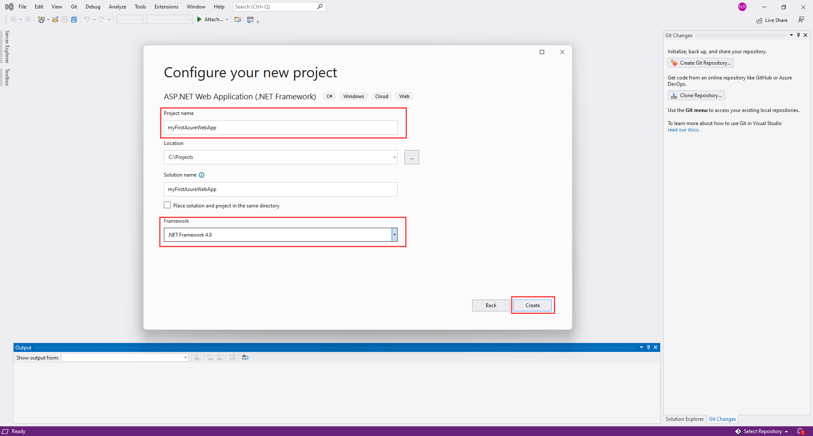
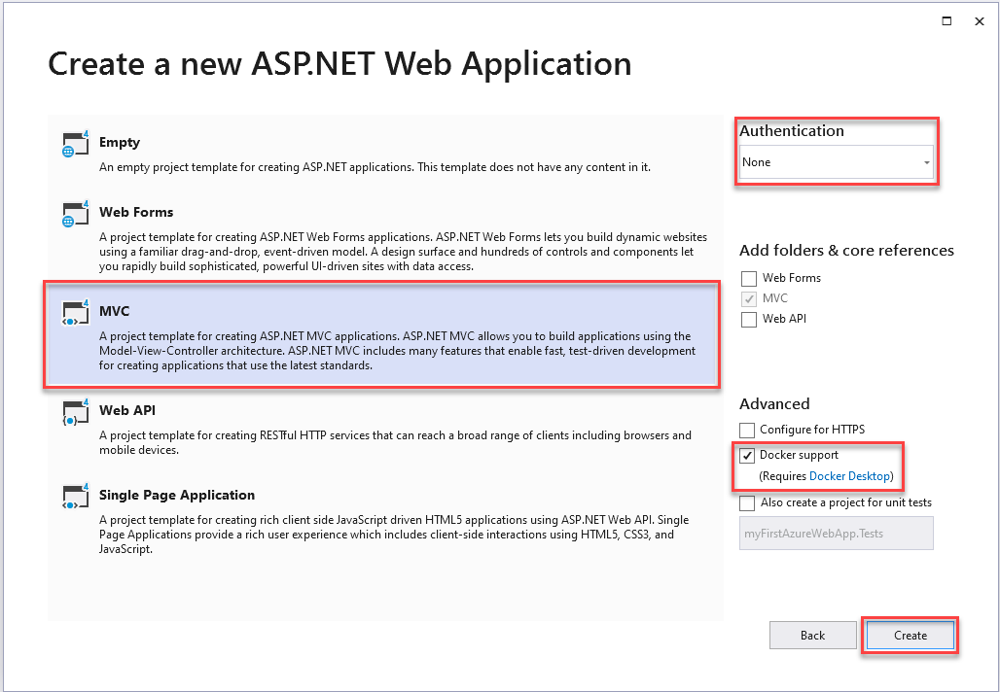
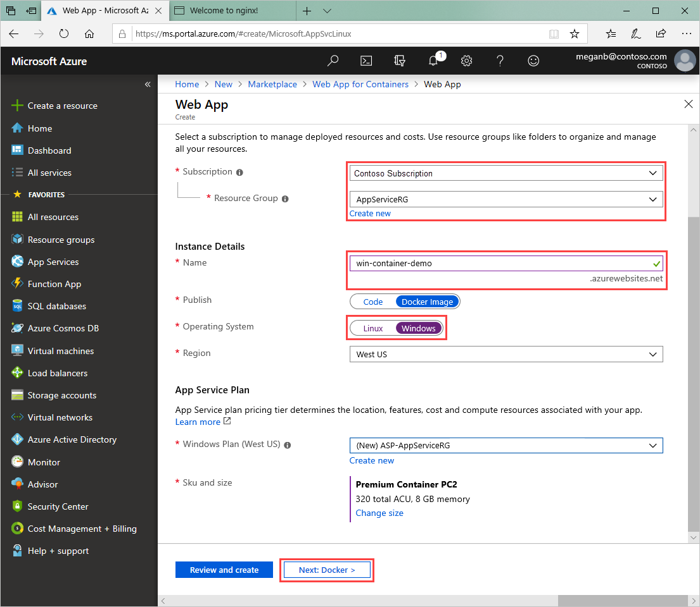

# Run a custom container in Azure

::: zone pivot="container-windows"
[Azure App Service](overview.md) provides pre-defined application stacks on Windows like ASP.NET or Node.js, running on IIS. The preconfigured Windows container environment locks down the operating system from administrative access, software installations, changes to the global assembly cache, and so on. For more information, see [Operating system functionality on Azure App Service](operating-system-functionality.md). If your application requires more access than the preconfigured environment allows, you can deploy a custom Windows container instead.

This quickstart shows how to deploy an ASP.NET app, in a Windows image, to [Docker Hub](https://hub.docker.com/) from Visual Studio. You run the app in a custom container in Azure App Service.

> [!NOTE]
> Windows Containers is limited to Azure Files and does not currently support Azure Blob.


## Prerequisites

To complete this tutorial:

- <a href="https://hub.docker.com/" target="_blank">Sign up for a Docker Hub account</a>
- <a href="https://docs.docker.com/docker-for-windows/install/" target="_blank">Install Docker for Windows</a>.
- <a href="/virtualization/windowscontainers/quick-start/quick-start-windows-10" target="_blank">Switch Docker to run Windows containers</a>.
- <a href="https://www.visualstudio.com/downloads/" target="_blank">Install Visual Studio 2019</a> with the **ASP.NET and web development** and **Azure development** workloads. If you've installed Visual Studio 2019 already:

    - Install the latest updates in Visual Studio by selecting **Help** > **Check for Updates**.
    - Add the workloads in Visual Studio by selecting **Tools** > **Get Tools and Features**.

## Create an ASP.NET web app

Create an ASP.NET web app by following these steps:

1. Open Visual Studio and then select **Create a new project**.

1. In **Create a new project**, find and choose **ASP.NET Web Application (.NET Framework)** for C#, then select **Next**.

1. In **Configure your new project**, name the application _myfirstazurewebapp_, and then select **Create**.

   

1. You can deploy any type of ASP.NET web app to Azure. For this quickstart, choose the **MVC** template.

1. Select **Docker support**, and make sure authentication is set to **No Authentication**. Select **Create**.

   

1. If the _Dockerfile_ file isn't opened automatically, open it from the **Solution Explorer**.

1. You need a [supported parent image](configure-custom-container.md#supported-parent-images). Change the parent image by replacing the `FROM` line with the following code and save the file:

   ```dockerfile
   FROM mcr.microsoft.com/dotnet/framework/aspnet:4.7.2-windowsservercore-ltsc2019
   ```

1. From the Visual Studio menu, select **Debug** > **Start Without Debugging** to run the web app locally.

   

## Publish to Docker Hub

1. In **Solution Explorer**, right-click the **myfirstazurewebapp** project and select **Publish**.

1. Choose **App Service** and then select **Publish**.

1. In Pick a **publish target**, select **Container Registry** and **Docker Hub**, and then click **Publish**.

   

1. Supply your Docker Hub account credentials and select **Save**.

   Wait for the deployment to complete. The **Publish** page now shows the repository name to use later.

   

1. Copy this repository name for later.

## Create a Windows container app

1. Sign in to the [Azure portal]( https://portal.azure.com).

1. Choose **Create a resource** in the upper left-hand corner of the Azure portal.

1. In the search box above the list of Azure Marketplace resources, search for **Web App for Containers**, and select **Create**.

1. In **Web App Create**, choose your subscription and a **Resource Group**. You can create a new resource group if needed.

1. Provide an app name, such as *win-container-demo* and choose **Windows** for **Operating System**. Select **Next: Docker** to continue.

   

1. For **Image Source**, choose **Docker Hub** and for **Image and tag**, enter the repository name you copied in [Publish to Docker Hub](#publish-to-docker-hub).

   

    If you have a custom image elsewhere for your web application, such as in [Azure Container Registry](../container-registry/index.yml) or in any other private repository, you can configure it here.

1. Select **Review and Create** and then **Create** and wait for Azure to create the required resources.

## Browse to the container app

When the Azure operation is complete, a notification box is displayed.


1. Click **Go to resource**.

1. In the overview of this resource, follow the link next to **URL**.

A new browser page opens to the following page:


Wait a few minutes and try again, until you get the default ASP.NET home page:


**Congratulations!** You're running your first custom Windows container in Azure App Service.

## See container start-up logs

It may take some time for the Windows container to load. To see the progress, navigate to the following URL by replacing *\<app_name>* with the name of your app.
```
https://<app_name>.scm.azurewebsites.net/api/logstream
```

The streamed logs looks like this:

```
2018-07-27T12:03:11  Welcome, you are now connected to log-streaming service.
27/07/2018 12:04:10.978 INFO - Site: win-container-demo - Start container succeeded. Container: facbf6cb214de86e58557a6d073396f640bbe2fdec88f8368695c8d1331fc94b
27/07/2018 12:04:16.767 INFO - Site: win-container-demo - Container start complete
27/07/2018 12:05:05.017 INFO - Site: win-container-demo - Container start complete
27/07/2018 12:05:05.020 INFO - Site: win-container-demo - Container started successfully
```

## Update locally and redeploy

1. In Visual Studio, in **Solution Explorer**, open **Views** > **Home** > **Index.cshtml**.

1. Find the `<div class="jumbotron">` HTML tag near the top, and replace the entire element with the following code:

   ```html
   <div class="jumbotron">
       <h1>ASP.NET in Azure!</h1>
       <p class="lead">This is a simple app that we've built that demonstrates how to deploy a .NET app to Azure App Service.</p>
   </div>
   ```

1. To redeploy to Azure, right-click the **myfirstazurewebapp** project in **Solution Explorer** and choose **Publish**.

1. On the publish page, select **Publish** and wait for publishing to complete.

1. To tell App Service to pull in the new image from Docker Hub, restart the app. Back in the app page in the portal, click **Restart** > **Yes**.

   

[Browse to the container app](#browse-to-the-container-app) again. As you refresh the webpage, the app should revert to the "Starting up" page at first, then display the updated webpage again after a few minutes.


## Next steps

> [!div class="nextstepaction"]
> [Migrate to Windows container in Azure](tutorial-custom-container.md)

Or, check out other resources:

> [!div class="nextstepaction"]
> [Configure custom container](configure-custom-container.md)

::: zone-end  

::: zone pivot="container-linux"
App Service on Linux provides pre-defined application stacks on Linux with support for languages such as .NET, PHP, Node.js and others. You can also use a custom Docker image to run your web app on an application stack that is not already defined in Azure. This quickstart shows you how to deploy an image from an [Azure Container Registry](../container-registry/index.yml) (ACR) to App Service.

## Prerequisites

* An [Azure account](https://azure.microsoft.com/free/?utm_source=campaign&utm_campaign=vscode-tutorial-docker-extension&mktingSource=vscode-tutorial-docker-extension)
* [Docker](https://www.docker.com/community-edition)
* [Visual Studio Code](https://code.visualstudio.com/)
* The [Azure App Service extension for VS Code](https://marketplace.visualstudio.com/items?itemName=ms-azuretools.vscode-azureappservice). You can use this extension to create, manage, and deploy Linux Web Apps on the Azure Platform as a Service (PaaS).
* The [Docker extension for VS Code](https://marketplace.visualstudio.com/items?itemName=ms-azuretools.vscode-docker). You can use this extension to simplify the management of local Docker images and commands and to deploy built app images to Azure.

## Create an image

To complete this quickstart, you will need a suitable web app image stored in an [Azure Container Registry](../container-registry/index.yml). Follow the instructions in [Quickstart: Create a private container registry using the Azure portal](../container-registry/container-registry-get-started-portal.md), but use the `mcr.microsoft.com/azuredocs/go` image instead of the `hello-world` image. For reference, the [sample Dockerfile is found in Azure Samples repo](https://github.com/Azure-Samples/go-docs-hello-world).

> [!IMPORTANT]
> Be sure to set the **Admin User** option to **Enable** when you create the container registry. You can also set it from the **Access keys** section of your registry page in the Azure portal. This setting is required for App Service access.

## Sign in

Next, launch VS Code and log into your Azure account using the App Service extension. To do this, select the Azure logo in the Activity Bar, navigate to the **APP SERVICE** explorer, then select **Sign in to Azure** and follow the instructions.


## Check prerequisites

Now you can check whether you have all the prerequisites installed and configured properly.

In VS Code, you should see your Azure email address in the Status Bar and your subscription in the **APP SERVICE** explorer.

Next, verify that you have Docker installed and running. The following command will display the Docker version if it is running.

```bash
docker --version
```

Finally, ensure that your Azure Container Registry is connected. To do this, select the Docker logo in the Activity Bar, then navigate to **REGISTRIES**.


## Deploy the image to Azure App Service

Now that everything is configured, you can deploy your image to [Azure App Service](https://azure.microsoft.com/services/app-service/) directly from the Docker extension explorer.

Find the image under the **Registries** node in the **DOCKER** explorer, and expand it to show its tags. Right-click a tag and then select **Deploy Image to Azure App Service**.

From here, follow the prompts to choose a subscription, a globally unique app name, a Resource Group, and an App Service Plan. Choose **B1 Basic** for the pricing tier, and a region.

After deployment, your app is available at `http://<app name>.azurewebsites.net`.

A **Resource Group** is a named collection of all your application's resources in Azure. For example, a Resource Group can contain a reference to a website, a database, and an Azure Function.

An **App Service Plan** defines the physical resources that will be used to host your website. This quickstart uses a **Basic** hosting plan on **Linux** infrastructure, which means the site will be hosted on a Linux machine alongside other websites. If you start with the **Basic** plan, you can use the Azure portal to scale up so that yours is the only site running on a machine.

## Browse the website

The **Output** panel will open during deployment to indicate the status of the operation. When the operation completes, find the app you created in the **APP SERVICE** explorer, right-click it, then select **Browse Website** to open the site in your browser.

> [!div class="nextstepaction"]
> [I ran into an issue](https://www.research.net/r/PWZWZ52?tutorial=quickstart-docker&step=deploy-app)

## Next steps

Congratulations, you've successfully completed this quickstart!

Next, check out the other Azure extensions.

* [Cosmos DB](https://marketplace.visualstudio.com/items?itemName=ms-azuretools.vscode-cosmosdb)
* [Azure Functions](https://marketplace.visualstudio.com/items?itemName=ms-azuretools.vscode-azurefunctions)
* [Azure CLI Tools](https://marketplace.visualstudio.com/items?itemName=ms-vscode.azurecli)
* [Azure Resource Manager Tools](https://marketplace.visualstudio.com/items?itemName=msazurermtools.azurerm-vscode-tools)

Or get them all by installing the
[Azure Tools](https://marketplace.visualstudio.com/items?itemName=ms-vscode.vscode-node-azure-pack) extension pack.

Check out other resources:

> [!div class="nextstepaction"]
> [Configure custom container](configure-custom-container.md)

::: zone-end
