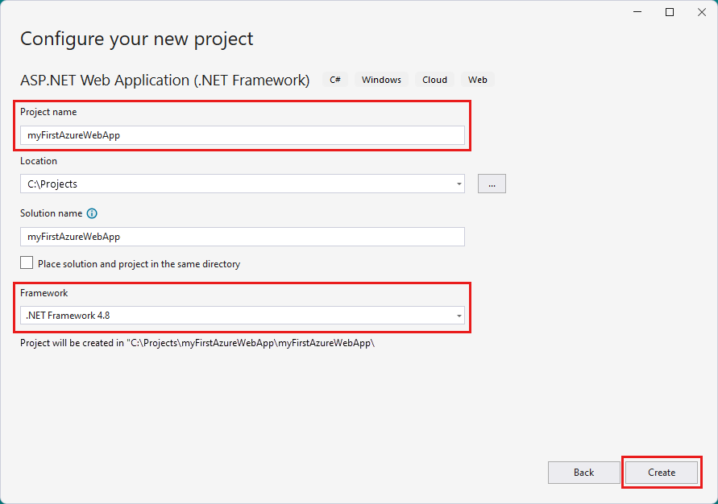
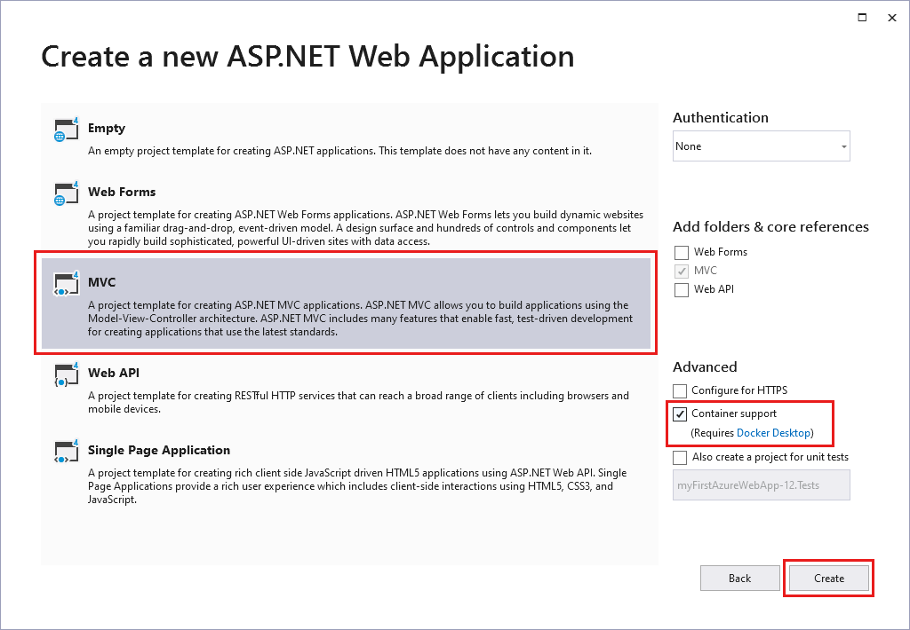
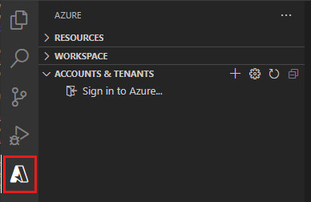
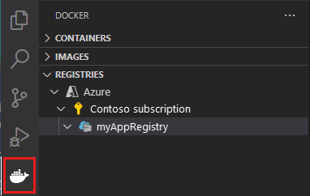
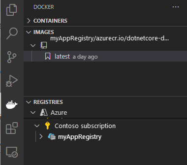
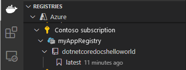

# Run a custom container in Azure

::: zone pivot="container-windows"
[Azure App Service](overview.md) provides pre-defined application stacks on Windows like ASP.NET or Node.js, running on IIS. The preconfigured Windows container environment locks down the operating system from administrative access, software installations, changes to the global assembly cache, and so on. For more information, see [Operating system functionality on Azure App Service](operating-system-functionality.md). If your application requires more access than the preconfigured environment allows, you can deploy a custom Windows container instead.

This quickstart shows how to deploy an ASP.NET app, in a Windows image, to [Docker Hub](https://hub.docker.com/) from Visual Studio. You run the app in a custom container in Azure App Service.

> [!NOTE]
> Windows Containers is limited to Azure Files and does not currently support Azure Blob.


## Prerequisites

To complete this tutorial:

- <a href="https://hub.docker.com/" target="_blank">Sign up for a Docker Hub account</a>
- <a href="https://docs.docker.com/docker-for-windows/install/" target="_blank">Install Docker for Windows</a>.
- <a href="/virtualization/windowscontainers/quick-start/quick-start-windows-10" target="_blank">Switch Docker to run Windows containers</a>.
- <a href="https://www.visualstudio.com/downloads/" target="_blank">Install Visual Studio 2019</a> with the **ASP.NET and web development** and **Azure development** workloads. If you've installed Visual Studio 2019 already:

    - Install the latest updates in Visual Studio by selecting **Help** > **Check for Updates**.
    - Add the workloads in Visual Studio by selecting **Tools** > **Get Tools and Features**.

## Create an ASP.NET web app

Create an ASP.NET web app by following these steps:

1. Open Visual Studio and then select **Create a new project**.

1. In **Create a new project**, find and choose **ASP.NET Web Application (.NET Framework)** for C#, then select **Next**.

1. In **Configure your new project**, name the application _myfirstazurewebapp_, and then select **Create**.

   

1. You can deploy any type of ASP.NET web app to Azure. For this quickstart, choose the **MVC** template.

1. Select **Docker support**, and make sure authentication is set to **No Authentication**. Select **Create**.

   

1. If the _Dockerfile_ file isn't opened automatically, open it from the **Solution Explorer**.

1. You need a [supported parent image](configure-custom-container.md#supported-parent-images). Change the parent image by replacing the `FROM` line with the following code and save the file:

   ```dockerfile
   FROM mcr.microsoft.com/dotnet/framework/aspnet:4.7.2-windowsservercore-ltsc2019
   ```

1. From the Visual Studio menu, select **Debug** > **Start Without Debugging** to run the web app locally.

   

## Publish to Docker Hub

1. In **Solution Explorer**, right-click the **myfirstazurewebapp** project and select **Publish**.

1. Choose **App Service** and then select **Publish**.

1. In Pick a **publish target**, select **Container Registry** and **Docker Hub**, and then click **Publish**.

   

1. Supply your Docker Hub account credentials and select **Save**.

   Wait for the deployment to complete. The **Publish** page now shows the repository name to use later.

   

1. Copy this repository name for later.

## Create a Windows container app

1. Sign in to the [Azure portal]( https://portal.azure.com).

1. Choose **Create a resource** in the upper left-hand corner of the Azure portal.

1. Under **Popular services**, select **Create** under **Web App**.

1. In **Create Web App**, choose your subscription and a **Resource Group**. You can create a new resource group if needed.

1. Provide an app name, such as *win-container-demo*. Choose **Docker Container** for **Publish** and **Windows** for **Operating System**. Select **Next: Docker** to continue.

   

1. For **Image Source**, choose **Docker Hub** and for **Image and tag**, enter the repository name you copied in [Publish to Docker Hub](#publish-to-docker-hub).

   

    If you have a custom image elsewhere for your web application, such as in [Azure Container Registry](../container-registry/index.yml) or in any other private repository, you can configure it here.

1. Select **Review and Create** and then **Create** and wait for Azure to create the required resources.

## Browse to the container app

When the Azure operation is complete, a notification box is displayed.


1. Click **Go to resource**.

1. In the overview of this resource, follow the link next to **URL**.

A new browser page opens to the following page:


Wait a few minutes and try again, until you get the default ASP.NET home page:


**Congratulations!** You're running your first custom Windows container in Azure App Service.

## See container start-up logs

It may take some time for the Windows container to load. To see the progress, navigate to the following URL by replacing *\<app_name>* with the name of your app.
```
https://<app_name>.scm.azurewebsites.net/api/logstream
```

The streamed logs looks like this:

```
2018-07-27T12:03:11  Welcome, you are now connected to log-streaming service.
27/07/2018 12:04:10.978 INFO - Site: win-container-demo - Start container succeeded. Container: facbf6cb214de86e58557a6d073396f640bbe2fdec88f8368695c8d1331fc94b
27/07/2018 12:04:16.767 INFO - Site: win-container-demo - Container start complete
27/07/2018 12:05:05.017 INFO - Site: win-container-demo - Container start complete
27/07/2018 12:05:05.020 INFO - Site: win-container-demo - Container started successfully
```

## Update locally and redeploy

1. In Visual Studio, in **Solution Explorer**, open **Views** > **Home** > **Index.cshtml**.

1. Find the `<div class="jumbotron">` HTML tag near the top, and replace the entire element with the following code:

   ```html
   <div class="jumbotron">
       <h1>ASP.NET in Azure!</h1>
       <p class="lead">This is a simple app that we've built that demonstrates how to deploy a .NET app to Azure App Service.</p>
   </div>
   ```

1. To redeploy to Azure, right-click the **myfirstazurewebapp** project in **Solution Explorer** and choose **Publish**.

1. On the publish page, select **Publish** and wait for publishing to complete.

1. To tell App Service to pull in the new image from Docker Hub, restart the app. Back in the app page in the portal, click **Restart** > **Yes**.

   

[Browse to the container app](#browse-to-the-container-app) again. As you refresh the webpage, the app should revert to the "Starting up" page at first, then display the updated webpage again after a few minutes.


## Next steps

> [!div class="nextstepaction"]
> [Migrate to Windows container in Azure](tutorial-custom-container.md)

Or, check out other resources:

> [!div class="nextstepaction"]
> [Configure custom container](configure-custom-container.md)

::: zone-end  

::: zone pivot="container-linux"
App Service on Linux provides pre-defined application stacks on Linux with support for languages such as .NET, PHP, Node.js and others. You can also use a custom Docker image to run your web app on an application stack that is not already defined in Azure. This quickstart shows you how to deploy an image from an [Azure Container Registry](../container-registry/index.yml) (ACR) to App Service.

## Prerequisites

* An [Azure account](https://azure.microsoft.com/free/?utm_source=campaign&utm_campaign=vscode-tutorial-docker-extension&mktingSource=vscode-tutorial-docker-extension)
* [Docker](https://www.docker.com/community-edition)
* [Visual Studio Code](https://code.visualstudio.com/)
* The [Azure App Service extension for VS Code](https://marketplace.visualstudio.com/items?itemName=ms-azuretools.vscode-azureappservice). You can use this extension to create, manage, and deploy Linux Web Apps on the Azure Platform as a Service (PaaS).
* The [Docker extension for VS Code](https://marketplace.visualstudio.com/items?itemName=ms-azuretools.vscode-docker). You can use this extension to simplify the management of local Docker images and commands and to deploy built app images to Azure.

## Create a container registry

This quickstart uses Azure Container Registry as the registry of choice. You're free to use other registries, but the steps may differ slightly.

Create a container registry by following the instructions in [Quickstart: Create a private container registry using the Azure portal](../container-registry/container-registry-get-started-portal.md).

> [!IMPORTANT]
> Be sure to set the **Admin User** option to **Enable** when you create the Azure container registry. You can also set it from the **Access keys** section of your registry page in the Azure portal. This setting is required for App Service access.

## Sign in

1. Launch Visual Studio Code. 
1. Select the **Azure** logo in the [Activity Bar](https://code.visualstudio.com/docs/getstarted/userinterface), navigate to the **APP SERVICE** explorer, then select **Sign in to Azure** and follow the instructions.

    

1. In the [Status Bar](https://code.visualstudio.com/docs/getstarted/userinterface) at the bottom, verify your Azure account email address. In the **APP SERVICE** explorer, your subscription should be displayed.

1. In the Activity Bar, select the **Docker** logo. In the **REGISTRIES** explorer, verify that the container registry you created appears.

    

## Check prerequisites

Verify that you have Docker installed and running. The following command will display the Docker version if it is running.

```bash
docker --version
```

## Create and build image

1. In Visual Studio Code, open an empty folder and add a file called `Dockerfile`. In the Dockerfile, paste in the content based on your desired language framework:

# [.NET](#tab/dotnet)

<!-- https://mcr.microsoft.com/v2/appsvc%2Fdotnetcore/tags/list -->
```dockerfile
FROM mcr.microsoft.com/appsvc/dotnetcore:lts

ENV PORT 8080
EXPOSE 8080

ENV ASPNETCORE_URLS "http://*:${PORT}"

ENTRYPOINT ["dotnet", "/defaulthome/hostingstart/hostingstart.dll"]
```

In this Dockerfile, the parent image is one of the built-in .NET containers of App Service. You can find the source files for it [in the Azure-App-Service/ImageBuilder GitHub repository, under GenerateDockerFiles/dotnetcore](https://github.com/Azure-App-Service/ImageBuilder/tree/master/GenerateDockerFiles/dotnetcore). Its [Dockerfile](https://github.com/Azure-App-Service/ImageBuilder/blob/master/GenerateDockerFiles/dotnetcore/debian-9/Dockerfile) copies a simple .NET app into `/defaulthome/hostingstart`. Your Dockerfile simply starts that app.

# [Node.js](#tab/node)

<!-- https://mcr.microsoft.com/v2/appsvc%2Fnode/tags/list -->
```dockerfile
FROM mcr.microsoft.com/appsvc/node:10-lts

ENV HOST 0.0.0.0
ENV PORT 8080
EXPOSE 8080

ENTRYPOINT ["pm2", "start", "--no-daemon", "/opt/startup/default-static-site.js"]
```

In this Dockerfile, the parent image is one of the built-in Node.js containers of App Service. You can find the source files for it [in the Azure-App-Service/ImageBuilder GitHub repository, under GenerateDockerFiles/node/node-template](https://github.com/Azure-App-Service/ImageBuilder/tree/master/GenerateDockerFiles/node/node-template). Its [Dockerfile](https://github.com/Azure-App-Service/ImageBuilder/blob/master/GenerateDockerFiles/node/node-template/Dockerfile) copies a simple Node.js app into `/opt/startup`. Your Dockerfile simply starts that app using PM2, which is already installed by the parent image.

# [Python](#tab/python)

<!-- https://mcr.microsoft.com/v2/appsvc%2Fpython/tags/list -->
```dockerfile
FROM mcr.microsoft.com/appsvc/python:latest

ENV PORT 8080
EXPOSE 8080

ENTRYPOINT ["gunicorn", "--timeout", "600", "--access-logfile", "'-'", "--error-logfile", "'-'", "--chdir=/opt/defaultsite", "application:app"]
```

In this Dockerfile, the parent image is one of the built-in Python containers of App Service. You can find the source files for it [in the Azure-App-Service/ImageBuilder GitHub repository, under GenerateDockerFiles/python/template-3.9](https://github.com/Azure-App-Service/ImageBuilder/tree/master/GenerateDockerFiles/python/template-3.9). Its [Dockerfile](https://github.com/Azure-App-Service/ImageBuilder/blob/master/GenerateDockerFiles/python/template-3.9/Dockerfile) copies a simple Python app into `/opt/defaultsite`. Your Dockerfile simply starts that app using Gunicorn, which is already installed by the parent image.

# [Java](#tab/java)

<!-- https://mcr.microsoft.com/v2/azure-app-service%2Fjava/tags/list -->
```dockerfile
FROM mcr.microsoft.com/azure-app-service/java:11-java11_stable

ENV PORT 80
EXPOSE 80

ENTRYPOINT ["java", "-Dserver.port=80", "-jar", "/tmp/appservice/parkingpage.jar"]
```

In this Dockerfile, the parent image is one of the built-in Java containers of App Service. You can find the source files for it [in the Azure-App-Service/java GitHub repository, under java/tree/dev/java11-alpine](https://github.com/Azure-App-Service/java/tree/dev/java11-alpine). Its [Dockerfile](https://github.com/Azure-App-Service/java/blob/dev/java11-alpine/Dockerfile) copies a simple Java app into `/tmp/appservice`. Your Dockerfile simply starts that app.

-----

2. [Open the Command Palette](https://code.visualstudio.com/docs/getstarted/userinterface#_command-palette), and type **Docker Images: Build Image**. Type **Enter** to run the command.

3. In the image tag box, specify the tag you want in the following format: `<acr-name>.azurecr.io/<image-name>/<tag>`, where `<acr-name>` is the name of the container registry you created. Press **Enter**.

4. When the image finishes building, click **Refresh** at the top of the **IMAGES** explorer and verify that the image is built successfully.

    

## Deploy to container registry

1. In the Activity Bar, click the **Docker** icon. In the **IMAGES** explorer, find the image you just built.
1. Expand the image, right-click on the tag you want, and click **Push**.
1. Make sure the image tag begins with `<acr-name>.azurecr.io` and press **Enter**.
1. When Visual Studio Code finishes pushing the image to your container registry, click **Refresh** at the top of the **REGISTRIES** explorer and verify that the image is pushed successfully.

    

## Deploy to App Service

1. In the **REGISTRIES** explorer, expand the image, right-click the tag, and click **Deploy image to Azure App Service**.
1. Follow the prompts to choose a subscription, a globally unique app name, a resource group, and an App Service plan. Choose **B1 Basic** for the pricing tier, and a region near you.

After deployment, your app is available at `http://<app-name>.azurewebsites.net`.

A **Resource Group** is a named collection of all your application's resources in Azure. For example, a Resource Group can contain a reference to a website, a database, and an Azure Function.

An **App Service Plan** defines the physical resources that will be used to host your website. This quickstart uses a **Basic** hosting plan on **Linux** infrastructure, which means the site will be hosted on a Linux machine alongside other websites. If you start with the **Basic** plan, you can use the Azure portal to scale up so that yours is the only site running on a machine. For pricing, see [App Service pricing](https://azure.microsoft.com/pricing/details/app-service/linux).

## Browse the website

The **Output** panel shows the status of the deployment operations. When the operation completes, click **Open Site** in the pop-up notification to open the site in your browser.

> [!div class="nextstepaction"]
> [I ran into an issue](https://www.research.net/r/PWZWZ52?tutorial=quickstart-docker&step=deploy-app)

## Next steps

Congratulations, you've successfully completed this quickstart.

The App Service app pulls from the container registry every time it starts. If you rebuild your image, you just need to push it to your container registry, and the app pulls in the updated image when it restarts. To tell your app to pull in the updated image immediately, restart it.

> [!div class="nextstepaction"]
> [Configure custom container](configure-custom-container.md)

> [!div class="nextstepaction"]
> [Custom container tutorial](tutorial-custom-container.md)

> [!div class="nextstepaction"]
> [Multi-container app tutorial](tutorial-multi-container-app.md)

Other Azure extensions:

* [Cosmos DB](https://marketplace.visualstudio.com/items?itemName=ms-azuretools.vscode-cosmosdb)
* [Azure Functions](https://marketplace.visualstudio.com/items?itemName=ms-azuretools.vscode-azurefunctions)
* [Azure CLI Tools](https://marketplace.visualstudio.com/items?itemName=ms-vscode.azurecli)
* [Azure Resource Manager Tools](https://marketplace.visualstudio.com/items?itemName=msazurermtools.azurerm-vscode-tools)
* [Azure Tools](https://marketplace.visualstudio.com/items?itemName=ms-vscode.vscode-node-azure-pack) extension pack includes all the extensions above.

::: zone-end
