# Quickstart: Create an ASP.NET Core web app in Azure

::: zone pivot="platform-windows"  

In this quickstart, you'll learn how to create and deploy your first ASP.NET Core web app to <abbr title="An HTTP-based service for hosting web applications, REST APIs, and mobile back-end applications.">Azure App Service</abbr>. App Service supports .NET 5.0 apps.

When you're finished, you'll have an Azure <abbr title="A logical container for related Azure resources that you can manage as a unit.">resource group</abbr>, consisting of an <abbr title="The plan that specifies the location, size, and features of the web server farm that hosts your app.">App Service plan</abbr> and an <abbr title="The representation of your web app, which contains your app code, DNS hostnames, certificates, and related resources.">App Service app</abbr> with a deployed sample ASP.NET Core application.

<hr/> 

## 1. Prepare your environment

- **Get an Azure account** with an active <abbr title="The basic organizational structure in which you manage resources in Azure, typically associated with an individual or department within an organization.">subscription</abbr>. [Create an account for free](https://azure.microsoft.com/free/dotnet/).
- **Install <a href="https://www.visualstudio.com/downloads/" target="_blank">Visual Studio 2019</a>** with the **ASP.NET and web development** workload.

<details>
<summary>Already have Visual Studio 2019?</summary>
If you've installed Visual Studio 2019 already:

<ul>
<li><strong>Install the latest updates</strong> in Visual Studio by selecting <strong>Help</strong> &gt; <strong>Check for Updates</strong>. The latest updates contain the .NET 5.0 SDK.</li>
<li><strong>Add the workload</strong> by selecting <strong>Tools</strong> &gt; <strong>Get Tools and Features</strong>.</li>
</ul>
</details>

<hr/> 

## 2. Create an ASP.NET Core web app

1. Open Visual Studio and select **Create a new project**.

1. In **Create a new project**, select **ASP.NET Core Web Application** and confirm that **C#** is listed in the languages for that choice, then select **Next**.

1. In **Configure your new project**, name your web application project *myFirstAzureWebApp*, and select **Create**.

   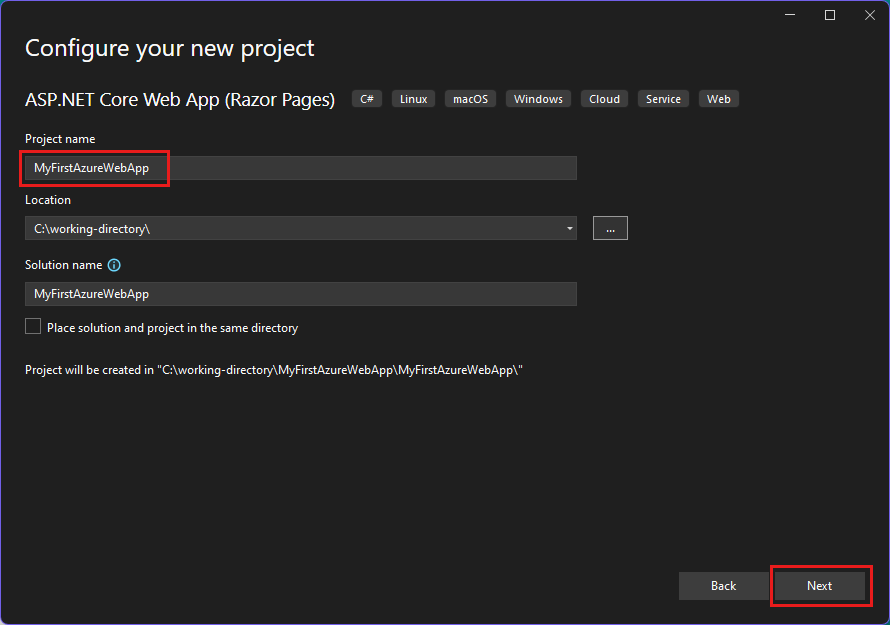

1. For a .NET 5.0 app, select **ASP.NET Core 5.0** in the dropdown. Otherwise, use the default value.

1. You can deploy any type of ASP.NET Core web app to Azure, but for this quickstart, choose the **ASP.NET Core Web App** template. Make sure **Authentication** is set to **No Authentication**, and that no other option is selected. Then, select **Create**.

   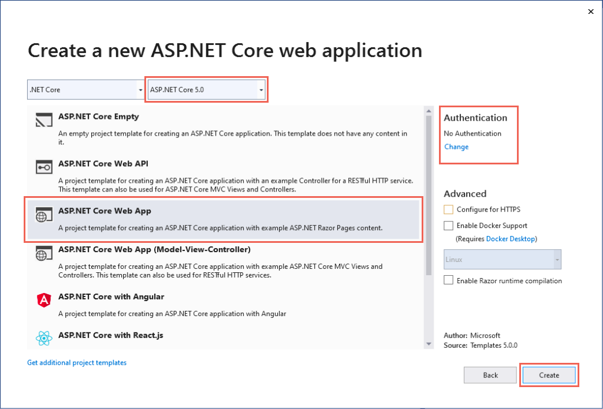 
   
1. From the Visual Studio menu, select **Debug** > **Start Without Debugging** to run your web app locally.

   

<hr/> 

## 3. Publish your web app

1. In **Solution Explorer**, right-click the **myFirstAzureWebApp** project and select **Publish**. 

1. In **Publish**, select **Azure** and click **Next**.

1. Your options depend on whether you're signed in to Azure already and whether you have a Visual Studio account linked to an Azure account. Select either **Add an account** or **Sign in** to sign in to your Azure subscription. If you're already signed in, select the account you want.

   

1. To the right of **App Service instances**, click **+**.

   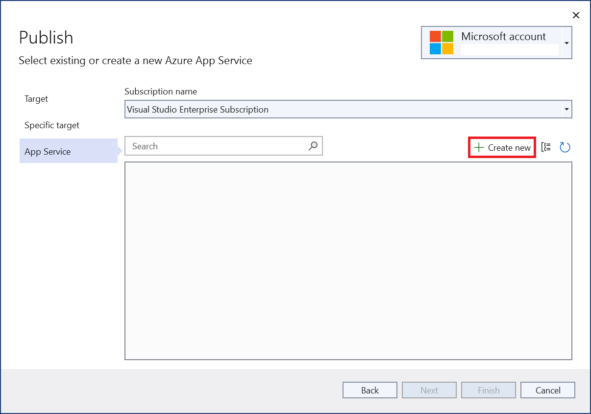

1. For **Subscription**, accept the subscription that is listed or select a new one from the drop-down list.

1. For **Resource group**, select **New**. In **New resource group name**, enter *myResourceGroup* and select **OK**. 

1. For **Hosting Plan**, select **New**. 

1. In the **Hosting Plan: Create new** dialog, enter the values specified in the following table:

   | Setting  | Suggested Value |
   | -------- | --------------- |
   | **Hosting Plan**  | *myFirstAzureWebAppPlan* |
   | **Location**      | *West Europe* |
   | **Size**          | *Free* |
   
   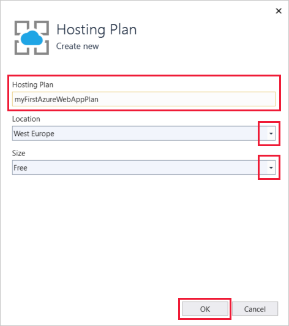

1. In **Name**, enter a unique app name.

    <details>
        <summary>Which characters can I use?</summary>
        Valid characters are a-z, A-Z, 0-9, and -. You can accept the automatically generated unique name. The URL of the web app is http://<code>&lt;app-name&gt;.azurewebsites.net</code>, where <code>&lt;app-name&gt;</code> is your app name.
    </details>

1. Select **Create** to create the Azure resources. 

   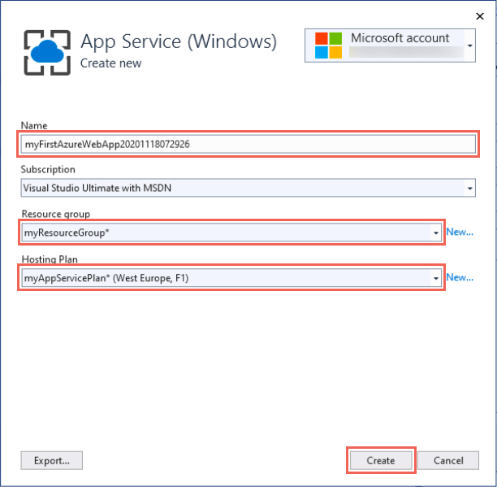

1. Wait for the wizard to finish creating Azure resources. Select **Finish** to close the wizard.

1. In the **Publish** page, click **Publish** to deploy your project. 

    <details>
        <summary>What's Visual Studio doing?</summary>
        Visual Studio builds, packages, and publishes the app to Azure, and then launches the app in the default browser.
    </details>

   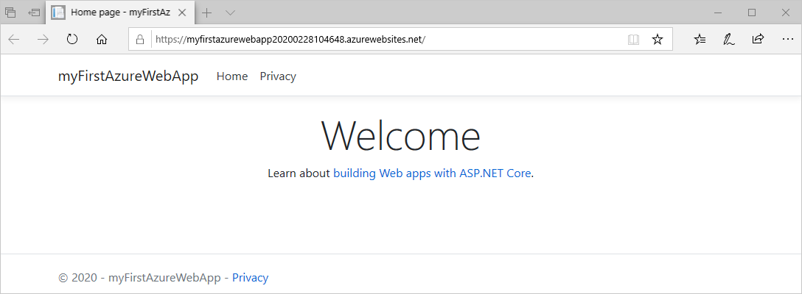

<hr/> 

## 4. Update the app and redeploy

1. In **Solution Explorer**, under your project, open **Pages** > **Index.cshtml**.

1. Replace the entire `<div>` tag with the following code:

   ```html
   <div class="jumbotron">
       <h1>ASP.NET in Azure!</h1>
       <p class="lead">This is a simple app that we've built that demonstrates how to deploy a .NET app to Azure App Service.</p>
   </div>
   ```

1. To redeploy to Azure, right-click the **myFirstAzureWebApp** project in **Solution Explorer** and select **Publish**.

1. In the **Publish** summary page, select **Publish**.

   <!-- 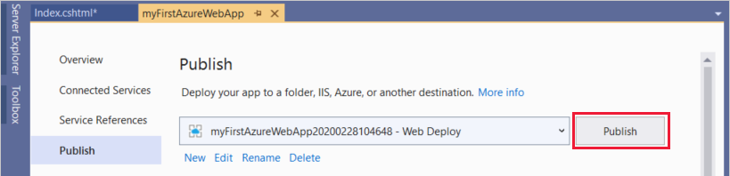 -->

    When publishing completes, Visual Studio launches a browser to the URL of the web app.

    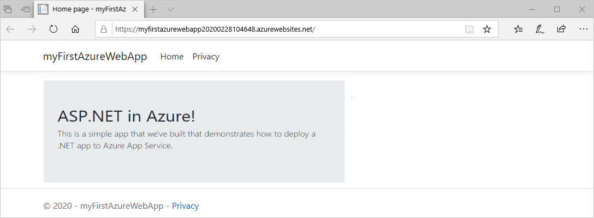

<hr/> 

## 5. Manage the Azure app

1. Go to the [Azure portal](https://portal.azure.com), and search for and select **App Services**.

    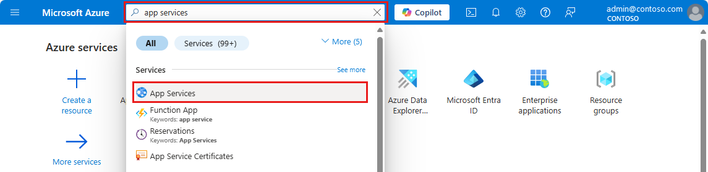
    
1. On the **App Services** page, select the name of your web app.

    :::image type="content" source="./media/quickstart-dotnetcore/select-app-service.png" alt-text="Screenshot of the App Services page with an example web app selected.":::

1. The **Overview** page for your web app, contains options for basic management like browse, stop, start, restart, and delete. The left menu provides further pages for configuring your app.

    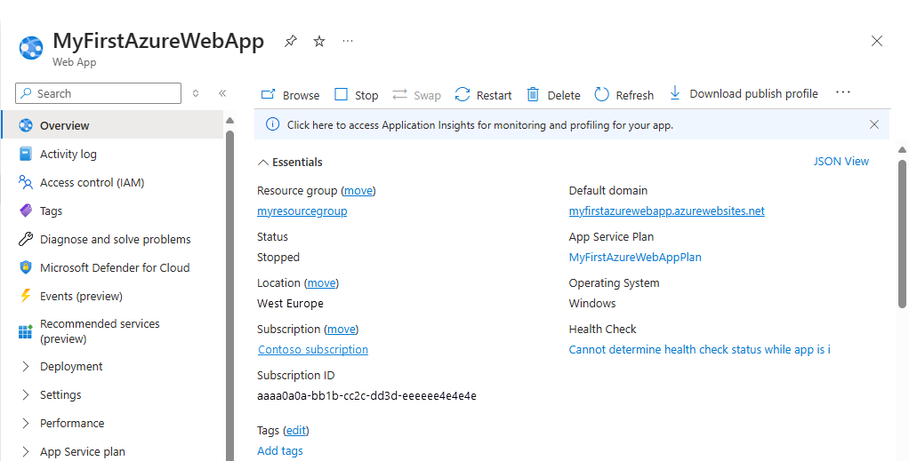
    
<hr/> 

## 6. Clean up resources

1. From the Azure portal menu or **Home** page, select **Resource groups**. Then, on the **Resource groups** page, select **myResourceGroup**.

1. On the **myResourceGroup** page, make sure that the listed resources are the ones you want to delete.

1. Select **Delete resource group**, type **myResourceGroup** in the text box to confirm, and then select **Delete**.

<hr/> 

## Next steps

Advance to the next article to learn how to create a .NET Core app and connect it to a SQL Database:

- [ASP.NET Core with SQL Database](tutorial-dotnetcore-sqldb-app.md)
- [Configure ASP.NET Core app](configure-language-dotnetcore.md)

::: zone-end  

::: zone pivot="platform-linux"
This quickstart shows how to create a [.NET Core](/aspnet/core/) app on <abbr title="App Service on Linux provides a highly scalable, self-patching web hosting service using the Linux operating system.">App Service on Linux</abbr>. You create the app using the [Azure CLI](/cli/azure/get-started-with-azure-cli), and you use Git to deploy the .NET Core code to the app.

<hr/> 

## 1. Prepare your environment

- **Get an Azure account** with an active subscription. [Create an account for free](https://azure.microsoft.com/free/dotnet/).
- **Install** the latest <a href="https://dotnet.microsoft.com/download/dotnet-core/3.1" target="_blank">.NET Core 3.1 SDK</a> or <a href="https://dotnet.microsoft.com/download/dotnet/5.0" target="_blank">.NET 5.0 SDK</a>.
- **<a href="/cli/azure/install-azure-cli" target="_blank">Install the latest Azure CLI</a>**.

[Having issues? Let us know.](https://aka.ms/DotNetAppServiceLinuxQuickStart)

<hr/> 

## 2. Create the app locally

1. Run `mkdir hellodotnetcore` to create the directory.

    ```bash
    mkdir hellodotnetcore
    ```

1. Run `cd hellodotnetcore` to change the directory. 

    ```bash
    cd hellodotnetcore
    ```

1. Run `dotnet new web` to create a new .NET Core app.

    ```bash
    dotnet new web
    ```

<hr/> 

## 3. Run the app locally

1. Run `dotnet run` to see how it looks when you deploy it to Azure.

    ```bash
    dotnet run
    ```
    
1. **Open a web browser**, and navigate to the app at `http://localhost:5000`.

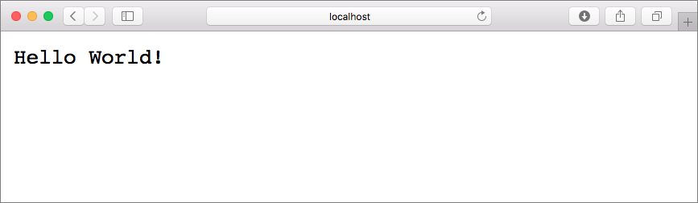

[Having issues? Let us know.](https://aka.ms/DotNetAppServiceLinuxQuickStart)

<hr/> 

## 4. Sign into Azure

Run `az login` to sign into Azure.

```azurecli
az login
```

[Having issues? Let us know.](https://aka.ms/DotNetAppServiceLinuxQuickStart)

<hr/> 

## 5. Deploy the app

1. **Run** `az webapp up` in your local folder. **Replace** <app-name> with a globally unique name.

    ```azurecli
    az webapp up --sku F1 --name <app-name> --os-type linux
    ```
    
    <details>
    <summary>Troubleshooting</summary>
    <ul>
    <li>If the <code>az</code> command isn't recognized, be sure you have the Azure CLI installed as described in <a href="#1-prepare-your-environment">Prepare your environment</a>.</li>
    <li>Replace <code>&lt;app-name&gt;</code> with a name that's unique across all of Azure (<em>valid characters are <code>a-z</code>, <code>0-9</code>, and <code>-</code></em>). A good pattern is to use a combination of your company name and an app identifier.</li>
    <li>The <code>--sku F1</code> argument creates the web app on the Free pricing tier. Omit this argument to use a faster premium tier, which incurs an hourly cost.</li>
    <li>You can optionally include the argument <code>--location &lt;location-name&gt;</code> where <code>&lt;location-name&gt;</code> is an available Azure region. You can retrieve a list of allowable regions for your Azure account by running the <a href="/cli/azure/appservice#az_appservice_list_locations"><code>az account list-locations</code></a> command.</li>
    </ul>
    </details>
    
1. Wait for the command to complete. It may take a few minutes, and ends with "You can launch the app at http://&lt;app-name&gt;.azurewebsites.net".

    <details>
    <summary>What's <code>az webapp up</code> doing?</summary>
    <p>The <code>az webapp up</code> command does the following actions:</p>
    <ul>
    <li>Create a default resource group.</li>
    <li>Create a default App Service plan.</li>
    <li><a href="/cli/azure/webapp#az_webapp_create">Create an App Service app</a> with the specified name.</li>
    <li><a href="/azure/app-service/deploy-zip">Zip deploy</a> files from the current working directory to the app.</li>
    <li>While running, it provides messages about resource creation, logging, and ZIP deployment.</li>
    </ul>
    </details>
    
# [.NET Core 3.1](#tab/netcore31)


# [.NET 5.0](#tab/net50)

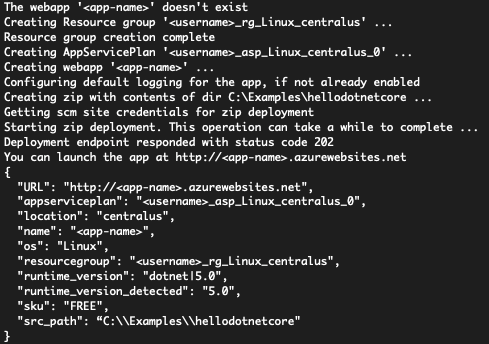

---

[Having issues? Let us know.](https://aka.ms/DotNetAppServiceLinuxQuickStart)

<hr/> 

## 6. Browse to the app

**Browse to the deployed application** using your web browser.

```bash
http://<app_name>.azurewebsites.net
```

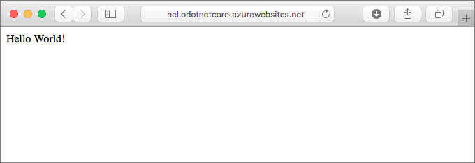

[Having issues? Let us know.](https://aka.ms/DotNetAppServiceLinuxQuickStart)

<hr/> 

## 7. Update and redeploy the code

1. **Open the _Startup.cs_ file** in the local directory. 

1. **Make a small change** to the text in the method call `context.Response.WriteAsync`.

    ```csharp
    await context.Response.WriteAsync("Hello Azure!");
    ```
    
1. **Save your changes**.

1. **Run** `az webapp up` to redeploy:

    ```azurecli
    az webapp up --os-type linux
    ```
    
    <details>
    <summary>What's <code>az webapp up</code> doing this time?</summary>
    The first time you ran the command, it saved the app name, resource group, and App Service plan in the <i>.azure/config</i> file from the project root. When you run it again from the project root, it uses the values saved in <i>.azure/config</i>, detects that the App Service resources already exists, and performs Zip deploy again.
    </details>
    
1. Once deployment has completed, **hit refresh** in the browser window that previously opened.

    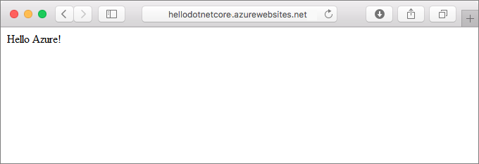
    
[Having issues? Let us know.](https://aka.ms/DotNetAppServiceLinuxQuickStart)

<hr/> 

## 8. Manage your new Azure app

1. Go to the <a href="https://portal.azure.com" target="_blank">Azure portal</a>.

1. From the left menu, click **App Services**, and then click the name of your Azure app.

    :::image type="content" source="./media/quickstart-dotnetcore/portal-app-service-list-up.png" alt-text="Screenshot of the App Services page showing an example Azure app selected.":::

1. The Overview page is where you can perform basic management tasks like browse, stop, start, restart, and delete. The left menu provides different pages for configuring your app. 

    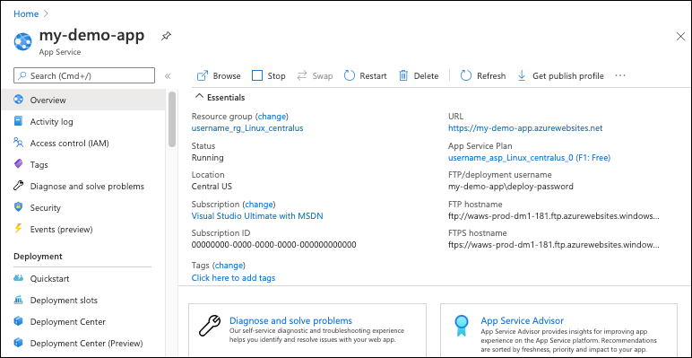
    
<hr/> 

## 9. Clean up resources

**Run** `az group delete --name myResourceGroup` to delete the resource group.

```azurecli-interactive
az group delete --name myResourceGroup
```

[Having issues? Let us know.](https://aka.ms/DotNetAppServiceLinuxQuickStart)

<hr/> 

## Next steps

- [Tutorial: ASP.NET Core app with SQL Database](tutorial-dotnetcore-sqldb-app.md)
- [Configure ASP.NET Core app](configure-language-dotnetcore.md)

::: zone-end
