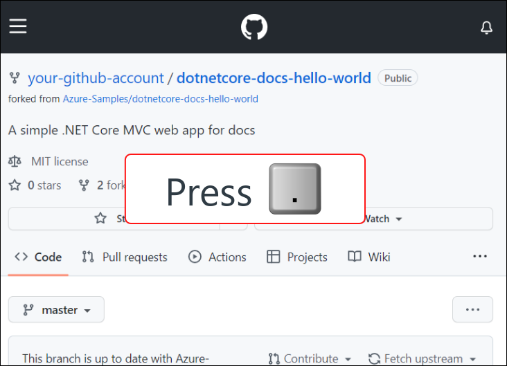
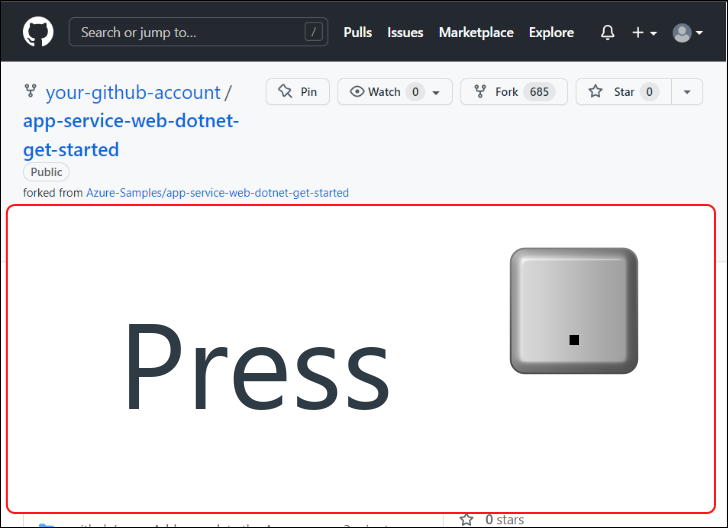
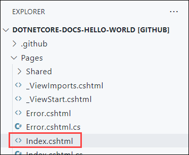
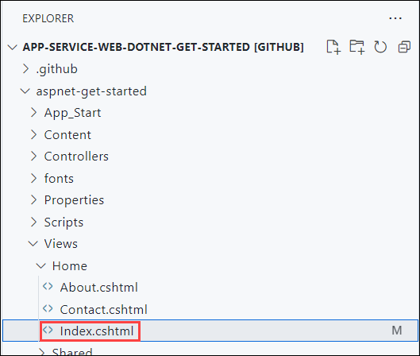
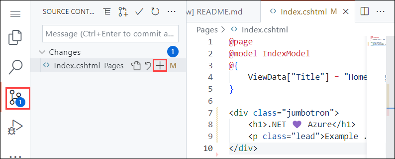
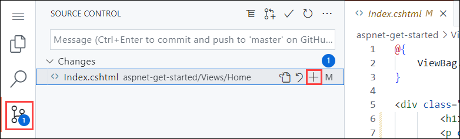
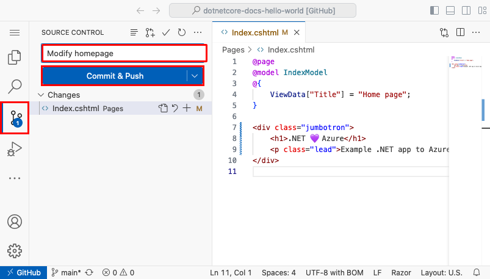
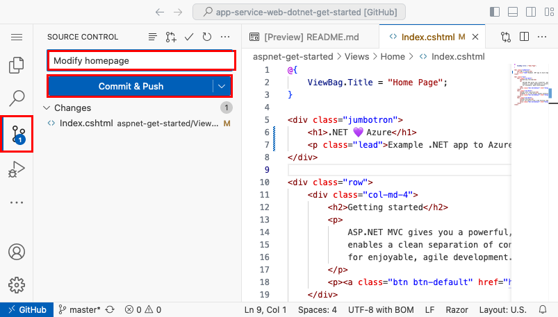

<!-- NOTES:

I'm a .NET developer who wants to deploy my web app to App Service. I may develop apps with
Visual Studio, Visual Studio for Mac, Visual Studio Code, or the .NET SDK/CLI. This article
should be able to guide .NET devs, whether they're app is .NET Core, .NET, or .NET Framework.

As a .NET developer, when choosing an IDE and .NET TFM - you map to various OS requirements.
For example, if you choose Visual Studio - you're developing the app on Windows, but you can still
target cross-platform with .NET 6.0.

| .NET / IDE         | Visual Studio | Visual Studio for Mac | Visual Studio Code | Command line   |
|--------------------|---------------|-----------------------|--------------------|----------------|
| .NET 6.0           | Windows       | macOS                 | Cross-platform     | Cross-platform |
| .NET Framework 4.8 | Windows       | N/A                   | Windows            | Windows        |

-->

# Quickstart: Deploy an ASP.NET web app

In this quickstart, you'll learn how to create and deploy your first ASP.NET web app to [Azure App Service](overview.md). App Service supports various versions of .NET apps, and provides a highly scalable, self-patching web hosting service. ASP.NET web apps are cross-platform and can be hosted on Linux or Windows. When you're finished, you'll have an Azure resource group consisting of an App Service hosting plan and an App Service with a deployed web application.

Alternatively, you can deploy an ASP.NET web app as part of a [Windows or Linux container in App Service](quickstart-custom-container.md).

## Prerequisites

:::zone target="docs" pivot="development-environment-vs"

### [.NET 6.0](#tab/net60)

- An Azure account with an active subscription. [Create an account for free](https://azure.microsoft.com/free/dotnet).
- <a href="https://www.visualstudio.com/downloads" target="_blank">Visual Studio 2022</a> with the **ASP.NET and web development** workload.

### [.NET Framework 4.8](#tab/netframework48)

- An Azure account with an active subscription. [Create an account for free](https://azure.microsoft.com/free/dotnet).
- <a href="https://www.visualstudio.com/downloads" target="_blank">Visual Studio 2022</a> with the **ASP.NET and web development** workload (ensure the optional checkbox **.NET Framework project and item templates** is selected).

-----

If you've already installed Visual Studio 2022:

1. Install the latest updates in Visual Studio by selecting **Help** > **Check for Updates**.
1. Add the workload by selecting **Tools** > **Get Tools and Features**.
    
:::zone-end

:::zone target="docs" pivot="development-environment-vscode"

- An Azure account with an active subscription. [Create an account for free](https://azure.microsoft.com/free/dotnet).
- <a href="https://www.visualstudio.com/downloads" target="_blank">Visual Studio Code</a>.
- The <a href="https://marketplace.visualstudio.com/items?itemName=ms-vscode.vscode-node-azure-pack" target="_blank">Azure Tools</a> extension.

### [.NET 6.0](#tab/net60)

<a href="https://dotnet.microsoft.com/download/dotnet/6.0" target="_blank">
    Install the latest .NET 6.0 SDK.
</a>

### [.NET Framework 4.8](#tab/netframework48)

<a href="https://dotnet.microsoft.com/download/dotnet-framework/net48" target="_blank">
    Install the .NET Framework 4.8 Developer Pack.
</a>

> [!NOTE]
> Visual Studio Code is cross-platform code editor, however; .NET Framework is not. If you're developing .NET Framework apps with Visual Studio Code, consider using a Windows machine to satisfy the build dependencies.

---

:::zone-end

<!-- markdownlint-disable MD044 -->
:::zone target="docs" pivot="development-environment-cli"
<!-- markdownlint-enable MD044 -->

- An Azure account with an active subscription. [Create an account for free](https://azure.microsoft.com/free/dotnet).
- The <a href="/cli/azure/install-azure-cli" target="_blank">Azure CLI</a>.
- The .NET SDK (includes runtime and CLI).

### [.NET 6.0](#tab/net60)

<a href="https://dotnet.microsoft.com/download/dotnet/6.0" target="_blank">
    Install the latest .NET 6.0 SDK.
</a>

### [.NET Framework 4.8](#tab/netframework48)

<a href="https://dotnet.microsoft.com/download/dotnet/6.0" target="_blank">
    Install the latest .NET 6.0 SDK.
</a> and <a href="https://dotnet.microsoft.com/download/dotnet-framework/net48" target="_blank">
    the .NET Framework 4.8 Developer Pack.
</a>

> [!NOTE]
> The [.NET CLI](/dotnet/core/tools) and .NET 6.0 are both cross-platform, but .NET Framework is not. If you're developing .NET Framework apps with the .NET CLI, consider using a Windows machine to satisfy the build dependencies. .NET 6.0 is cross-platform.

---

:::zone-end

<!-- markdownlint-disable MD044 -->
:::zone target="docs" pivot="development-environment-ps"
<!-- markdownlint-enable MD044 -->

- An Azure account with an active subscription. [Create an account for free](https://azure.microsoft.com/free/dotnet).
- The <a href="/powershell/azure/install-az-ps" target="_blank">Azure PowerShell</a>.
- The .NET SDK (includes runtime and CLI).

### [.NET 6.0](#tab/net60)

<a href="https://dotnet.microsoft.com/download/dotnet/6.0" target="_blank">
    Install the latest .NET 6.0 SDK.
</a>

### [.NET Framework 4.8](#tab/netframework48)

<a href="https://dotnet.microsoft.com/download/dotnet/6.0" target="_blank">
    Install the latest .NET 6.0 SDK.
</a> and <a href="https://dotnet.microsoft.com/download/dotnet-framework/net48" target="_blank">
    the .NET Framework 4.8 Developer Pack.
</a>

> [!NOTE]
> [Azure PowerShell](/powershell/azure/) and .NET 6.0 are both cross-platform, but .NET Framework is not. If you're developing .NET Framework apps with the .NET CLI, consider using a Windows machine to satisfy the build dependencies.

---

:::zone-end

:::zone target="docs" pivot="development-environment-azure-portal"

### [.NET 6.0](#tab/net60)

- An Azure account with an active subscription. [Create an account for free](https://azure.microsoft.com/free/dotnet).
- A GitHub account [Create an account for free](https://github.com/).

### [.NET Framework 4.8](#tab/netframework48)

- An Azure account with an active subscription. [Create an account for free](https://azure.microsoft.com/free/dotnet).
- A GitHub account [Create an account for free](https://github.com/).
    
:::zone-end

## Create an ASP.NET web app

:::zone target="docs" pivot="development-environment-vs"

### [.NET 6.0](#tab/net60)

1. Open Visual Studio and then select **Create a new project**.
1. In **Create a new project**, find, and select **ASP.NET Core Web App**, then select **Next**.
1. In **Configure your new project**, name the application _MyFirstAzureWebApp_, and then select **Next**.

   :::image type="content" source="./media/quickstart-dotnet/configure-webapp-net.png" alt-text="Screenshot of Visual Studio - Configure ASP.NET 6.0 web app." lightbox="media/quickstart-dotnet/configure-webapp-net.png" border="true":::

1. Select **.NET 6.0 (Long-term support)**.
1. Ensure **Authentication Type** is set to **None**. Select **Create**.

   :::image type="content" source="media/quickstart-dotnet/vs-additional-info-net60.png" alt-text="Screenshot of Visual Studio - Additional info when selecting .NET 6.0." lightbox="media/quickstart-dotnet/vs-additional-info-net60.png" border="true":::

1. From the Visual Studio menu, select **Debug** > **Start Without Debugging** to run the web app locally.

   :::image type="content" source="media/quickstart-dotnet/local-webapp-net.png" alt-text="Screenshot of Visual Studio - ASP.NET Core 6.0 running locally." lightbox="media/quickstart-dotnet/local-webapp-net.png" border="true":::

### [.NET Framework 4.8](#tab/netframework48)

1. Open Visual Studio and then select **Create a new project**.
1. In **Create a new project**, find, and select **ASP.NET Web Application (.NET Framework)**, then select **Next**.
1. In **Configure your new project**, name the application _MyFirstAzureWebApp_, and then select **Create**.

   :::image type="content" source="media/quickstart-dotnet/configure-webapp-netframework48.png" alt-text="Screenshot of Visual Studio - Configure ASP.NET Framework 4.8 web app." lightbox="media/quickstart-dotnet/configure-webapp-netframework48.png" border="true":::

1. Select the **MVC** template.
1. Ensure **Authentication** is set to **No Authentication**. Select **Create**.

   :::image type="content" source="media/quickstart-dotnet/vs-mvc-no-auth-netframework48.png" alt-text="Screenshot of Visual Studio - Select the MVC template." lightbox="media/quickstart-dotnet/vs-mvc-no-auth-netframework48.png" border="true":::

1. From the Visual Studio menu, select **Debug** > **Start Without Debugging** to run the web app locally.

   :::image type="content" source="media/quickstart-dotnet/vs-local-webapp-netframework48.png" alt-text="Screenshot of Visual Studio - ASP.NET Framework 4.8 running locally." lightbox="media/quickstart-dotnet/vs-local-webapp-netframework48.png" border="true":::

---

:::zone-end

:::zone target="docs" pivot="development-environment-vscode"

1. In the terminal window, create a new folder named _MyFirstAzureWebApp_, and open it in Visual Studio Code. 

    ```terminal
    mkdir MyFirstAzureWebApp
    code MyFirstAzureWebApp
    ```

1. In Visual Studio Code, open the <a href="https://code.visualstudio.com/docs/editor/integrated-terminal" target="_blank">Terminal</a> window by typing `Ctrl` + `` ` ``.

1. In Visual Studio Code terminal, create a new .NET web app using the [`dotnet new webapp`](/dotnet/core/tools/dotnet-new#web-options) command.

    ### [.NET 6.0](#tab/net60)
    
    ```dotnetcli
    dotnet new webapp -f net6.0
    ```
    
    ### [.NET Framework 4.8](#tab/netframework48)
    
    ```dotnetcli
    dotnet new webapp --target-framework-override net48
    ```
    
    > [!IMPORTANT]
    > The `--target-framework-override` flag is a free-form text replacement of the target framework moniker (TFM) for the project, and makes *no guarantees* that the supporting template exists or compiles. You can only build and run .NET Framework apps on Windows.
    
    ---

1. From the **Terminal** in Visual Studio Code, run the application locally using the [`dotnet run`](/dotnet/core/tools/dotnet-run) command.

    ```dotnetcli
    dotnet run --urls=https://localhost:5001/
    ```

1. Open a web browser, and navigate to the app at `https://localhost:5001`.

    ### [.NET 6.0](#tab/net60)
    
    You'll see the template ASP.NET Core 6.0 web app displayed in the page.
    
    :::image type="content" source="media/quickstart-dotnet/local-webapp-net.png" alt-text="Screenshot of Visual Studio Code - run .NET 6.0 in browser locally." lightbox="media/quickstart-dotnet/local-webapp-net.png" border="true":::
    
    ### [.NET Framework 4.8](#tab/netframework48)
    
    You'll see the template ASP.NET Framework 4.8 web app displayed in the page.
    
    :::image type="content" source="media/quickstart-dotnet/local-webapp-net48.png" alt-text="Screenshot of Visual Studio Code - run .NET 4.8 in browser locally." lightbox="media/quickstart-dotnet/local-webapp-net48.png" border="true":::
    
    ---

:::zone-end

<!-- markdownlint-disable MD044 -->
:::zone target="docs" pivot="development-environment-cli,development-environment-ps"
<!-- markdownlint-enable MD044 -->

1. Open a terminal window on your machine to a working directory. Create a new .NET web app using the [`dotnet new webapp`](/dotnet/core/tools/dotnet-new#web-options) command, and then change directories into the newly created app.

    <!-- Please keep the following commands in two lines instead of one && separated line. The latter doesn't work in PowerShell -->
    
    ### [.NET 6.0](#tab/net60)
    
    ```dotnetcli
    dotnet new webapp -n MyFirstAzureWebApp --framework net6.0
    cd MyFirstAzureWebApp
    ```
    
    ### [.NET Framework 4.8](#tab/netframework48)
    
    ```dotnetcli
    dotnet new webapp -n MyFirstAzureWebApp --target-framework-override net48
    cd MyFirstAzureWebApp
    ```
    
    > [!IMPORTANT]
    > The `--target-framework-override` flag is a free-form text replacement of the target framework moniker (TFM) for the project, and makes *no guarantees* that the supporting template exists or compiles. You can only build .NET Framework apps on Windows.
    
    ---

1. From the same terminal session, run the application locally using the [`dotnet run`](/dotnet/core/tools/dotnet-run) command.

    ```dotnetcli
    dotnet run --urls=https://localhost:5001/
    ```

1. Open a web browser, and navigate to the app at `https://localhost:5001`.

    ### [.NET 6.0](#tab/net60)
    
    You'll see the template ASP.NET Core 6.0 web app displayed in the page.
    
    :::image type="content" source="media/quickstart-dotnet/local-webapp-net.png" alt-text="Screenshot of Visual Studio Code - ASP.NET Core 6.0 in local browser." lightbox="media/quickstart-dotnet/local-webapp-net.png" border="true":::
    
    ### [.NET Framework 4.8](#tab/netframework48)
    
    You'll see the template ASP.NET Framework 4.8 web app displayed in the page.
    
    :::image type="content" source="media/quickstart-dotnet/local-webapp-net48.png" alt-text="Screenshot of Visual Studio Code - ASP.NET Framework 4.8 in local browser." lightbox="media/quickstart-dotnet/local-webapp-net48.png" border="true":::
    
    ---

:::zone-end

:::zone target="docs" pivot="development-environment-azure-portal"

In this step we will fork a demo project to deploy.

### [.NET 6.0](#tab/net60)

- Go to the [.NET 6.0 sample app](https://github.com/Azure-Samples/dotnetcore-docs-hello-world).
- Select the **Fork** button in the upper right on the GitHub page.
- Select the **Owner** and leave the default **Repository name**.
- Select **Create fork**.

### [.NET Framework 4.8](#tab/netframework48)

- Go to the [.NET Framework 4.8 sample app](https://github.com/Azure-Samples/app-service-web-dotnet-get-started).
- Select the **Fork** button in the upper right on the GitHub page.
- Select the **Owner** and leave the default **Repository name**.
- Select **Create fork**.
    
:::zone-end

## Publish your web app

To publish your web app, you must first create and configure a new App Service that you can publish your app to.

As part of setting up the App Service, you'll create:

- A new [resource group](../azure-resource-manager/management/overview.md#terminology) to contain all of the Azure resources for the service.
- A new [Hosting Plan](overview-hosting-plans.md) that specifies the location, size, and features of the web server farm that hosts your app.

Follow these steps to create your App Service resources and publish your project:

:::zone target="docs" pivot="development-environment-vs"

1. In **Solution Explorer**, right-click the **MyFirstAzureWebApp** project and select **Publish**.
1. In **Publish**, select **Azure** and then **Next**.

    :::image type="content" source="media/quickstart-dotnet/vs-publish-target-Azure.png" alt-text="Screenshot of Visual Studio - Publish the web app and target Azure." lightbox="media/quickstart-dotnet/vs-publish-target-Azure.png" border="true":::

1. Choose the **Specific target**, either **Azure App Service (Linux)** or **Azure App Service (Windows)**. Then, select **Next**.

    > [!IMPORTANT]
    > When targeting ASP.NET Framework 4.8, use **Azure App Service (Windows)**.

1. Your options depend on whether you're signed in to Azure already and whether you have a Visual Studio account linked to an Azure account. Select either **Add an account** or **Sign in** to sign in to your Azure subscription. If you're already signed in, select the account you want.

    :::image type="content" source="media/quickstart-dotnet/sign-in-azure.png" border="true" alt-text="Screenshot of Visual Studio - Select sign in to Azure dialog." lightbox="media/quickstart-dotnet/sign-in-azure.png" :::

1. To the right of **App Service instances**, select **+**.

    :::image type="content" source="media/quickstart-dotnet/publish-new-app-service.png" border="true" alt-text="Screenshot of Visual Studio - New App Service app dialog." lightbox="media/quickstart-dotnet/publish-new-app-service.png" :::

1. For **Subscription**, accept the subscription that is listed or select a new one from the drop-down list.
1. For **Resource group**, select **New**. In **New resource group name**, enter *myResourceGroup* and select **OK**.
1. For **Hosting Plan**, select **New**.
1. In the **Hosting Plan: Create new** dialog, enter the values specified in the following table:

    | Setting          | Suggested value          | Description                                                           |
    |------------------|--------------------------|-----------------------------------------------------------------------|
    | **Hosting Plan** | *MyFirstAzureWebAppPlan* | Name of the App Service plan.                                         |
    | **Location**     | *West Europe*            | The datacenter where the web app is hosted.                           |
    | **Size**         | *Free*                   | [Pricing tier][app-service-pricing-tier] determines hosting features. |

    :::image type="content" source="media/quickstart-dotnet/create-new-hosting-plan.png" border="true" alt-text="Screenshot of Create new Hosting Plan screen in the Azure portal." lightbox="media/quickstart-dotnet/create-new-hosting-plan.png" :::

1. In **Name**, enter a unique app name that includes only the valid characters are `a-z`, `A-Z`, `0-9`, and `-`. You can accept the automatically generated unique name. The URL of the web app is `http://<app-name>.azurewebsites.net`, where `<app-name>` is your app name.
1. Select **Create** to create the Azure resources.

    :::image type="content" source="media/quickstart-dotnet/web-app-name.png" border="true" alt-text="Screenshot of Visual Studio - Create app resources dialog." lightbox="media/quickstart-dotnet/web-app-name.png" :::

   Once the wizard completes, the Azure resources are created for you and you're ready to publish your ASP.NET Core project.

1. In the **Publish** dialog, ensure your new App Service app is selected in **App Service instance**, then select **Finish**. Visual Studio creates a publish profile for you for the selected App Service app.
1. In the **Publish** page, select **Publish**. If you see a warning message, select **Continue**.

    Visual Studio builds, packages, and publishes the app to Azure, and then launches the app in the default browser.

    ### [.NET 6.0](#tab/net60)

    You'll see the ASP.NET Core 6.0 web app displayed in the page.

    :::image type="content" source="media/quickstart-dotnet/Azure-webapp-net.png" lightbox="media/quickstart-dotnet/Azure-webapp-net.png" border="true" alt-text="Screenshot of Visual Studio - ASP.NET Core 6.0 web app in Azure." :::

    ### [.NET Framework 4.8](#tab/netframework48)

    You'll see the ASP.NET Framework 4.8 web app displayed in the page.

    :::image type="content" source="media/quickstart-dotnet/vs-Azure-webapp-net48.png" lightbox="media/quickstart-dotnet/vs-Azure-webapp-net48.png" border="true" alt-text="Screenshot of Visual Studio - ASP.NET Framework 4.8 web app in Azure.":::

    ---

:::zone-end

:::zone target="docs" pivot="development-environment-vscode"

<!-- :::image type="content" source="media/quickstart-dotnet/vscode-sign-in-to-Azure.png" alt-text="Screenshot of Visual Studio Code - Sign in to Azure." border="true"::: -->

1. In Visual Studio Code, open the [**Command Palette**](https://code.visualstudio.com/docs/getstarted/userinterface#_command-palette), <kbd>Ctrl</kbd>+<kbd>Shift</kbd>+<kbd>P</kbd>.
1. Search for and select "Azure App Service: Deploy to Web App".
1. Respond to the prompts as follows:

    1. Select *MyFirstAzureWebApp* as the folder to deploy.
    1. Select **Add Config** when prompted.
    1. If prompted, sign in to your Azure account.
    1. Select your **Subscription**.
    1. Select **Create new Web App... Advanced**.
    1. For **Enter a globally unique name**, use a name that's unique across all of Azure (*valid characters are `a-z`, `0-9`, and `-`*). A good pattern is to use a combination of your company name and an app identifier.
    1. Select **Create new resource group** and provide a name like `myResourceGroup`.
    1. When prompted to **Select a runtime stack**:
      - For *.NET 6.0*, select **.NET 6**
      - For *.NET Framework 4.8*, select **ASP.NET V4.8**
    1. Select an operating system (Windows or Linux).
        - For *.NET Framework 4.8*, Windows will be selected implicitly.
    1. Select a location near you.
    1. Select **Create a new App Service plan**, provide a name, and select the **F1 Free** [pricing tier][app-service-pricing-tier].
    1. Select **Skip for now** for the Application Insights resource.

1. In the popup **Always deploy the workspace "MyFirstAzureWebApp" to \<app-name>"**, select **Yes** so that Visual Studio Code deploys to the same App Service app every time you're in that workspace.
1. When publishing completes, select **Browse Website** in the notification and select **Open** when prompted.

    ### [.NET 6.0](#tab/net60)

    You'll see the ASP.NET Core 6.0 web app displayed in the page.

    :::image type="content" source="media/quickstart-dotnet/Azure-webapp-net.png" lightbox="media/quickstart-dotnet/Azure-webapp-net.png" border="true" alt-text="Screenshot of Visual Studio Code - ASP.NET Core 6.0 web app in Azure.":::

    ### [.NET Framework 4.8](#tab/netframework48)

    You'll see the ASP.NET Framework 4.8 web app displayed in the page.

    :::image type="content" source="media/quickstart-dotnet/Azure-webapp-net48.png" lightbox="media/quickstart-dotnet/vs-Azure-webapp-net48.png" border="true" alt-text="Screenshot of Visual Studio Code - ASP.NET Framework 4.8 web app in Azure.":::

    ---

:::zone-end

<!-- markdownlint-disable MD044 -->
:::zone target="docs" pivot="development-environment-cli"
<!-- markdownlint-enable MD044 -->

1. Sign into your Azure account by using the [`az login`](/cli/azure/reference-index#az-login) command and following the prompt:

    ```azurecli
    az login
    ```
    
1. Deploy the code in your local *MyFirstAzureWebApp* directory using the [`az webapp up`](/cli/azure/webapp#az-webapp-up) command:

    ```azurecli
    az webapp up --sku F1 --name <app-name> --os-type <os>
    ```

    - If the `az` command isn't recognized, ensure you have the Azure CLI installed as described in [Prerequisites](#prerequisites).
    - Replace `<app-name>` with a name that's unique across all of Azure (*valid characters are `a-z`, `0-9`, and `-`*). A good pattern is to use a combination of your company name and an app identifier.
    - The `--sku F1` argument creates the web app on the **Free** [pricing tier][app-service-pricing-tier]. Omit this argument to use a faster premium tier, which incurs an hourly cost.
    - Replace `<os>` with either `linux` or `windows`. You must use `windows` when targeting *ASP.NET Framework 4.8*.
    - You can optionally include the argument `--location <location-name>` where `<location-name>` is an available Azure region. You can retrieve a list of allowable regions for your Azure account by running the [`az account list-locations`](/cli/azure/appservice#az-appservice-list-locations) command.
    
    The command might take a few minutes to complete. While running, it provides messages about creating the resource group, the App Service plan, and hosting app, configuring logging, then performing ZIP deployment. Then it shows a message with the app's URL:
    
    ```azurecli
    You can launch the app at http://<app-name>.azurewebsites.net
    ```

1. Open a web browser and navigate to the URL:

    ### [.NET 6.0](#tab/net60)
    
    You'll see the ASP.NET Core 6.0 web app displayed in the page.
    
    :::image type="content" source="media/quickstart-dotnet/Azure-webapp-net.png" lightbox="media/quickstart-dotnet/Azure-webapp-net.png" border="true" alt-text="Screenshot of the CLI - ASP.NET Core 6.0 web app in Azure.":::
    
    ### [.NET Framework 4.8](#tab/netframework48)
    
    You'll see the ASP.NET Framework 4.8 web app displayed in the page.
    
    :::image type="content" source="media/quickstart-dotnet/Azure-webapp-net48.png" lightbox="media/quickstart-dotnet/Azure-webapp-net48.png" border="true" alt-text="Screenshot of the CLI - ASP.NET Framework 4.8 web app in Azure.":::

    -----

:::zone-end

<!-- markdownlint-disable MD044 -->
:::zone target="docs" pivot="development-environment-ps"
<!-- markdownlint-enable MD044 -->

> [!NOTE]
> Azure PowerShell is recommended for creating apps on the Windows hosting platform. To create apps on Linux, use a different tool, such as [Azure CLI](quickstart-dotnetcore.md?pivots=development-environment-cli).

1. Sign into your Azure account by using the [`Connect-AzAccount`](/powershell/module/az.accounts/connect-azaccount) command and following the prompt:

    ```azurepowershell-interactive
    Connect-AzAccount
    ```

<!-- ### [Deploy to Windows](#tab/windows) -->

2. Create a new app by using the [New-AzWebApp](/powershell/module/az.websites/new-azwebapp) command:

    ```azurepowershell-interactive
    New-AzWebApp -Name <app-name> -Location westeurope
    ```

    - Replace `<app-name>` with a name that's unique across all of Azure (*valid characters are `a-z`, `0-9`, and `-`*). A combination of your company name and an app identifier is a good pattern.
    - You can optionally include the parameter `-Location <location-name>` where `<location-name>` is an available Azure region. You can retrieve a list of allowable regions for your Azure account by running the [`Get-AzLocation`](/powershell/module/az.resources/get-azlocation) command.

    The command might take a few minutes to complete. While running, it creates a resource group, an App Service plan, and the App Service resource.

    <!-- ### [Deploy to Linux](#tab/linux)
    
    2. Create the Azure resources you need:
    
        ```azurepowershell-interactive
        New-AzResourceGroup -Name myResourceGroup -Location westeurope
        New-AzAppServicePlan -ResourceGroupName myResourceGroup -Name myAppServicePlan -Location westeurope -Linux
        New-AzWebApp -ResourceGroupName myResourceGroup -AppServicePlan myAppServicePlan -Name <app-name>
        Set-AzWebApp -
        ```
    
        - Replace `<app-name>` with a name that's unique across all of Azure (*valid characters are `a-z`, `0-9`, and `-`*). A good pattern is to use a combination of your company name and an app identifier.
        - You can optionally specify a different location in the `-Location` parameter. You can retrieve a list of allowable regions for your Azure account by running the [`Get-AzLocation`](/powershell/module/az.resources/get-azlocation) command.
        - [New-AzResourceGroup](/powershell/module/az.resources/new-azresourcegroup) creates a resource group to contain the resources.
        - [New-AzAppServicePlan](/powershell/module/az.websites/new-azappserviceplan) uses `-Linux` to create a Linux App Service plan, which hosts your app. The default pricing tier is `Free`, but you can change it with the `-Tier` parameter.
        - [New-AzWebApp](/powershell/module/az.websites/new-azwebapp) creates the app itself.
    
    --- -->
    
1. From the application root folder, prepare your local *MyFirstAzureWebApp* application for deployment using the [`dotnet publish`](/dotnet/core/tools/dotnet-publish) command:

    ```dotnetcli
    dotnet publish --configuration Release
    ```

1. Change to the release directory and create a zip file from the contents:

    ### [.NET 6.0](#tab/net60)

    ```powershell-interactive
    cd bin\Release\net6.0\publish
    Compress-Archive -Path * -DestinationPath deploy.zip
    ```

    ### [.NET Framework 4.8](#tab/netframework48)

    ```powershell-interactive
    cd bin\Release\net48\publish
    Compress-Archive -Path * -DestinationPath deploy.zip
    ```

    -----

1. Publish the zip file to the Azure app using the [Publish-AzWebApp](/powershell/module/az.websites/publish-azwebapp) command:

    ```azurepowershell-interactive
    Publish-AzWebApp -ResourceGroupName myResourceGroup -Name <app-name> -ArchivePath (Get-Item .\deploy.zip).FullName -Force
    ```

    > [!NOTE]
    > `-ArchivePath` needs the full path of the zip file.

1. Open a web browser and navigate to the URL:

    ### [.NET 6.0](#tab/net60)
    
    You'll see the ASP.NET Core 6.0 web app displayed in the page.
    
    :::image type="content" source="media/quickstart-dotnet/Azure-webapp-net.png" lightbox="media/quickstart-dotnet/Azure-webapp-net.png" border="true" alt-text="Screenshot of the CLI - ASP.NET Core 6.0 web app in Azure.":::
    
    ### [.NET Framework 4.8](#tab/netframework48)
    
    You'll see the ASP.NET Framework 4.8 web app displayed in the page.
    
    :::image type="content" source="media/quickstart-dotnet/Azure-webapp-net48.png" lightbox="media/quickstart-dotnet/Azure-webapp-net48.png" border="true" alt-text="Screenshot of the CLI - ASP.NET Framework 4.8 web app in Azure.":::

    -----

:::zone-end

:::zone target="docs" pivot="development-environment-azure-portal"

1. Type **app services** in the search. Under **Services**, select **App Services**.

     :::image type="content" source="./media/quickstart-dotnet/portal-search.png?text=Azure portal search details" alt-text="Screenshot of portal search in the Azure portal.":::

1. In the **App Services** page, select **+ Create**.

1. In the **Basics** tab, under **Project details**, ensure the correct subscription is selected and then select to **Create new** resource group. Type *myResourceGroup* for the name.

    :::image type="content" source="./media/quickstart-dotnet/project-details.png" alt-text="Screenshot of the Project details section showing where you select the Azure subscription and the resource group for the web app.":::

1. Under **Instance details**:

    ### [.NET 6.0](#tab/net60)
    
    - Under **Name**, type a globally unique name for your web app.
    - Under **Publish**, select *Code*.
    - Under **Runtime stack** select *.NET 6 (LTS)*.
    - Select an **Operating System**, and a **Region** you want to serve your app from.
    
    :::image type="content" source="media/quickstart-dotnet/app-service-dotnet-60.png" lightbox="media/quickstart-dotnet/Azure-webapp-net.png" border="true" alt-text="Screenshot of the App Service Instance Details with a .NET 6 runtime.":::
        
    ### [.NET Framework 4.8](#tab/netframework48)
    
    - Under **Name**, type a globally unique name for your web app.
    - Under **Publish**, select *Code*.
    - Under **Runtime stack** select *ASP.NET V4.8*.
    - Select an **Operating System**, and a **Region** you want to serve your app from.

    
    :::image type="content" source="media/quickstart-dotnet/app-service-dotnet-48.png" lightbox="media/quickstart-dotnet/Azure-webapp-net.png" border="true" alt-text="Screenshot of the App Service Instance Details with a ASP.NET V4.8 runtime.":::
    
    -----

1. Under **App Service Plan**, select **Create new** App Service Plan. Type *myAppServicePlan* for the name. To change to the Free tier, select **Change size**, select **Dev/Test** tab, select **F1**, and select the **Apply** button at the bottom of the page.

    :::image type="content" source="./media/quickstart-dotnet/app-service-plan-details.png" alt-text="Screenshot of the Administrator account section where you provide the administrator username and password.":::

1. Select the **Next: Deployment >** button at the bottom of the page.

1. In the **Deployment** tab, under **GitHub Actions settings** make sure **Continuous deployment** is *Enable*.

1. Under **GitHub Actions details**, authenticate with your GitHub account, and select the following options:

    ### [.NET 6.0](#tab/net60)
    
    - For **Organization** select the organization where you have forked the demo project.
    - For **Repository** select the *dotnetcore-docs-hello-world* project.
    - For **Branch** select *master*.

    :::image type="content" source="media/quickstart-dotnet/app-service-deploy-60.png" lightbox="media/quickstart-dotnet/Azure-webapp-net.png" border="true" alt-text="Screenshot of the deployment options for an app using the .NET 6 runtime.":::
        
    ### [.NET Framework 4.8](#tab/netframework48)
    
    - For **Organization** select the organization where you have forked the demo project.
    - For **Repository** select the *app-service-web-dotnet-get-started* project.
    - For **Branch** select *master*.
    
    :::image type="content" source="media/quickstart-dotnet/app-service-deploy-48.png" lightbox="media/quickstart-dotnet/Azure-webapp-net.png" border="true" alt-text="Screenshot of the deployment options for an app using the .NET Framework 4.8 runtime.":::
    
    -----

1. Select the **Review + create** button at the bottom of the page.

    :::image type="content" source="./media/quickstart-dotnet/review-create.png" alt-text="Screenshot of the Review and create button at the bottom of the page.":::

1. After validation runs, select the **Create** button at the bottom of the page.

1. After deployment is complete, select **Go to resource**.

    :::image type="content" source="./media/quickstart-dotnet/next-steps.png" alt-text="Screenshot of the next step of going to the resource.":::

1. Browse to the deployed application in your web browser at the URL `http://<app-name>.azurewebsites.net`.

    ### [.NET 6.0](#tab/net60)
    
    :::image type="content" source="media/quickstart-dotnet/browse-dotnet-60.png" lightbox="media/quickstart-dotnet/Azure-webapp-net.png" border="true" alt-text="Screenshot of the deployed sample app.":::
        
    ### [.NET Framework 4.8](#tab/netframework48)
       
    :::image type="content" source="media/quickstart-dotnet/browse-dotnet-48.png" lightbox="media/quickstart-dotnet/Azure-webapp-net.png" border="true" alt-text="Screenshot of the deployed sample app.":::
    
    -----

:::zone-end


## Update the app and redeploy

Follow these steps to update and redeploy your web app:

:::zone target="docs" pivot="development-environment-vs"

1. In **Solution Explorer**, under your project, open *Index.cshtml*.
1. Replace the first `<div>` element with the following code:

    ```razor
    <div class="jumbotron">
        <h1>.NET 💜 Azure</h1>
        <p class="lead">Example .NET app to Azure App Service.</p>
    </div>
    ```

   Save your changes.

1. To redeploy to Azure, right-click the **MyFirstAzureWebApp** project in **Solution Explorer** and select **Publish**.
1. In the **Publish** summary page, select **Publish**.

    When publishing completes, Visual Studio launches a browser to the URL of the web app.

    ### [.NET 6.0](#tab/net60)

    You'll see the updated ASP.NET Core 6.0 web app displayed in the page.

    :::image type="content" source="media/quickstart-dotnet/updated-Azure-webapp-net.png" lightbox="media/quickstart-dotnet/updated-Azure-webapp-net.png" border="true" alt-text="Screenshot of Visual Studio - Updated ASP.NET Core 6.0 web app in Azure.":::

    ### [.NET Framework 4.8](#tab/netframework48)

    You'll see the updated ASP.NET Framework 4.8 web app displayed in the page.

    :::image type="content" source="media/quickstart-dotnet/vs-updated-Azure-webapp-net48.png" lightbox="media/quickstart-dotnet/vs-updated-Azure-webapp-net48.png" border="true" alt-text="Screenshot of Visual Studio - Updated ASP.NET Framework 4.8 web app in Azure.":::

    ---

:::zone-end

:::zone target="docs" pivot="development-environment-vscode"

1. Open *Index.cshtml*.
1. Replace the first `<div>` element with the following code:

    ```razor
    <div class="jumbotron">
        <h1>.NET 💜 Azure</h1>
        <p class="lead">Example .NET app to Azure App Service.</p>
    </div>
    ```

   Save your changes.

1. In Visual Studio Code, open the [**Command Palette**](https://code.visualstudio.com/docs/getstarted/userinterface#_command-palette), <kbd>Ctrl</kbd>+<kbd>Shift</kbd>+<kbd>P</kbd>.
1. Search for and select "Azure App Service: Deploy to Web App".
1. Select **Deploy** when prompted.
1. When publishing completes, select **Browse Website** in the notification and select **Open** when prompted.

    ### [.NET 6.0](#tab/net60)

    You'll see the updated ASP.NET Core 6.0 web app displayed in the page.

    :::image type="content" source="media/quickstart-dotnet/updated-Azure-webapp-net.png" lightbox="media/quickstart-dotnet/updated-Azure-webapp-net.png" border="true" alt-text="Screenshot of Visual Studio Code - Updated ASP.NET Core 6.0 web app in Azure.":::

    ### [.NET Framework 4.8](#tab/netframework48)

    You'll see the updated ASP.NET Framework 4.8 web app displayed in the page.

    :::image type="content" source="media/quickstart-dotnet/updated-Azure-webapp-net48.png" lightbox="media/quickstart-dotnet/updated-Azure-webapp-net48.png" border="true" alt-text="Screenshot of Visual Studio Code - Updated ASP.NET Framework 4.8 web app in Azure.":::

    ---

:::zone-end

<!-- markdownlint-disable MD044 -->
:::zone target="docs" pivot="development-environment-cli"
<!-- markdownlint-enable MD044 -->

In the local directory, open the *Index.cshtml* file. Replace the first `<div>` element:

```razor
<div class="jumbotron">
    <h1>.NET 💜 Azure</h1>
    <p class="lead">Example .NET app to Azure App Service.</p>
</div>
```

Save your changes, then redeploy the app using the `az webapp up` command again:

### [.NET 6.0](#tab/net60)

ASP.NET Core 6.0 is cross-platform, based on your previous deployment replace `<os>` with either `linux` or `windows`.

```azurecli
az webapp up --os-type <os>
```

### [.NET Framework 4.8](#tab/netframework48)

ASP.NET Framework 4.8 has framework dependencies, and must be hosted on Windows.

```azurecli
az webapp up --os-type windows
```

> [!TIP]
> If you're interested in hosting your .NET apps on Linux, consider migrating from [ASP.NET Framework to ASP.NET Core](/aspnet/core/migration/proper-to-2x).

---

This command uses values that are cached locally in the *.azure/config* file, including the app name, resource group, and App Service plan.

Once deployment has completed, switch back to the browser window that opened in the **Browse to the app** step, and hit refresh.

### [.NET 6.0](#tab/net60)

You'll see the updated ASP.NET Core 6.0 web app displayed in the page.

:::image type="content" source="media/quickstart-dotnet/updated-Azure-webapp-net.png" lightbox="media/quickstart-dotnet/updated-Azure-webapp-net.png" border="true" alt-text="Screenshot of the CLI - Updated ASP.NET Core 6.0 web app in Azure.":::

### [.NET Framework 4.8](#tab/netframework48)

You'll see the updated ASP.NET Framework 4.8 web app displayed in the page.

:::image type="content" source="media/quickstart-dotnet/updated-Azure-webapp-net48.png" lightbox="media/quickstart-dotnet/updated-Azure-webapp-net48.png" border="true" alt-text="Screenshot of the CLI - Updated ASP.NET Framework 4.8 web app in Azure.":::

---

:::zone-end

<!-- markdownlint-disable MD044 -->
:::zone target="docs" pivot="development-environment-ps"
<!-- markdownlint-enable MD044 -->

1. In the local directory, open the *Index.cshtml* file. Replace the first `<div>` element:

    ```razor
    <div class="jumbotron">
        <h1>.NET 💜 Azure</h1>
        <p class="lead">Example .NET app to Azure App Service.</p>
    </div>
    ```

1. From the application root folder, prepare your local *MyFirstAzureWebApp* application for deployment using the [`dotnet publish`](/dotnet/core/tools/dotnet-publish) command:

    ```dotnetcli
    dotnet publish --configuration Release
    ```

1. Change to the release directory and create a zip file from the contents:

    ### [.NET 6.0](#tab/net60)

    ```powershell-interactive
    cd bin\Release\net6.0\publish
    Compress-Archive -Path * -DestinationPath deploy.zip
    ```

    ### [.NET Framework 4.8](#tab/netframework48)

    ```powershell-interactive
    cd bin\Release\net48\publish
    Compress-Archive -Path * -DestinationPath deploy.zip
    ```

    -----

1. Publish the zip file to the Azure app using the [Publish-AzWebApp](/powershell/module/az.websites/publish-azwebapp) command:

    ```azurepowershell-interactive
    Publish-AzWebApp -ResourceGroupName myResourceGroup -Name <app-name> -ArchivePath (Get-Item .\deploy.zip).FullName -Force
    ```

    > [!NOTE]
    > `-ArchivePath` needs the full path of the zip file.

1. Once deployment has completed, switch back to the browser window that opened in the **Browse to the app** step, and hit refresh.

    ### [.NET 6.0](#tab/net60)
    
    You'll see the updated ASP.NET Core 6.0 web app displayed in the page.
    
    :::image type="content" source="media/quickstart-dotnet/updated-Azure-webapp-net.png" lightbox="media/quickstart-dotnet/updated-Azure-webapp-net.png" border="true" alt-text="Screenshot of the CLI - Updated ASP.NET Core 6.0 web app in Azure.":::
    
    ### [.NET Framework 4.8](#tab/netframework48)
    
    You'll see the updated ASP.NET Framework 4.8 web app displayed in the page.
    
    :::image type="content" source="media/quickstart-dotnet/updated-Azure-webapp-net48.png" lightbox="media/quickstart-dotnet/updated-Azure-webapp-net48.png" border="true" alt-text="Screenshot of the CLI - Updated ASP.NET Framework 4.8 web app in Azure.":::
    
    ---
    
:::zone-end

:::zone target="docs" pivot="development-environment-azure-portal"

1. Browse to your GitHub fork of the sample code.

1. On your repo page, press `.` to start Visual Studio code within your browser.

    > [!NOTE]
    > The URL will change from GitHub.com to GitHub.dev. This feature only works with repos that have files. This does not work on empty repos.

    ### [.NET 6.0](#tab/net60)
    
    

    ### [.NET Framework 4.8](#tab/netframework48)

    

1. Open *Index.cshtml*.

    ### [.NET 6.0](#tab/net60)

    Index.cshtml is located in the `Pages` folder.

    

    ### [.NET Framework 4.8](#tab/netframework48)

    Index.cshtml is located in the `aspnet-get-started/Views/Home` folder

    

2. Replace the first `<div>` element with the following code:

    ```razor
    <div class="jumbotron">
        <h1>.NET 💜 Azure</h1>
        <p class="lead">Example .NET app to Azure App Service.</p>
    </div>
    ```

   Save your changes.

3. From the **Source Control** menu, select the **Stage Changes** button to stage the change.

    ### [.NET 6.0](#tab/net60)

    

    ### [.NET Framework 4.8](#tab/netframework48)

    

4. Enter a commit message such as `We love Azure`. Then, select **Commit and Push**.

    ### [.NET 6.0](#tab/net60)

    

    ### [.NET Framework 4.8](#tab/netframework48)

    

5. Once deployment has completed, return to the browser window that opened during the **Browse to the app** step, and refresh the page.
    
    ### [.NET 6.0](#tab/net60)
    
    You'll see the updated ASP.NET Core 6.0 web app displayed in the page.
    
    :::image type="content" source="media/quickstart-dotnet/updated-Azure-webapp-net.png" lightbox="media/quickstart-dotnet/updated-Azure-webapp-net.png" border="true" alt-text="Screenshot of the CLI - Updated ASP.NET Core 6.0 web app in Azure.":::
    
    ### [.NET Framework 4.8](#tab/netframework48)
    
    You'll see the updated ASP.NET Framework 4.8 web app displayed in the page.
    
    :::image type="content" source="media/quickstart-dotnet/updated-Azure-webapp-net48.png" lightbox="media/quickstart-dotnet/updated-Azure-webapp-net48.png" border="true" alt-text="Screenshot of the CLI - Updated ASP.NET Framework 4.8 web app in Azure.":::
    
:::zone-end

## Manage the Azure app

To manage your web app, go to the [Azure portal](https://portal.azure.com), and search for and select **App Services**.

:::image type="content" source="media/quickstart-dotnetcore/app-services.png" alt-text="Screenshot of the Azure portal - Select App Services option.":::

On the **App Services** page, select the name of your web app.

:::image type="content" source="./media/quickstart-dotnetcore/select-app-service.png" alt-text="Screenshot of the Azure portal - App Services page with an example web app selected.":::

The **Overview** page for your web app, contains options for basic management like browse, stop, start, restart, and delete. The left menu provides further pages for configuring your app.

:::image type="content" source="media/quickstart-dotnetcore/web-app-overview-page.png" alt-text="Screenshot of the Azure portal - App Service overview page.":::

<!--
## Clean up resources - H2 added from the next three includes
-->
:::zone target="docs" pivot="development-environment-vs"
[!INCLUDE [Clean-up Portal web app resources](../../includes/clean-up-section-portal-web-app.md)]
:::zone-end

:::zone target="docs" pivot="development-environment-vscode"
[!INCLUDE [Clean-up Portal web app resources](../../includes/clean-up-section-portal-web-app.md)]
:::zone-end

<!-- markdownlint-disable MD044 -->
:::zone target="docs" pivot="development-environment-cli"
<!-- markdownlint-enable MD044 -->
[!INCLUDE [Clean-up CLI resources](../../includes/cli-samples-clean-up.md)]
:::zone-end

:::zone target="docs" pivot="development-environment-ps"
<!-- markdownlint-enable MD044 -->
[!INCLUDE [Clean-up PowerShell resources](../../includes/powershell-samples-clean-up.md)]
:::zone-end
<!-- markdownlint-enable MD044 -->

:::zone target="docs" pivot="development-environment-azure-portal"
<!-- markdownlint-enable MD044 -->
[!INCLUDE [Clean-up Portal web app resources](../../includes/clean-up-section-portal-web-app.md)]
:::zone-end
<!-- markdownlint-enable MD044 -->

## Next steps

In this quickstart, you created and deployed an ASP.NET web app to Azure App Service.

### [.NET 6.0](#tab/net60)

Advance to the next article to learn how to create a .NET Core app and connect it to a SQL Database:

> [!div class="nextstepaction"]
> [Tutorial: ASP.NET Core app with SQL database](tutorial-dotnetcore-sqldb-app.md)

> [!div class="nextstepaction"]
> [App Template: ASP.NET Core app with SQL database and App Insights deployed using CI/CD GitHub Actions](https://github.com/Azure-Samples/app-templates-dotnet-azuresql-appservice)

> [!div class="nextstepaction"]
> [Configure ASP.NET Core app](configure-language-dotnetcore.md)

### [.NET Framework 4.8](#tab/netframework48)

Advance to the next article to learn how to create a .NET Framework app and connect it to a SQL Database:

> [!div class="nextstepaction"]
> [Tutorial: ASP.NET app with SQL database](app-service-web-tutorial-dotnet-sqldatabase.md)
> 
> [!div class="nextstepaction"]
> [Configure ASP.NET Framework app](configure-language-dotnet-framework.md)

> [!div class="nextstepaction"]
> [Secure with custom domain and certificate](tutorial-secure-domain-certificate.md)

---

[app-service-pricing-tier]: https://azure.microsoft.com/pricing/details/app-service/?ref=microsoft.com&utm_source=microsoft.com&utm_medium=docs&utm_campaign=visualstudio
