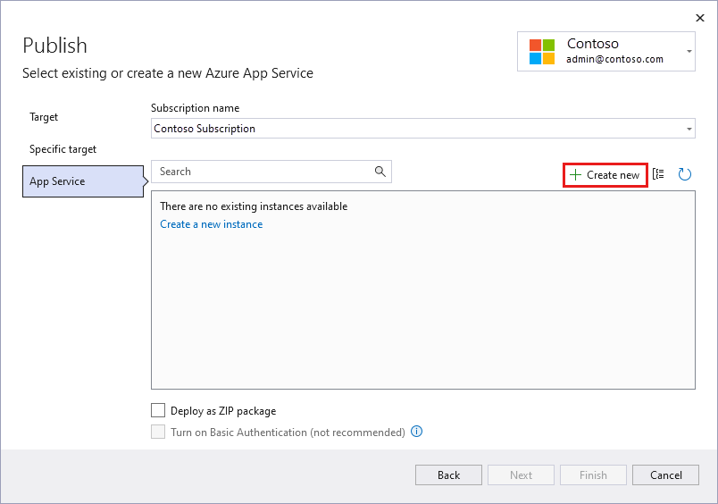
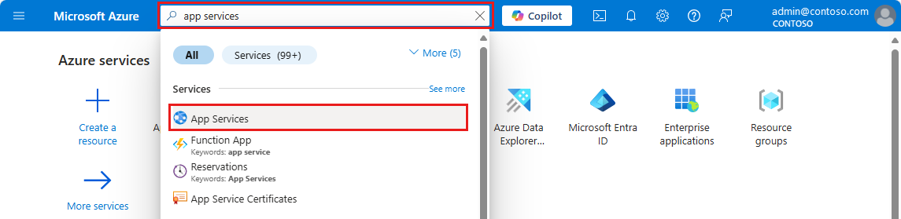
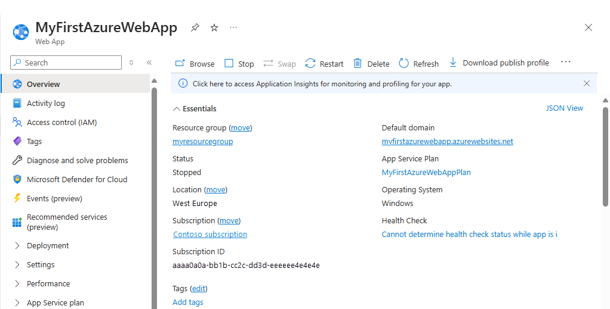

<!--

As a .NET developer, when choosing an IDE and .NET TFM - you map to various OS requirements.
For example, if you choose Visual Studio - you're developing the app on Windows, but you can still
target cross-platform with .NET Core 3.1 or .NET 5.0.

| .NET / IDE         | Visual Studio | Visual Studio for Mac | Visual Studio Code | Command line   |
|--------------------|---------------|-----------------------|--------------------|----------------|
| .NET Core 3.1      | Windows       | macOS                 | Cross-platform     | Cross-platform |
| .NET 5.0           | Windows       | macOS                 | Cross-platform     | Cross-platform |
| .NET Framework 4.8 | Windows       | N/A                   | Windows            | Windows        |

-->

# Quickstart: Create an ASP.NET web app in Azure

In this quickstart, you'll learn how to create and deploy your first ASP.NET web app to [Azure App Service](overview.md). App Service supports various versions of .NET apps, and provides a highly scalable, self-patching web hosting service. When you're finished, you'll have an Azure resource group consisting of an App Service hosting plan and an App Service with a deployed web application.

## Prerequisites

::: zone pivot="development-environment-vs"

- An Azure account with an active subscription. [Create an account for free](https://azure.microsoft.com/free/dotnet).
- <a href="https://www.visualstudio.com/downloads" target="_blank">Visual Studio 2019</a> with the **ASP.NET and web development** workload.

  If you've already installed Visual Studio 2019:

  - Install the latest updates in Visual Studio by selecting **Help** > **Check for Updates**.
  - Add the workload by selecting **Tools** > **Get Tools and Features**.

::: zone-end

::: zone pivot="development-environment-vscode"

- An Azure account with an active subscription. [Create an account for free](https://azure.microsoft.com/free/dotnet).
- <a href="https://www.visualstudio.com/downloads" target="_blank">Visual Studio Code</a>.
- The <a href="https://marketplace.visualstudio.com/items?itemName=ms-vscode.vscode-node-azure-pack" target="_blank">Azure Tools</a> extension.

## [.NET Core 3.1](#tab/netcore31)

<a href="https://dotnet.microsoft.com/download/dotnet-core/3.1" target="_blank">
    Install the latest .NET Core 3.1 SDK
</a>.

## [.NET 5.0](#tab/net50)

<a href="https://dotnet.microsoft.com/download/dotnet/5.0" target="_blank">
    Install the latest .NET 5.0 SDK
</a>.

## [.NET Framework 4.8](#tab/netframework48)

<a href="https://dotnet.microsoft.com/download/dotnet-framework/net48" target="_blank">
    Install the .NET Framework 4.8 Developer Pack
</a>.

---

::: zone-end

::: zone pivot="development-environment-cli"

- An Azure account with an active subscription. [Create an account for free](https://azure.microsoft.com/free/dotnet).
- The <a href="/cli/azure/install-azure-cli" target="_blank">Azure CLI</a>.

## [.NET Core 3.1](#tab/netcore31)

<a href="https://dotnet.microsoft.com/download/dotnet-core/3.1" target="_blank">
    Install the latest .NET Core 3.1 SDK
</a>.

## [.NET 5.0](#tab/net50)

<a href="https://dotnet.microsoft.com/download/dotnet/5.0" target="_blank">
    Install the latest .NET 5.0 SDK
</a>.

## [.NET Framework 4.8](#tab/netframework48)

<a href="https://dotnet.microsoft.com/download/dotnet-framework/net48" target="_blank">
    Install the .NET Framework 4.8 Developer Pack
</a>.

---

::: zone-end

[Having issues? Let us know.](https://aka.ms/DotNetAppServiceLinuxQuickStart)

## Create an ASP.NET web app

::: zone pivot="development-environment-vs"

::: zone-end

::: zone pivot="development-environment-vscode"

Create a new .NET web app using the [`dotnet new`](/dotnet/core/tools/dotnet-new) command, and open it in Visual Studio Code.

## [.NET Core 3.1](#tab/netcore31)

```dotnetcli
dotnet new web -n hello-dotnet -f netcoreapp3.1
code .
```

## [.NET 5.0](#tab/net50)

```dotnetcli
dotnet new web -n hello-dotnet -f net5.0
code .
```

## [.NET Framework 4.8](#tab/netframework48)

```dotnetcli
dotnet new web -n hello-dotnet --target-framework-override net48
code .
```

> [!IMPORTANT]
> The `--target-framework-override` flag is a free-form text replacement of the target framework moniker (TFM) for the project, and makes *no guarantees* that the supporting template exists or compiles. You can only build .NET Framework apps on Windows.

---

::: zone-end

::: zone pivot="development-environment-cli"

In a terminal window on your machine, create a directory named `hello-dotnet` and change the current directory to it.

```bash
mkdir hello-dotnet && cd hello-dotnet
```

Create a new .NET web app.

## [.NET Core 3.1](#tab/netcore31)

```dotnetcli
dotnet new web -n hello-dotnet -f netcoreapp3.1
```

## [.NET 5.0](#tab/net50)

```dotnetcli
dotnet new web -n hello-dotnet -f net5.0
```

## [.NET Framework 4.8](#tab/netframework48)

```dotnetcli
dotnet new web -n hello-dotnet --target-framework-override net48
```

> [!IMPORTANT]
> The `--target-framework-override` flag is a free-form text replacement of the target framework moniker (TFM) for the project, and makes *no guarantees* that the supporting template exists or compiles. You can only build .NET Framework apps on Windows.

---

::: zone-end

## Publish your web app

::: zone pivot="development-environment-vs"

Create an ASP.NET Core web app in Visual Studio by following these steps:

## [.NET Core 3.1](#tab/netcore31)

1. Open Visual Studio and select **Create a new project**.

1. In **Create a new project**, select **ASP.NET Core Web Application** and confirm that **C#** is listed in the languages for that choice, then select **Next**.

1. In **Configure your new project**, name your web application project *myFirstAzureWebApp*, and select **Create**.

   

1. You can deploy any type of ASP.NET Core web app to Azure, but for this quickstart, choose the **Web Application** template. Make sure **Authentication** is set to **No Authentication**, and that no other option is selected. Then, select **Create**.

   

1. From the Visual Studio menu, select **Debug** > **Start Without Debugging** to run your web app locally.

   

## [.NET 5.0](#tab/net50)

1. Open Visual Studio and select **Create a new project**.

1. In **Create a new project**, select **ASP.NET Core Web Application** and confirm that **C#** is listed in the languages for that choice, then select **Next**.

1. In **Configure your new project**, name your web application project *myFirstAzureWebApp*, and select **Create**.

   

1. For a .NET 5.0 app, select **ASP.NET Core 5.0** in the dropdown.

1. You can deploy any type of ASP.NET Core web app to Azure, but for this quickstart, choose the **ASP.NET Core Web App** template. Make sure **Authentication** is set to **No Authentication**, and that no other option is selected. Then, select **Create**.

   

1. From the Visual Studio menu, select **Debug** > **Start Without Debugging** to run your web app locally.

   

## [.NET 5.0](#tab/netframework48)

---

::: zone-end

::: zone pivot="development-environment-vscode"

::: zone-end

::: zone pivot="development-environment-cli"

::: zone-end

To publish your web app, you must first create and configure a new App Service that you can publish your app to.

As part of setting up the App Service, you'll create:

- A new [resource group](../azure-resource-manager/management/overview.md#terminology) to contain all of the Azure resources for the service.
- A new [Hosting Plan](./overview-hosting-plans.md) that specifies the location, size, and features of the web server farm that hosts your app.

Follow these steps to create your App Service and publish your web app:

1. In **Solution Explorer**, right-click the **myFirstAzureWebApp** project and select **Publish**.

1. In **Publish**, select **Azure** and click **Next**.

1. Your options depend on whether you're signed in to Azure already and whether you have a Visual Studio account linked to an Azure account. Select either **Add an account** or **Sign in** to sign in to your Azure subscription. If you're already signed in, select the account you want.

   

1. To the right of **App Service instances**, click **+**.

   

1. For **Subscription**, accept the subscription that is listed or select a new one from the drop-down list.

1. For **Resource group**, select **New**. In **New resource group name**, enter *myResourceGroup* and select **OK**.

1. For **Hosting Plan**, select **New**.

1. In the **Hosting Plan: Create new** dialog, enter the values specified in the following table:

   | Setting          | Suggested Value          | Description                                                           |
   |------------------|--------------------------|-----------------------------------------------------------------------|
   | **Hosting Plan** | *myFirstAzureWebAppPlan* | Name of the App Service plan.                                         |
   | **Location**     | *West Europe*            | The datacenter where the web app is hosted.                           |
   | **Size**         | *Free*                   | [Pricing tier][app-service-pricing-tier] determines hosting features. |

   

1. In **Name**, enter a unique app name that includes only the valid characters are `a-z`, `A-Z`, `0-9`, and `-`. You can accept the automatically generated unique name. The URL of the web app is `http://<app-name>.azurewebsites.net`, where `<app-name>` is your app name.

2. Select **Create** to create the Azure resources.

   

   Once the wizard completes, the Azure resources are created for you and you are ready to publish.

3. Select **Finish** to close the wizard.

1. In the **Publish** page, click **Publish**. Visual Studio builds, packages, and publishes the app to Azure, and then launches the app in the default browser.

   

**Congratulations!** Your ASP.NET Core web app is running live in Azure App Service.

## Update the app and redeploy

::: zone pivot="development-environment-vs"

::: zone-end

::: zone pivot="development-environment-vscode"

::: zone-end

::: zone pivot="development-environment-cli"

::: zone-end

Follow these steps to update and redeploy your web app:

1. In **Solution Explorer**, under your project, open **Pages** > **Index.cshtml**.

1. Replace the entire `<div>` tag with the following code:

   ```html
   <div class="jumbotron">
       <h1>ASP.NET in Azure!</h1>
       <p class="lead">This is a simple app that we've built that demonstrates how to deploy a .NET app to Azure App Service.</p>
   </div>
   ```

1. To redeploy to Azure, right-click the **myFirstAzureWebApp** project in **Solution Explorer** and select **Publish**.

1. In the **Publish** summary page, select **Publish**.

   <!--  -->

    When publishing completes, Visual Studio launches a browser to the URL of the web app.

    

## Manage the Azure app

::: zone pivot="development-environment-vs"

::: zone-end

::: zone pivot="development-environment-vscode"

::: zone-end

::: zone pivot="development-environment-cli"

::: zone-end

To manage your web app, go to the [Azure portal](https://portal.azure.com), and search for and select **App Services**.



On the **App Services** page, select the name of your web app.

:::image type="content" source="./media/quickstart-dotnetcore/select-app-service.png" alt-text="Screenshot of the App Services page with an example web app selected.":::

The **Overview** page for your web app, contains options for basic management like browse, stop, start, restart, and delete. The left menu provides further pages for configuring your app.



[!INCLUDE [Clean-up section](../../includes/clean-up-section-portal.md)]

## Next steps

In this quickstart, you used Visual Studio to create and deploy an ASP.NET Core web app to Azure App Service.

Advance to the next article to learn how to create a .NET Core app and connect it to a SQL Database:

> [!div class="nextstepaction"]
> [ASP.NET Core with SQL Database](tutorial-dotnetcore-sqldb-app.md)

> [!div class="nextstepaction"]
> [Configure ASP.NET Core app](configure-language-dotnetcore.md)

::: zone-end


[app-service-pricing-tier]: https://azure.microsoft.com/pricing/details/app-service/?ref=microsoft.com&utm_source=microsoft.com&utm_medium=docs&utm_campaign=visualstudio
