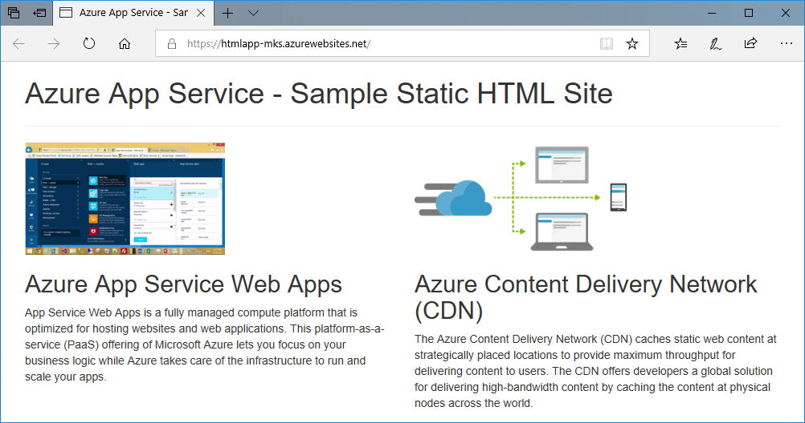
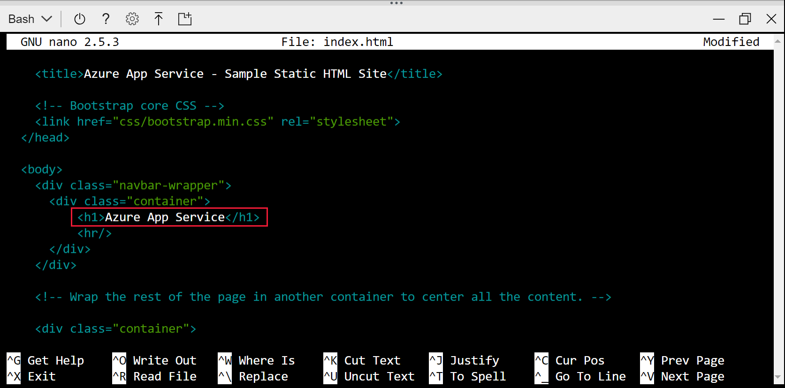
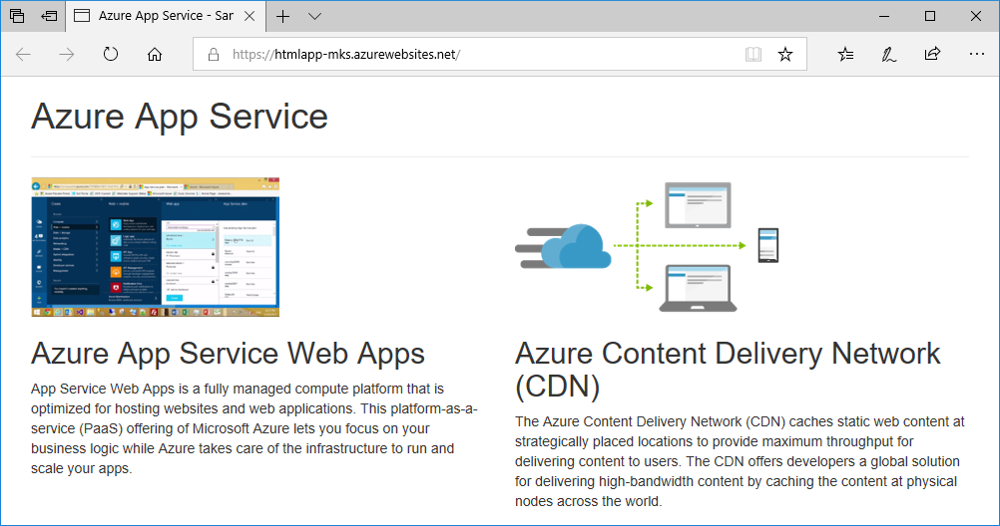
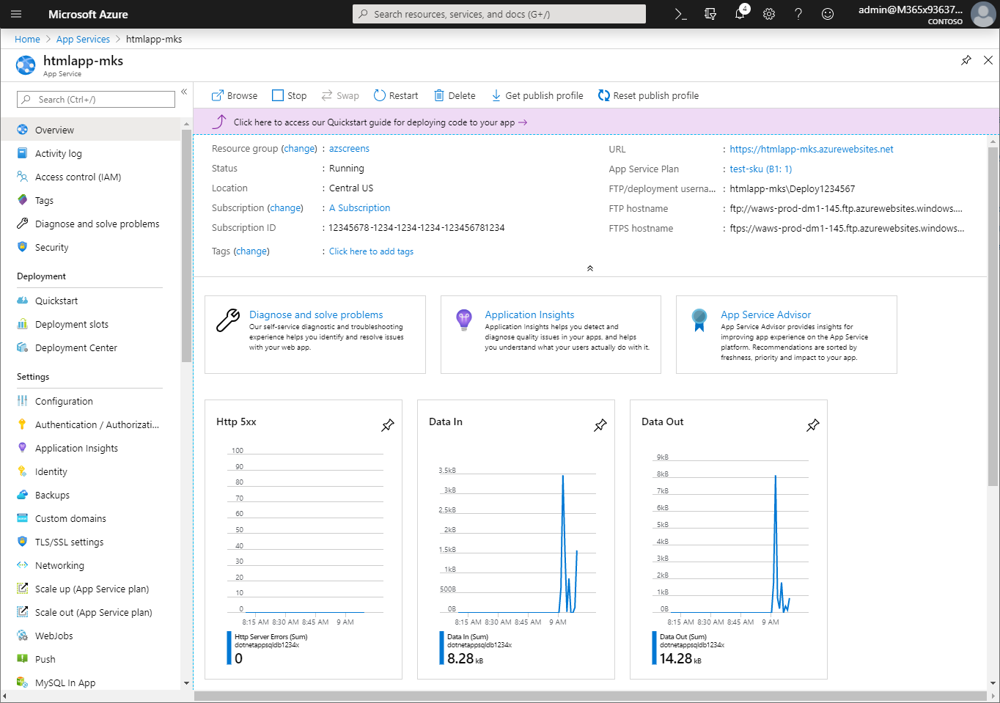

# Create a static HTML web app in Azure

This quickstart shows how to deploy a basic HTML+CSS site to <abbr title="An HTTP-based service for hosting web applications, REST APIs, and mobile back-end applications.">Azure App Service</abbr>. You'll complete this quickstart in [Cloud Shell](../cloud-shell/overview.md), but you can also run these commands locally with [Azure CLI](/cli/azure/install-azure-cli).

## 1. Prepare your environment

[!INCLUDE [quickstarts-free-trial-note](../../includes/quickstarts-free-trial-note.md)]

In [Cloud Shell](../cloud-shell/overview.md), create a quickstart directory and then change to it.

```bash
mkdir quickstart

cd $HOME/quickstart
```

Next, run the following command to clone the sample app repository to your quickstart directory.

```bash
git clone https://github.com/Azure-Samples/html-docs-hello-world.git
```
<hr/>

## 2. Create a web app

Change to the directory that contains the sample code and run the `az webapp up` command. **Replace** `<app-name>` with a globally unique name.

```bash
cd html-docs-hello-world

az webapp up --location westeurope --name <app_name> --html
```

<details>
<summary>Troubleshooting</summary>
<ul>
<li>If the <code>az</code> command isn't recognized, be sure you have the Azure CLI installed as described in <a href="#1-prepare-your-environment">Prepare your environment</a>.</li>
<li>Replace <code>&lt;app-name&gt;</code> with a name that's unique across all of Azure (<em>valid characters are <code>a-z</code>, <code>0-9</code>, and <code>-</code></em>). A good pattern is to use a combination of your company name and an app identifier.</li>
<li>The <code>--sku F1</code> argument creates the web app on the Free pricing tier. Omit this argument to use a faster premium tier, which incurs an hourly cost.</li>
<li>The <code>--html</code> argument says to treat all folder content as static content and disable build automation.</li>
<li>You can optionally include the argument <code>--location &lt;location-name&gt;</code> where <code>&lt;location-name&gt;</code> is an available Azure region. You can retrieve a list of allowable regions for your Azure account by running the <a href="/cli/azure/appservice#az_appservice_list_locations"><code>az account list-locations</code></a> command.</li>
</ul>
</details>

The command may take a few minutes to complete. 

<details>
<summary>What's <code>az webapp up</code> doing?</summary>
<p>The <code>az webapp up</code> command does the following actions:</p>
<ul>
<li>Create a default resource group.</li>
<li>Create a default App Service plan.</li>
<li><a href="/cli/azure/webapp#az_webapp_create">Create an App Service app</a> with the specified name.</li>
<li><a href="/azure/app-service/deploy-zip">Zip deploy</a> files from the current working directory to the app.</li>
<li>While running, it provides messages about resource creation, logging, and ZIP deployment.</li>
</ul>

When it finishes, it displays information similar to the following example:

```output
{
  "app_url": "https://&lt;app_name&gt;.azurewebsites.net",
  "location": "westeurope",
  "name": "&lt;app_name&gt;",
  "os": "Windows",
  "resourcegroup": "appsvc_rg_Windows_westeurope",
  "serverfarm": "appsvc_asp_Windows_westeurope",
  "sku": "FREE",
  "src_path": "/home/&lt;username&gt;/quickstart/html-docs-hello-world ",
  &lt; JSON data removed for brevity. &gt;
}
```

</details>

You will need the `resourceGroup` value to [clean up resources](#6-clean-up-resources) later.

<hr/>

## 3. Browse to the app

In a browser, go to the app URL: `http://<app_name>.azurewebsites.net`.

The page is running as an Azure App Service web app.



<hr/>

## 4. Update and redeploy the app

In the Cloud Shell, **type** `nano index.html` to open the nano text editor. 

In the `<h1>` heading tag, change "Azure App Service - Sample Static HTML Site" to "Azure App Service".



**Save** your changes by using command `^O`.

**Exit** nano by using command `^X`.

Redeploy the app with `az webapp up` command.

```bash
az webapp up --html
```

Switch back to the browser window that opened in the **Browse to the app** step.

**Refresh** the page.



<hr/>

## 5. Manage your new Azure app

**Navigate** to the [Azure portal](https://portal.azure.com)., 

**Search** for and **select** **App Services**.


**Select** the name of your Azure app.


You see your web app's Overview page. Here, you can perform basic management tasks like browse, stop, start, restart, and delete.



The left menu provides different pages for configuring your app.

<hr/>

## 6. Clean up resources

In the preceding steps, you created Azure resources in a resource group. If you don't expect to need these resources in the future, delete the resource group by running the following command in the Cloud Shell. Remember that the resource group name was automatically generated for you in the [create a web app](#2-create-a-web-app) step.

```bash
az group delete --name appsvc_rg_Windows_westeurope
```

This command may take a minute to run.

<hr/>

## Next steps

> [!div class="nextstepaction"]
> [Map custom domain](app-service-web-tutorial-custom-domain-uiex.md)
