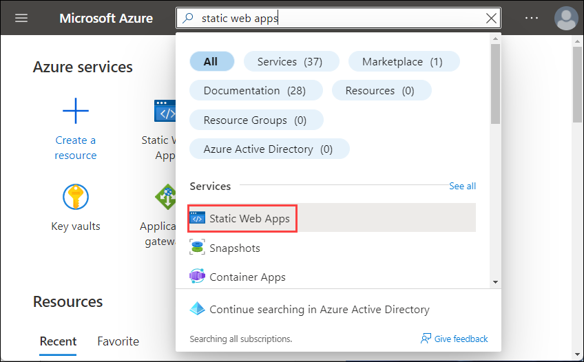
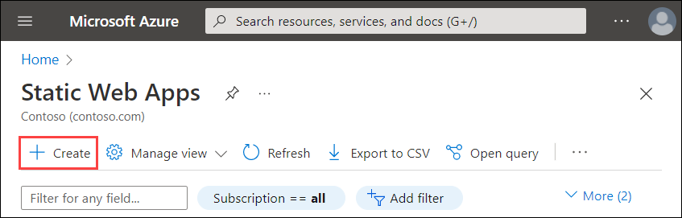
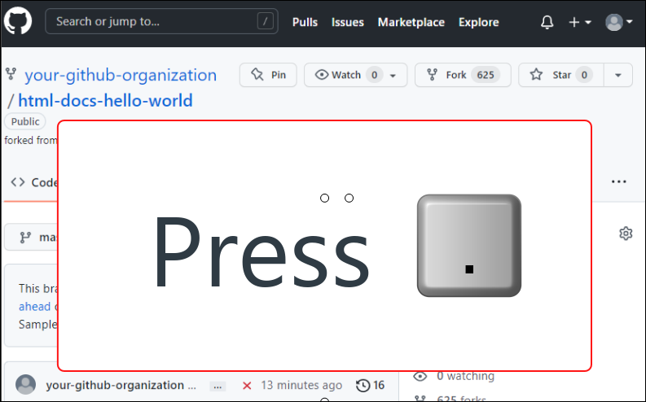
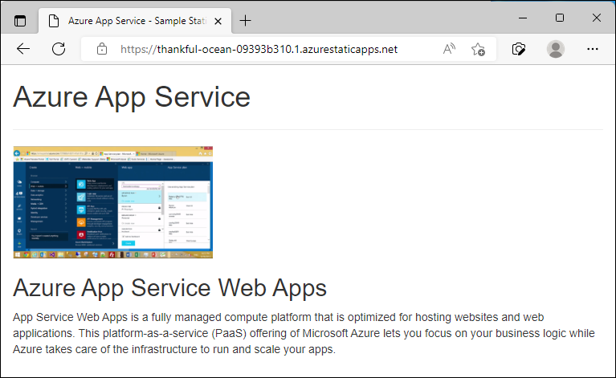

# Create a static HTML web app in Azure

[Azure App Service](overview.md) provides a highly scalable, self-patching web hosting service. This quickstart shows how to deploy a basic HTML + CSS site to Azure Static Web Apps.


You can follow the steps here using a Mac, Windows, or Linux machine. Once the prerequisites are installed, it takes about five minutes to complete the steps.

This quickstart configures a static web App in the **Free** tier and incurs no cost for your Azure subscription.

To complete this quickstart you need:

1. An Azure account with an active subscription. [Create an account for free](https://azure.microsoft.com/free/?utm_source=campaign&utm_campaign=vscode-tutorial-app-service-extension&mktingSource=vscode-tutorial-app-service-extension).
2. A GitHub account to fork a repository.

> [!NOTE]
> For information regarding hosting static HTML files in a serverless environment, please see [Static Web Apps](../static-web-apps/overview.md).

:::image type="content" source="media/quickstart-html/hello-world-in-browser.png" alt-text="Home page of sample app":::

[!INCLUDE [quickstarts-free-trial-note](../../includes/quickstarts-free-trial-note.md)]

## 1 - Get the sample repository

### [CLI](#tab/cli)

You'll complete this quickstart in [Cloud Shell](../cloud-shell/overview.md), but you can also run these commands locally with [Azure CLI](/cli/azure/install-azure-cli).

[!INCLUDE [azure-cli-prepare-your-environment.md](../../includes/azure-cli-prepare-your-environment.md)]

In the Cloud Shell, create a quickstart directory and then change to it.

```bash
mkdir quickstart

cd $HOME/quickstart
```

Next, run the following commands to clone the sample app repository to your quickstart directory.

```bash
git clone https://github.com/Azure-Samples/html-docs-hello-world.git
```

### [Portal](#tab/portal)

1. In your browser, navigate to the repository containing [the sample code](https://github.com/Azure-Samples/html-docs-hello-world).

2. In the upper right corner, select **Fork**.

    

3. On the **Create a new fork** screen, confirm the **Owner** and **Repository name** fields. Select **Create fork**.

    >[!NOTE]
    > This should take you to the new fork. Your fork URL will look something like this: https://github.com/YOUR_GITHUB_ACCOUNT_NAME/html-docs-hello-world

---

## 2 - Deploy the sample app to Azure

### [CLI](#tab/cli)

Change to the directory that contains the sample code and run the [az webapp up](/cli/azure/webapp#az-webapp-up) command. In the following example, replace <app_name> with a unique app name. Static content is indicated by the `--html` flag.

```azurecli
cd html-docs-hello-world

az webapp up --location westeurope --name <app_name> --html
```

The `az webapp up` command does the following actions:

- Create a default resource group.

- Create a default app service plan.

- Create an app with the specified name.

- [Zip deploy](./deploy-zip.md) files from the current working directory to the web app.

This command may take a few minutes to run. While running, it displays information similar to the following example:

```output
{
  "app_url": "https://&lt;app_name&gt;.azurewebsites.net",
  "location": "westeurope",
  "name": "&lt;app_name&gt;",
  "os": "Windows",
  "resourcegroup": "appsvc_rg_Windows_westeurope",
  "serverfarm": "appsvc_asp_Windows_westeurope",
  "sku": "FREE",
  "src_path": "/home/&lt;username&gt;/quickstart/html-docs-hello-world ",
  &lt; JSON data removed for brevity. &gt;
}
```

Make a note of the `resourceGroup` value. You need it for the [clean up resources](#clean-up-resources) section.

In a browser, go to the app URL in the `app_url`.

### [Portal](#tab/portal)

1. Sign into the Azure portal.
   
2. At the top of the portal, type **static web apps** in the search box. Under **Services**, select **Static Web Apps**.

    

3. On the **Static Web Apps** page, select **Create**.

    

4. Fill out the **Create Web App** page as follows.
   - **Resource Group**: Create a resource group named *myResourceGroup*.
   - **Name**: Type a globally unique name for your web app. 
   - **Plan type**: Select *Free*.
   - **Region for Azure Functions API and staging environments**: Choose a location close to you.
   - **Source**: Select *GitHub*.
   - **Organization**: Select your organization.
   - **Repository**: Select your forked *html-docs-hello-world* repo.
   - **Branch**: Select the default branch.

    There are no build presets for this repository. However, if you use a framework or static site generator, the Static Web App integration with GitHub supports a variety of frameworks and static site generators.

5.  Select the **Review + create** button at the bottom of the page.

6.  After validation runs, select the **Create** button at the bottom of the page. This will create an Azure resource group and static web app. This will also add a workflow with GitHub actions that will automatically deploy your code from your repo to the Azure static web app.

7.  After the Azure resources are created, select **Go to resource**. Wait a few minutes for your site to deploy. Then navigate to the URL that appears on the Overview page.

---

The sample static app is running.


**Congratulations!** You've deployed your first static web app using the Azure portal.

## 3 - Update and redeploy the app

### [CLI](#tab/cli)

In the Cloud Shell, type `nano index.html` to open the nano text editor. In the `<h1>` heading tag, change "Azure App Service - Sample Static HTML Site" to "Azure App Service", as shown below.


Save your changes and exit nano. Use the command `^O` to save and `^X` to exit.

You'll now redeploy the app with the same `az webapp up` command.

```azurecli
az webapp up --location westeurope --name <app_name> --html
```

Once deployment has completed, switch back to the browser window that opened in the **Browse to the app** step, and refresh the page.

:::image type="content" source="media/quickstart-html/hello-world-in-browser.png" alt-text="Updated sample app home page":::

### [Portal](#tab/portal)

1. Browse to your GitHub fork of html-docs-hello-world.

2. On your repo page, press `.` to start Visual Studio code within your browser.



> [!NOTE]
> The URL will change from GitHub.com to GitHub.dev. This feature only works with repos that have files. This does not work on empty repos.

3. Edit **index.html** so that it shows "Azure App Service" instead of "Azure App Service - Sample Static HTML Site".

    ```html
    <h1>Azure App Service</h1>
    ```

4. From the **Source Control** menu, select the **Stage Changes** button to stage the change.

    

5. Enter a commit message such as `Updated static site`. Then, select **Commit and Push**.
    
    

6. Once deployment has completed, return to the browser window that opened during the **Browse to the app** step, and refresh the page.

    

---

## 4 - Manage your new Azure app

1. Go to the Azure portal to manage the web app you created. Search for and select **Static Web Apps**.

    

2. Select the name of your static web app.

    

    Your web app's **Overview** page will be displayed. Here, you can manage the deployment token for your static web app, in case you need to reset the token.

    

    The web app menu provides different options for configuring your app.

## 5 - Clean up resources

When you're finished with the sample app, you can remove all of the resources for the app from Azure. It will not incur extra charges and keep your Azure subscription uncluttered. Removing the resource group also removes all resources in the resource group and is the fastest way to remove all Azure resources for your app.

### [CLI](#tab/cli)

Delete the resource group by running the following command in the Cloud Shell. Remember that the resource group name was automatically generated for you in the [create a web app](#create-a-web-app) step.

```azurecli
az group delete --name appsvc_rg_Windows_westeurope
```

This command may take a minute to run.

### [Portal](#tab/portal)

1. From your App Service **Overview** page, select the resource group you created.

2. From the resource group page, select **Delete resource group**. Confirm the name of the resource group to finish deleting the resources.

---

## Next steps

> [!div class="nextstepaction"]
> [Map custom domain](app-service-web-tutorial-custom-domain.md)
