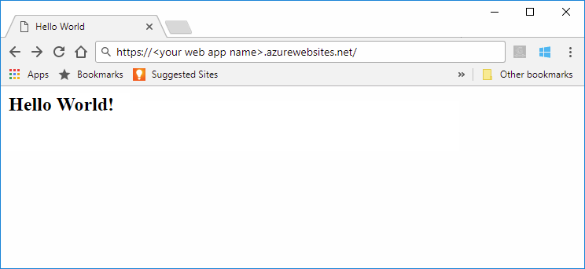

# Quickstart: Create a Java app on Azure App Service

[Azure App Service](overview.md) provides a highly scalable, self-patching web hosting service.  This quickstart shows how to use the [Azure CLI](/cli/azure/get-started-with-azure-cli) with the [Azure Web App Plugin for Maven](https://github.com/Microsoft/azure-maven-plugins/tree/develop/azure-webapp-maven-plugin) to deploy a .jar file, or .war file. 

There are also IDE versions of this article. Check out [Azure Toolkit for IntelliJ Quickstart](/azure/developer/java/toolkit-for-intellij/create-hello-world-web-app) or [Azure Toolkit for Eclipse Quickstart](/azure/developer/java/toolkit-for-eclipse/create-hello-world-web-app).

## 1. Prepare your environment

Before you begin, you must have the following:

+ An Azure account (The profile that maintains billing information for Azure usage.) with an active subscription (The basic organizational structure in which you manage resources in Azure, typically associated with an individual or department within an organization.). [Create an account for free](https://azure.microsoft.com/free/?ref=microsoft.com&utm_source=microsoft.com&utm_medium=docs&utm_campaign=visualstudio).

+ The [Azure CLI](/cli/azure/install-azure-cli).

+ The [Java Developer Kit](/azure/developer/java/fundamentals/java-support-on-azure), version 8 or 11.

+ [Apache Maven](https://maven.apache.org), version 3.0 or above.

The Maven plugin uses account credentials from the Azure CLI to deploy to App Services. [Sign in with the Azure CLI](/cli/azure/authenticate-azure-cli) before continuing. For more information, see [authentication with Maven plugins](https://github.com/microsoft/azure-maven-plugins/wiki/Authentication).

```azurecli
az login
```

<br>
<hr/>

## 2. Create a Java app

# [Java SE](#tab/javase)

Clone the [Spring Boot Getting Started](https://github.com/spring-guides/gs-spring-boot) sample project.

```bash
git clone https://github.com/spring-guides/gs-spring-boot
```

Change directory to the completed project.

```bash
cd gs-spring-boot/complete
```

# [Tomcat](#tab/tomcat)

Execute the following Maven command in the Cloud Shell prompt to create a new app named `helloworld`:

```bash
mvn archetype:generate "-DgroupId=example.demo" "-DartifactId=helloworld" "-DarchetypeArtifactId=maven-archetype-webapp" "-Dversion=1.0-SNAPSHOT"
```

Then change your working directory to the project folder:

```bash
cd helloworld
```

---

<br>
<hr/>

## 3. Configure the Maven plugin

Run the Maven command below to configure the deployment. This command will help you to set up the App Service operating system, Java version, and Tomcat version.

```bash
mvn com.microsoft.azure:azure-webapp-maven-plugin:1.12.0:config
```

::: zone pivot="platform-windows"

# [Java SE](#tab/javase)

1. When prompted with **Subscription** option, select the proper `Subscription` by entering the number print in the line start.
1. When prompted with **Web App** option, accept the default option `<create>` by pressing enter or select an existing app.
1. When prompted with **OS** option, select **Windows** by entering `3`.
1. When prompted with **Pricing Tier** option, select **B2** by entering `2`.
1. Use the default Java version, **Java 8**, by pressing enter.
1. Finally, press enter on the last prompt to confirm your selections.

    Your summary output will look similar to the snippet shown below.

    <pre class="is-monospace is-size-small has-padding-medium has-background-tertiary has-text-tertiary-invert">
    Please confirm webapp properties
    Subscription Id : ********-****-****-****-************
    AppName : spring-boot-1599007390755
    ResourceGroup : spring-boot-1599007390755-rg
    Region : westeurope
    PricingTier : Basic_B2
    OS : Windows
    Java : 1.8
    WebContainer : java 8
    Deploy to slot : false
    Confirm (Y/N)? : Y
    [INFO] Saving configuration to pom.
    [INFO] ------------------------------------------------------------------------
    [INFO] BUILD SUCCESS
    [INFO] ------------------------------------------------------------------------
    [INFO] Total time: 41.118 s
    [INFO] Finished at: 2020-09-01T17:43:45-07:00
    [INFO] ------------------------------------------------------------------------
    </pre>

# [Tomcat](#tab/tomcat)

1. When prompted with **Subscription** option, select the proper `Subscription` by entering the number print in the line start.
1. When prompted with **Web App** option, accept the default option `<create>` by pressing enter or select an existing app.
1. When prompted with **OS** option, select **Windows** by entering `3`.
1. When prompted with **Pricing Tier** option, select **B2** by entering `2`.
1. Use the default Java version, **Java 8**, by pressing enter.
1. Use the default web container, **Tomcat 8.5**, by pressing enter.
1. Finally, press enter on the last prompt to confirm your selections.

    Your summary output will look similar to the snippet shown below.

    <pre class="is-monospace is-size-small has-padding-medium has-background-tertiary has-text-tertiary-invert">
    Please confirm webapp properties
    Subscription Id : ********-****-****-****-************
    AppName : helloworld-1599003152123
    ResourceGroup : helloworld-1599003152123-rg
    Region : westeurope
    PricingTier : Basic_B2
    OS : Windows
    Java : 1.8
    WebContainer : tomcat 8.5
    Deploy to slot : false
    Confirm (Y/N)? : Y
    [INFO] Saving configuration to pom.
    [INFO] ------------------------------------------------------------------------
    [INFO] BUILD SUCCESS
    [INFO] ------------------------------------------------------------------------
    [INFO] Total time: 03:03 min
    [INFO] Finished at: 2020-09-01T16:35:30-07:00
    [INFO] ------------------------------------------------------------------------
    </pre>

---

::: zone-end
::: zone pivot="platform-linux"

### [Java SE](#tab/javase)

1. When prompted with **Subscription** option, select the proper `Subscription` by entering the number print in the line start.
1. When prompted with **Web App** option, accept the default option `<create>` by pressing enter or select an existing app.
1. When prompted with **OS** option, select **Linux** by pressing enter.
1. When prompted with **Pricing Tier** option, select **B2** by entering `2`.
1. Use the default Java version, **Java 8**, by pressing enter.
1. Finally, press enter on the last prompt to confirm your selections.

    <pre class="is-monospace is-size-small has-padding-medium has-background-tertiary has-text-tertiary-invert">
    Please confirm webapp properties
    Subscription Id : ********-****-****-****-************
    AppName : spring-boot-1599007116351
    ResourceGroup : spring-boot-1599007116351-rg
    Region : westeurope
    PricingTier : Basic_B2
    OS : Linux
    RuntimeStack : JAVA 8-jre8
    Deploy to slot : false
    Confirm (Y/N)? : Y
    [INFO] Saving configuration to pom.
    [INFO] ------------------------------------------------------------------------
    [INFO] BUILD SUCCESS
    [INFO] ------------------------------------------------------------------------
    [INFO] Total time: 20.925 s
    [INFO] Finished at: 2020-09-01T17:38:51-07:00
    [INFO] ------------------------------------------------------------------------
    </pre>

### [Tomcat](#tab/tomcat)

1. When prompted with **Subscription** option, select the proper `Subscription` by entering the number print in the line start.
1. When prompted with **Web App** option, accept the default option `<create>` by pressing enter or select an existing app.
1. When prompted with **OS** option, select **Linux** by pressing enter.
1. When prompted with **Pricing Tier** option, select **B2** by entering `2`.
1. Use the default Java version, **Java 8**, by pressing enter.
1. Use the default web container, **Tomcat 8.5**, by pressing enter.
1. Finally, press enter on the last prompt to confirm your selections.

    <pre class="is-monospace is-size-small has-padding-medium has-background-tertiary has-text-tertiary-invert">
    Please confirm webapp properties
    Subscription Id : ********-****-****-****-************
    AppName : helloworld-1599003744223
    ResourceGroup : helloworld-1599003744223-rg
    Region : westeurope
    PricingTier : Basic_B2
    OS : Linux
    RuntimeStack : TOMCAT 8.5-jre8
    Deploy to slot : false
    Confirm (Y/N)? : Y
    [INFO] Saving configuration to pom.
    [INFO] ------------------------------------------------------------------------
    [INFO] BUILD SUCCESS
    [INFO] ------------------------------------------------------------------------
    [INFO] Total time: 50.785 s
    [INFO] Finished at: 2020-09-01T16:43:09-07:00
    [INFO] ------------------------------------------------------------------------
    </pre>

---

::: zone-end

You can modify the configurations for App Service directly in your `pom.xml` if needed. Some common ones are listed below:

Property | Required | Description | Version
---|---|---|---
`<schemaVersion>` | false | Specify the version of the configuration schema. Supported values are: `v1`, `v2`. | 1.5.2
`<subscriptionId>` | false | Specify the subscription ID. | 0.1.0+
`<resourceGroup>` | true | Azure  resource group (A logical container for related Azure resources that you can manage as a unit.) for your Web App. | 0.1.0+
`<appName>` | true | The name of your Web App. | 0.1.0+
`<region>` | true | Specifies the region where your Web App will be hosted; the default value is **westeurope**. All valid regions at [Supported Regions](https://azure.microsoft.com/global-infrastructure/services/?products=app-service) section. | 0.1.0+
`<pricingTier>` | false | The pricing tier for your Web App. The default value is **P1V2** for production workload, while **B2** is the recommended minimum for Java dev/test. [Learn more](https://azure.microsoft.com/pricing/details/app-service/linux/)| 0.1.0+
`<runtime>` | true | The runtime environment configuration, you could see the detail [here](https://github.com/microsoft/azure-maven-plugins/wiki/Azure-Web-App:-Configuration-Details). | 0.1.0+
`<deployment>` | true | The deployment configuration, you could see the details [here](https://github.com/microsoft/azure-maven-plugins/wiki/Azure-Web-App:-Configuration-Details). | 0.1.0+

Be careful about the values of `<appName>` and `<resourceGroup>`(`helloworld-1590394316693` and `helloworld-1590394316693-rg` accordingly in the example output), they will be used later.

[Report a problem](https://www.research.net/r/javae2e?tutorial=quickstart-java&step=config)

<br>
<hr/>

## 4. Deploy the app

Deploy your Java app to Azure using the following command.

```bash
mvn package azure-webapp:deploy
```

Once deployment has completed, your application will be ready at `http://<appName>.azurewebsites.net/`. Open the url with your local web browser. You should see the following display:



**Congratulations!** You've deployed your first Java app to App Service.

[Report a problem](https://www.research.net/r/javae2e?tutorial=app-service-linux-quickstart&step=deploy)

<br>
<hr/>

## 5. Clean up resources

Delete the Java  app and its related resources to avoid incurring any further costs.

```azurecli
az group delete --name <your resource group name; for example: helloworld-1558400876966-rg> --yes
```

This command may take a minute to run.

<br>
<hr/>

## Next steps

> [!div class="nextstepaction"]
> [Connect to Azure DB for PostgreSQL with Java](../postgresql/connect-java.md)

> [!div class="nextstepaction"]
> [Set up CI/CD](deploy-continuous-deployment.md)

> [!div class="nextstepaction"]
> [Pricing Information](https://azure.microsoft.com/pricing/details/app-service/linux/)

> [!div class="nextstepaction"]
> [Aggregate Logs and Metrics](troubleshoot-diagnostic-logs.md)

> [!div class="nextstepaction"]
> [Scale up](manage-scale-up.md)

> [!div class="nextstepaction"]
> [Azure for Java Developers Resources](/java/azure/)

> [!div class="nextstepaction"]
> [Configure your Java app](configure-language-java.md)

> [!div class="nextstepaction"]
> [Secure with custom domain and certificate](tutorial-secure-domain-certificate.md)
