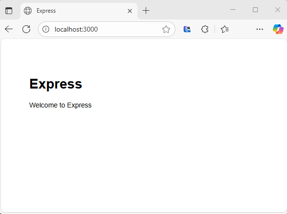
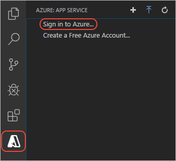
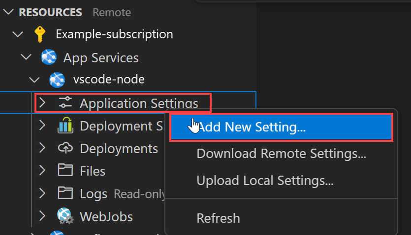
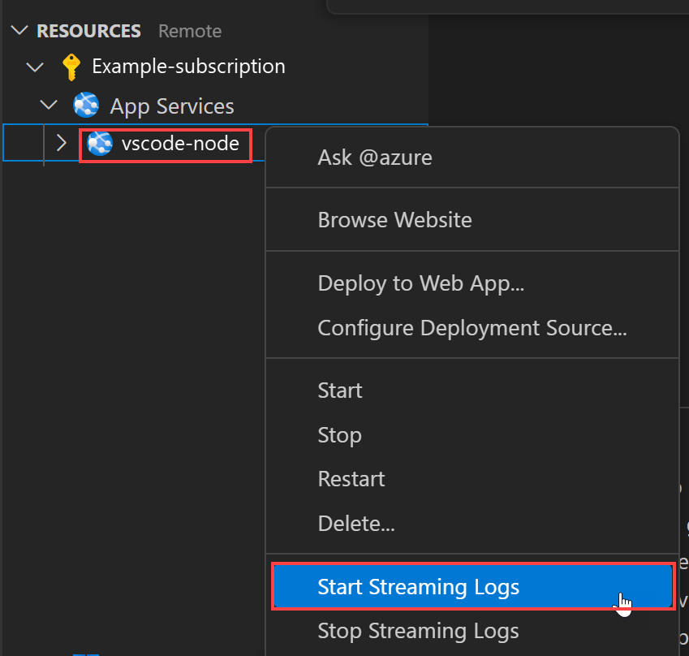

# Deploy a Node.js web app in Azure

In this quickstart, you'll learn how to create and deploy your first Node.js ([Express](https://www.expressjs.com)) web app to [Azure App Service](overview.md). App Service supports various versions of Node.js on both Linux and Windows. 

This quickstart configures an App Service app in the **Free** tier and incurs no cost for your Azure subscription.

## Set up your initial environment

:::zone target="docs" pivot="development-environment-vscode"

- Have an Azure account with an active subscription. [Create an account for free](https://azure.microsoft.com/free/?utm_source=campaign&utm_campaign=vscode-tutorial-app-service-extension&mktingSource=vscode-tutorial-app-service-extension).
- Install [Node.js and npm](https://nodejs.org). Run the command `node --version` to verify that Node.js is installed.
- Install [Visual Studio Code](https://code.visualstudio.com/).
- The [Azure App Service extension](https://marketplace.visualstudio.com/items?itemName=ms-azuretools.vscode-azureappservice) for Visual Studio Code.
 <!-- - <a href="https://git-scm.com/" target="_blank">Install Git</a> -->

::: zone-end

:::zone target="docs" pivot="development-environment-cli"

- Have an Azure account with an active subscription. [Create an account for free](https://azure.microsoft.com/free/?utm_source=campaign&utm_campaign=vscode-tutorial-app-service-extension&mktingSource=vscode-tutorial-app-service-extension).
- Install [Node.js LTS and npm](https://nodejs.org). Run the command `node --version` to verify that Node.js is installed.
- Install <a href="/cli/azure/install-azure-cli" target="_blank">Azure CLI</a>, with which you run commands in any shell to create and configure Azure resources.

::: zone-end


:::zone target="docs" pivot="development-environment-azure-portal"

- Have an Azure account with an active subscription. [Create an account for free](https://azure.microsoft.com/free/?utm_source=campaign&utm_campaign=vscode-tutorial-app-service-extension&mktingSource=vscode-tutorial-app-service-extension).
- Install [Node.js LTS and npm](https://nodejs.org). Run the command `node --version` to verify that Node.js is installed.
- Have an FTP client (for example, [FileZilla](https://filezilla-project.org)), to connect to your app.

::: zone-end
## Create your Node.js application

In this step, you create a basic Node.js application and ensure it runs on your computer.

> [!TIP]
> If you have already completed the [Node.js tutorial](https://code.visualstudio.com/docs/nodejs/nodejs-tutorial), you can skip ahead to [Deploy to Azure](#deploy-to-azure).

1. Create a Node.js application using the [Express Generator](https://expressjs.com/starter/generator.html), which is installed by default with Node.js and NPM.

    ```bash
    npx express-generator myExpressApp --view ejs
    ```

1. Change to the application's directory and install the NPM packages.

    ```bash
    cd myExpressApp && npm install
    ```

1. Start the development server with debug information.

    ```bash
    DEBUG=myexpressapp:* npm start
    ```

1. In a browser, navigate to `http://localhost:3000`. You should see something like this:

    

:::zone target="docs" pivot="development-environment-vscode"
> [!div class="nextstepaction"]
> [I ran into an issue](https://www.research.net/r/PWZWZ52?tutorial=node-deployment-azure-app-service&step=create-app)
::: zone-end

## Deploy to Azure

Before you continue, ensure that you have all the prerequisites installed and configured.

> [!NOTE]
> For your Node.js application to run in Azure, it needs to listen on the port provided by the `PORT` environment variable. In your generated Express app, this environment variable is already used in the startup script *bin/www* (search for `process.env.PORT`).
>

:::zone target="docs" pivot="development-environment-vscode"

#### Sign in to Azure

1. In the terminal, ensure you're in the *myExpressApp* directory, then start Visual Studio Code with the following command:

    ```bash
    code .
    ```

1. In Visual Studio Code, in the [Activity Bar](https://code.visualstudio.com/docs/getstarted/userinterface), select the **Azure** logo.

1. In the **App Service** explorer, select **Sign in to Azure...** and follow the instructions.

    In Visual Studio Code, you should see your Azure email address in the Status Bar and your subscription in the **AZURE APP SERVICE** explorer.

    

> [!div class="nextstepaction"]
> [I ran into an issue](https://www.research.net/r/PWZWZ52?tutorial=node-deployment-azure-app-service&step=getting-started)

#### Configure the App Service app and deploy code

1. Select the *myExpressApp* folder.

# [Deploy to Linux](#tab/linux)

2. Right-click on App Services and select **Create new Web App**. A Linux container is used by default. 
1. Type a globally unique name for your web app and press **Enter**. The name must be unique across all of Azure and use only alphanumeric characters ('A-Z', 'a-z', and '0-9') and hyphens ('-').
1. In Select a runtime stack, select the Node.js version you want. An **LTS** version is recommended.
1. In Select a pricing tier, select **Free (F1)** and wait for the resources to be created in Azure.
1. In the popup **Always deploy the workspace "myExpressApp" to \<app-name>"**, select **Yes**. This way, as long as you're in the same workspace, Visual Studio Code deploys to the same App Service app each time.

    While Visual Studio Code creates the Azure resources and deploys the code, it shows [progress notifications](https://code.visualstudio.com/api/references/extension-guidelines#notifications).

1. Once deployment completes, select **Browse Website** in the notification popup. The browser should display the Express default page.

# [Deploy to Windows](#tab/windows)

2. Right-click on App Services and select **Create new Web App... Advanced**.
1. Type a globally unique name for your web app and press **Enter**. The name must be unique across all of Azure and use only alphanumeric characters ('A-Z', 'a-z', and '0-9') and hyphens ('-').
1. Select **Create a new resource group**, then enter a name for the resource group, such as *AppServiceQS-rg*.
1. Select the Node.js version you want. An **LTS** version is recommended.
1. Select **Windows** for the operating system.
1. Select the location you want to serve your app from. For example, *West Europe*.
1. Select **Create new App Service plan**, then enter a name for the plan (such as *AppServiceQS-plan*), then select **F1 Free** for the pricing tier.
1. For **Select an Application Insights resource for your app**, select **Skip for now** and wait the resources to be created in Azure.
1. In the popup **Always deploy the workspace "myExpressApp" to \<app-name>"**, select **Yes**. This way, as long as you're in the same workspace, Visual Studio Code deploys to the same App Service app each time.

    While Visual Studio Code creates the Azure resources and deploys the code, it shows [progress notifications](https://code.visualstudio.com/api/references/extension-guidelines#notifications).

    > [!NOTE]
    > When deployment completes, your Azure app doesn't run yet because your project root doesn't have a *web.config*. Follow the remaining steps to generate it automatically. For more information, see [You do not have permission to view this directory or page](configure-language-nodejs.md#you-do-not-have-permission-to-view-this-directory-or-page).

1. In the **App Service** explorer in Visual Studio code, expand the node for the new app, right-click **Application Settings**, and select **Add New Setting**:

    

1. Enter `SCM_DO_BUILD_DURING_DEPLOYMENT` for the setting key.
1. Enter `true` for the setting value.

    This app setting enables build automation at deploy time, which automatically detects the start script and generates the *web.config* with it.

1. In the **App Service** explorer, select the **Deploy to Web App** icon again, confirm by clicking **Deploy** again.
1. Wait for deployment to complete, then select **Browse Website** in the notification popup. The browser should display the Express default page.

-----

> [!div class="nextstepaction"]
> [I ran into an issue](https://www.research.net/r/PWZWZ52?tutorial=node-deployment-azure-app-service&step=deploy-app)

::: zone-end

:::zone target="docs" pivot="development-environment-cli"

In the terminal, ensure you're in the *myExpressApp* directory, and deploy the code in your local folder (*myExpressApp*) using the [az webapp up](/cli/azure/webapp#az-webapp-up) command:

# [Deploy to Linux](#tab/linux)

```azurecli
az webapp up --sku F1 --name <app-name>
```

# [Deploy to Windows](#tab/windows)

```azurecli
az webapp up --sku F1 --name <app-name> --os-type Windows
```

-----

- If the `az` command isn't recognized, ensure you have the Azure CLI installed as described in [Set up your initial environment](#set-up-your-initial-environment).
- Replace `<app_name>` with a name that's unique across all of Azure (*valid characters are `a-z`, `0-9`, and `-`*). A good pattern is to use a combination of your company name and an app identifier.
- The `--sku F1` argument creates the web app on the Free pricing tier, which incurs a no cost.
- You can optionally include the argument `--location <location-name>` where `<location_name>` is an available Azure region. You can retrieve a list of allowable regions for your Azure account by running the [`az account list-locations`](/cli/azure/appservice#az-appservice-list-locations) command.
- The command creates a Linux app for Node.js by default. To create a Windows app instead, use the `--os-type` argument. 
- If you see the error, "Could not auto-detect the runtime stack of your app," ensure you're running the command in the *myExpressApp* directory (See [Troubleshooting auto-detect issues with az webapp up](https://github.com/Azure/app-service-linux-docs/blob/master/AzWebAppUP/runtime_detection.md)).

The command may take a few minutes to complete. While running, it provides messages about creating the resource group, the App Service plan, and the app resource, configuring logging, and doing ZIP deployment. It then gives the message, "You can launch the app at http://&lt;app-name&gt;.azurewebsites.net", which is the app's URL on Azure.

<pre>
The webapp '&lt;app-name>' doesn't exist
Creating Resource group '&lt;group-name>' ...
Resource group creation complete
Creating AppServicePlan '&lt;app-service-plan-name>' ...
Creating webapp '&lt;app-name>' ...
Configuring default logging for the app, if not already enabled
Creating zip with contents of dir /home/cephas/myExpressApp ...
Getting scm site credentials for zip deployment
Starting zip deployment. This operation can take a while to complete ...
Deployment endpoint responded with status code 202
You can launch the app at http://&lt;app-name>.azurewebsites.net
{
  "URL": "http://&lt;app-name>.azurewebsites.net",
  "appserviceplan": "&lt;app-service-plan-name>",
  "location": "centralus",
  "name": "&lt;app-name>",
  "os": "&lt;os-type>",
  "resourcegroup": "&lt;group-name>",
  "runtime_version": "node|10.14",
  "runtime_version_detected": "0.0",
  "sku": "FREE",
  "src_path": "//home//cephas//myExpressApp"
}
</pre>

[!include [az webapp up command note](../../includes/app-service-web-az-webapp-up-note.md)]

::: zone-end

:::zone target="docs" pivot="development-environment-azure-portal"
### Sign in to Azure portal

Sign in to the [Azure portal](https://portal.azure.com).

### Create Azure resources

1. To start creating a Node.js app, browse to [https://portal.azure.com/#create/Microsoft.WebSite](https://portal.azure.com/#create/Microsoft.WebSite).

1. In the **Basics** tab, under **Project details**, ensure the correct subscription is selected and then select to **Create new** resource group. Type *myResourceGroup* for the name.

    :::image type="content" source="./media/quickstart-nodejs/project-details.png" alt-text="Screenshot of the Project details section showing where you select the Azure subscription and the resource group for the web app":::

1. Under **Instance details**, type a globally unique name for your web app and select **Code**. Select *Node 18 LTS* **Runtime stack**, an **Operating System**, and a **Region** you want to serve your app from.

    :::image type="content" source="./media/quickstart-nodejs/instance-details.png" alt-text="Screenshot of the Instance details section where you provide a name for the virtual machine and select its region, image and size":::

1. Under **App Service Plan**, select **Create new** App Service Plan. Type *myAppServicePlan* for the name. To change to the Free tier, select **Change size**, select **Dev/Test** tab, select **F1**, and select the **Apply** button at the bottom of the page.

    :::image type="content" source="./media/quickstart-nodejs/app-service-plan-details.png" alt-text="Screenshot of the Administrator account section where you provide the administrator username and password":::

1. Select the **Review + create** button at the bottom of the page.

    :::image type="content" source="./media/quickstart-nodejs/review-create.png" alt-text="Screenshot showing the Review and create button at the bottom of the page":::

1. After validation runs, select the **Create** button at the bottom of the page.

1. After deployment is complete, select **Go to resource**.

    :::image type="content" source="./media/quickstart-nodejs/next-steps.png" alt-text="Screenshot showing the next step of going to the resource":::

### Get FTPS credentials

Azure App Service supports [**two types of credentials**](deploy-configure-credentials.md) for FTP/S deployment. These credentials aren't the same as your Azure subscription credentials. In this section, you get the *application-scope credentials* to use with FileZilla.

1. From the App Service app page, select **Deployment Center** in the left-hand menu and select **FTPS credentials** tab.

    :::image type="content" source="./media/quickstart-nodejs/ftps-deployment-credentials.png" alt-text="FTPS deployment credentials":::

1. Open **FileZilla** and create a new site.

1. From the **FTPS credentials** tab, under **Application scope**, copy **FTPS endpoint**, **FTPS Username**, and **Password** into FileZilla.

    :::image type="content" source="./media/quickstart-nodejs/filezilla-ftps-connection.png" alt-text="FTPS connection details":::

1. Select **Connect** in FileZilla.
 
### Deploy files with FTPS

1. Copy all files and directories files to the [**/site/wwwroot** directory](https://github.com/projectkudu/kudu/wiki/File-structure-on-azure) in Azure.
    
    :::image type="content" source="./media/quickstart-nodejs/filezilla-deploy-files.png" alt-text="FileZilla deploy files":::

1. Browse to your app's URL to verify the app is running properly.

::: zone-end
## Redeploy updates

You can deploy changes to this app by making edits in Visual Studio Code, saving your files, and then redeploy to your Azure app. For example:

1. From the sample project, open *views/index.ejs* and change

    ```html
    <p>Welcome to <%= title %></p>
    ```

    to
    
    ```html
    <p>Welcome to Azure</p>
    ```

:::zone target="docs" pivot="development-environment-vscode"

2. In the **App Service** explorer, select the **Deploy to Web App** icon again, confirm by clicking **Deploy** again.

1. Wait for deployment to complete, then select **Browse Website** in the notification popup. You should see that the `Welcome to Express` message has been changed to `Welcome to Azure!`.

::: zone-end

:::zone target="docs" pivot="development-environment-cli"

2. Save your changes, then redeploy the app using the [az webapp up](/cli/azure/webapp#az-webapp-up) command again with no arguments for Linux. Add `--os-type Windows` for Windows:

    ```azurecli
    az webapp up
    ```
    
    This command uses values that are cached locally in the *.azure/config* file, such as the app name, resource group, and App Service plan.
    
1. Once deployment is complete, refresh the webpage `http://<app-name>.azurewebsites.net`. You should see that the `Welcome to Express` message has been changed to `Welcome to Azure!`.

::: zone-end

:::zone target="docs" pivot="development-environment-azure-portal"

2. Save your changes, then redeploy the app using your FTP client.
    
1. Once deployment is complete, refresh the webpage `http://<app-name>.azurewebsites.net`. You should see that the `Welcome to Express` message has been changed to `Welcome to Azure!`.

::: zone-end

## Stream Logs

:::zone target="docs" pivot="development-environment-vscode"

You can stream log output (calls to `console.log()`) from the Azure app directly in the Visual Studio Code output window.

1. In the **App Service** explorer, right-click the app node and select **Start Streaming Logs**.

    

1. If asked to restart the app, select **Yes**. Once the app is restarted, the Visual Studio Code output window opens with a connection to the log stream.

1. After a few seconds, the output window shows a message indicating that you're connected to the log-streaming service. You can generate more output activity by refreshing the page in the browser.

    <pre>
    Connecting to log stream...
    2020-03-04T19:29:44  Welcome, you are now connected to log-streaming service. The default timeout is 2 hours.
    Change the timeout with the App Setting SCM_LOGSTREAM_TIMEOUT (in seconds).
    </pre>

> [!div class="nextstepaction"]
> [I ran into an issue](https://www.research.net/r/PWZWZ52?tutorial=node-deployment-azure-app-service&step=tailing-logs)

::: zone-end

:::zone target="docs" pivot="development-environment-cli"

You can access the console logs generated from inside the app and the container in which it runs. Logs include any output generated by calls to `console.log()`.

To stream logs, run the [az webapp log tail](/cli/azure/webapp/log#az-webapp-log-tail) command:

```azurecli
az webapp log tail
```

The command uses the resource group name cached in the *.azure/config* file.

You can also include the `--logs` parameter with then [az webapp up](/cli/azure/webapp#az-webapp-up) command to automatically open the log stream on deployment.

Refresh the app in the browser to generate console logs, which include messages describing HTTP requests to the app. If no output appears immediately, try again in 30 seconds.

To stop log streaming at any time, press **Ctrl**+**C** in the terminal.

::: zone-end

:::zone target="docs" pivot="development-environment-azure-portal"

You can access the console logs generated from inside the app and the container in which it runs. You can stream log output (calls to `console.log()`) from the Node.js app directly in the Azure portal.

1. In the same **App Service** page for your app, use the left menu to scroll to the *Monitoring* section and select **Log stream**.

    :::image type="content" source="./media/quickstart-nodejs/log-stream.png" alt-text="Screenshot of Log stream in Azure App service.":::

1. After a few seconds, the output window shows a message indicating that you're connected to the log-streaming service. You can generate more output activity by refreshing the page in the browser.

    <pre>
    Connecting...
    2021-10-26T21:04:14  Welcome, you are now connected to log-streaming service.
    Starting Log Tail -n 10 of existing logs ----
    /appsvctmp/volatile/logs/runtime/81b1b83b27ea1c3d598a1cdec28c71c4074ce66c735d0be57f15a8d07cb3178e.log
    2021-10-26T21:04:08.614384810Z: [INFO]
    2021-10-26T21:04:08.614393710Z: [INFO]  # Enter the source directory to make sure the script runs where the user expects
    2021-10-26T21:04:08.614399010Z: [INFO]  cd "/home/site/wwwroot"
    2021-10-26T21:04:08.614403210Z: [INFO]
    2021-10-26T21:04:08.614407110Z: [INFO]  export NODE_PATH=/usr/local/lib/node_modules:$NODE_PATH
    2021-10-26T21:04:08.614411210Z: [INFO]  if [ -z "$PORT" ]; then
    2021-10-26T21:04:08.614415310Z: [INFO]          export PORT=8080
    2021-10-26T21:04:08.614419610Z: [INFO]  fi
    2021-10-26T21:04:08.614423411Z: [INFO]
    2021-10-26T21:04:08.614427211Z: [INFO]  node /opt/startup/default-static-site.js
    Ending Log Tail of existing logs ---
    </pre>

::: zone-end

## Clean up resources

:::zone target="docs" pivot="development-environment-vscode"

In the preceding steps, you created Azure resources in a resource group. The create steps in this quickstart put all the resources in this resource group. To clean up, you just need to remove the resource group.


1. In the Azure extension of Visual Studio, expand the **Resource Groups** explorer.

1. Expand the subscription, right-click the resource group you created earlier, and select **Delete**.

    :::image type="content" source="media/quickstart-nodejs/clean-up.png" alt-text="Screenshot of the Visual Studio Code navigation to delete a resource that contains App Service resources.":::

1. When prompted, confirm your deletion by entering the name of the resource group you're deleting. Once you confirm, the resource group is deleted, and you see a [notification](https://code.visualstudio.com/api/references/extension-guidelines#notifications) when it's done.

> [!div class="nextstepaction"]
> [I ran into an issue](https://www.research.net/r/PWZWZ52?tutorial=node-deployment-azure-app-service&step=clean-up)

::: zone-end

:::zone target="docs" pivot="development-environment-cli"

In the preceding steps, you created Azure resources in a resource group. The resource group has a name like "appsvc_rg_Linux_CentralUS" depending on your location.

If you don't expect to need these resources in the future, delete the resource group by running the following command:

```azurecli
az group delete --no-wait
```

The command uses the resource group name cached in the *.azure/config* file.

The `--no-wait` argument allows the command to return before the operation is complete.

::: zone-end

:::zone target="docs" pivot="development-environment-azure-portal"

When no longer needed, you can delete the resource group, App service, and all related resources.

1. From your App Service *overview* page, select the *resource group* you created in the [Create Azure resources](#create-azure-resources) step.

    :::image type="content" source="./media/quickstart-nodejs/resource-group.png" alt-text="Resource group in App Service overview page":::

1. From the *resource group* page, select **Delete resource group**. Confirm the name of the resource group to finish deleting the resources.

    :::image type="content" source="./media/quickstart-nodejs/delete-resource-group.png" alt-text="Delete resource group":::

::: zone-end

## Next steps

Congratulations, you've successfully completed this quickstart!

> [!div class="nextstepaction"]
> [Tutorial: Node.js app with MongoDB](tutorial-nodejs-mongodb-app.md)

> [!div class="nextstepaction"]
> [Configure Node.js app](configure-language-nodejs.md)

> [!div class="nextstepaction"]
> [Secure with custom domain and certificate](tutorial-secure-domain-certificate.md)

Check out the other Azure extensions.

* [Azure Cosmos DB](https://marketplace.visualstudio.com/items?itemName=ms-azuretools.vscode-cosmosdb)
* [Azure Functions](https://marketplace.visualstudio.com/items?itemName=ms-azuretools.vscode-azurefunctions)
* [Docker Tools](https://marketplace.visualstudio.com/items?itemName=PeterJausovec.vscode-docker)
* [Azure CLI Tools](https://marketplace.visualstudio.com/items?itemName=ms-vscode.azurecli)
* [Azure Resource Manager Tools](https://marketplace.visualstudio.com/items?itemName=msazurermtools.azurerm-vscode-tools)

Or get them all by installing the
[Node Pack for Azure](https://marketplace.visualstudio.com/items?itemName=ms-vscode.vscode-node-azure-pack) extension pack.
