# Create a PHP web app in Azure App Service

::: zone pivot="platform-windows"  
[!INCLUDE [quickstart-php-windows-](./includes/quickstart-php/quickstart-php-windows-pivot.md)]
::: zone-end  

::: zone pivot="platform-linux"
[Azure App Service](overview.md) provides a highly scalable, self-patching web hosting service.  This quickstart shows how to deploy a PHP app to Azure App Service on Linux.


You can follow the steps here using a Mac, Windows, or Linux machine. Once the prerequisites are installed, it takes about five minutes to complete the steps.

To complete this quickstart, you need:

* An Azure account with an active subscription. [Create an account for free](https://azure.microsoft.com/free/).
* [Git](https://git-scm.com/)
* [PHP](https://php.net/manual/install.php)
* [Azure CLI](/cli/azure/install-azure-cli) to run commands in any shell to provision and configure Azure resources.

## 1 - Get the sample repository

### [Azure CLI](#tab/cli)

You can create the web app using the [Azure CLI](/cli/azure/get-started-with-azure-cli) in Cloud Shell, and you use Git to deploy sample PHP code to the web app.

1. In a terminal window, run the following commands. It will clone the sample application to your local machine, and navigate to the directory containing the sample code.

    ```bash
    git clone https://github.com/Azure-Samples/php-docs-hello-world
    cd php-docs-hello-world
    ```

1. To run the application locally, use the `php` command to launch the built-in PHP web server.

    ```bash
    php -S localhost:8080
    ```
    
1. Browse to the sample application at `http://localhost:8080` in a web browser.
    
    
    
1. In your terminal window, press **Ctrl+C** to exit the web server.

### [Portal](#tab/portal)

1. In your browser, navigate to the repository containing [the sample code](https://github.com/Azure-Samples/php-docs-hello-world).

1. In the upper right corner, select **Fork**.

    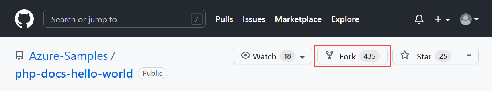

1. On the **Create a new fork** screen, confirm the **Owner** and **Repository name** fields. Select **Create fork**.

    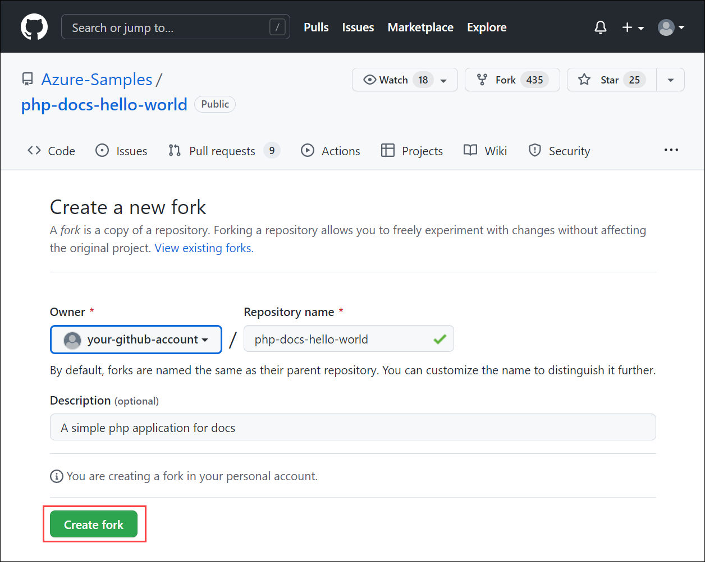

>[!NOTE]
> This should take you to the new fork. Your fork URL will look something like this: `https://github.com/YOUR_GITHUB_ACCOUNT_NAME/php-docs-hello-world`

---

## 2 - Deploy your application code to Azure

### [Azure CLI](#tab/cli)

Azure CLI has a command [`az webapp up`](/cli/azure/webapp#az-webapp-up) that will create the necessary resources and deploy your application in a single step.

In the terminal, deploy the code in your local folder using the  [`az webapp up`](/cli/azure/webapp#az-webapp-up) command:

```azurecli
az webapp up --runtime "PHP:8.0" --os-type=linux
```

- If the `az` command isn't recognized, be sure you have [Azure CLI](/cli/azure/install-azure-cli) installed.
- The `--runtime "PHP:8.0"` argument creates the web app with PHP version 8.0.
- The `--os-type=linux` argument creates the web app on App Service on Linux.
- You can optionally specify a name with the argument `--name <app-name>`. If you don't provide one, then a name will be automatically generated.
- You can optionally include the argument `--location <location-name>` where `<location_name>` is an available Azure region. You can retrieve a list of allowable regions for your Azure account by running the [`az account list-locations`](/cli/azure/appservice#az_appservice_list_locations) command.
- If you see the error, "Could not auto-detect the runtime stack of your app," make sure you're running the command in the code directory (See [Troubleshooting auto-detect issues with az webapp up](https://github.com/Azure/app-service-linux-docs/blob/master/AzWebAppUP/runtime_detection.md)).

The command may take a few minutes to complete. While running, it provides messages about creating the resource group, the App Service plan, and the app resource, configuring logging, and doing ZIP deployment. It then gives the message, "You can launch the app at http://&lt;app-name&gt;.azurewebsites.net", which is the app's URL on Azure.

<pre>
The webapp '&lt;app-name>' doesn't exist
Creating Resource group '&lt;group-name>' ...
Resource group creation complete
Creating AppServicePlan '&lt;app-service-plan-name>' ...
Creating webapp '&lt;app-name>' ...
Configuring default logging for the app, if not already enabled
Creating zip with contents of dir /home/msangapu/myPhpApp ...
Getting scm site credentials for zip deployment
Starting zip deployment. This operation can take a while to complete ...
Deployment endpoint responded with status code 202
You can launch the app at http://&lt;app-name>.azurewebsites.net
{
  "URL": "http://&lt;app-name>.azurewebsites.net",
  "appserviceplan": "&lt;app-service-plan-name>",
  "location": "centralus",
  "name": "&lt;app-name>",
  "os": "linux",
  "resourcegroup": "&lt;group-name>",
  "runtime_version": "php|8.0",
  "runtime_version_detected": "0.0",
  "sku": "FREE",
  "src_path": "//home//msangapu//myPhpApp"
}
</pre>

[!include [az webapp up command note](../../includes/app-service-web-az-webapp-up-note.md)]

Browse to the deployed application in your web browser at the URL `http://<app-name>.azurewebsites.net`.

### [Portal](#tab/portal)

1. Sign into the Azure portal.
   
1. At the top of the portal, type **app services** in the search box. Under **Services**, select **App Services**.

    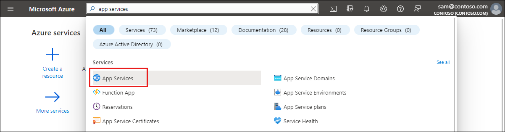

1. On the **App Services** page, select **Create**.

    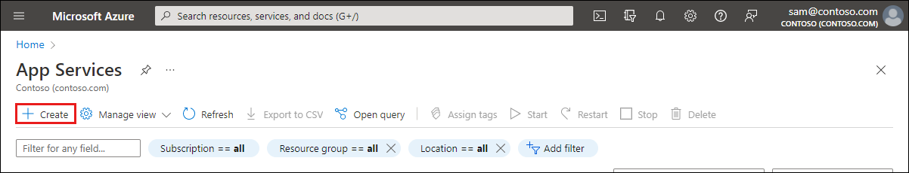

1. Fill out the **Create Web App** page as follows.
   - **Resource Group**: Create a resource group named *myResourceGroup*.
   - **Name**: Type a globally unique name for your web app. 
   - **Publish**: Select *Code*.
   - **Runtime stack**: Select *PHP 8.0*. 
   - **Operating system**: Select *Linux*.
   - **Region**: Select an Azure region close to you.
   - **App Service Plan**: Create an app service plan named *myAppServicePlan*.

1.  To change to the Free tier, next to **Sku and size**, select **Change size**. 
   
1.  In the Spec Picker, select **Dev/Test** tab, select **F1**, and select the **Apply** button at the bottom of the page.

    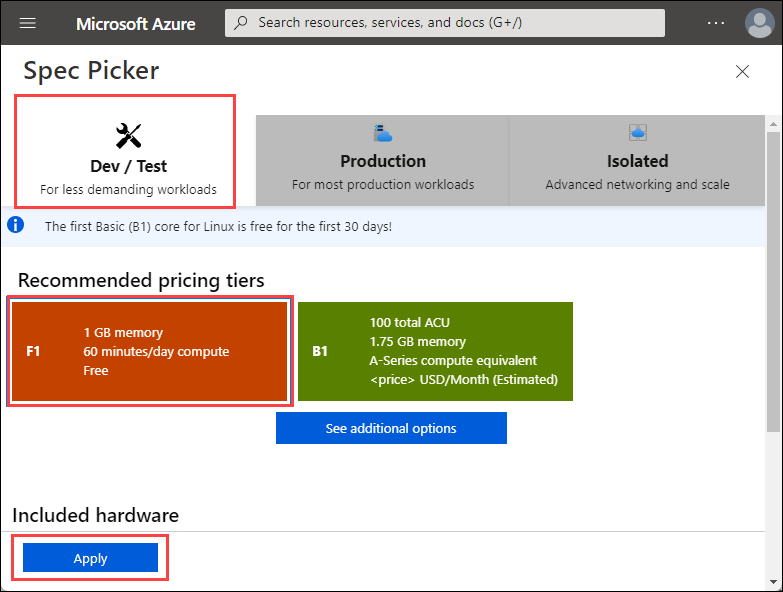   

1.  Select the **Review + create** button at the bottom of the page.

1.  After validation runs, select the **Create** button at the bottom of the page. This will create an Azure resource group, app service plan, and app service.

1.  After the Azure resources are created, select **Go to resource**.
  
1. From the left navigation, select **Deployment Center**.

    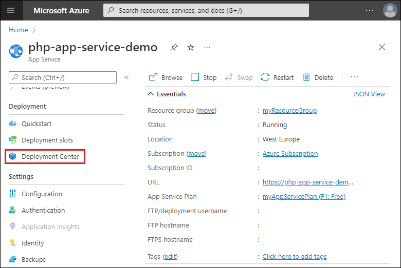  

1. Under **Settings**, select a **Source**. For this quickstart, select *GitHub*.

1. In the section under **GitHub**, select the following settings:
    - Organization: Select your organization.
    - Repository: Select *php-docs-hello-world*.
    - Branch: Select the default branch for your repository.

1. Select **Save**.

    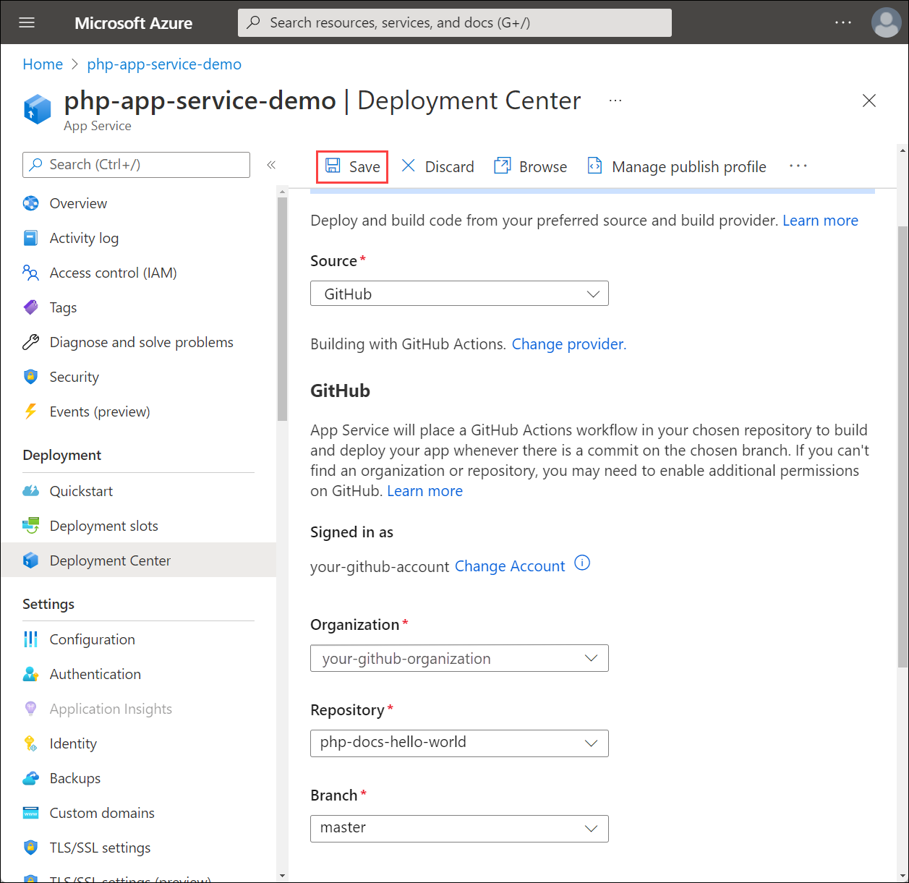  

    > [!TIP]
    > This quickstart uses GitHub. Additional continuous deployment sources include Bitbucket, Local Git, Azure Repos, and External Git. FTPS is also a supported deployment method.
    
1. Once the GitHub integration is saved, from the left navigation of your app, select **Overview** > **URL**.

    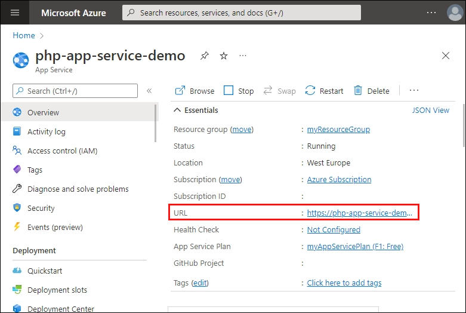  

---

The PHP sample code is running in an Azure App Service.


**Congratulations!** You've deployed your first PHP app to App Service using the Azure portal.

## 3 - Update and redeploy the app

### [Azure CLI](#tab/cli)

1. Using a local text editor, open the `index.php` file within the PHP app, and make a small change to the text within the string next to `echo`:

    ```php
    echo "Hello Azure!";
    ```

1. Save your changes, then redeploy the app using the [az webapp up](/cli/azure/webapp#az-webapp-up) command again with these arguments:

    ```azurecli
    az webapp up --runtime "PHP:8.0" --os-type=linux
    ```

1. Once deployment has completed, return to the browser window that opened during the **Browse to the app** step, and refresh the page.

    

### [Portal](#tab/portal)

1. Browse to your GitHub fork of php-docs-hello-world.

1. On your repo page, press `.` to start Visual Studio code within your browser.

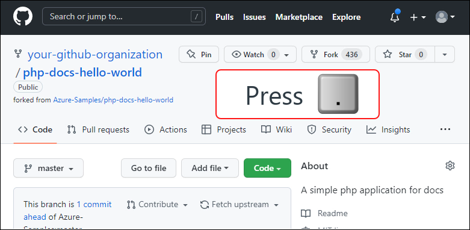

> [!NOTE]
> The URL will change from GitHub.com to GitHub.dev. This feature only works with repos that have files. This does not work on empty repos.

1. Edit **index.php** so that it shows "Hello Azure!" instead of "Hello World!"

    ```php
    <?php
        echo "Hello Azure!";
    ?>
    ```

1. From the **Source Control** menu, select the **Stage Changes** button to stage the change.

    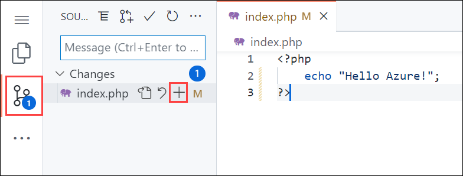

1. Enter a commit message such as `Hello Azure`. Then, select **Commit and Push**.
    
    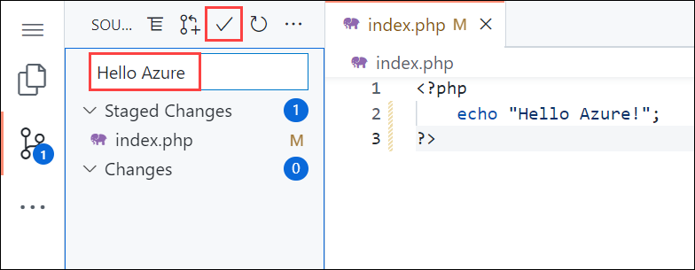

1. Once deployment has completed, return to the browser window that opened during the **Browse to the app** step, and refresh the page.

    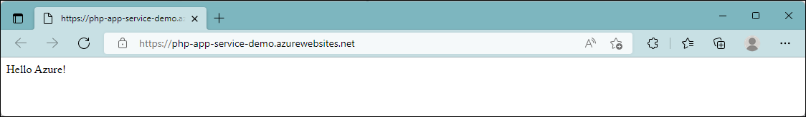

---

## 4 - Manage your new Azure app

1. Go to the Azure portal to manage the web app you created. Search for and select **App Services**.

    

1. Select the name of your Azure app.

    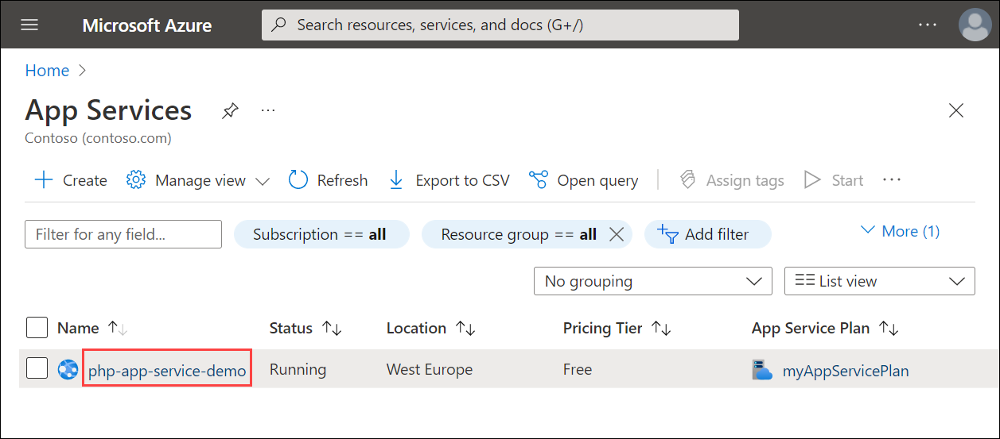

    Your web app's **Overview** page will be displayed. Here, you can perform basic management tasks like **Browse**, **Stop**, **Restart**, and **Delete**.

    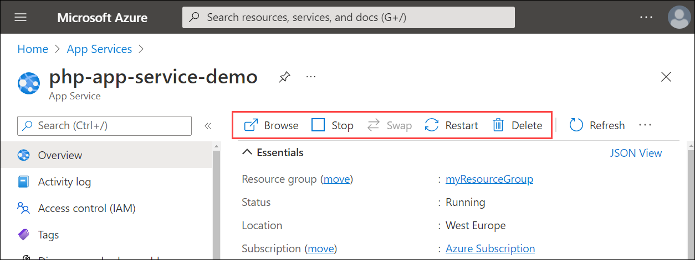

    The web app menu provides different options for configuring your app.

## 5 - Clean up resources

When you're finished with the sample app, you can remove all of the resources for the app from Azure. It will not incur extra charges and keep your Azure subscription uncluttered. Removing the resource group also removes all resources in the resource group and is the fastest way to remove all Azure resources for your app.

### [Azure CLI](#tab/cli)

Delete the resource group by using the [az group delete](/cli/azure/group#az-group-delete) command.

```azurecli-interactive
az group delete --name myResourceGroup
```

This command may take a minute to run.

### [Portal](#tab/portal)

1. From your App Service **Overview** page, select the resource group you created.

1. From the resource group page, select **Delete resource group**. Confirm the name of the resource group to finish deleting the resources.

---

::: zone-end

## Next steps

> [!div class="nextstepaction"]
> [PHP with MySQL](tutorial-php-mysql-app.md)

> [!div class="nextstepaction"]
> [Configure PHP app](configure-language-php.md)

> [!div class="nextstepaction"]
> [Secure with custom domain and certificate](tutorial-secure-domain-certificate.md)
