# Quickstart: Create a Python app using Azure App Service on Linux (Azure portal)

In this quickstart, you deploy a Python web app to [App Service on Linux](overview.md#app-service-on-linux), Azure's highly scalable, self-patching web hosting service. You use the Azure portal to deploy a sample with either the Flask or Django frameworks. The web app you configure uses a basic App Service tier that incurs a small cost in your Azure subscription.

## Configure accounts

- If you don't yet have an Azure account with an active subscription, [create an account for free](https://azure.microsoft.com/free/?ref=microsoft.com&utm_source=microsoft.com&utm_medium=docs&utm_campaign=visualstudio).

- If you don't have a GitHub account, visit [github.com](https://github.com) to create one. 

## Fork the sample GitHub repository

1. Open [github.com](https://github.com) and sign in.

1. Navigate to one of the following sample repositories:
    - [Flask Hello World](https://github.com/Azure-Samples/python-docs-hello-world)
    - [Django Hello World](https://github.com/Azure-Samples/python-docs-hello-django)

1. On the upper right of the GitHub page, select **Fork** to make a copy of the repository in your own GitHub account:

    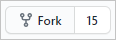

    Azure requires that you have access to the GitHub organization that contains the repository. By forking the sample to your own GitHub account, you automatically have the necessary access and can also make changes to the code.

## Provision the App Service web app

An App Service web app is the web server to which you deploy your code.

1. Open the Azure portal at [https://portal.azure.com](https://portal.azure.com) and sign in if needed.

1. In the search bar at the top of the Azure portal, enter "App Service", then select **App Services**.

    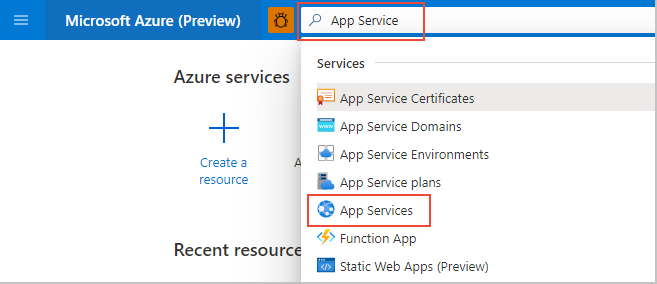

1. On the **App Services** page, select "**+Add**:

    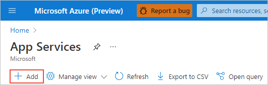

1. On the **Create Web App** page, do the following actions:
    
    | Field | Action |
    | --- | --- |
    | Subscription | Select the Azure subscription you want to use. |
    | Resource Group | Select **Create New** below the drop-down. In the popup, enter "AppService-PythonQuickstart" and select "**OK**. |
    | Name | Enter a name that's unique across all of Azure, typically using a combination of your personal or company names, such as *contoso-testapp-123*. |
    | Publish | Select **Code**. |
    | Runtime stack | Select **Python 3.8**. |
    | Operating System | Select **Linux** (Python is supported only on Linux). |
    | Region | Select a region near you. |
    | Linux Plan | Select an exiting App Service Plan or use **Create new** to create a new one. We recommend using the **Basic B1** plan. |

    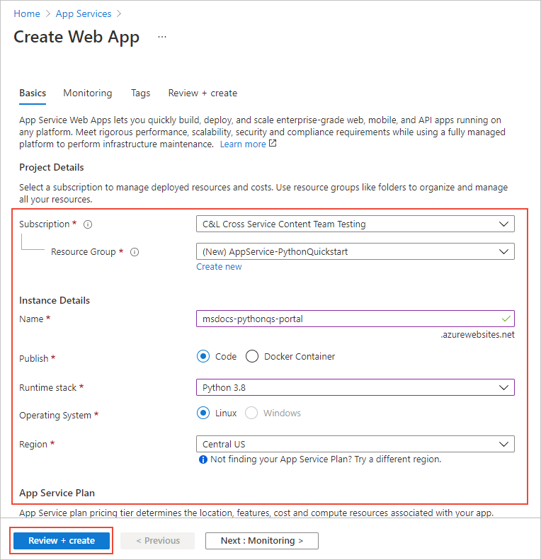

1. At the bottom of the page, select **Review + Create**, review the details, then select **Create**.

1. When provisioning is complete, select **Go to resource** to navigate to the new App Service page. Your web app at this point contains only a default page, so the next step deploys sample code.

Having issues? [Let us know](https://aka.ms/FlaskPortalQuickstartHelp).

## Deploy the sample code

1. On the web app page on the Azure portal, select **Deployment Center**:
    
    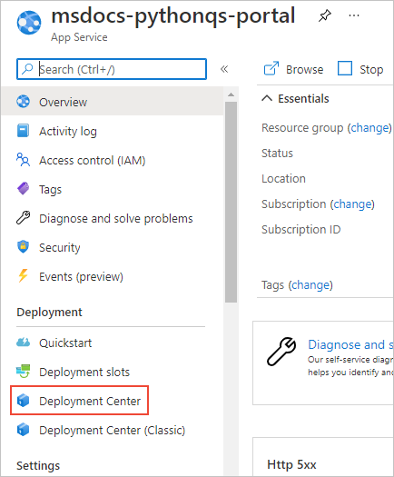

1. On the **Deployment Center** page, select the **Settings** tab if it's not already open:

    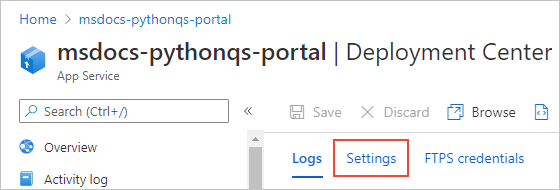

1. Under **Source**, select **GitHub**, then on the **GitHub** form that appears, do the following actions:

    | Field | Action |
    | --- | --- |
    | Signed in as | If you're not signed into GitHub already, sign in now or select **Change Account* if needed. |
    | Organization | Select your GitHub organization, if needed. |
    | Repository | Select the name of the sample repository you forked earlier, either **python-docs-hello-world** (Flask) or **python-docs-hello-django** (Django). |
    | Branch | Select **main**. |

    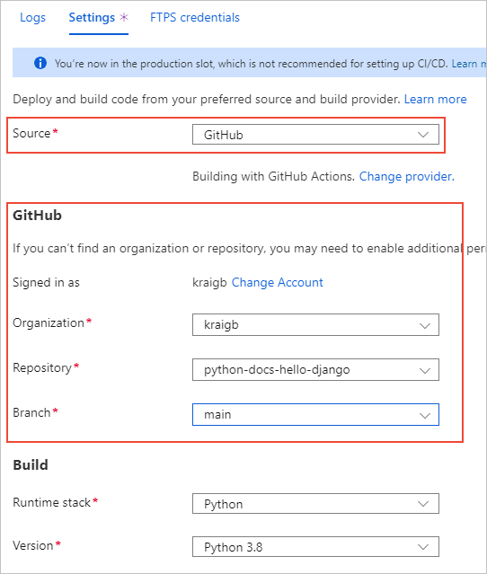

1. At the top of the page, select **Save** to apply the settings.:

    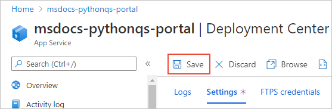

1. Select the **Logs** tab to view the status of the deployment. It takes a few minutes to build and deploy the sample and additional logs appear during the process. Upon completion, the logs should reflect a Status of **Success (Active)**:

    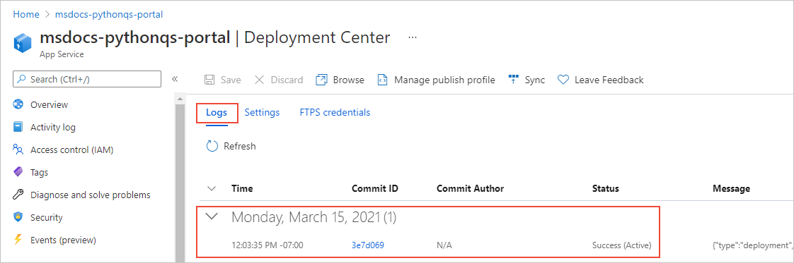

Having issues? [Let us know](https://aka.ms/FlaskPortalQuickstartHelp).

## Browse to the app

1. Once deployment is complete, select **Overview** on the left-hand menu to return to the main page for the web app.

1. Select the **URL** that contains address of the web app:

    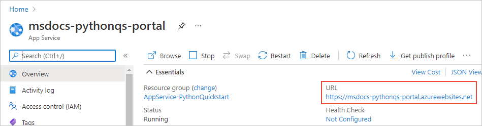

1. Verify that the output of the app is "Hello, World!":

    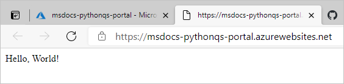

Having issues? Refer first to the [Troubleshooting guide](configure-language-python.md#troubleshooting), otherwise, [let us know](https://aka.ms/FlaskPortalQuickstartHelp).

## Make a change and redeploy

Because you connected App Service to your repository, changes that you commit to your source repository are automatically deployed to the web app.

1. You can make changes directly in your forked repository on GitHub, or you can clone the repository locally, make and commit changes, and then push those changes to GitHub. Either method results in a change to the repository that's connected to App Service.

1. **In your forked repository**, change the app's message from "Hello, World!" to "Hello, Azure!" as follows:
    - Flask (python-docs-hello-world sample): Change the text string on line 6 of the *application.py* file.
    - Django (python-docs-hello-django sample): Change the text string on line 5 of the *views.py* file within the *hello* folder.

1. Commit the change to the repository.

    If you're using a local clone, also push those changes to GitHub.

1. On the Azure portal for the web app, return to the **Deployment Center**, select the **Logs** tab, and note the new deployment activity that should be underway.

1. When the deployment is complete, return to the web app's **Overview** page, open the web app's URL again, and observe the changes in the app:

    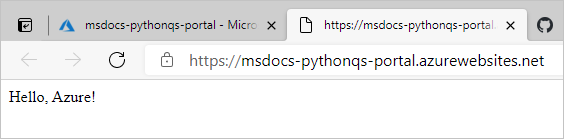

Having issues? Refer first to the [Troubleshooting guide](configure-language-python.md#troubleshooting), otherwise, [let us know](https://aka.ms/FlaskCLIQuickstartHelp).

## Clean up resources

In the preceding steps, you created Azure resources in a resource group named "AppService-PythonQuickstart", which is shown on the web app's *Overview** page. If you keep the web app running, you will incur some ongoing costs (see [App Service pricing](https://azure.microsoft.com/pricing/details/app-service/linux/)).

If you don't expect to need these resources in the future, select the name of the resource group on the web app **Overview** page to navigate to the resource groups overview. These select **Delete resource group** and follow the prompts.

Having issues? [Let us know](https://aka.ms/FlaskCLIQuickstartHelp).

## Next steps

> [!div class="nextstepaction"]
> [Tutorial: Python (Django) web app with PostgreSQL](./tutorial-python-postgresql-app.md)

> [!div class="nextstepaction"]
> [Configure Python app](configure-language-python.md)

> [!div class="nextstepaction"]
> [Add user sign-in to a Python web app](../active-directory/develop/quickstart-v2-python-webapp.md)

> [!div class="nextstepaction"]
> [Tutorial: Run Python app in custom container](tutorial-custom-container.md)

> [!div class="nextstepaction"]
> [Secure with custom domain and certificate](tutorial-secure-domain-certificate.md)
