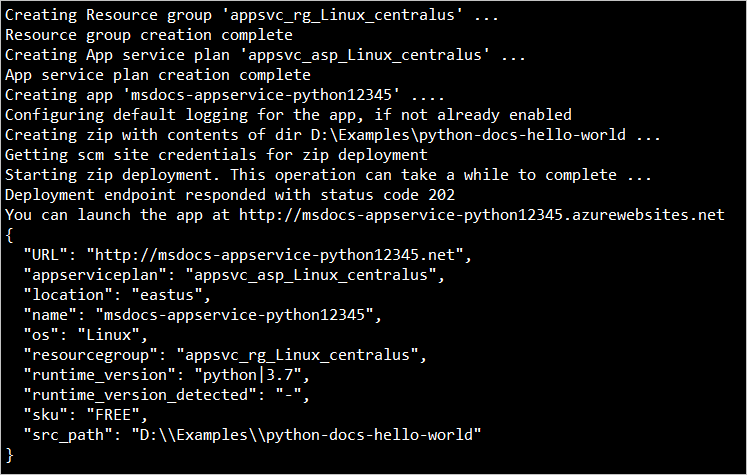
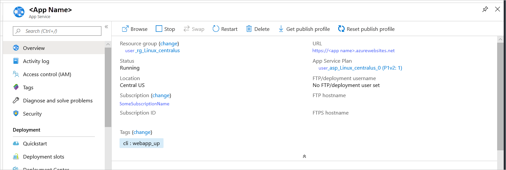

# Quickstart: Create a Python app using Azure App Service on Linux

In this quickstart, you deploy a Python web app to [App Service on Linux](overview.md#app-service-on-linux), Azure's highly scalable, self-patching web hosting service. You use the local [Azure command-line interface (CLI)](/cli/azure/install-azure-cli) on a Mac, Linux, or Windows computer to deploy a sample with either the Flask or Django frameworks. The web app you configure uses a basic App Service tier that incurs a small cost in your Azure subscription.

## Set up your initial environment

1. Have an Azure account with an active subscription. [Create an account for free](https://azure.microsoft.com/free/?ref=microsoft.com&utm_source=microsoft.com&utm_medium=docs&utm_campaign=visualstudio).
1. Install <a href="https://www.python.org/downloads/" target="_blank">Python 3.6 or higher</a>.
1. Install the <a href="/cli/azure/install-azure-cli" target="_blank">Azure CLI</a> 2.0.80 or higher, with which you run commands in any shell to provision and configure Azure resources.

Open a terminal window and check your Python version is 3.6 or higher:

# [Bash](#tab/bash)

```bash
python3 --version
```

# [PowerShell](#tab/powershell)

```cmd
py -3 --version
```

# [Cmd](#tab/cmd)

```cmd
py -3 --version
```

---

Check that your Azure CLI version is 2.0.80 or higher:

```azurecli
az --version
```

Then sign in to Azure through the CLI:

```azurecli
az login
```

This command opens a browser to gather your credentials. When the command finishes, it shows JSON output containing information about your subscriptions.

Once signed in, you can run Azure commands with the Azure CLI to work with resources in your subscription.

Having issues? [Let us know](https://aka.ms/FlaskCLIQuickstartHelp).

## Clone the sample

Clone the sample repository using the following command and navigate into the sample folder. ([Install git](https://git-scm.com/downloads) if you don't have git already.)

::: zone pivot="python-framework-flask"
```terminal
git clone https://github.com/Azure-Samples/python-docs-hello-world
```
::: zone-end

::: zone pivot="python-framework-django"
```terminal
git clone https://github.com/Azure-Samples/python-docs-hello-django
```
::: zone-end

The sample contains framework-specific code that Azure App Service recognizes when starting the app. For more information, see [Container startup process](configure-language-python.md#container-startup-process).

Having issues? [Let us know](https://aka.ms/FlaskCLIQuickstartHelp).

## Run the sample

::: zone pivot="python-framework-flask"
1. Navigate into in the *python-docs-hello-world* folder:

    ```terminal
    cd python-docs-hello-world
    ```

1. Create a virtual environment and install dependencies:

    [!include [virtual environment setup](../../includes/app-service-quickstart-python-venv.md)]

    If you encounter "[Errno 2] No such file or directory: 'requirements.txt'.", make sure you're in the *python-docs-hello-world* folder.

1. Run the development server.

    ```terminal  
    flask run
    ```
    
    By default, the server assumes that the app's entry module is in *app.py*, as used in the sample.

    If you use a different module name, set the `FLASK_APP` environment variable to that name.

    If you encounter the error, "Could not locate a Flask application. You did not provide the 'FLASK_APP' environment variable, and a 'wsgi.py' or 'app.py' module was not found in the current directory.", make sure you're in the `python-docs-hello-world` folder that contains the sample.

1. Open a web browser and go to the sample app at `http://localhost:5000/`. The app displays the message **Hello, World!**.

    
    
1. In your terminal window, press **Ctrl**+**C** to exit the development server.
::: zone-end

::: zone pivot="python-framework-django"
1. Navigate into the *python-docs-hello-django* folder:

    ```terminal
    cd python-docs-hello-django
    ```

1. Create a virtual environment and install dependencies:

    [!include [virtual environment setup](../../includes/app-service-quickstart-python-venv.md)]

    If you encounter "[Errno 2] No such file or directory: 'requirements.txt'.", make sure you're in the *python-docs-hello-django* folder.
    
1. Run the development server.

    ```terminal
    python manage.py runserver
    ```

1. Open a web browser and go to the sample app at `http://localhost:8000/`. The app displays the message **Hello, World!**.

    
    
1. In your terminal window, press **Ctrl**+**C** to exit the development server.
::: zone-end

Having issues? [Let us know](https://aka.ms/FlaskCLIQuickstartHelp).

## Deploy the sample

Deploy the code in your local folder (*python-docs-hello-world*) using the `az webapp up` command:

```azurecli
az webapp up --sku B1 --name <app-name>
```

- If the `az` command isn't recognized, be sure you have the Azure CLI installed as described in [Set up your initial environment](#set-up-your-initial-environment).
- If the `webapp` command isn't recognized, because that your Azure CLI version is 2.0.80 or higher. If not, [install the latest version](/cli/azure/install-azure-cli).
- Replace `<app_name>` with a name that's unique across all of Azure (*valid characters are `a-z`, `0-9`, and `-`*). A good pattern is to use a combination of your company name and an app identifier.
- The `--sku B1` argument creates the web app on the Basic pricing tier, which incurs a small hourly cost. Omit this argument to use a faster premium tier.
- You can optionally include the argument `--location <location-name>` where `<location_name>` is an available Azure region. You can retrieve a list of allowable regions for your Azure account by running the [`az account list-locations`](/cli/azure/appservice#az_appservice_list_locations) command.
- If you see the error, "Could not auto-detect the runtime stack of your app," make sure you're running the command in the *python-docs-hello-world* folder (Flask) or the *python-docs-hello-django* folder (Django) that contains the *requirements.txt* file. (See [Troubleshooting auto-detect issues with az webapp up](https://github.com/Azure/app-service-linux-docs/blob/master/AzWebAppUP/runtime_detection.md) (GitHub).)

The command may take a few minutes to complete. While running, it provides messages about creating the resource group, the App Service plan and hosting app, configuring logging, then performing ZIP deployment. It then gives the message, "You can launch the app at http://&lt;app-name&gt;.azurewebsites.net", which is the app's URL on Azure.



Having issues? Refer first to the [Troubleshooting guide](configure-language-python.md#troubleshooting), otherwise, [let us know](https://aka.ms/FlaskCLIQuickstartHelp).

[!include [az webapp up command note](../../includes/app-service-web-az-webapp-up-note.md)]

## Browse to the app

Browse to the deployed application in your web browser at the URL `http://<app-name>.azurewebsites.net`. It can take a minute or two for the the app to start, so if you see a default app page, wait a minute and refresh the browser.

The Python sample code is running a Linux container in App Service using a built-in image.


**Congratulations!** You've deployed your Python app to App Service.

Having issues? Refer first to the [Troubleshooting guide](configure-language-python.md#troubleshooting), otherwise, [let us know](https://aka.ms/FlaskCLIQuickstartHelp).

## Redeploy updates

In this section, you make a small code change and then redeploy the code to Azure. The code change includes a `print` statement to generate logging output that you work with in the next section.

::: zone pivot="python-framework-flask"
Open *app.py* in an editor and update the `hello` function to match the following code. 

```python
def hello():
    print("Handling request to home page.")
    return "Hello, Azure!"
```
::: zone-end
::: zone pivot="python-framework-django"
Open *hello/views.py* in an editor and update the `hello` function to match the following code.

```python
def hello(request):
    print("Handling request to home page.")
    return HttpResponse("Hello, Azure!")
```
::: zone-end
    
Save your changes, then redeploy the app using the `az webapp up` command again:

```azurecli
az webapp up
```

This command uses values that are cached locally in the *.azure/config* file, including the app name, resource group, and App Service plan.

Once deployment is complete, switch back to the browser window open to `http://<app-name>.azurewebsites.net`. Refresh the page, which should display the modified message:


Having issues? Refer first to the [Troubleshooting guide](configure-language-python.md#troubleshooting), otherwise, [let us know](https://aka.ms/FlaskCLIQuickstartHelp).

> [!TIP]
> Visual Studio Code provides powerful extensions for Python and Azure App Service, which simplify the process of deploying Python web apps to App Service. For more information, see [Deploy Python apps to App Service from Visual Studio Code](/azure/python/tutorial-deploy-app-service-on-linux-01).

## Stream logs

You can access the console logs generated from inside the app and the container in which it runs. Logs include any output generated using `print` statements.

To stream logs, run the [az webapp log tail](/cli/azure/webapp/log#az_webapp_log_tail) command:

```azurecli
az webapp log tail
```

You can also include the `--logs` parameter with then `az webapp up` command to automatically open the log stream on deployment.

Refresh the app in the browser to generate console logs, which include messages describing HTTP requests to the app. If no output appears immediately, try again in 30 seconds.

You can also inspect the log files from the browser at `https://<app-name>.scm.azurewebsites.net/api/logs/docker`.

To stop log streaming at any time, press **Ctrl**+**C** in the terminal.

Having issues? Refer first to the [Troubleshooting guide](configure-language-python.md#troubleshooting), otherwise, [let us know](https://aka.ms/FlaskCLIQuickstartHelp).

## Manage the Azure app

Go to the <a href="https://portal.azure.com" target="_blank">Azure portal</a> to manage the app you created. Search for and select **App Services**.


Select the name of your Azure app.


Selecting the app opens its **Overview** page, where you can perform basic management tasks like browse, stop, start, restart, and delete.



The App Service menu provides different pages for configuring your app.

Having issues? Refer first to the [Troubleshooting guide](configure-language-python.md#troubleshooting), otherwise, [let us know](https://aka.ms/FlaskCLIQuickstartHelp).

## Clean up resources

In the preceding steps, you created Azure resources in a resource group. The resource group has a name like "appsvc_rg_Linux_CentralUS" depending on your location. If you keep the web app running, you will incur some ongoing costs (see [App Service pricing](https://azure.microsoft.com/pricing/details/app-service/linux/)).

If you don't expect to need these resources in the future, delete the resource group by running the following command:

```azurecli
az group delete --no-wait
```

The command uses the resource group name cached in the *.azure/config* file.

The `--no-wait` argument allows the command to return before the operation is complete.

Having issues? [Let us know](https://aka.ms/FlaskCLIQuickstartHelp).

## Next steps

> [!div class="nextstepaction"]
> [Tutorial: Python (Django) web app with PostgreSQL](tutorial-python-postgresql-app.md)

> [!div class="nextstepaction"]
> [Configure Python app](configure-language-python.md)

> [!div class="nextstepaction"]
> [Add user sign-in to a Python web app](../active-directory/develop/quickstart-v2-python-webapp.md)

> [!div class="nextstepaction"]
> [Tutorial: Run Python app in custom container](tutorial-custom-container.md)
