# Create a Ruby on Rails App in App Service

[Azure App Service on Linux](overview.md#app-service-on-linux) provides a highly scalable, self-patching web hosting service using the Linux operating system.

> [!NOTE]
> The Ruby development stack only supports Ruby on Rails at this time. If you want to use a different platform, such as Sinatra, or if you want to use an unsupported Ruby version, you need to [run it in a custom container](./quickstart-custom-container.md?pivots=platform-linux%3fpivots%3dplatform-linux).

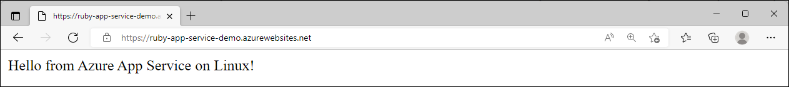

[!INCLUDE [quickstarts-free-trial-note](../../includes/quickstarts-free-trial-note.md)]

### [Azure CLI](#tab/cli)

If you are running the sample code locally, you will need:

* [Install Ruby 2.7 or higher](https://www.ruby-lang.org/en/documentation/installation/#rubyinstaller)
* [Install Git](https://git-scm.com/)

You will not need to install these if you are using the Cloud Shell.

[!INCLUDE [Try Cloud Shell](../../includes/cloud-shell-try-it.md)]
  
### [Portal](#tab/portal)

To complete this quickstart you need:

* An Azure account with an active subscription. [Create an account for free](https://azure.microsoft.com/free/?utm_source=campaign&utm_campaign=vscode-tutorial-app-service-extension&mktingSource=vscode-tutorial-app-service-extension).
* A GitHub account to fork a repository.

---

## 1 - Get the sample repository

### [Azure CLI](#tab/cli)

This quickstart tutorial shows how to deploy a Ruby on Rails app to App Service on Linux using the [Cloud Shell](../cloud-shell/overview.md).

1. In a terminal window, clone the sample application to your local machine, and navigate to the directory containing the sample code.

    ```bash
    git clone https://github.com/Azure-Samples/ruby-docs-hello-world
    cd ruby-docs-hello-world
    ```

1. Make sure the default branch is `main`.

    ```bash
    git branch -m main
    ```

    > [!TIP]
    > The branch name change isn't required by App Service. However, since many repositories are changing their default branch to `main`, this tutorial also shows you how to deploy a repository from `main`. For more information, see [Change deployment branch](deploy-local-git.md#change-deployment-branch).

### Run the application locally

If you want to run the application locally to see how it works, clone the repository locally and follow these steps.

> [!NOTE]
> These steps cannot be run in Azure Cloud Shell, due to version conflicts with Ruby.

1. Install the required gems. There's a `Gemfile` included in the sample, so just run the following command:

    ```bash
    bundle install
    ```

1. Once the gems are installed, start the app:

    ```bash
    bundle exec rails server
    ```

1. Using your web browser, navigate to `http://localhost:3000` to test the app locally.

    

### [Portal](#tab/portal)

This quickstart shows how to deploy a Ruby on Rails app to App Service on Linux within your browser, without having to install the development environment tools on your machine.

1. In your browser, navigate to the repository containing [the sample code](https://github.com/Azure-Samples/ruby-docs-hello-world).

1. In the upper right corner, select **Fork**.

    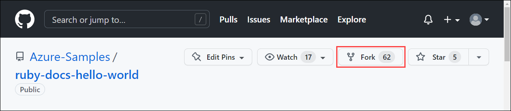

1. On the **Create a new fork** screen, confirm the **Owner** and **Repository name** fields. Select **Create fork**.

    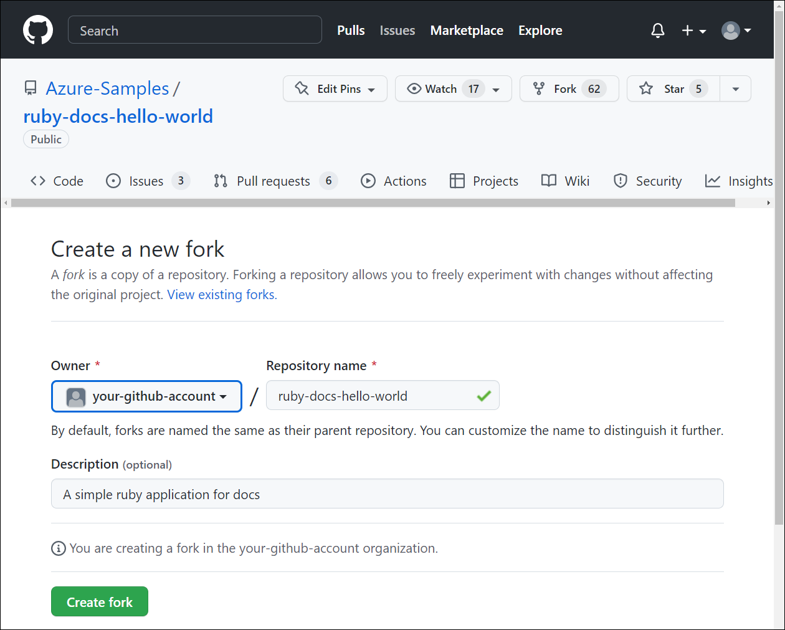

    >[!NOTE]
    > This should take you to the new fork. Your fork URL will look something like this: `https://github.com/YOUR_GITHUB_ACCOUNT_NAME/ruby-docs-hello-world`

---

## 2 - Deploy your application code to Azure

### [Azure CLI](#tab/cli)

[!INCLUDE [Configure deployment user](../../includes/configure-deployment-user.md)]

[!INCLUDE [Create resource group](../../includes/app-service-web-create-resource-group-linux.md)]

[!INCLUDE [Create app service plan](../../includes/app-service-web-create-app-service-plan-linux.md)]


1. Create a [web app](overview.md#app-service-on-linux) in the `myAppServicePlan` App Service plan.

    In the Cloud Shell, you can use the [`az webapp create`](/cli/azure/webapp) command. In the following example, replace `<app-name>` with a globally unique app name (valid characters are `a-z`, `0-9`, and `-`). The runtime is set to `RUBY|2.7`. To see all supported runtimes, run [`az webapp list-runtimes --os linux`](/cli/azure/webapp).

    ```azurecli-interactive
    az webapp create --resource-group myResourceGroup --plan myAppServicePlan --name <app-name> --runtime 'RUBY|2.7' --deployment-local-git
    ```

    When the web app has been created, the Azure CLI shows output similar to the following example:

    <pre>
    Local git is configured with url of 'https://&lt;username&gt;@&lt;app-name&gt;.scm.azurewebsites.net/&lt;app-name&gt;.git'
    {
      "availabilityState": "Normal",
      "clientAffinityEnabled": true,
      "clientCertEnabled": false,
      "cloningInfo": null,
      "containerSize": 0,
      "dailyMemoryTimeQuota": 0,
      "defaultHostName": "&lt;app-name&gt;.azurewebsites.net",
      "deploymentLocalGitUrl": "https://&lt;username&gt;@&lt;app-name&gt;.scm.azurewebsites.net/&lt;app-name&gt;.git",
      "enabled": true,
      &lt; JSON data removed for brevity. &gt;
    }
    </pre>

    You've created an empty new web app, with Git deployment enabled.

    > [!NOTE]
    > The URL of the Git remote is shown in the `deploymentLocalGitUrl` property, with the format `https://<username>@<app-name>.scm.azurewebsites.net/<app-name>.git`. Save this URL as you need it later.
    >

1. Since you're deploying the `main` branch, you need to set the default deployment branch for your App Service app to `main` (see [Change deployment branch](deploy-local-git.md#change-deployment-branch)). In the Cloud Shell, set the `DEPLOYMENT_BRANCH` app setting with the [`az webapp config appsettings set`](/cli/azure/webapp/config/appsettings#az-webapp-config-appsettings-set) command. 

    ```azurecli-interactive
    az webapp config appsettings set --name <app-name> --resource-group myResourceGroup --settings DEPLOYMENT_BRANCH='main'
    ```

1. Back in the local terminal window, add an Azure remote to your local Git repository. Replace *\<deploymentLocalGitUrl-from-create-step>* with the `deploymentLocalGitUrl` value from app creation.

    ```bash
    git remote add azure <deploymentLocalGitUrl-from-create-step>
    ```

1. Push to the Azure remote to deploy your app with the following command. When Git Credential Manager prompts you for credentials, make sure you enter the credentials you created in **Configure a deployment user**, not the credentials you use to sign in to the Azure portal.

    ```bash
    git push azure main
    ```

    This command may take a few minutes to run. While running, it displays information similar to the following example:

   <pre>
   remote: Using turbolinks 5.2.0
   remote: Using uglifier 4.1.20
   remote: Using web-console 3.7.0
   remote: Bundle complete! 18 Gemfile dependencies, 78 gems now installed.
   remote: Bundled gems are installed into `/tmp/bundle`
   remote: Zipping up bundle contents
   remote: .......
   remote: ~/site/repository
   remote: Finished successfully.
   remote: Running post deployment command(s)...
   remote: Deployment successful.
   remote: App container will begin restart within 10 seconds.
   To https://&lt;app-name&gt;.scm.azurewebsites.net/&lt;app-name&gt;.git
      a6e73a2..ae34be9  main -> main
   </pre>

1. Once the deployment has completed, wait about 10 seconds for the web app to restart, and then navigate to the web app and verify the results.

```bash
http://<app-name>.azurewebsites.net
```

> [!NOTE]
> While the app is restarting, you may observe the HTTP status code `Error 503 Server unavailable` in the browser, or the `Hey, Ruby developers!` default page. It may take a few minutes for the app to fully restart.
>

### [Portal](#tab/portal)

1. Sign into the Azure portal.

1. At the top of the portal, type **app services** in the search box. Under **Services**, select **App Services**.

    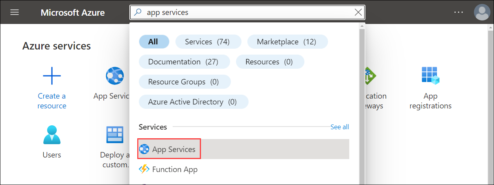

1. In the **App Services** page, select **Create**.

    

1. Fill out the **Create Web App** page as follows.
    - **Resource Group**: Create a resource group named *myResourceGroup*.
    - **Name**: Type a globally unique name for your web app. 
    - **Publish**: Select *Code*.
    - **Runtime stack**: Select *Ruby 2.7*. 
    - **Operating system**: Select *Linux*.
    - **Region**: Select an Azure region close to you.
    - **App Service Plan**: Create an app service plan named *myAppServicePlan*.

1.  To change to the Free tier, next to **Sku and size**, select **Change size**. 
   
1.  In the Spec Picker, select **Dev/Test** tab, select **F1**, and select the **Apply** button at the bottom of the page.

    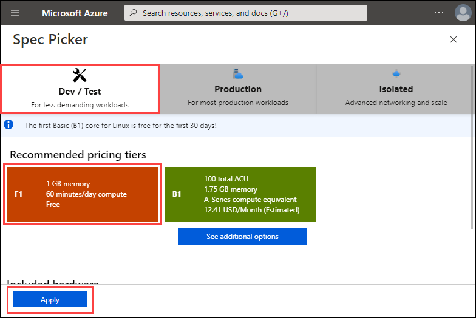   

1. Select the **Review + create** button at the bottom of the page.

1. After validation runs, select the **Create** button at the bottom of the page. This will create an Azure resource group, app service plan, and app service.

1. After the Azure resources are created, select **Go to resource**.

1. From the left navigation, select **Deployment Center**.

    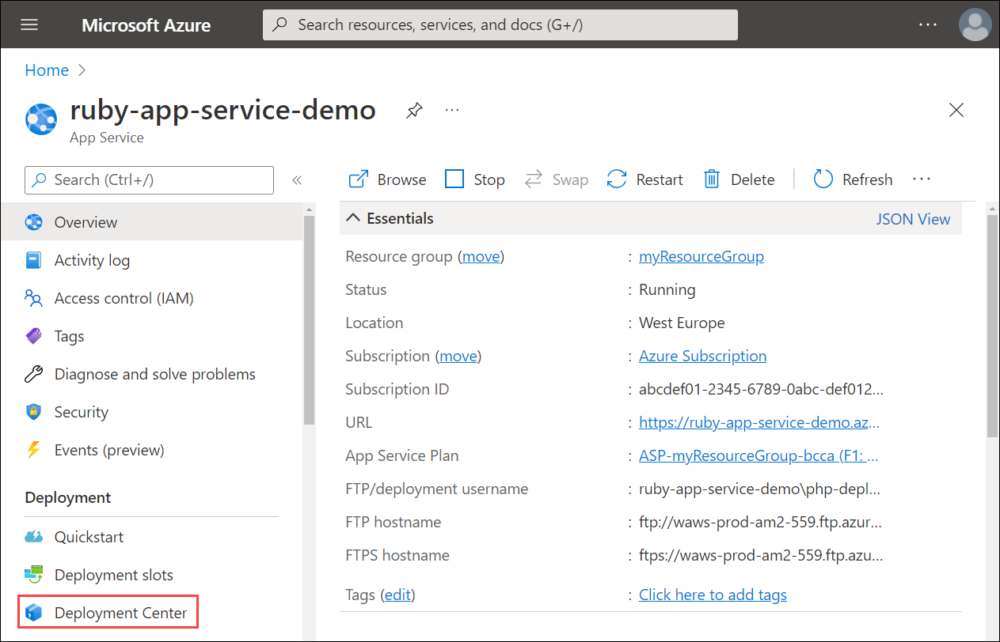  

1. Under **Settings**, select a **Source**. For this quickstart, select *GitHub*.

1. In the section under **GitHub**, select the following settings:
    - Organization: Select your organization.
    - Repository: Select *ruby-docs-hello-world*.
    - Branch: Select the default branch for your repository.

1. Select **Save**.

    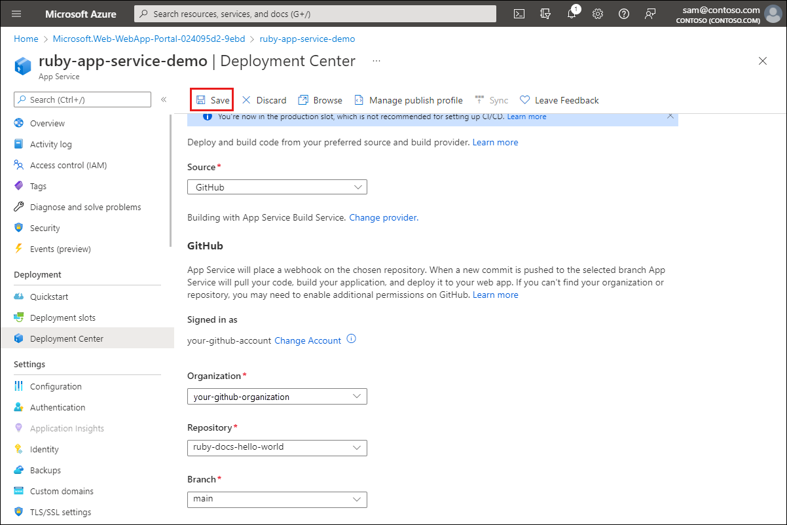  

    > [!TIP]
    > This quickstart uses GitHub. Additional continuous deployment sources include Bitbucket, Local Git, Azure Repos, and External Git. FTPS is also a supported deployment method.

1. Once the GitHub integration is saved, from the left navigation of your app, select **Overview** > **URL**. 

1. On the Overview, select the link under **URL**.

    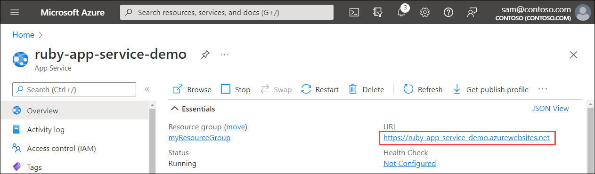  

---

The Ruby sample code is running in an Azure App Service Linux web app.


**Congratulations!** You've deployed your first Ruby app to App Service using the Azure portal.

## 3 - Update and redeploy the app

### [Azure CLI](#tab/cli)

1. From Azure Cloud Shell, launch a text editor and edit the file `app/controllers/application_controller.rb`. Edit the *ApplicationController* class so that it shows "Hello world from Azure App Service on Linux!" instead of "Hello from Azure App Service on Linux!".

    ```ruby
    class ApplicationController < ActionController::Base
        def hello
            render html: "Hello world from Azure App Service on Linux!"
        end
    end
    ```

1. Save and close the file.

1. Commit the change to Git with the following commands:

    ```bash
    git add .
    git commit -m "Hello world"
    git push azure main
    ```

> [!NOTE]
> * Make sure your `git push` statement includes `azure main` so that you are pushing directly to the Azure Git deployment URL.
> * You may also need to set your `user.name` and `user.email` Git config values when you commit the changes. You can do that with `git config user.name "YOUR NAME"` and `git config user.email "YOUR EMAIL"`.


### [Portal](#tab/portal)

1. Browse to your GitHub fork of ruby-docs-hello-world.

1. On your repo page, press `.` to start Visual Studio code within your browser.

    > [!NOTE]
    > The URL will change from GitHub.com to GitHub.dev. This feature only works with repos that have files. This does not work on empty repos.

    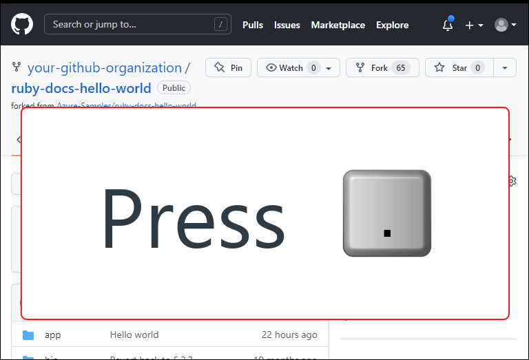

1. Navigate to **app/controllers/application_controller.rb**.

    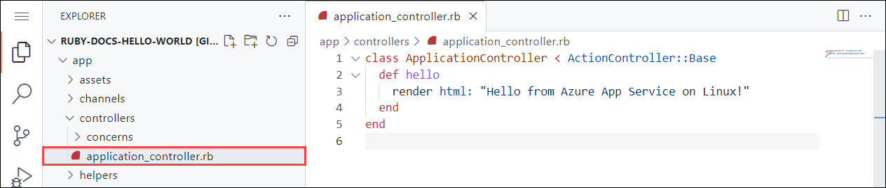

1. Edit the *ApplicationController* class so that it shows "Hello world from Azure App Service on Linux!" instead of "Hello from Azure App Service on Linux!".

    ```ruby
    class ApplicationController < ActionController::Base
        def hello
            render html: "Hello world from Azure App Service on Linux!"
        end
    end
    ```

1. From the **Source Control** menu, select the **Stage Changes** button to stage the change.

    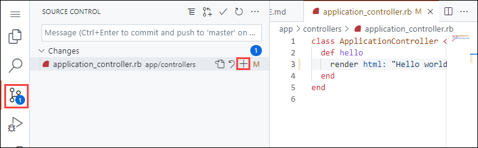

1. Enter a commit message such as `Hello world`. Then, select Commit and Push.

    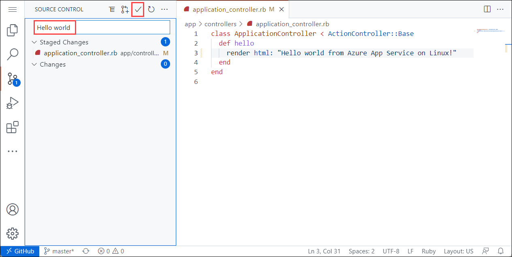

1. Once deployment has completed, return to the browser window that opened during the **Browse to the app** step, and refresh the page.

    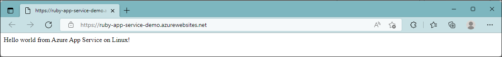

---

## 4 - Manage your new Azure app

1. Go to the Azure portal to manage the web app you created. Search for and select **App Services**.

        

1. Select the name of your Azure app.

    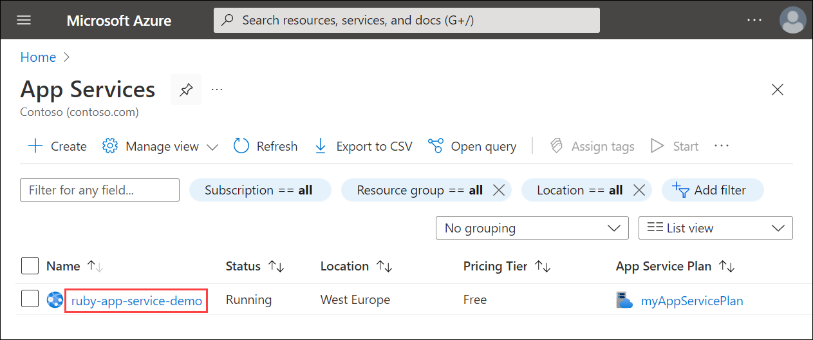

Your web app's **Overview** page will be displayed. Here, you can perform basic management tasks like **Browse**, **Stop**, **Restart**, and **Delete**.

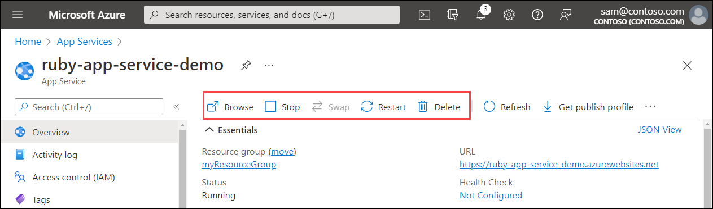


## 5 - Clean up resources

### [Azure CLI](#tab/cli)

[!INCLUDE [Clean-up section](../../includes/cli-script-clean-up.md)]

### [Portal](#tab/portal)

1. From your App Service **Overview** page, select the resource group you created.

1. From the resource group page, select **Delete resource group**. Confirm the name of the resource group to finish deleting the resources.

---

## Next steps

> [!div class="nextstepaction"]
> [Tutorial: Ruby on Rails with Postgres](tutorial-ruby-postgres-app.md)

> [!div class="nextstepaction"]
> [Configure Ruby app](configure-language-ruby.md)

> [!div class="nextstepaction"]
> [Secure with custom domain and certificate](tutorial-secure-domain-certificate.md)
