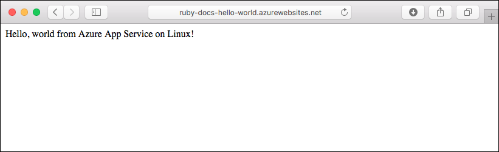
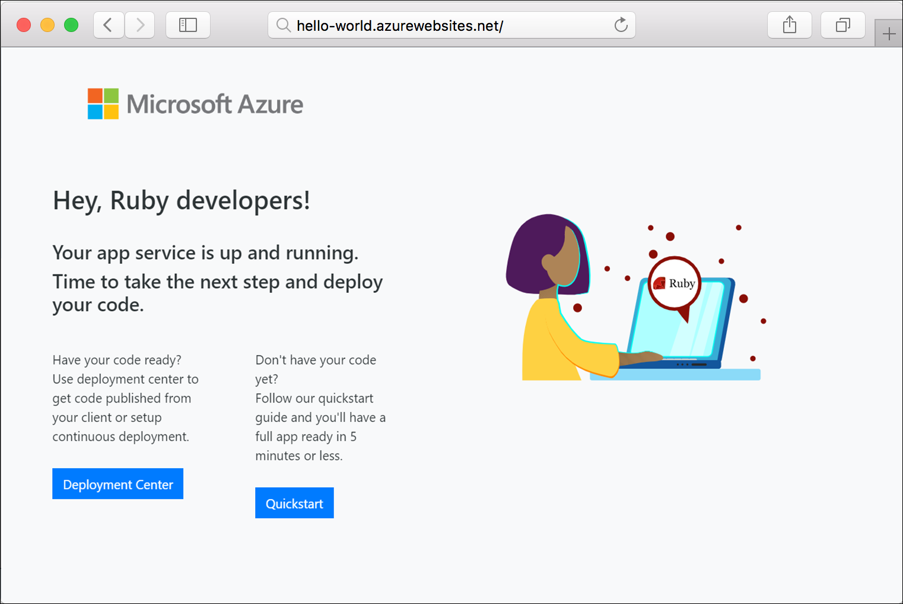

# Create a Ruby on Rails App in App Service

[Azure App Service on Linux](overview.md#app-service-on-linux) provides a highly scalable, self-patching web hosting service using the Linux operating system. This quickstart tutorial shows how to deploy a Ruby on Rails app to App Service on Linux using the [Cloud Shell](../cloud-shell/overview.md).

> [!NOTE]
> The Ruby development stack only supports Ruby on Rails at this time. If you want to use a different platform, such as Sinatra, or if you want to use an unsupported Ruby version, you need to [run it in a custom container](./quickstart-custom-container.md?pivots=platform-linux%3fpivots%3dplatform-linux).



[!INCLUDE [quickstarts-free-trial-note](../../includes/quickstarts-free-trial-note.md)]

## Prerequisites

* <a href="https://www.ruby-lang.org/en/documentation/installation/#rubyinstaller" target="_blank">Install Ruby 2.6 or higher</a>
* <a href="https://git-scm.com/" target="_blank">Install Git</a>

## Download the sample

In a terminal window, run the following commands. This will clone the sample application to your local machine, and navigate to the directory containing the sample code. 

```bash
git clone https://github.com/Azure-Samples/ruby-docs-hello-world
cd ruby-docs-hello-world
```

## Run the application locally

1. Install the required gems. There's a `Gemfile` included in the sample, so just run the following command:

    ```bash
    bundle install
    ```

1. Once the gems are installed, start the app:

    ```bash
    bundle exec rails server
    ```

1. Using your web browser, navigate to `http://localhost:3000` to test the app locally.

    

[!INCLUDE [Try Cloud Shell](../../includes/cloud-shell-try-it.md)]

[!INCLUDE [Configure deployment user](../../includes/configure-deployment-user.md)]

[!INCLUDE [Create resource group](../../includes/app-service-web-create-resource-group-linux.md)]

[!INCLUDE [Create app service plan](../../includes/app-service-web-create-app-service-plan-linux.md)]

## Create a web app

1. Create a [web app](../articles/app-service/overview.md#app-service-on-linux) in the `myAppServicePlan` App Service plan. 

    In the Cloud Shell, you can use the [`az webapp create`](/cli/azure/webapp) command. In the following example, replace `<app-name>` with a globally unique app name (valid characters are `a-z`, `0-9`, and `-`). The runtime is set to `RUBY|2.6.2`. To see all supported runtimes, run [`az webapp list-runtimes --linux`](/cli/azure/webapp). 

    ```azurecli-interactive
    az webapp create --resource-group myResourceGroup --plan myAppServicePlan --name <app-name> --runtime 'RUBY|2.6.2' --deployment-local-git
    ```

    When the web app has been created, the Azure CLI shows output similar to the following example:

    <pre>
    Local git is configured with url of 'https://&lt;username&gt;@&lt;app-name&gt;.scm.azurewebsites.net/&lt;app-name&gt;.git'
    {
      "availabilityState": "Normal",
      "clientAffinityEnabled": true,
      "clientCertEnabled": false,
      "cloningInfo": null,
      "containerSize": 0,
      "dailyMemoryTimeQuota": 0,
      "defaultHostName": "&lt;app-name&gt;.azurewebsites.net",
      "deploymentLocalGitUrl": "https://&lt;username&gt;@&lt;app-name&gt;.scm.azurewebsites.net/&lt;app-name&gt;.git",
      "enabled": true,
      &lt; JSON data removed for brevity. &gt;
    }
    </pre>
    
    You've created an empty new web app, with git deployment enabled.

    > [!NOTE]
    > The URL of the Git remote is shown in the `deploymentLocalGitUrl` property, with the format `https://<username>@<app-name>.scm.azurewebsites.net/<app-name>.git`. Save this URL as you need it later.
    >

1. Browse to the app to see your newly created web app with built-in image. Replace _&lt;app name>_ with your web app name.

    ```bash
    http://<app_name>.azurewebsites.net
    ```

    Here is what your new web app should look like:

    

## Deploy your application

1. Since your Git repository is in `main` branch, you need to set the default deployment branch for your App Service app to `main`. In the Cloud Shell, set the `DEPLOYMENT_BRANCH` app setting with the [`az webapp config appsettings set`](/cli/azure/webapp/appsettings#az_webapp_config_appsettings_set) command. 

    ```azurecli-interactive
    az webapp config appsettings set --name <app-name> --resource-group myResourceGroup --settings DEPLOYMENT_BRANCH='main'
    ```

[!INCLUDE [Push to Azure](../../includes/app-service-web-git-push-to-azure.md)] 

    <pre>
    remote: Using turbolinks 5.2.0
    remote: Using uglifier 4.1.20
    remote: Using web-console 3.7.0
    remote: Bundle complete! 18 Gemfile dependencies, 78 gems now installed.
    remote: Bundled gems are installed into `/tmp/bundle`
    remote: Zipping up bundle contents
    remote: .......
    remote: ~/site/repository
    remote: Finished successfully.
    remote: Running post deployment command(s)...
    remote: Deployment successful.
    remote: App container will begin restart within 10 seconds.
    To https://&lt;app-name&gt;.scm.azurewebsites.net/&lt;app-name&gt;.git
       a6e73a2..ae34be9  main -> main
    </pre>
    
1. Once the deployment has completed, wait about 10 seconds for the web app to restart, and then navigate to the web app and verify the results.

    ```bash
    http://<app-name>.azurewebsites.net
    ```
    
    

    > [!NOTE]
    > While the app is restarting, you may observe the HTTP status code `Error 503 Server unavailable` in the browser, or the `Hey, Ruby developers!` default page. It may take a few minutes for the app to fully restart.
    >

[!INCLUDE [Clean-up section](../../includes/cli-script-clean-up.md)]

## Next steps

> [!div class="nextstepaction"]
> [Tutorial: Ruby on Rails with Postgres](tutorial-ruby-postgres-app.md)

> [!div class="nextstepaction"]
> [Configure Ruby app](configure-language-ruby.md)
