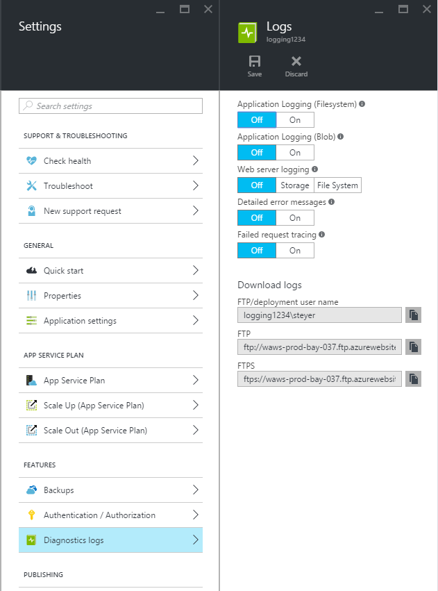

# Enable diagnostics logging for apps in Azure App Service
## Overview
Azure provides built-in diagnostics to assist with debugging an [App Service app](https://go.microsoft.com/fwlink/?LinkId=529714). In this article, you learn how to enable diagnostic logging and add instrumentation to your application, as well as how to access the information logged by Azure.

This article uses the [Azure portal](https://portal.azure.com) and Azure CLI to work with diagnostic logs. For information on working with diagnostic logs using Visual Studio, see [Troubleshooting Azure in Visual Studio](troubleshoot-dotnet-visual-studio.md).

## Web server diagnostics and application diagnostics
App Service provides diagnostic functionality for logging information from both the web server and the web application. These are logically separated into **web server diagnostics** and **application diagnostics**.

### Web server diagnostics
You can enable or disable the following kinds of logs:

* **Detailed Error Logging** - Detailed information for any request that results in HTTP status code 400 or greater. It may contain information that can help determine why the server returned the error code. One HTML file is generated for each error in the app's file system, and up to 50 errors (files) are retained. When the number of HTML files exceed 50, the oldest 26 files are automatically deleted.
* **Failed Request Tracing** - Detailed information on failed requests, including a trace of the IIS components used to process the request and the time taken in each component. It's useful if you want to improve site performance or isolate a specific HTTP error. One folder is generated for each error in the app's file system. File retention policies are the same as the detailed error logging above.
* **Web Server Logging** - Information about HTTP transactions using the [W3C extended log file format](/windows/desktop/Http/w3c-logging). It's useful when determining overall site metrics such as the number of requests handled or how many requests are from a specific IP address.

### Application diagnostics
Application diagnostics allows you to capture information produced by a web application. ASP.NET applications can use the [System.Diagnostics.Trace](/dotnet/api/system.diagnostics.trace) class to log information to the application diagnostics log. For example:

    System.Diagnostics.Trace.TraceError("If you're seeing this, something bad happened");

At runtime, you can retrieve these logs to help with troubleshooting. For more information, see [Troubleshooting Azure App Service in Visual Studio](troubleshoot-dotnet-visual-studio.md).

App Service also logs deployment information when you publish content to an app. It happens automatically and there are no configuration settings for deployment logging. Deployment logging allows you to determine why a deployment failed. For example, if you use a custom deployment script, you might use deployment logging to determine why the script is failing.

## How to enable diagnostics
To enable diagnostics in the [Azure portal](https://portal.azure.com), go to the page for your app and click **Settings > Diagnostics logs**.

<!-- todo:cleanup dogfood addresses in screenshot -->

When you enable **application diagnostics**, you also choose the **Level**. The following table shows the categories of logs each level includes:

| Level| Included log categories |
|-|-|
|**Disabled** | None |
|**Error** | Error, Critical |
|**Warning** | Warning, Error, Critical|
|**Information** | Info, Warning, Error, Critical|
|**Verbose** | Trace, Debug, Info, Warning, Error, Critical (all categories) |
|-|-|

For **Application logging**, you can turn on the file system option temporarily for debugging purposes. This option turns off automatically in 12 hours. You can also turn on the blob storage option to select a blob container to write logs to.

> [!NOTE]
> Currently only .NET application logs can be written to the blob storage. Java, PHP, Node.js, Python application logs can only be stored on the file system (without code modifications to write logs to external storage).
>
>

For **Web server logging**, you can select **storage** or **file system**. Selecting **storage** allows you to select a storage account, and then a blob container that the logs are written to. 

If you store logs on the file system, the files can be accessed by FTP, or downloaded as a Zip archive by using Azure CLI.

By default, logs are not automatically deleted (with the exception of **Application Logging (Filesystem)**). To automatically delete logs, set the **Retention Period (Days)** field.

> [!NOTE]
> If you [regenerate your storage account's access keys](../storage/common/storage-create-storage-account.md), you must reset the respective logging configuration to use the updated keys. To do this:
>
> 1. In the **Configure** tab, set the respective logging feature to **Off**. Save your setting.
> 2. Enable logging to the storage account blob again. Save your setting.
>
>

Any combination of file system or blob storage can be enabled at the same time, and have individual log level configurations. For example, you may wish to log errors and warnings to blob storage as a long-term logging solution, while enabling file system logging with a level of verbose.

While both storage locations provide the same basic information for logged events, **blob storage** logs additional information such as the instance ID, thread ID, and a more granular timestamp (tick format) than logging to **file system**.

> [!NOTE]
> Information stored in **blob  storage** can only be accessed using a storage client or an application that can directly work with these storage systems. For example, Visual Studio 2013 contains a Storage Explorer that can be used to explore blob storage, and HDInsight can access data stored in blob storage. You can also write an application that accesses Azure Storage by using one of the [Azure SDKs](https://azure.microsoft.com/downloads/).
>

##  How to: Download logs
Diagnostic information stored to the app file system can be accessed directly using FTP. It can also be downloaded as a Zip archive using Azure CLI.

The directory structure that the logs are stored in is as follows:

* **Application logs** - /LogFiles/Application/. This folder contains one or more text files containing information produced by application logging.
* **Failed Request Traces** - /LogFiles/W3SVC#########/. This folder contains an XSL file and one or more XML files. Ensure that you download the XSL file into the same directory as the XML file(s) because the XSL file provides functionality for formatting and filtering the contents of the XML file(s) when viewed in Internet Explorer.
* **Detailed Error Logs** - /LogFiles/DetailedErrors/. This folder contains one or more .htm files that provide extensive information for any HTTP errors that have occurred.
* **Web Server Logs** - /LogFiles/http/RawLogs. This folder contains one or more text files formatted using the [W3C extended log file format](/windows/desktop/Http/w3c-logging).
* **Deployment logs** - /LogFiles/Git. This folder contains logs generated by the internal deployment processes used by Azure App Service, as well as logs for Git deployments. You can also find deployment logs under D:\home\site\deployments.

### FTP

To open an FTP connection to your app's FTP server, see [Deploy your app to Azure App Service using FTP/S](deploy-ftp.md).

Once connected to your app's FTP/S server, open the **LogFiles** folder, where the log files are stored.

### Download with Azure CLI
To download the log files using the Azure Command Line Interface, open a new command prompt, PowerShell, Bash, or Terminal session and enter the following command:

    az webapp log download --resource-group resourcegroupname --name appname

This command saves the logs for the app named 'appname' to a file named **webapp_logs.zip** in the current directory.

> [!NOTE]
> If you haven't installed Azure CLI, or haven't configured it to use your Azure Subscription, see [How to Use Azure CLI](https://docs.microsoft.com/cli/azure/get-started-with-azure-cli?view=azure-cli-latest).
>
>

## How to: View logs in Application Insights
Visual Studio Application Insights provides tools for filtering and searching logs, and for correlating the logs with requests and other events.

1. Add the Application Insights SDK to your project in Visual Studio.
   * In Solution Explorer, right-click your project and choose Add Application Insights. The interface guides you through steps that include creating an Application Insights resource. [Learn more](../azure-monitor/app/asp-net.md)
2. Add the Trace Listener package to your project.
   * Right-click your project and choose Manage NuGet Packages. Select `Microsoft.ApplicationInsights.TraceListener` [Learn more](../azure-monitor/app/asp-net-trace-logs.md)
3. Upload your project and run it to generate log data.
4. In the [Azure portal](https://portal.azure.com/), browse to your new Application Insights resource, and open **Search**. You should see your log data, along with request, usage, and other telemetry. Some telemetry might take a few minutes to arrive: click Refresh. [Learn more](../azure-monitor/app/diagnostic-search.md)

[Learn more about performance tracking with Application Insights](../azure-monitor/app/azure-web-apps.md)

##  How to: Stream logs
While developing an application, it is often useful to see logging information in near-real time. You can stream logging information to your development environment using Azure CLI.

> [!NOTE]
> Some types of logging buffer write to the log file, which can result in out of order events in the stream. For example, an application log entry that occurs when a user visits a page may be displayed in the stream before the corresponding HTTP log entry for the page request.
>
> [!NOTE]
> Log streaming also streams information written to any text file stored in the **D:\\home\\LogFiles\\** folder.
>
>

### Streaming with Azure CLI
To stream logging information, open a new command prompt, PowerShell, Bash, or Terminal session and enter the following command:

    az webapp log tail --name appname --resource-group myResourceGroup

This command connects to the app named 'appname' and begin streaming information to the window as log events occur on the app. Any information written to files ending in .txt, .log, or .htm that are stored in the /LogFiles directory (d:/home/logfiles) is streamed to the local console.

To filter specific events, such as errors, use the **--Filter** parameter. For example:

    az webapp log tail --name appname --resource-group myResourceGroup --filter Error

To filter specific log types, such as HTTP, use the **--Path** parameter. For example:

    az webapp log tail --name appname --resource-group myResourceGroup --path http

> [!NOTE]
> If you haven't installed Azure CLI, or haven't configured it to use your Azure Subscription, see [How to Use Azure CLI](../cli-install-nodejs.md).
>
>

##  How to: Understand diagnostics logs
### Application diagnostics logs
Application diagnostics stores information in a specific format for .NET applications, depending on whether you store logs to the file system or blob storage. 

The base set of data stored is the same across both storage types - the date and time the event occurred, the process ID that produced the event, the event type (information, warning, error), and the event message. Using the file system for log storage is useful when you need immediate access to troubleshoot an issue because the log files are updated near instantaneously. Blob storage is used for archival purposes because the files are cached and then flushed to the storage container on a schedule.

**File system**

Each line logged to the file system or received using streaming is in the following format:

    {Date}  PID[{process ID}] {event type/level} {message}

For example, an error event would appear similar to the following sample:

    2014-01-30T16:36:59  PID[3096] Error       Fatal error on the page!

Logging to the file system provides the most basic information of the three available methods, providing only the time, process ID, event level, and message.

**Blob storage**

When logging to blob storage, data is stored in comma-separated values (CSV) format. Additional fields are logged to provide more granular information about the event. The following properties are used for each row in the CSV:

| Property name | Value/format |
| --- | --- |
| Date |The date and time that the event occurred |
| Level |Event level (for example, error, warning, information) |
| ApplicationName |The app name |
| InstanceId |Instance of the app that the event occurred on |
| EventTickCount |The date and time that the event occurred, in Tick format (greater precision) |
| EventId |The event ID of this event

Defaults to 0 if none specified |
| Pid |Process ID |
| Tid |The thread ID of the thread that produced the event |
| Message |Event detail message |

The data stored in a blob would look similar to the following example:

    date,level,applicationName,instanceId,eventTickCount,eventId,pid,tid,message
    2014-01-30T16:36:52,Error,mywebapp,6ee38a,635266966128818593,0,3096,9,An error occurred

> [!NOTE]
> For ASP.NET Core, logging is accomplished using the [Microsoft.Extensions.Logging.AzureAppServices](https://www.nuget.org/packages/Microsoft.Extensions.Logging.AzureAppServices) provider This provider deposits additional log files into the blob container. For more information, see [ASP.NET Core logging in Azure](/aspnet/core/fundamentals/logging).
>
>

### Failed request traces
Failed request traces are stored in XML files named **fr######.xml**. To make it easier to view the logged information, an XSL stylesheet named **freb.xsl** is provided in the same directory as the XML files. If you open one of the XML files in Internet Explorer, Internet Explorer uses the XSL stylesheet to provide a formatted display of the trace information, similar to the following example:

> [!NOTE]
> An easy way to view the formatted failed request traces is to navigate to your app's page in the portal. From the left menu, select **Diagnose and solve problems**, then search for **Failed Request Tracing Logs**, then click the icon to browse and view the trace you want.
>

### Detailed error logs
Detailed error logs are HTML documents that provide more detailed information on HTTP errors that have occurred. Since they are simply HTML documents, they can be viewed using a web browser.

### Web server logs
The web server logs are formatted using the [W3C extended log file format](/windows/desktop/Http/w3c-logging). This information can be read using a text editor or parsed using utilities such as [Log Parser](https://go.microsoft.com/fwlink/?LinkId=246619).

> [!NOTE]
> The logs produced by Azure App Service do not support the **s-computername**, **s-ip**, or **cs-version** fields.
>
>

##  Next steps
* [How to Monitor Azure App Service](web-sites-monitor.md)
* [Troubleshooting Azure App Service in Visual Studio](troubleshoot-dotnet-visual-studio.md)
* [Analyze app Logs in HDInsight](https://gallery.technet.microsoft.com/scriptcenter/Analyses-Windows-Azure-web-0b27d413)
