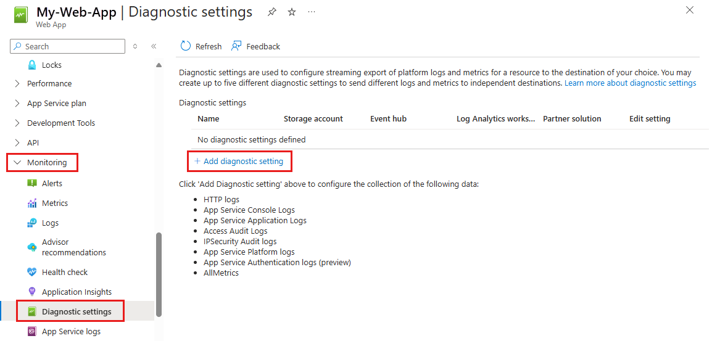

# Enable diagnostics logging for apps in Azure App Service
## Overview
Azure provides built-in diagnostics to assist with debugging an [App Service app](overview.md). In this article, you learn how to enable diagnostic logging and add instrumentation to your application, as well as how to access the information logged by Azure.

This article uses the [Azure portal](https://portal.azure.com) and Azure CLI to work with diagnostic logs. For information on working with diagnostic logs using Visual Studio, see [Troubleshooting Azure in Visual Studio](troubleshoot-dotnet-visual-studio.md).

> [!NOTE]
> In addition to the logging instructions in this article, there's new, integrated logging capability with Azure Monitoring. You'll find more on this capability in the [Send logs to Azure Monitor](#send-logs-to-azure-monitor) section. 
>
>

|Type|Platform|Location|Description|
|-|-|-|-|
| Application logging | Windows, Linux | App Service file system and/or Azure Storage blobs | Logs messages generated by your application code. The messages can be generated by the web framework you choose, or from your application code directly using the standard logging pattern of your language. Each message is assigned one of the following categories: **Critical**, **Error**, **Warning**, **Info**, **Debug**, and **Trace**. You can select how verbose you want the logging to be by setting the severity level when you enable application logging.|
| Web server logging| Windows | App Service file system or Azure Storage blobs| Raw HTTP request data in the [W3C extended log file format](/windows/desktop/Http/w3c-logging). Each log message includes data such as the HTTP method, resource URI, client IP, client port, user agent, response code, and so on. |
| Detailed Error Messages| Windows | App Service file system | Copies of the *.htm* error pages that would have been sent to the client browser. For security reasons, detailed error pages shouldn't be sent to clients in production, but App Service can save the error page each time an application error occurs that has HTTP code 400 or greater. The page may contain information that can help determine why the server returns the error code. |
| Failed request tracing | Windows | App Service file system | Detailed tracing information on failed requests, including a trace of the IIS components used to process the request and the time taken in each component. It's useful if you want to improve site performance or isolate a specific HTTP error. One folder is generated for each failed request, which contains the XML log file, and the XSL stylesheet to view the log file with. |
| Deployment logging | Windows, Linux | App Service file system | Logs for when you publish content to an app. Deployment logging happens automatically and there are no configurable settings for deployment logging. It helps you determine why a deployment failed. For example, if you use a [custom deployment script](https://github.com/projectkudu/kudu/wiki/Custom-Deployment-Script), you might use deployment logging to determine why the script is failing. |

When stored in the App Service file system, logs are subject to the available storage for your pricing tier (see [App Service limits](../azure-resource-manager/management/azure-subscription-service-limits.md#app-service-limits)).

> [!NOTE]
> App Service provides a dedicated, interactive diagnostics tool to help you troubleshoot your application. For more information, see [Azure App Service diagnostics overview](overview-diagnostics.md).
>
> In addition, you can use other Azure services to improve the logging and monitoring capabilities of your app, such as [Azure Monitor](../azure-monitor/app/azure-web-apps.md).
>

## Enable application logging (Windows)

To enable application logging for Windows apps in the [Azure portal](https://portal.azure.com), navigate to your app and select **App Service logs**.

Select **On** for either **Application Logging (Filesystem)** or **Application Logging (Blob)**, or both. 

The **Filesystem** option is for temporary debugging purposes, and turns itself off in 12 hours. The **Blob** option is for long-term logging, and needs a blob storage container to write logs to.  The **Blob** option also includes additional information in the log messages, such as the ID of the origin VM instance of the log message (`InstanceId`), thread ID (`Tid`), and a more granular timestamp ([`EventTickCount`](/dotnet/api/system.datetime.ticks)).

> [!NOTE]
> If your Azure Storage account is secured by firewall rules, see [Networking considerations](#networking-considerations).

> [!NOTE]
> Currently only .NET application logs can be written to the blob storage. Java, PHP, Node.js, Python application logs can only be stored on the App Service file system (without code modifications to write logs to external storage).
>
> Also, if you [regenerate your storage account's access keys](../storage/common/storage-account-create.md), you must reset the respective logging configuration to use the updated access keys. To do this:
>
> 1. In the **Configure** tab, set the respective logging feature to **Off**. Save your setting.
> 2. Enable logging to the storage account blob again. Save your setting.
>
>

Select the **Level**, or the level of details to log. The following table shows the log categories included in each level:

| Level | Included categories |
|-|-|
|**Disabled** | None |
|**Error** | Error, Critical |
|**Warning** | Warning, Error, Critical|
|**Information** | Info, Warning, Error, Critical|
|**Verbose** | Trace, Debug, Info, Warning, Error, Critical (all categories) |

When finished, select **Save**.

> [!NOTE]
> If you write logs to blobs, the retention policy no longer applies if you delete the app but keep the logs in the blobs. For more information, see [Costs that might accrue after resource deletion](overview-manage-costs.md#costs-that-might-accrue-after-resource-deletion).
>

## Enable application logging (Linux/Container)

To enable application logging for Linux apps or custom containers in the [Azure portal](https://portal.azure.com), navigate to your app and select **App Service logs**.

In **Application logging**, select **File System**.

In **Quota (MB)**, specify the disk quota for the application logs. In **Retention Period (Days)**, set the number of days the logs should be retained.

When finished, select **Save**.

## Enable web server logging

To enable web server logging for Windows apps in the [Azure portal](https://portal.azure.com), navigate to your app and select **App Service logs**.

For **Web server logging**, select **Storage** to store logs on blob storage, or **File System** to store logs on the App Service file system. 

> [!NOTE]
> If your Azure Storage account is secured by firewall rules, see [Networking considerations](#networking-considerations).

In **Retention Period (Days)**, set the number of days the logs should be retained.

> [!NOTE]
> If you [regenerate your storage account's access keys](../storage/common/storage-account-create.md), you must reset the respective logging configuration to use the updated keys. To do this:
>
> 1. In the **Configure** tab, set the respective logging feature to **Off**. Save your setting.
> 2. Enable logging to the storage account blob again. Save your setting.
>
>

When finished, select **Save**.

> [!NOTE]
> If you write logs to blobs, the retention policy no longer applies if you delete the app but keep the logs in the blobs. For more information, see [Costs that might accrue after resource deletion](overview-manage-costs.md#costs-that-might-accrue-after-resource-deletion).
>

## Log detailed errors

To save the error page or failed request tracing for Windows apps in the [Azure portal](https://portal.azure.com), navigate to your app and select **App Service logs**.

Under **Detailed Error Logging** or **Failed Request Tracing**, select **On**, then select **Save**.

Both types of logs are stored in the App Service file system. Up to 50 errors (files/folders) are retained. When the number of HTML files exceeds 50, the oldest error files are automatically deleted.

The Failed Request Tracing feature by default captures a log of requests that failed with HTTP status codes between 400 and 600. To specify custom rules, you can override the `<traceFailedRequests>` section in the *web.config* file.

## Add log messages in code

In your application code, you use the usual logging facilities to send log messages to the application logs. For example:

- ASP.NET applications can use the [System.Diagnostics.Trace](/dotnet/api/system.diagnostics.trace) class to log information to the application diagnostics log. For example:

    ```csharp
    System.Diagnostics.Trace.TraceError("If you're seeing this, something bad happened");
    ```

    By default, ASP.NET Core uses the [Microsoft.Extensions.Logging.AzureAppServices](https://www.nuget.org/packages/Microsoft.Extensions.Logging.AzureAppServices) logging provider. For more information, see [ASP.NET Core logging in Azure](/aspnet/core/fundamentals/logging/). For information about WebJobs SDK logging, see [Get started with the Azure WebJobs SDK](./webjobs-sdk-get-started.md#enable-console-logging)
- Python applications can use the [OpenCensus package](../azure-monitor/app/opencensus-python.md) to send logs to the application diagnostics log.


## Stream logs

Before you stream logs in real time, enable the log type that you want. Any information written to the console output or files ending in .txt, .log, or .htm that are stored in the */home/LogFiles* directory (D:\home\LogFiles) is streamed by App Service.

> [!NOTE]
> Some types of logging buffer write to the log file, which can result in out of order events in the stream. For example, an application log entry that occurs when a user visits a page may be displayed in the stream before the corresponding HTTP log entry for the page request.
>

### In Azure portal

To stream logs in the [Azure portal](https://portal.azure.com), navigate to your app and select **Log stream**. 

### In Cloud Shell

To stream logs live in [Cloud Shell](../cloud-shell/overview.md), use the following command:

> [!IMPORTANT]
> This command may not work with web apps hosted in a Linux app service plan.

```azurecli-interactive
az webapp log tail --name appname --resource-group myResourceGroup
```

To filter specific log types, such as HTTP, use the **--Provider** parameter. For example:

```azurecli-interactive
az webapp log tail --name appname --resource-group myResourceGroup --provider http
```

### In local terminal

To stream logs in the local console, [install Azure CLI](/cli/azure/install-azure-cli) and [sign in to your account](/cli/azure/authenticate-azure-cli). Once signed in, followed the [instructions for Cloud Shell](#in-cloud-shell)

## Access log files

If you configure the Azure Storage blobs option for a log type, you need a client tool that works with Azure Storage. For more information, see [Azure Storage Client Tools](../storage/common/storage-explorers.md).

For logs stored in the App Service file system, the easiest way is to download the ZIP file in the browser at:

- Linux/custom containers: `https://<app-name>.scm.azurewebsites.net/api/logs/docker/zip`
- Windows apps: `https://<app-name>.scm.azurewebsites.net/api/dump`

For Linux/custom containers, the ZIP file contains console output logs for both the docker host and the docker container. For a scaled-out app, the ZIP file contains one set of logs for each instance. In the App Service file system, these log files are the contents of the */home/LogFiles* directory.

For Windows apps, the ZIP file contains the contents of the *D:\Home\LogFiles* directory in the App Service file system. It has the following structure:

| Log type | Directory | Description |
|-|-|-|
| **Application logs** |*/LogFiles/Application/* | Contains one or more text files. The format of the log messages depends on the logging provider you use. |
| **Failed Request Traces** | */LogFiles/W3SVC#########/* | Contains XML files, and an XSL file. You can view the formatted XML files in the browser. |
| **Detailed Error Logs** | */LogFiles/DetailedErrors/* | Contains HTM error files. You can view the HTM files in the browser.<br/>Another way to view the failed request traces is to navigate to your app page in the portal. From the left menu, select **Diagnose and solve problems**, then search for **Failed Request Tracing Logs**, then click the icon to browse and view the trace you want. |
| **Web Server Logs** | */LogFiles/http/RawLogs/* | Contains text files formatted using the [W3C extended log file format](/windows/desktop/Http/w3c-logging). This information can be read using a text editor or a utility like [Log Parser](https://www.iis.net/downloads/community/2010/04/log-parser-22).<br/>App Service doesn't support the `s-computername`, `s-ip`, or `cs-version` fields. |
| **Deployment logs** | */LogFiles/Git/* and */deployments/* | Contain logs generated by the internal deployment processes, as well as logs for Git deployments. |

## Send logs to Azure Monitor

With the new [Azure Monitor integration](https://aka.ms/appsvcblog-azmon), you can [create Diagnostic Settings](https://azure.github.io/AppService/2019/11/01/App-Service-Integration-with-Azure-Monitor.html#create-a-diagnostic-setting) to send logs to Storage Accounts, Event Hubs and Log Analytics. 

> [!div class="mx-imgBorder"]
> 

### Supported log types

The following table shows the supported log types and descriptions: 

| Log type | Windows | Windows Container | Linux | Linux Container | Description |
|-|-|-|-|-|-|
| AppServiceConsoleLogs | Java SE & Tomcat | Yes | Yes | Yes | Standard output and standard error |
| AppServiceHTTPLogs | Yes | Yes | Yes | Yes | Web server logs |
| AppServiceEnvironmentPlatformLogs | Yes | N/A | Yes | Yes | App Service Environment: scaling, configuration changes, and status logs|
| AppServiceAuditLogs | Yes | Yes | Yes | Yes | Login activity via FTP and Kudu |
| AppServiceFileAuditLogs | Yes | Yes | TBA | TBA | File changes made to the site content; **only available for Premium tier and above** |
| AppServiceAppLogs | ASP.NET, .NET Core, & Tomcat <sup>1</sup> | ASP.NET & Tomcat <sup>1</sup> | .NET Core, Java, SE & Tomcat Blessed Images <sup>2</sup> | Java SE & Tomcat Blessed Images <sup>2</sup> | Application logs |
| AppServiceIPSecAuditLogs  | Yes | Yes | Yes | Yes | Requests from IP Rules |
| AppServicePlatformLogs  | TBA | Yes | Yes | Yes | Container operation logs |
| AppServiceAntivirusScanAuditLogs <sup>3</sup> | Yes | Yes | Yes | Yes | [Anti-virus scan logs](https://azure.github.io/AppService/2020/12/09/AzMon-AppServiceAntivirusScanAuditLogs.html) using Microsoft Defender for Cloud; **only available for Premium tier** | 

<sup>1</sup> For Tomcat apps, add `TOMCAT_USE_STARTUP_BAT` to the app settings and set it to `false` or `0`. Need to be on the *latest* Tomcat version and use *java.util.logging*.

<sup>2</sup> For Java SE apps, add `WEBSITE_AZMON_PREVIEW_ENABLED` to the app settings and set it to `true` or to `1`.

<sup>3</sup> AppServiceAntivirusScanAuditLogs log type is still currently in Preview

## Networking considerations

If you secure your Azure Storage account by [only allowing selected networks](../storage/common/storage-network-security.md#change-the-default-network-access-rule), it can receive logs from App Service only if both of the following are true:

- The Azure Storage account is in a different Azure region from the App Service app.
- All outbound addresses of the App Service app are [added to the Storage account's firewall rules](../storage/common/storage-network-security.md#managing-ip-network-rules). To find the outbound addresses for your app, see [Find outbound IPs](overview-inbound-outbound-ips.md#find-outbound-ips).

## <a name="nextsteps"></a> Next steps
* [Query logs with Azure Monitor](../azure-monitor/logs/log-query-overview.md)
* [How to Monitor Azure App Service](web-sites-monitor.md)
* [Troubleshooting Azure App Service in Visual Studio](troubleshoot-dotnet-visual-studio.md)
* [Analyze app Logs in HDInsight](https://gallery.technet.microsoft.com/scriptcenter/Analyses-Windows-Azure-web-0b27d413)
* [Tutorial: Run a load test to identify performance bottlenecks in a web app](../load-testing/tutorial-identify-bottlenecks-azure-portal.md)