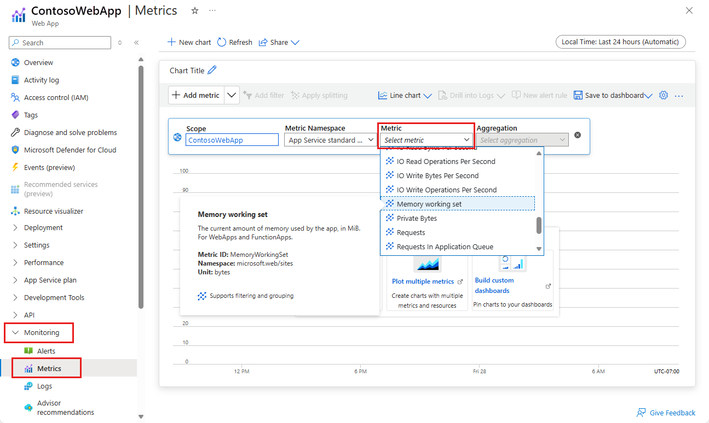
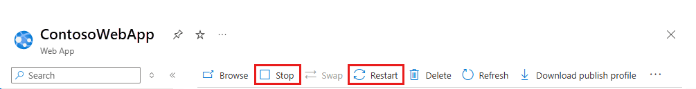

# Troubleshoot HTTP errors of "502 bad gateway" and "503 service unavailable" in Azure App Service
"502 bad gateway" and "503 service unavailable" are common errors in your app hosted in [Azure App Service](./overview.md). This article helps you troubleshoot these errors.

If you need more help at any point in this article, you can contact the Azure experts on [the MSDN Azure and the Stack Overflow forums](https://azure.microsoft.com/support/forums/). Alternatively, you can also file an Azure support incident. Go to the [Azure Support site](https://azure.microsoft.com/support/options/) and click on **Get Support**.

## Symptom
When you browse to the app, it returns a HTTP "502 Bad Gateway" error or a HTTP "503 Service Unavailable" error.

## Cause
This problem is often caused by application level issues, such as:

* requests taking a long time
* application using high memory/CPU
* application crashing due to an exception.

## Troubleshooting steps to solve "502 bad gateway" and "503 service unavailable" errors
Troubleshooting can be divided into three distinct tasks, in sequential order:

1. [Observe and monitor application behavior](#observe)
2. [Collect data](#collect)
3. [Mitigate the issue](#mitigate)

[App Service](overview.md) gives you various options at each step.

### 1. Observe and monitor application behavior
#### Track Service health
Microsoft Azure publicizes each time there is a service interruption or performance degradation. You can track the health of the service on the [Azure Portal](https://portal.azure.com/). For more information, see [Track service health](../service-health/service-notifications.md).

#### Monitor your app
This option enables you to find out if your application is having any issues. In your app’s blade, click the **Requests and errors** tile. The **Metric** blade will show you all the metrics you can add.

Some of the metrics that you might want to monitor for your app are

* Average memory working set
* Average response time
* CPU time
* Memory working set
* Requests

For more information, see:

* [Monitor apps in Azure App Service](web-sites-monitor.md)
* [Receive alert notifications](../azure-monitor/alerts/alerts-overview.md)

### 2. Collect data
#### Use the diagnostics tool
App Service provides an intelligent and interactive experience to help you troubleshoot your app with no configuration required. When you do run into issues with your app, the diagnostics tool will point out what’s wrong to guide you to the right information to more easily and quickly troubleshoot and resolve the issue.

To access App Service diagnostics, navigate to your App Service app or App Service Environment in the [Azure portal](https://portal.azure.com). In the left navigation, click on **Diagnose and solve problems**.

#### Use the Kudu Debug Console
App Service comes with a debug console that you can use for debugging, exploring, uploading files, as well as JSON endpoints for getting information about your environment. This is called the *Kudu Console* or the *SCM Dashboard* for your app.

You can access this dashboard by going to the link **https://&lt;Your app name>.scm.azurewebsites.net/**.

Some of the things that Kudu provides are:

* environment settings for your application
* log stream
* diagnostic dump
* debug console in which you can run PowerShell cmdlets and basic DOS commands.

Another useful feature of Kudu is that, in case your application is throwing first-chance exceptions, you can use Kudu and the SysInternals tool Procdump to create memory dumps. These memory dumps are snapshots of the process and can often help you troubleshoot more complicated issues with your app.

For more information on features available in Kudu, see
[Azure Websites online tools you should know about](https://azure.microsoft.com/blog/windows-azure-websites-online-tools-you-should-know-about/).

### 3. Mitigate the issue
#### Scale the app
In Azure App Service, for increased performance and throughput,  you can adjust the scale at which you are running your application. Scaling up an app involves two related actions: changing your App Service plan to a higher pricing tier, and configuring certain settings after you have switched to the higher pricing tier.

For more information on scaling, see [Scale an app in Azure App Service](manage-scale-up.md).

Additionally, you can choose to run your application on more than one instance . This not only provides you with more processing capability, but also gives you some amount of fault tolerance. If the process goes down on one instance, the other instance will still continue serving requests.

You can set the scaling to be Manual or Automatic.

#### Use AutoHeal
AutoHeal recycles the worker process for your app based on settings you choose (like configuration changes, requests, memory-based limits, or the time needed to execute a request). Most of the time, recycle the process is the fastest way to recover from a problem. Though you can always restart the app from directly within the Azure Portal, AutoHeal will do it automatically for you. All you need to do is add some triggers in the root web.config for your app. Note that these settings would work in the same way even if your application is not a .NET one.

For more information, see [Auto-Healing Azure Web Sites](https://azure.microsoft.com/blog/auto-healing-windows-azure-web-sites/).

#### Restart the app
This is often the simplest way to recover from one-time issues. On the [Azure Portal](https://portal.azure.com/), on your app’s blade, you have the options to stop or restart your app.

 

You can also manage your app using Azure PowerShell. For more information, see
[Using Azure PowerShell with Azure Resource Manager](../azure-resource-manager/management/manage-resources-powershell.md).