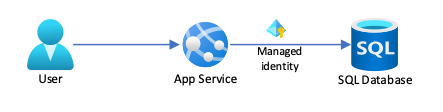

# Tutorial: Connect to Azure databases from App Service without secrets using a managed identity

[App Service](overview.md) provides a highly scalable, self-patching web hosting service in Azure. It also provides a [managed identity](overview-managed-identity.md) for your app, which is a turn-key solution for securing access to Azure databases, including: 

- [Azure SQL Database](/azure/azure-sql/database/)
- [Azure Database for MySQL](../mysql/index.yml)
- [Azure Database for PostgreSQL](../postgresql/index.yml)

> [!NOTE]
> This tutorial doesn't include guidance for [Azure Cosmos DB](../cosmos-db/index.yml), which supports Microsoft Entra authentication differently. For more information, see the Azure Cosmos DB documentation, such as [Use system-assigned managed identities to access Azure Cosmos DB data](../cosmos-db/managed-identity-based-authentication.md).

Managed identities in App Service make your app more secure by eliminating secrets from your app, such as credentials in the connection strings. This tutorial shows you how to connect to the above-mentioned databases from App Service using managed identities. 

<!--  -->

What you will learn:

> [!div class="checklist"]
> * Configure a Microsoft Entra user as an administrator for your Azure database.
> * Connect to your database as the Microsoft Entra user.
> * Configure a system-assigned or user-assigned managed identity for an App Service app.
> * Grant database access to the managed identity.
> * Connect to the Azure database from your code (.NET Framework 4.8, .NET 6, Node.js, Python, Java) using a managed identity.
> * Connect to the Azure database from your development environment using the Microsoft Entra user.

[!INCLUDE [quickstarts-free-trial-note](../../includes/quickstarts-free-trial-note.md)]

## Prerequisites

- Create an app in App Service based on .NET, Node.js, Python, or Java.
- Create a database server with Azure SQL Database, Azure Database for MySQL, or Azure Database for PostgreSQL.
- You should be familiar with the standard connectivity pattern (with username and password) and be able to connect successfully from your App Service app to your database of choice.

Prepare your environment for the Azure CLI.

[!INCLUDE [azure-cli-prepare-your-environment-no-header.md](~/reusable-content/azure-cli/azure-cli-prepare-your-environment-no-header.md)]


## 1. Install the Service Connector passwordless extension

[!INCLUDE [CLI-samples-clean-up](../service-connector/includes/install-passwordless-extension.md)]

## 2. Create a passwordless connection

Next, create a passwordless connection with Service Connector.

> [!TIP]
> The Azure portal can help you compose the commands below. In the Azure portal, go to your [Azure App Service](../service-connector/quickstart-portal-app-service-connection.md) resource, select **Service Connector** from the left menu and select **Create**. Fill out the form with all required parameters. Azure automaticaly generates the connection creation command, which you can copy to use in the CLI or execute in Azure Cloud Shell.

# [Azure SQL Database](#tab/sqldatabase-sc)

The following Azure CLI command uses a `--client-type` parameter.

1. Optionally run the `az webapp connection create sql -h` to get the supported client types.

1. Choose a client type and run the corresponding command. Replace the placeholders below with your own information.

    # [User-assigned managed identity](#tab/userassigned-sc)

    ```azurecli-interactive
    az webapp connection create sql \
        --resource-group <group-name> \
        --name <server-name> \
        --target-resource-group <sql-group-name> \
        --server <sql-name> \
        --database <database-name> \
        --user-identity client-id=<client-id> subs-id=<subscription-id> \
        --client-type <client-type>
    ```

    # [System-assigned managed identity](#tab/systemassigned-sc)

    ```azurecli-interactive
    az webapp connection create sql \
        --resource-group <group-name> \
        --name <server-name> \
        --target-resource-group <group-name> \
        --server <sql-name> \
        --database <database-name> \
        --system-identity \
        --client-type <client-type>
    ```

    -----

# [Azure Database for MySQL](#tab/mysql-sc)

> [!NOTE]
> For Azure Database for MySQL - Flexible Server, you must first [manually set up Microsoft Entra authentication](../mysql/flexible-server/how-to-azure-ad.md), which requires a separate user-assigned managed identity and specific Microsoft Graph permissions. This step can't be automated.

1. Manually [set up Microsoft Entra authentication for Azure Database for MySQL - Flexible Server](../mysql/flexible-server/how-to-azure-ad.md).

1. Optionally run the command `az webapp connection create mysql-flexible -h` to get the supported client types.

1. Choose a client type and run the corresponding command. The following Azure CLI command uses a `--client-type` parameter.

    # [User-assigned managed identity](#tab/userassigned-sc)

    ```azurecli-interactive
    az webapp connection create mysql-flexible \
        --resource-group <group-name> \
        --name <server-name> \
        --target-resource-group <group-name> \
        --server <mysql-name> \
        --database <database-name> \
        --user-identity client-id=XX subs-id=XX mysql-identity-id=$IDENTITY_RESOURCE_ID \
        --client-type <client-type>
    ```

    # [System-assigned managed identity](#tab/systemassigned-sc)

    ```azurecli-interactive
    az webapp connection create mysql-flexible \
    --resource-group <group-name> \
    --name <server-name> \
    --target-resource-group <group-name> \
    --server <mysql-name> \
    --database <database-name> \
    --system-identity mysql-identity-id=$IDENTITY_RESOURCE_ID \
    --client-type <client-type>
    ```

    -----

# [Azure Database for PostgreSQL](#tab/postgresql-sc)

The following Azure CLI command uses a `--client-type` parameter.

1. Optionally run the command `az webapp connection create postgres-flexible -h` to get a list of all supported client types.

1. Choose a client type and run the corresponding command.

    # [User-assigned managed identity](#tab/userassigned-sc)

    ```azurecli-interactive
    az webapp connection create postgres-flexible \
        --resource-group <group-name> \
        --name <server-name> \
        --target-resource-group <group-name> \
        --server <postgresql-name> \
        --database <database-name> \
        --user-identity client-id=XX subs-id=XX \
        --client-type java
    ```

    # [System-assigned managed identity](#tab/systemassigned-sc)

    ```azurecli-interactive
    az webapp connection create postgres-flexible \
        --resource-group <group-name> \
        --name <server-name> \
        --target-resource-group <group-name> \
        --server <postgresql-name> \
        --database <database-name> \
        --system-identity \
        --client-type <client-type>
    ```

    -----

1. Grant permission to pre-created tables

[!INCLUDE [Postgresql grant permission](../service-connector/includes/postgres-grant-permission.md)]

-----

This Service Connector command completes the following tasks in the background:

* Enable system-assigned managed identity, or assign a user identity for the app `<server-name>` hosted by Azure App Service.
* Set the Microsoft Entra admin to the current signed-in user.
* Add a database user for the system-assigned managed identity or user-assigned managed identity. Grant all privileges of the database `<database-name>` to this user. The username can be found in the connection string in preceding command output.
* Set configurations named `AZURE_MYSQL_CONNECTIONSTRING`, `AZURE_POSTGRESQL_CONNECTIONSTRING`, or `AZURE_SQL_CONNECTIONSTRING` to the Azure resource based on the database type.
* For App Service, the configurations are set in the **App Settings** blade.

If you encounter any problem when creating a connection, refer to [Troubleshooting](../service-connector/tutorial-passwordless.md#troubleshooting) for help.

## 3. Modify your code

# [Azure SQL Database](#tab/sqldatabase-sc)

[!INCLUDE [code sample for sql managed identity authentication connection](./includes/tutorial-connect-msi-azure-database/code-sql-mi.md)]

# [Azure Database for MySQL](#tab/mysql-sc)

Connectivity to the Azure Database for MySQL in your code follows the `DefaultAzureCredential` pattern for all language stacks. `DefaultAzureCredential` is flexible enough to adapt to both the development environment and the Azure environment. When running locally, it can retrieve the logged-in Azure user from the environment of your choice (Visual Studio, Visual Studio Code, Azure CLI, or Azure PowerShell). When running in Azure, it retrieves the managed identity. So it's possible to have connectivity to database both at development time and in production. The pattern is as follows:

1. Instantiate a `DefaultAzureCredential` from the Azure Identity client library. If you're using a user-assigned identity, specify the client ID of the identity.
2. Get an access token for Azure Database for MySQL: `https://ossrdbms-aad.database.windows.net/.default`.
3. Add the token to your connection string.
4. Open the connection.

[!INCLUDE [code sample for mysql managed identity authentication connection](./includes/tutorial-connect-msi-azure-database/code-mysql-mi.md)]

# [Azure Database for PostgreSQL](#tab/postgresql-sc)

Connectivity to the Azure Database for PostgreSQL in your code follows the `DefaultAzureCredential` pattern for all language stacks. `DefaultAzureCredential` is flexible enough to adapt to both the development environment and the Azure environment. When running locally, it can retrieve the logged-in Azure user from the environment of your choice (Visual Studio, Visual Studio Code, Azure CLI, or Azure PowerShell). When running in Azure, it retrieves the managed identity. So it's possible to have connectivity to database both at development time and in production. The pattern is as follows:

1. Instantiate a `DefaultAzureCredential` from the Azure Identity client library. If you're using a user-assigned identity, specify the client ID of the identity.
2. Get an access token for Azure Database for PostgreSQL: `https://ossrdbms-aad.database.windows.net/.default`.
3. Add the token to your connection string.
4. Open the connection.

[!INCLUDE [code sample for postgres managed identity authentication connection](./includes/tutorial-connect-msi-azure-database/code-postgres-mi.md)]

-----

## 4. Set up your dev environment

 This sample code uses `DefaultAzureCredential` to get a useable token for your Azure database from Microsoft Entra ID and then adds it to the database connection. While you can customize `DefaultAzureCredential`, it's already versatile by default. It gets a token from the signed-in Microsoft Entra user or from a managed identity, depending on whether you run it locally in your development environment or in App Service.

Without any further changes, your code is ready to be run in Azure. To debug your code locally, however, your develop environment needs a signed-in Microsoft Entra user. In this step, you configure your environment of choice by signing in with your Microsoft Entra user. 

# [Visual Studio Windows](#tab/windowsclient)

1. Visual Studio for Windows is integrated with Microsoft Entra authentication. To enable development and debugging in Visual Studio, add your Microsoft Entra user in Visual Studio by selecting **File** > **Account Settings** from the menu, and select **Sign in** or **Add**.

1. To set the Microsoft Entra user for Azure service authentication, select **Tools** > **Options** from the menu, then select **Azure Service Authentication** > **Account Selection**. Select the Microsoft Entra user you added and select **OK**.

# [Visual Studio for macOS](#tab/macosclient)

1. Visual Studio for Mac is *not* integrated with Microsoft Entra authentication. However, the Azure Identity client library that you'll use later can also retrieve tokens from Azure CLI. To enable development and debugging in Visual Studio, [install Azure CLI](/cli/azure/install-azure-cli) on your local machine.

1. Sign in to Azure CLI with the following command using your Microsoft Entra user:

    ```azurecli
    az login --allow-no-subscriptions
    ```

# [Visual Studio Code](#tab/vscode)

1. Visual Studio Code is integrated with Microsoft Entra authentication through the Azure extension. Install the <a href="https://marketplace.visualstudio.com/items?itemName=ms-vscode.vscode-node-azure-pack" target="_blank">Azure Tools</a> extension in Visual Studio Code.

1. In Visual Studio Code, in the [Activity Bar](https://code.visualstudio.com/docs/getstarted/userinterface), select the **Azure** logo.

1. In the **App Service** explorer, select **Sign in to Azure...** and follow the instructions.

# [Azure CLI](#tab/cli)

1. The Azure Identity client library that you'll use later can use tokens from Azure CLI. To enable command-line based development, [install Azure CLI](/cli/azure/install-azure-cli) on your local machine.

1. Sign in to Azure with the following command using your Microsoft Entra user:

    ```azurecli
    az login --allow-no-subscriptions
    ```

# [Azure PowerShell](#tab/ps)

1. The Azure Identity client library that you'll use later can use tokens from Azure PowerShell. To enable command-line based development, [install Azure PowerShell](/powershell/azure/install-azure-powershell) on your local machine.

1. Sign in to Azure CLI with the following cmdlet using your Microsoft Entra user:

    ```powershell-interactive
    Connect-AzAccount
    ```

-----

For more information about setting up your dev environment for Microsoft Entra authentication, see [Azure Identity client library for .NET](/dotnet/api/overview/azure/Identity-readme).

You're now ready to develop and debug your app with the SQL Database as the back end, using Microsoft Entra authentication.

## 5. Test and publish

1. Run your code in your dev environment. Your code uses the signed-in Microsoft Entra user in your environment to connect to the back-end database. The user can access the database because it's configured as a Microsoft Entra administrator for the database.

1. Publish your code to Azure using the preferred publishing method. In App Service, your code uses the app's managed identity to connect to the back-end database.

## Frequently asked questions

- [Does managed identity support SQL Server?](#does-managed-identity-support-sql-server)
- [I get the error `Login failed for user '<token-identified principal>'.`](#i-get-the-error-login-failed-for-user-token-identified-principal)
- [I made changes to App Service authentication or the associated app registration. Why do I still get the old token?](#i-made-changes-to-app-service-authentication-or-the-associated-app-registration-why-do-i-still-get-the-old-token)
- [How do I add the managed identity to a Microsoft Entra group?](#how-do-i-add-the-managed-identity-to-an-azure-ad-group)
- [I get the error `SSL connection is required. Please specify SSL options and retry`.](#i-get-the-error-ssl-connection-is-required-please-specify-ssl-options-and-retry)

#### Does managed identity support SQL Server?

Microsoft Entra ID and managed identities aren't supported for on-premises SQL Server. 

#### I get the error `Login failed for user '<token-identified principal>'.`

The managed identity you're attempting to request a token for is not authorized to access the Azure database.

#### I made changes to App Service authentication or the associated app registration. Why do I still get the old token?

The back-end services of managed identities also [maintain a token cache](overview-managed-identity.md#configure-target-resource) that updates the token for a target resource only when it expires. If you modify the configuration *after* trying to get a token with your app, you don't actually get a new token with the updated permissions until the cached token expires. The best way to work around this is to test your changes with a new InPrivate (Edge)/private (Safari)/Incognito (Chrome) window. That way, you're sure to start from a new authenticated session.


<a name='how-do-i-add-the-managed-identity-to-an-azure-ad-group'></a>

#### How do I add the managed identity to a Microsoft Entra group?

If you want, you can add the identity to an [Microsoft Entra group](../active-directory/fundamentals/active-directory-manage-groups.md), then grant  access to the Microsoft Entra group instead of the identity. For example, the following commands add the managed identity from the previous step to a new group called _myAzureSQLDBAccessGroup_:

```azurecli-interactive
groupid=$(az ad group create --display-name myAzureSQLDBAccessGroup --mail-nickname myAzureSQLDBAccessGroup --query objectId --output tsv)
msiobjectid=$(az webapp identity show --resource-group <group-name> --name <app-name> --query principalId --output tsv)
az ad group member add --group $groupid --member-id $msiobjectid
az ad group member list -g $groupid
```

To grant database permissions for a Microsoft Entra group, see documentation for the respective database type.

#### I get the error `SSL connection is required. Please specify SSL options and retry`.

Connecting to the Azure database requires additional settings and is beyond the scope of this tutorial. For more information, see one of the following links:

[Configure TLS connectivity in Azure Database for PostgreSQL - Single Server](../postgresql/concepts-ssl-connection-security.md)
[Configure SSL connectivity in your application to securely connect to Azure Database for MySQL](../mysql/howto-configure-ssl.md)

## Next steps

What you learned:

> [!div class="checklist"]
> * Configure a Microsoft Entra user as an administrator for your Azure database.
> * Connect to your database as the Microsoft Entra user.
> * Configure a system-assigned or user-assigned managed identity for an App Service app.
> * Grant database access to the managed identity.
> * Connect to the Azure database from your code (.NET Framework 4.8, .NET 6, Node.js, Python, Java) using a managed identity.
> * Connect to the Azure database from your development environment using the Microsoft Entra user.

> [!div class="nextstepaction"]
> [How to use managed identities for App Service and Azure Functions](overview-managed-identity.md)

> [!div class="nextstepaction"]
> [Tutorial: Connect to SQL Database from .NET App Service without secrets using a managed identity](tutorial-connect-msi-sql-database.md)

> [!div class="nextstepaction"]
> [Tutorial: Connect to Azure services that don't support managed identities (using Key Vault)](tutorial-connect-msi-key-vault.md)

> [!div class="nextstepaction"]
> [Tutorial: Isolate back-end communication with Virtual Network integration](tutorial-networking-isolate-vnet.md)
