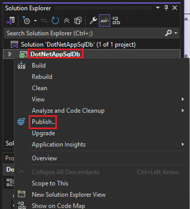
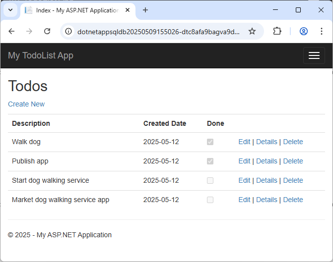

# Tutorial: Use managed identity to connect an Azure web app to an Azure SQL database without secrets

[Azure App Service](overview.md) provides a highly scalable, self-patching web hosting service in Azure. App Service also provides a [managed identity](overview-managed-identity.md) for your app, which is a turnkey solution for securing access to [Azure SQL](/azure/azure-sql/) and other Azure services. Managed identities in App Service make your app more secure by eliminating secrets, such as credentials in connection strings.

This tutorial shows you how to add managed identity to a sample .NET app that has an Azure SQL backend. After you finish, your app can connect to the Azure SQL database securely without the need for a user name and password.


In this tutorial, you:

> [!div class="checklist"]
> - Enable managed identities.
> - Grant Azure SQL Database access to the managed identity.
> - Configure Entity Framework to use Microsoft Entra authentication with SQL Database.
> - Connect to SQL Database from Visual Studio using Microsoft Entra authentication.

For guidance about using Azure Database for MySQL or Azure Database for PostgreSQL in Node.js, Python, and Java frameworks, see [Tutorial: Connect to Azure databases from App Service without secrets using a managed identity](tutorial-connect-msi-azure-database.md).

> [!NOTE]
> - Microsoft Entra ID and managed identities aren't supported for on-premises SQL Server.
> 
> - Microsoft Entra authentication is different from [Integrated Windows authentication](/previous-versions/windows/it-pro/windows-server-2003/cc758557(v=ws.10)) in on-premises Active Directory (AD) Domain Services (DS). AD DS and Microsoft Entra ID use completely different authentication protocols. For more information, see [Microsoft Entra Domain Services documentation](/azure/active-directory-domain-services/index).

## Prerequisites

- [!INCLUDE [quickstarts-free-trial-note](~/reusable-content/ce-skilling/azure/includes/quickstarts-free-trial-note.md)]

- Have a basic Azure App Service [ASP.NET MVC](https://www.asp.net/mvc) or [ASP.NET Core MVC](/aspnet/core/mvc/overview) create-read-update-delete (CRUD) app that uses Azure SQL Database with SQL authentication as the back end. The steps in this tutorial support the following .NET versions:

  - .NET Framework 4.8 and above
  - .NET 6.0 and above

- Allow client connection from your computer to Azure, so you can debug your app in your development environment. You can add the client IP address by following the steps at [Manage server-level IP firewall rules using the Azure portal](/azure/azure-sql/database/firewall-configure#use-the-azure-portal-to-manage-server-level-ip-firewall-rules).

- Sign in to Azure Cloud Shell or prepare your environment to use the Azure CLI.
  [!INCLUDE [azure-cli-prepare-your-environment-no-header.md](~/reusable-content/azure-cli/azure-cli-prepare-your-environment-no-header.md)]

<a name='1-grant-database-access-to-azure-ad-user'></a>
## Grant admin access to a Microsoft Entra user

Enable Microsoft Entra authentication to the Azure SQL database by assigning a Microsoft Entra user as the admin of the Azure SQL server. The Microsoft Entra admin must be a user that is created, imported, synced, or invited into Microsoft Entra ID. This user might not be the same as the Microsoft account user for your Azure subscription.

- For more information on creating a Microsoft Entra user, see [Add or delete users using Microsoft Entra ID](/entra/fundamentals/how-to-create-delete-users).
- For more information on allowed Microsoft Entra users for SQL Database, see [Microsoft Entra features and limitations in SQL Database](/azure/azure-sql/database/authentication-aad-overview#limitations).
- For more information on adding an Azure SQL server admin, see [Provision a Microsoft Entra administrator for your server](/azure/azure-sql/database/authentication-aad-configure#provision-azure-ad-admin-sql-managed-instance).

Run the following commands in the Bash environment of Azure Cloud Shell, or after signing in to Azure CLI locally.

1. Use [`az ad user list`](/cli/azure/ad/user#az-ad-user-list) with the `display-name`, `filter`, or `upn` parameter to get the object ID for the Microsoft Entra ID user. Run `az ad user list` standalone to show information for all the users in the Microsoft Entra directory.

   For example, the following command lists information for a Microsoft Entra ID user with the `display-name` of Firstname Lastname.

   ```azurecli
   az ad user list --display-name "Firstname Lastname"
   ```

   Here's example output:

   ```output
    "businessPhones": [],
    "displayName": "Firstname Lastname",
    "givenName": null,
    "id": "aaaaaaaa-0000-1111-2222-bbbbbbbbbbbb",
    "jobTitle": null,
    "mail": "firstname@contoso.com",
    "mobilePhone": null,
    "officeLocation": null,
    "preferredLanguage": null,
    "surname": null,
    "userPrincipalName": "firstname@contoso.com"
   ```

1. Add the Microsoft Entra ID user `id` as an admin on the Azure SQL server by using [`az sql server ad-admin create`](/cli/azure/sql/server/ad-admin#az-sql-server-ad-admin-create). In the following command, replace `<server-name>` with your server name without the `.database.windows.net` suffix, and `<entra-id>` with the `id` value from the preceding `az ad user list` command.

   ```azurecli
   az sql server ad-admin create --resource-group myResourceGroup --server-name <server-name> --display-name ADMIN --object-id <entra-id>
   ```

## Set up managed identity connectivity

The following steps configure your app to connect to Azure SQL Database with a system-assigned managed identity. To use a user-assigned identity, see [Tutorial: Connect to Azure databases from App Service without secrets using a managed identity](tutorial-connect-msi-azure-database.md).

### Enable managed identity for the app

To enable a managed identity for your Azure app, use the [az webapp identity assign](/cli/azure/webapp/identity#az-webapp-identity-assign) command, replacing `<app-name>` with your app name.

```azurecli
az webapp identity assign --resource-group myResourceGroup --name <app-name>
```

Here's an example of the output:

```output
{
  "additionalProperties": {},
  "principalId": "aaaaaaaa-bbbb-cccc-1111-222222222222",
  "tenantId": "aaaabbbb-0000-cccc-1111-dddd2222eeee",
  "type": "SystemAssigned"
}
```

To enable managed identity for a [deployment slot](deploy-staging-slots.md), add `--slot <slot-name>` and use the name of the slot in `<slot-name>`.

You can also add the identity to a [Microsoft Entra group](/azure/active-directory/fundamentals/active-directory-manage-groups), then grant SQL Database access to the Microsoft Entra group instead of to the identity. The following commands add the example managed identity to a new group called `myAzureSQLDBAccessGroup`.

```azurecli
$groupid=(az ad group create --display-name myAzureSQLDBAccessGroup --mail-nickname myAzureSQLDBAccessGroup --query objectId --output tsv)
$msiobjectid=(az webapp identity show --resource-group myResourceGroup --name <app-name> --query principalId --output tsv)
az ad group member add --group $groupid --member-id $msiobjectid
az ad group member list -g $groupid
```

### Grant permissions to the managed identity

Grant the identity the minimum permissions your app needs.

The name of a system-assigned identity is always the same as the app name. The name of a system-assigned identity for a deployment slot is `<app-name>/slots/<slot-name>`. To grant permissions for a Microsoft Entra group, use the group's display name, such as `myAzureSQLDBAccessGroup`.

1. In a PowerShell command line, sign in to SQL Database by using the following SQLCMD command, replacing `<server-name>` with your server name, `<db-name>` with your database name, and `<entra-user>` with the Microsoft Entra user name you used to set up the database. This Entra user has admin access to the database server by default.

   ```azurepowershell
   sqlcmd -S <servername>.database.windows.net -d <db-name> -U <entra-user> -G -l 30
   ```

   Follow the prompts to sign in.

1. At the SQL prompt, run the following commands to grant the minimum permissions your app needs, replacing `<identity-name>` with the name of the managed identity in Microsoft Entra ID.

   ```sql
   CREATE USER [<identity-name>] FROM EXTERNAL PROVIDER;
   ALTER ROLE db_datareader ADD MEMBER [<identity-name>];
   ALTER ROLE db_datawriter ADD MEMBER [<identity-name>];
   ALTER ROLE db_ddladmin ADD MEMBER [<identity-name>];
   GO
   ```

> [!NOTE]
> The backend managed identity services [maintain a token cache](overview-managed-identity.md#configure-target-resource) that updates the token for a target resource only when it expires. If you try to modify your SQL Database permissions after first getting a token with your app, you don't get a new token with updated permissions until the cached token expires.

### Remove the existing connection string

The same changes you made in *Web.config* or *appsettings.json* work with the managed identity. You can remove the existing connection string you used when you deployed your app the first time. To delete the connection string, run the following command, replacing `<app-name>` with the name of your app.

```azurecli
az webapp config connection-string delete --resource-group myResourceGroup --name <app-name> --setting-names <connection-string-name>
```

## Set up your development environment

Set up your chosen development environment and sign in to Azure. For more information about setting up your dev environment for Microsoft Entra authentication, see [Azure Identity client library for .NET](/dotnet/api/overview/azure/Identity-readme).

# [Visual Studio Windows](#tab/windowsclient)

Visual Studio for Windows is integrated with Microsoft Entra authentication.

1. To enable development and debugging in Visual Studio, add your Microsoft Entra user in Visual Studio by selecting **File** > **Account Settings** from the top menu, and then select **Sign in** or **Add**.
1. To set the Microsoft Entra user for Azure service authentication, select **Tools** > **Options** from the top menu, and then select **Azure Service Authentication** > **Account Selection**. Select the Microsoft Entra user you added and select **OK**.

# [Visual Studio Code](#tab/vscode)

Visual Studio Code is integrated with Microsoft Entra authentication through the Azure Tools extension.

1. In Visual Studio Code, install the <a href="https://marketplace.visualstudio.com/items?itemName=ms-vscode.vscode-node-azure-pack" target="_blank">Azure Tools</a> extension.
1. In the [Activity Bar](https://code.visualstudio.com/docs/getstarted/userinterface), select the **Azure** logo.
1. In the **App Service** explorer, select **Sign in to Azure** and follow the instructions.

# [Azure CLI](#tab/macosclient)

The Azure Identity client library can use tokens from Azure CLI.

1. To enable development and debugging in Visual Studio, [install Azure CLI](/cli/azure/install-azure-cli) on your local machine.
1. Use your Microsoft Entra user to sign in to Azure with the command `az login --allow-no-subscriptions`.

# [Azure PowerShell](#tab/ps)

The Azure Identity client library can use tokens from Azure PowerShell.

1. To enable command-line based development, [install Azure PowerShell](/powershell/azure/install-azure-powershell) on your local machine.
1. Use your Microsoft Entra user to sign in to Azure with the `Connect-AzAccount` cmdlet.

-----

## Modify your project and publish your app

You can now use Microsoft Entra authentication to develop and debug your Azure SQL database-backed web app.

The app uses a database context to connect with the database. You update the code to refer to the Entity Framework SQL Server provider, which depends on the modern [Microsoft.Data.SqlClient](https://github.com/dotnet/SqlClient) ADO.NET provider. The Entity Framework provider replaces the built-in `System.Data.SqlClient` SQL Server provider, and includes support for Microsoft Entra ID authentication methods. For more information, see [Microsoft.EntityFramework.SqlServer}](https://www.nuget.org/packages/Microsoft.EntityFramework.SqlServer).

`[DbConfigurationType(typeof(MicrosoftSqlDbConfiguration))]` works locally to use `Microsoft.Data.SqlClient` for the database context, but because `System.Data.SqlClient` is hardcoded as the provider in Azure App Service, you need to extend `MicrosoftSqlDbConfiguration` to redirect references to `System.Data.SqlClient` to `Microsoft.Data.SqlClient` instead.

The steps differ depending on whether you have an ASP.NET or ASP.NET Core app.

- An ASP.NET Core app uses [Entity Framework Core](/ef/core/) by default.
- An ASP.NET app uses [Entity Framework](/ef/ef6/) by default.

# [ASP.NET Core app](#tab/efcore)

1. In the Visual Studio **Package Manager Console**, add the NuGet package [Microsoft.Data.SqlClient](https://www.nuget.org/packages/Microsoft.Data.SqlClient).

   ```powershell
   Install-Package Microsoft.Data.SqlClient
   ```

1. In *appsettings.json*, replace the value of the connection string with the following code, replacing `<server-name` and `<database-name>` with your server name and database name.

   ```json
   "Server=tcp:<server-name>.database.windows.net;Authentication=Active Directory Default; Database=<database-name>;"
   ```

   > [!NOTE]
   > You can use [Microsoft Entra Default](/sql/connect/ado-net/sql/azure-active-directory-authentication#using-active-directory-default-authentication) authentication both on your local machine and in Azure App Service. The driver can acquire a token from Microsoft Entra ID in several different ways.
   >
   >If the app is deployed, the driver gets a token from the app's system-assigned managed identity. The driver can also authenticate with a user-assigned managed identity if you include `User Id=<client-id-of-user-assigned-managed-identity>;` in your connection string.
   >
   >The `DefaultAzureCredential` class caches the token in memory and retrieves it from Microsoft Entra ID just before expiration. You don't need any custom code to refresh the token.

   You now have everything you need to connect to SQL Database when you debug in Visual Studio. Your code uses the Microsoft Entra user you configured when you set up your dev environment. You can set up SQL Database later to allow connection from the managed identity of your App Service app.

1. Run your app. The CRUD app in your browser connects to the Azure SQL database directly, using Microsoft Entra authentication. This setup lets you run database migrations from Visual Studio.

1. Publish your changes using the following Git commands:

```bash
git commit -am "configure managed identity"
git push azure main
```

# [ASP.NET app](#tab/ef)

1. From the Visual Studio **Tools** menu, select **NuGet Package Manager** > **Package Manager Console**.

1. In the **Package Manager Console**, install the following packages:

   ```powershell
   Install-Package Microsoft.Data.SqlClient
   Install-Package Microsoft.EntityFramework.SqlServer
   ```

1. In *Models/MyDatabaseContext.cs* or other file that configures the database context, add the following class:

   ```csharp
       public class AppServiceConfiguration : MicrosoftSqlDbConfiguration
       {
           public AppServiceConfiguration()
           {
               SetProviderFactory("System.Data.SqlClient", Microsoft.Data.SqlClient.SqlClientFactory.Instance);
               SetProviderServices("System.Data.SqlClient", MicrosoftSqlProviderServices.Instance);
               SetExecutionStrategy("System.Data.SqlClient", () => new MicrosoftSqlAzureExecutionStrategy());
           }
       }
   ```

1. Add the following attribute to *MyDatabaseContext.cs*:

   ```csharp
   [DbConfigurationType(typeof(AppServiceConfiguration))]
   ```

1. Open *web.config*, find the connection string called `MyDbConnection`, and replace its `connectionString` value with 

   `"server=tcp:<server-name>.database.windows.net;Authentication=Active Directory Default; Database=<db-name>;"`

   replacing `<server-name` and `<db-name>` with your server name and database name. This connection string is used by the default constructor in *Models/MyDatabaseContext.cs*.
   
1. In *web.config*, remove the `entityFramework/providers/provider` section and line: `<provider invariantName="System.Data.SqlClient" .../>`.

   You now have everything you need to connect to SQL Database when you debug in Visual Studio. Your code uses the Microsoft Entra user you configured when you set up your dev environment.

1. In Visual Studio, press **Ctrl**+**F5** to run the app. The CRUD app in your browser now connects to the Azure SQL database directly, using Microsoft Entra authentication. This setup lets you run database migrations from Visual Studio.

1. In **Solution Explorer**, right-click your **DotNetAppSqlDb** project and select **Publish**.

   

1. On the **Publish** page, select **Publish**. 

   > [!IMPORTANT]
   > Ensure that your app service name doesn't duplicate any existing [app registrations](/azure/active-directory/manage-apps/add-application-portal), which leads to Principal ID conflicts.

---

### Test the app

When the new webpage shows your to-do list, your app is connecting to the database using the managed identity.



You can now edit the to-do list.

[!INCLUDE [cli-samples-clean-up](../../includes/cli-samples-clean-up.md)]

## Related content

- [Tutorial: Use a custom domain and a managed certificate to secure your app](tutorial-secure-domain-certificate.md)
- [Tutorial: Connect an App Service app to SQL Database on behalf of the signed-in user](tutorial-connect-app-access-sql-database-as-user-dotnet.md)
- [Tutorial: Connect to Azure databases from App Service without secrets using a managed identity](tutorial-connect-msi-azure-database.md)
- [Tutorial: Connect to Azure services that don't support managed identities using Key Vault](tutorial-connect-msi-key-vault.md)
- [Tutorial: Isolate back-end communication with Virtual Network integration](tutorial-networking-isolate-vnet.md)
