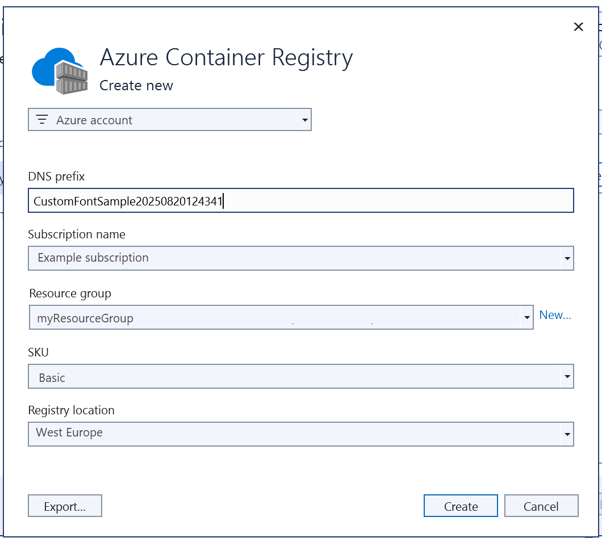
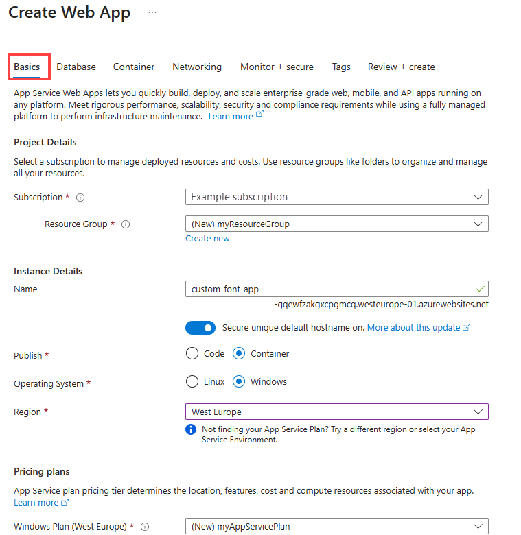

# Migrate custom software to Azure App Service using a custom container

::: zone pivot="container-windows"  

[Azure App Service](overview.md) provides pre-defined application stacks on Windows like ASP.NET or Node.js, running on IIS. The preconfigured Windows environment locks down the operating system from administrative access, software installations, changes to the global assembly cache, and so on (see [Operating system functionality on Azure App Service](operating-system-functionality.md)). However, using a custom Windows container in App Service lets you make OS changes that your app needs, so it's easy to migrate on-premises app that requires custom OS and software configuration. This tutorial demonstrates how to migrate to App Service an ASP.NET app that uses custom fonts installed in the Windows font library. You deploy a custom-configured Windows image from Visual Studio to [Azure Container Registry](../container-registry/index.yml), and then run it in App Service.


## Prerequisites

To complete this tutorial:

- <a href="https://hub.docker.com/" target="_blank">Sign up for a Docker Hub account</a>
- <a href="https://docs.docker.com/docker-for-windows/install/" target="_blank">Install Docker for Windows</a>.
- <a href="/virtualization/windowscontainers/quick-start/quick-start-windows-10" target="_blank">Switch Docker to run Windows containers</a>.
- <a href="https://www.visualstudio.com/downloads/" target="_blank">Install Visual Studio 2019</a> with the **ASP.NET and web development** and **Azure development** workloads. If you've installed Visual Studio 2019 already:
    - Install the latest updates in Visual Studio by clicking **Help** > **Check for Updates**.
    - Add the workloads in Visual Studio by clicking **Tools** > **Get Tools and Features**.

## Set up the app locally

### Download the sample

In this step, you set up the local .NET project.

- [Download the sample project](https://github.com/Azure-Samples/custom-font-win-container/archive/master.zip).
- Extract (unzip) the  *custom-font-win-container.zip* file.

The sample project contains a simple ASP.NET application that uses a custom font that is installed into the Windows font library. It's not necessary to install fonts, but it's an example of an app that is integrated with the underlying OS. To migrate such an app to App Service, you either rearchitect your code to remove the integration, or migrate it as-is in a custom Windows container.

### Install the font

In Windows Explorer, navigate to _custom-font-win-container-master/CustomFontSample_, right-click _FrederickatheGreat-Regular.ttf_, and select **Install**.

This font is publicly available from [Google Fonts](https://fonts.google.com/specimen/Fredericka+the+Great).

### Run the app

Open the *custom-font-win-container/CustomFontSample.sln* file in Visual Studio. 

Type `Ctrl+F5` to run the app without debugging. The app is displayed in your default browser. 

:::image type="content" source="media/tutorial-custom-container/local-app-in-browser.png" alt-text="Screenshot showing the app displayed in the default browser.":::

Because it uses an installed font, the app can't run in the App Service sandbox. However, you can deploy it using a Windows container instead, because you can install the font in the Windows container.

### Configure Windows container

In Solution Explorer, right-click the **CustomFontSample** project and select **Add** > **Container Orchestration Support**.

:::image type="content" source="media/tutorial-custom-container/enable-container-orchestration.png" alt-text="Screenshot of the Solution Explorer window showing the CustomFontSample project, Add, and Container Orchestrator Support menu items selected.":::

Select **Docker Compose** > **OK**.

Your project is now set up to run in a Windows container. A _Dockerfile_ is added to the **CustomFontSample** project, and a **docker-compose** project is added to the solution. 

From the Solution Explorer, open **Dockerfile**.

You need to use a [supported parent image](configure-custom-container.md#supported-parent-images). Change the parent image by replacing the `FROM` line with the following code:

```dockerfile
FROM mcr.microsoft.com/dotnet/framework/aspnet:4.7.2-windowsservercore-ltsc2019
```

At the end of the file, add the following line and save the file:

```dockerfile
RUN ${source:-obj/Docker/publish/InstallFont.ps1}
```

You can find _InstallFont.ps1_ in the **CustomFontSample** project. It's a simple script that installs the font. You can find a more complex version of the script in the [Script Center](https://gallery.technet.microsoft.com/scriptcenter/fb742f92-e594-4d0c-8b79-27564c575133).

> [!NOTE]
> To test the Windows container locally, make sure that Docker is started on your local machine.
>

## Publish to Azure Container Registry

[Azure Container Registry](../container-registry/index.yml) can store your images for container deployments. You can configure App Service to use images hosted in Azure Container Registry.

### Open publish wizard

In the Solution Explorer, right-click the **CustomFontSample** project and select **Publish**.

:::image type="content" source="media/tutorial-custom-container/open-publish-wizard.png" alt-text="Screenshot of Solution Explorer showing the CustomFontSample project and Publish selected.":::

### Create registry and publish

In the publish wizard, select **Container Registry** > **Create New Azure Container Registry** > **Publish**.

:::image type="content" source="media/tutorial-custom-container/create-registry.png" alt-text="Screenshot of the publish wizard showing Container Registry, Create New Azure Container Registry, and the Publish button selected.":::

### Sign in with Azure account

In the **Create a new Azure Container Registry** dialog, select **Add an account**, and sign in to your Azure subscription. If you're already signed in, select the account containing the desired subscription from the dropdown.


### Configure the registry

Configure the new container registry based on the suggested values in the following table. When finished, click **Create**.

| Setting  | Suggested value | For more information |
| ----------------- | ------------ | ----|
|**DNS Prefix**| Keep the generated registry name, or change it to another unique name. |  |
|**Resource Group**| Click **New**, type **myResourceGroup**, and click **OK**. |  |
|**SKU**| Basic | [Pricing tiers](https://azure.microsoft.com/pricing/details/container-registry/)|
|**Registry Location**| West Europe | |



A terminal window is opened and displays the image deployment progress. Wait for the deployment to complete.

## Sign in to Azure

Sign in to the Azure portal at https://portal.azure.com.

## Create a web app

From the left menu, select **Create a resource** > **Web** > **Web App for Containers**.

### Configure app basics

In the **Basics** tab, configure the settings according to the following table, then click **Next: Docker**.

| Setting  | Suggested value | For more information |
| ----------------- | ------------ | ----|
|**Subscription**| Make sure the correct subscription is selected. |  |
|**Resource Group**| Select **Create new**, type **myResourceGroup**, and click **OK**. |  |
|**Name**| Type a unique name. | The URL of the web app is `http://<app-name>.azurewebsites.net`, where `<app-name>` is your app name. |
|**Publish**| Docker container | |
|**Operating System**| Windows | |
|**Region**| West Europe | |
|**Windows Plan**| Select **Create new**, type **myAppServicePlan**, and click **OK**. | |

Your **Basics** tab should look like this:



### Configure Windows container

In the **Docker** tab, configure your custom Windows container as shown in the following table, and select **Review + create**.

| Setting  | Suggested value |
| ----------------- | ------------ |
|**Image Source**| Azure Container Register |
|**Registry**| Select [the registry you created earlier](#publish-to-azure-container-registry). |
|**Image**| customfontsample |
|**Tag**| latest |

### Complete app creation

Click **Create** and wait for Azure to create the required resources.

## Browse to the web app

When the Azure operation is complete, a notification box is displayed.


1. Click **Go to resource**.

2. In the app page, click the link under **URL**.

A new browser page is opened to the following page:


Wait a few minutes and try again, until you get the homepage with the beautiful font you expect:


**Congratulations!** You've migrated an ASP.NET application to Azure App Service in a Windows container.

## See container start-up logs

It may take some time for the Windows container to load. To see the progress, navigate to the following URL by replacing *\<app-name>* with the name of your app.
```
https://<app-name>.scm.azurewebsites.net/api/logstream
```

The streamed logs looks like this:

```
14/09/2018 23:16:19.889 INFO - Site: fonts-win-container - Creating container for image: customfontsample20180914115836.azurecr.io/customfontsample:latest.
14/09/2018 23:16:19.928 INFO - Site: fonts-win-container - Create container for image: customfontsample20180914115836.azurecr.io/customfontsample:latest succeeded. Container Id 329ecfedbe370f1d99857da7352a7633366b878607994ff1334461e44e6f5418
14/09/2018 23:17:23.405 INFO - Site: fonts-win-container - Start container succeeded. Container: 329ecfedbe370f1d99857da7352a7633366b878607994ff1334461e44e6f5418
14/09/2018 23:17:28.637 INFO - Site: fonts-win-container - Container ready
14/09/2018 23:17:28.637 INFO - Site: fonts-win-container - Configuring container
14/09/2018 23:18:03.823 INFO - Site: fonts-win-container - Container ready
14/09/2018 23:18:03.823 INFO - Site: fonts-win-container - Container start-up and configuration completed successfully
```

::: zone-end

::: zone pivot="container-linux"

Azure App Service uses the Docker container technology to host both built-in images and custom images. To see a list of built-in images, run the Azure CLI command, ['az webapp list-runtimes --linux'](/cli/azure/webapp#az_webapp_list_runtimes). If those images don't satisfy your needs, you can build and deploy a custom image.

In this tutorial, you learn how to:

> [!div class="checklist"]
> * Build a custom image if no built-in image satisfies your needs
> * Push the custom image to a private container registry on Azure
> * Run the custom image in App Service
> * Configure environment variables
> * Update and redeploy the image
> * Access diagnostic logs
> * Connect to the container using SSH

Completing this tutorial incurs a small charge in your Azure account for the container registry and can incur additional costs for hosting the container for longer than a month.

## Set up your initial environment

- Have an Azure account with an active subscription. [Create an account for free](https://azure.microsoft.com/free/?ref=microsoft.com&utm_source=microsoft.com&utm_medium=docs&utm_campaign=visualstudio).
- Install [Docker](https://docs.docker.com/get-started/#setup), which you use to build Docker images. Installing Docker may require a computer restart.
[!INCLUDE [azure-cli-prepare-your-environment-no-header.md](../../includes/azure-cli-prepare-your-environment-no-header.md)]
- This tutorial requires version 2.0.80 or later of the Azure CLI. If using Azure Cloud Shell, the latest version is already installed.

After installing Docker or running Azure Cloud Shell, open a terminal window and verify that docker is installed:

```bash
docker --version
```

## Clone or download the sample app

You can obtain the sample for this tutorial via git clone or download.

### Clone with git

Clone the sample repository:

```terminal
git clone https://github.com/Azure-Samples/docker-django-webapp-linux.git --config core.autocrlf=input
```

Be sure to include the `--config core.autocrlf=input` argument to guarantee proper line endings in files that are used inside the Linux container:

Then go into that folder:

```terminal
cd docker-django-webapp-linux
```

### Download from GitHub

Instead of using git clone, you can visit [https://github.com/Azure-Samples/docker-django-webapp-linux](https://github.com/Azure-Samples/docker-django-webapp-linux), select **Clone**, and then select **Download ZIP**. 

Unpack the ZIP file into a folder named *docker-django-webapp-linux*. 

Then open a terminal window in that *docker-django-webapp-linux* folder.

## (Optional) Examine the Docker file

The file in the sample named _Dockerfile_ that describes the docker image and contains configuration instructions:

```Dockerfile
FROM tiangolo/uwsgi-nginx-flask:python3.6

RUN mkdir /code
WORKDIR /code
ADD requirements.txt /code/
RUN pip install -r requirements.txt --no-cache-dir
ADD . /code/

# ssh
ENV SSH_PASSWD "root:Docker!"
RUN apt-get update \
        && apt-get install -y --no-install-recommends dialog \
        && apt-get update \
	&& apt-get install -y --no-install-recommends openssh-server \
	&& echo "$SSH_PASSWD" | chpasswd 

COPY sshd_config /etc/ssh/
COPY init.sh /usr/local/bin/
	
RUN chmod u+x /usr/local/bin/init.sh
EXPOSE 8000 2222

#CMD ["python", "/code/manage.py", "runserver", "0.0.0.0:8000"]
ENTRYPOINT ["init.sh"]
```

* The first group of commands installs the app's requirements in the environment.
* The second group of commands create an [SSH](https://www.ssh.com/ssh/protocol/) server for secure communication between the container and the host.
* The last line, `ENTRYPOINT ["init.sh"]`, invokes `init.sh` to start the SSH service and Python server.

## Build and test the image locally

> [!NOTE]
> Docker Hub has [quotas on the number of anonymous pulls per IP and the number of authenticated pulls per free user (see **Data transfer**)](https://www.docker.com/pricing). If you notice your pulls from Docker Hub are being limited, try `docker login` if you're not already logged in.
> 

1. Run the following command to build the image:

    ```bash
    docker build --tag appsvc-tutorial-custom-image .
    ```
    
1. Test that the build works by running the Docker container locally:

    ```bash
    docker run -p 8000:8000 appsvc-tutorial-custom-image
    ```
    
    This [`docker run`](https://docs.docker.com/engine/reference/commandline/run/) command specifies the port with the `-p` argument followed by the name of the image. 
    
    > [!TIP]
    > If you are running on Windows and see the error, *standard_init_linux.go:211: exec user process caused "no such file or directory"*, the *init.sh* file contains CR-LF line endings instead of the expected LF endings. This error happens if you used git to clone the sample repository but omitted the `--config core.autocrlf=input` parameter. In this case, clone the repository again with the `--config`` argument. You might also see the error if you edited *init.sh* and saved it with CRLF endings. In this case, save the file again with LF endings only.

1. Browse to `http://localhost:8000` to verify the web app and container are functioning correctly.

    

## Create a resource group

In this section and those that follow, you provision resources in Azure to which you push the image and then deploy a container to Azure App Service. You start by creating a resource group in which to collect all these resources.

Run the [az group create](/cli/azure/group#az_group_create) command to create a resource group:

```azurecli-interactive
az group create --name AppSvc-DockerTutorial-rg --location westus2
```

You can change the `--location` value to specify a region near you.

## Push the image to Azure Container Registry

In this section, you push the image to Azure Container Registry from which App Service can deploy it.

1. Run the [`az acr create`](/cli/azure/acr#az_acr_create) command to create an Azure Container Registry:

    ```azurecli-interactive
    az acr create --name <registry-name> --resource-group AppSvc-DockerTutorial-rg --sku Basic --admin-enabled true
    ```
    
    Replace `<registry-name>` with a suitable name for your registry. The name must contain only letters and numbers and must be unique across all of Azure.

1. Run the [`az acr show`](/cli/azure/acr#az_acr_show) command to retrieve credentials for the registry:

    ```azurecli-interactive
    az acr credential show --resource-group AppSvc-DockerTutorial-rg --name <registry-name>
    ```
    
    The JSON output of this command provides two passwords along with the registry's user name.
    
1. Use the `docker login` command to sign in to the container registry:

    ```bash
    docker login <registry-name>.azurecr.io --username <registry-username>
    ```
    
    Replace `<registry-name>` and `<registry-username>` with values from the previous steps. When prompted, type in one of the passwords from the previous step.

    You use the same registry name in all the remaining steps of this section.

1. Once the login succeeds, tag your local Docker image for the registry:

    ```bash
   docker tag appsvc-tutorial-custom-image <registry-name>.azurecr.io/appsvc-tutorial-custom-image:latest
    ```    

1. Use the `docker push` command to push the image to the registry:

    ```bash
    docker push <registry-name>.azurecr.io/appsvc-tutorial-custom-image:latest
    ```

    Uploading the image the first time might take a few minutes because it includes the base image. Subsequent uploads are typically faster.

    While you're waiting, you can complete the steps in the next section to configure App Service to deploy from the registry.

1. Use the `az acr repository list` command to verify that the push was successful:

    ```azurecli-interactive
    az acr repository list -n <registry-name>
    ```
    
    The output should show the name of your image.


## Configure App Service to deploy the image from the registry

To deploy a container to Azure App Service, you first create a web app on App Service, then connect the web app to the container registry. When the web app starts, App Service automatically pulls the image from the registry.

1. Create an App Service plan using the [`az appservice plan create`](/cli/azure/appservice/plan#az_appservice_plan_create) command:

    ```azurecli-interactive
    az appservice plan create --name AppSvc-DockerTutorial-plan --resource-group AppSvc-DockerTutorial-rg --is-linux
    ```

    An App Service plan corresponds to the virtual machine that hosts the web app. By default, the previous command uses an inexpensive [B1 pricing tier](https://azure.microsoft.com/pricing/details/app-service/linux/) that is free for the first month. You can control the tier with the `--sku` parameter.

1. Create the web app with the [`az webpp create`](/cli/azure/webapp#az_webapp_create) command:

    ```azurecli-interactive
    az webapp create --resource-group AppSvc-DockerTutorial-rg --plan AppSvc-DockerTutorial-plan --name <app-name> --deployment-container-image-name <registry-name>.azurecr.io/appsvc-tutorial-custom-image:latest
    ```
    
    Replace `<app-name>` with a name for the web app, which must be unique across all of Azure. Also replace `<registry-name>` with the name of your registry from the previous section.

1. Use [`az webapp config appsettings set`](/cli/azure/webapp/config/appsettings#az_webapp_config_appsettings_set) to set the `WEBSITES_PORT` environment variable as expected by the app code: 

    ```azurecli-interactive
    az webapp config appsettings set --resource-group AppSvc-DockerTutorial-rg --name <app-name> --settings WEBSITES_PORT=8000
    ```

    Replace `<app-name>` with the name you used in the previous step.
    
    For more information on this environment variable, see the [readme in the sample's GitHub repository](https://github.com/Azure-Samples/docker-django-webapp-linux).

1. Enable [managed identity](./overview-managed-identity.md) for the web app by using the [`az webapp identity assign`](/cli/azure/webapp/identity#az_webapp_identity-assign) command:

    ```azurecli-interactive
    az webapp identity assign --resource-group AppSvc-DockerTutorial-rg --name <app-name> --query principalId --output tsv
    ```

    Replace `<app-name>` with the name you used in the previous step. The output of the command (filtered by the `--query` and `--output` arguments) is the service principal of the assigned identity, which you use shortly.

    Managed identity allows you to grant permissions to the web app to access other Azure resources without needing any specific credentials.

1. Retrieve your subscription ID with the [`az account show`](/cli/azure/account#az_account_show) command, which you need in the next step:

    ```azurecli-interactive
    az account show --query id --output tsv
    ``` 

1. Grant the web app permission to access the container registry:

    ```azurecli-interactive
    az role assignment create --assignee <principal-id> --scope /subscriptions/<subscription-id>/resourceGroups/AppSvc-DockerTutorial-rg/providers/Microsoft.ContainerRegistry/registries/<registry-name> --role "AcrPull"
    ```

    Replace the following values:
    - `<principal-id>` with the service principal ID from the `az webapp identity assign` command
    - `<registry-name>` with the name of your container registry
    - `<subscription-id>` with the subscription ID retrieved from the `az account show` command

For more information about these permissions, see [What is Azure role-based access control](../role-based-access-control/overview.md) and 

## Deploy the image and test the app

You can complete these steps once the image is pushed to the container registry and the App Service is fully provisioned.

1. Use the [`az webapp config container set`](/cli/azure/webapp/config/container#az_webapp_config_container_set) command to specify the container registry and the image to deploy for the web app:

    ```azurecli-interactive
    az webapp config container set --name <app-name> --resource-group AppSvc-DockerTutorial-rg --docker-custom-image-name <registry-name>.azurecr.io/appsvc-tutorial-custom-image:latest --docker-registry-server-url https://<registry-name>.azurecr.io
    ```
    
    Replace `<app_name>` with the name of your web app and replace `<registry-name>` in two places with the name of your registry. 

    - When using a registry other than Docker Hub (as this example shows), `--docker-registry-server-url` must be formatted as `https://` followed by the fully qualified domain name of the registry.
    - The message, "No credential was provided to access Azure Container Registry. Trying to look up..." tells you that Azure is using the app's managed identity to authenticate with the container registry rather than asking for a username and password.
    - If you encounter the error, "AttributeError: 'NoneType' object has no attribute 'reserved'", make sure your `<app-name>` is correct.

    > [!TIP]
    > You can retrieve the web app's container settings at any time with the command `az webapp config container show --name <app-name> --resource-group AppSvc-DockerTutorial-rg`. The image is specified in the property `DOCKER_CUSTOM_IMAGE_NAME`. When the web app is deployed through Azure DevOps or Azure Resource Manager templates, the image can also appear in a property named `LinuxFxVersion`. Both properties serve the same purpose. If both are present in the web app's configuration, `LinuxFxVersion` takes precedence.

1. Once the `az webapp config container set` command completes, the web app should be running in the container on App Service.

    To test the app, browse to `http://<app-name>.azurewebsites.net`, replacing `<app-name>` with the name of your web app. On first access, it may take some time for the app to respond because App Service must pull the entire image from the registry. If the browser times out, just refresh the page. Once the initial image is pulled, subsequent tests will run much faster.

    

## Modify the app code and redeploy

In this section, you make a change to the web app code, rebuild the container, and then push the container to the registry. App Service then automatically pulls the updated image from the registry to update the running web app.

1. In your local *docker-django-webapp-linux* folder, open the file *app/templates/app/index.html*.

1. Change the first HTML element to match the following code.

    ```html
    <nav class="navbar navbar-inverse navbar-fixed-top">
      <div class="container">
        <div class="navbar-header">
          <a class="navbar-brand" href="#">Azure App Service - Updated Here!</a>
        </div>
      </div>
    </nav>
    ```
    
1. Save your changes.

1. Change to the *docker-django-webapp-linux* folder and rebuild the image:

    ```bash
    docker build --tag appsvc-tutorial-custom-image .
    ```

1. Update the version number in the image's tag to v1.0.1:

    ```bash
    docker tag appsvc-tutorial-custom-image <registry-name>.azurecr.io/appsvc-tutorial-custom-image:latest
    ```

    Replace `<registry-name>` with the name of your registry.

1. Push the image to the registry:

    ```bash
    docker push <registry-name>.azurecr.io/appsvc-tutorial-custom-image:latest
    ```

1. Restart the web app:

    ```azurecli-interactive
    az webapp restart --name <app_name> --resource-group AppSvc-DockerTutorial-rg
    ```

    Replace `<app_name>` with the name of your web app. Upon restart, App Service pulls the updated image from the container registry.

1. Verify that the update has been deployed by browsing to `http://<app-name>.azurewebsites.net`.

## Access diagnostic logs

1. Turn on container logging:

    ```azurecli-interactive
    az webapp log config --name <app-name> --resource-group AppSvc-DockerTutorial-rg --docker-container-logging filesystem
    ```
    
1. Enable the log stream:

    ```azurecli-interactive
    az webapp log tail --name <app-name> --resource-group AppSvc-DockerTutorial-rg
    ```
    
    If you don't see console logs immediately, check again in 30 seconds.

    You can also inspect the log files from the browser at `https://<app-name>.scm.azurewebsites.net/api/logs/docker`.

1. To stop log streaming at any time, type **Ctrl**+**C**.

## Connect to the container using SSH

SSH enables secure communication between a container and a client. To enable SSH connection to your container, your custom image must be configured for it. Once the container is running, you can open an SSH connection.

### Configure the container for SSH

The sample app used in this tutorial already has the necessary configuration in the *Dockerfile*, which installs the SSH server and also sets the login credentials. This section is informational only. To connect to the container, skip to the next section

```Dockerfile
ENV SSH_PASSWD "root:Docker!"
RUN apt-get update \
        && apt-get install -y --no-install-recommends dialog \
        && apt-get update \
  && apt-get install -y --no-install-recommends openssh-server \
  && echo "$SSH_PASSWD" | chpasswd 
```

> [!NOTE]
> This configuration doesn't allow external connections to the container. SSH is available only through the Kudu/SCM Site. The Kudu/SCM site is authenticated with your Azure account.

The *Dockerfile* also copies the *sshd_config* file to the */etc/ssh/* folder and exposes port 2222 on the container:

```Dockerfile
COPY sshd_config /etc/ssh/

# ...

EXPOSE 8000 2222
```

Port 2222 is an internal port accessible only by containers within the bridge network of a private virtual network. 

Finally, the entry script, *init.sh*, starts the SSH server.

```bash
#!/bin/bash
service ssh start
```

### Open SSH connection to container

1. Browse to `https://<app-name>.scm.azurewebsites.net/webssh/host` and sign in with your Azure account. Replace `<app-name>` with the name of your web app.

1. Once signed in, you're redirected to an informational page for the web app. Select **SSH** at the top of the page to open the shell and use commands.

    For example, you can examine the processes running within it using the `top` command.
    
## Clean up resources

The resources you created in this article may incur ongoing costs. to clean up the resources, you need only delete the resource group that contains them:

```azurecli
az group delete --name AppSvc-DockerTutorial-rg
```

::: zone-end

## Next steps

What you learned:

> [!div class="checklist"]
> * Deploy a custom image to a private container registry
> * Deploy and the custom image in App Service
::: zone pivot="container-linux"
> * Update and redeploy the image
::: zone-end
> * Access diagnostic logs
::: zone pivot="container-linux"
> * Connect to the container using SSH
::: zone-end

In the next tutorial, you learn how to map a custom DNS name to your app.

> [!div class="nextstepaction"]
> [Tutorial: Map custom DNS name to your app](app-service-web-tutorial-custom-domain.md)

Or, check out other resources:

> [!div class="nextstepaction"]
> [Configure custom container](configure-custom-container.md)

::: zone pivot="container-linux"
> [!div class="nextstepaction"]
> [Tutorial: Multi-container WordPress app](tutorial-multi-container-app.md)
::: zone-end
