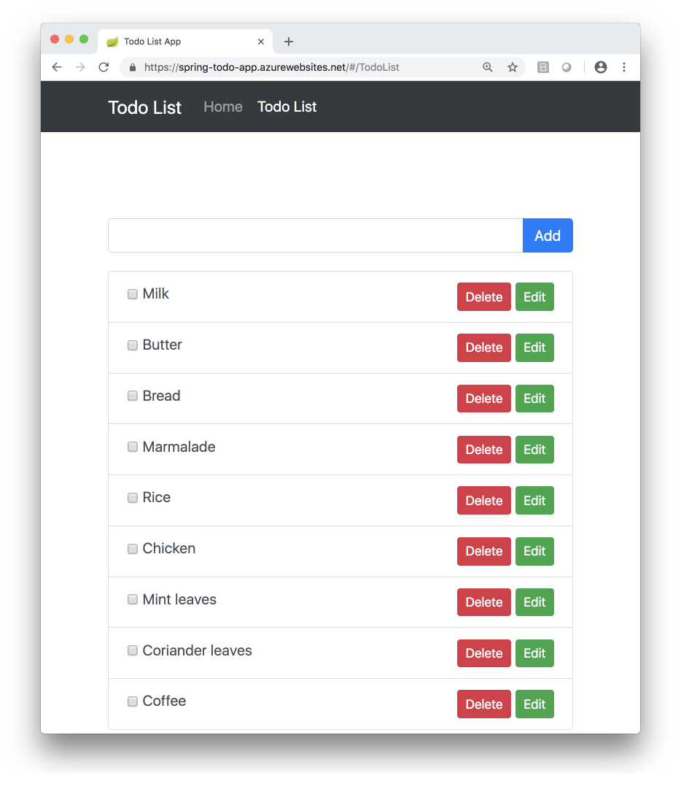

# Tutorial: Build a Java Spring Boot web app with Azure App Service on Linux and Azure Cosmos DB

This tutorial walks you through the process of building, configuring, deploying, and scaling Java web apps on Azure. 
When you are finished, you will have a [Spring Boot](https://spring.io/projects/spring-boot) application storing data in [Azure Cosmos DB](../cosmos-db/index.yml) running on [Azure App Service on Linux](overview.md).


In this tutorial, you learn how to:

> [!div class="checklist"]
> * Create an Azure Cosmos DB database.
> * Connect a sample app to the database and test it locally
> * Deploy the sample app to Azure
> * Stream diagnostic logs from App Service
> * Add additional instances to scale out the sample app

[!INCLUDE [quickstarts-free-trial-note](../../includes/quickstarts-free-trial-note.md)]

## Prerequisites

* [Azure CLI](/cli/azure/overview), installed on your own computer. 
* [Git](https://git-scm.com/)
* [Java JDK](/azure/developer/java/fundamentals/java-support-on-azure)
* [Maven](https://maven.apache.org)

## Clone the sample TODO app and prepare the repo

This tutorial uses a sample TODO list app with a web UI that calls a Spring REST API backed by [Spring Data for Azure Cosmos DB](https://github.com/Microsoft/spring-data-cosmosdb). The code for the app is available [on GitHub](https://github.com/Microsoft/spring-todo-app). To learn more about writing Java apps using Spring and Azure Cosmos DB, see the [Spring Boot Starter with the Azure Cosmos DB for NoSQL tutorial](/java/azure/spring-framework/configure-spring-boot-starter-java-app-with-cosmos-db) and the [Spring Data for Azure Cosmos DB quick start](https://github.com/Microsoft/spring-data-cosmosdb#quick-start).

Run the following commands in your terminal to clone the sample repo and set up the sample app environment.

```bash
git clone --recurse-submodules https://github.com/Azure-Samples/e2e-java-experience-in-app-service-linux-part-2.git
cd e2e-java-experience-in-app-service-linux-part-2
yes | cp -rf .prep/* .
```

## Create an Azure Cosmos DB

Follow these steps to create an Azure Cosmos DB database in your subscription. The TODO list app will connect to this database and store its data when running, persisting the application state no matter where you run the application.

1. Login to your Azure CLI, and optionally set your subscription if you have more than one connected to your login credentials.

    ```azurecli
    az login
    az account set -s <your-subscription-id>
    ```   

2. Create an Azure Resource Group, noting the resource group name.

    ```azurecli
    az group create -n <your-azure-group-name> \
        -l <your-resource-group-region>
    ```

3. Create Azure Cosmos DB with the `GlobalDocumentDB` kind. 
The name of the Azure Cosmos DB instance must use only lower case letters. Note down the `documentEndpoint` field in the response from the command.

    ```azurecli
    az cosmosdb create --kind GlobalDocumentDB \
        -g <your-azure-group-name> \
        -n <your-azure-COSMOS-DB-name-in-lower-case-letters>
    ```

4. Get your Azure Cosmos DB key to connect to the app. Keep the `primaryMasterKey`, `documentEndpoint` nearby as you'll need them in the next step.

    ```azurecli
    az cosmosdb keys list -g <your-azure-group-name> -n <your-azure-COSMOSDB-name>
    ```

## Configure the TODO app properties

Open a terminal on your computer. Copy the sample script file in the cloned repo so you can customize it for the Azure Cosmos DB database you just created.

```bash
cd initial/spring-todo-app
cp set-env-variables-template.sh .scripts/set-env-variables.sh
```
 
Edit `.scripts/set-env-variables.sh` in your favorite editor and supply Azure 
Azure Cosmos DB connection info. For the App Service Linux configuration, use the same region as before (`your-resource-group-region`) and resource group (`your-azure-group-name`) used when creating the Azure Cosmos DB database. Choose a WEBAPP_NAME that is unique since it cannot duplicate any web app name in any Azure deployment.

```bash
export COSMOSDB_URI=<put-your-COSMOS-DB-documentEndpoint-URI-here>
export COSMOSDB_KEY=<put-your-COSMOS-DB-primaryMasterKey-here>
export COSMOSDB_DBNAME=<put-your-COSMOS-DB-name-here>

# App Service Linux Configuration
export RESOURCEGROUP_NAME=<put-your-resource-group-name-here>
export WEBAPP_NAME=<put-your-Webapp-name-here>
export REGION=<put-your-REGION-here>
```

Then run the script:

```bash
source .scripts/set-env-variables.sh
```
   
These environment variables are used in `application.properties` in the TODO list app. The fields in the properties file set up a default repository configuration for Spring Data:

```properties
azure.cosmosdb.uri=${COSMOSDB_URI}
azure.cosmosdb.key=${COSMOSDB_KEY}
azure.cosmosdb.database=${COSMOSDB_DBNAME}
```

```java
@Repository
public interface TodoItemRepository extends DocumentDbRepository<TodoItem, String> {
}
```

Then the sample app uses the `@Document` annotation imported from `com.microsoft.azure.spring.data.cosmosdb.core.mapping.Document` to set up an entity type to be stored and managed by Azure Cosmos DB:

```java
@Document
public class TodoItem {
    private String id;
    private String description;
    private String owner;
    private boolean finished;
```

## Run the sample app

Use Maven to run the sample.

```bash
mvn package spring-boot:run
```

The output should look like the following.

```output
bash-3.2$ mvn package spring-boot:run
[INFO] Scanning for projects...
[INFO] 
[INFO] ------------------------------------------------------------------------
[INFO] Building spring-todo-app 2.0-SNAPSHOT
[INFO] ------------------------------------------------------------------------
[INFO] 


[INFO] SimpleUrlHandlerMapping - Mapped URL path [/webjars/**] onto handler of type [class org.springframework.web.servlet.resource.ResourceHttpRequestHandler]
[INFO] SimpleUrlHandlerMapping - Mapped URL path [/**] onto handler of type [class org.springframework.web.servlet.resource.ResourceHttpRequestHandler]
[INFO] WelcomePageHandlerMapping - Adding welcome page: class path resource [static/index.html]
2018-10-28 15:04:32.101  INFO 7673 --- [           main] c.m.azure.documentdb.DocumentClient      : Initializing DocumentClient with serviceEndpoint [https://sample-cosmos-db-westus.documents.azure.com:443/], ConnectionPolicy [ConnectionPolicy [requestTimeout=60, mediaRequestTimeout=300, connectionMode=Gateway, mediaReadMode=Buffered, maxPoolSize=800, idleConnectionTimeout=60, userAgentSuffix=;spring-data/2.0.6;098063be661ab767976bd5a2ec350e978faba99348207e8627375e8033277cb2, retryOptions=com.microsoft.azure.documentdb.RetryOptions@6b9fb84d, enableEndpointDiscovery=true, preferredLocations=null]], ConsistencyLevel [null]
[INFO] AnnotationMBeanExporter - Registering beans for JMX exposure on startup
[INFO] TomcatWebServer - Tomcat started on port(s): 8080 (http) with context path ''
[INFO] TodoApplication - Started TodoApplication in 45.573 seconds (JVM running for 76.534)
```

You can access Spring TODO App locally using this link once the app is started: `http://localhost:8080/`.

 

If you see exceptions instead of the "Started TodoApplication" message, check that the `bash` script in the previous step exported the environment variables properly and that the values are correct for the Azure Cosmos DB database you created.

## Configure Azure deployment

Open the `pom.xml` file in the `initial/spring-boot-todo` directory and add the following  [Azure Web App Plugin for Maven](https://github.com/Microsoft/azure-maven-plugins/blob/develop/azure-webapp-maven-plugin/README.md) configuration.

```xml    
<plugins> 

    <!--*************************************************-->
    <!-- Deploy to Java SE in App Service Linux           -->
    <!--*************************************************-->
       
    <plugin>
        <groupId>com.microsoft.azure</groupId>
        <artifactId>azure-webapp-maven-plugin</artifactId>
        <version>2.5.0</version>
        <configuration>
            <schemaVersion>v2</schemaVersion>

            <!-- Web App information -->
            <resourceGroup>${RESOURCEGROUP_NAME}</resourceGroup>
            <appName>${WEBAPP_NAME}</appName>
            <region>${REGION}</region>
            <pricingTier>P1v2</pricingTier>
            <!-- Java Runtime Stack for Web App on Linux-->
            <runtime>
                 <os>linux</os>
                 <javaVersion>Java 8</javaVersion>
                 <webContainer>Java SE</webContainer>
             </runtime>
             <deployment>
                 <resources>
                 <resource>
                     <directory>${project.basedir}/target</directory>
                     <includes>
                     <include>*.jar</include>
                     </includes>
                 </resource>
                 </resources>
             </deployment>

            <appSettings>
                <property>
                    <name>COSMOSDB_URI</name>
                    <value>${COSMOSDB_URI}</value>
                </property> 
                <property>
                    <name>COSMOSDB_KEY</name>
                    <value>${COSMOSDB_KEY}</value>
                </property>
                <property>
                    <name>COSMOSDB_DBNAME</name>
                    <value>${COSMOSDB_DBNAME}</value>
                </property>
                <property>
                    <name>JAVA_OPTS</name>
                    <value>-Dserver.port=80</value>
                </property>
            </appSettings>

        </configuration>
    </plugin>           
    ...
</plugins>
```

## Deploy to App Service on Linux

Use the `mvn azure-webapp:deploy` Maven goal to deploy the TODO app to Azure App Service on Linux.

```bash

# Deploy
bash-3.2$ mvn azure-webapp:deploy
[INFO] Scanning for projects...
[INFO] 
[INFO] ------------------------------------------------------------------------
[INFO] Building spring-todo-app 2.0-SNAPSHOT
[INFO] ------------------------------------------------------------------------
[INFO] 
[INFO] --- azure-webapp-maven-plugin:2.5.0:deploy (default-cli) @ spring-todo-app ---
Auth Type: AZURE_CLI
Default subscription: xxxxxxxxx
Username: xxxxxxxxx
[INFO] Subscription: xxxxxxxxx
[INFO] Creating App Service Plan 'ServicePlanb6ba8178-5bbb-49e7'...
[INFO] Successfully created App Service Plan.
[INFO] Creating web App spring-todo-app...
[INFO] Successfully created Web App spring-todo-app.
[INFO] Trying to deploy artifact to spring-todo-app...
[INFO] Successfully deployed the artifact to https://spring-todo-app.azurewebsites.net
[INFO] ------------------------------------------------------------------------
[INFO] BUILD SUCCESS
[INFO] ------------------------------------------------------------------------
[INFO] Total time: 02:19 min
[INFO] Finished at: 2019-11-06T15:32:03-07:00
[INFO] Final Memory: 50M/574M
[INFO] ------------------------------------------------------------------------
```

The output contains the URL to your deployed application (in this example, `https://spring-todo-app.azurewebsites.net`). You can copy this URL into your web browser or run the following command in your Terminal window to load your app.

```bash
explorer https://spring-todo-app.azurewebsites.net
```

You should see the app running with the remote URL in the address bar:

 

## Stream diagnostic logs

[!INCLUDE [Access diagnostic logs](../../includes/app-service-web-logs-access-no-h.md)]


## Scale out the TODO App

Scale out the application by adding another worker:

```azurecli
az appservice plan update --number-of-workers 2 \
   --name ${WEBAPP_PLAN_NAME} \
   --resource-group <your-azure-group-name>
```

## Clean up resources

If you don't need these resources for another tutorial (see [Next steps](#next)), you can delete them by running the following command in the Cloud Shell:
```azurecli
az group delete --name <your-azure-group-name> --yes
```

<a name="next"></a>

## Next steps

[Azure for Java Developers](/java/azure/)
[Spring Boot](https://spring.io/projects/spring-boot), 
[Spring Data for Azure Cosmos DB](/azure/developer/java/spring-framework/configure-spring-boot-starter-java-app-with-cosmos-db), 
[Azure Cosmos DB](../cosmos-db/introduction.md)
and
[App Service Linux](overview.md).

Learn more about running Java apps on App Service on Linux in the developer guide.

> [!div class="nextstepaction"] 
> [Java in App Service Linux dev guide](configure-language-java.md?pivots=platform-linux)

Learn how to secure your app with a custom domain and certificate.

> [!div class="nextstepaction"]
> [Secure with custom domain and certificate](tutorial-secure-domain-certificate.md)
