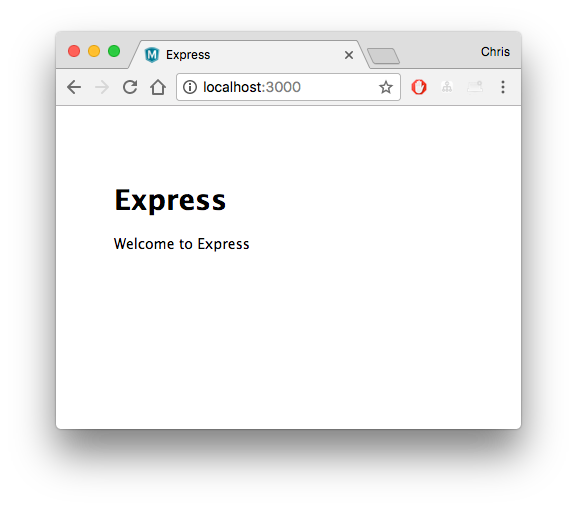

# Create your Node.js application

Next, create a Node.js application that can be deployed to the Cloud. This tutorial uses an application generator to quickly scaffold out the application from a terminal.

> [!TIP]
> If you have already completed the [Node.js tutorial](https://code.visualstudio.com/docs/nodejs/nodejs-tutorial), you can skip ahead to [Deploy the Website](./tutorial-javascript-vscode-deploy-app.md).

## Install the Express generator

[Express](https://www.expressjs.com) is a popular framework for building and running Node.js applications. You can scaffold (create) a new
Express application using the [Express Generator](https://expressjs.com/en/starter/generator.html) tool. The Express Generator is shipped as an npm module and installed by using the npm command-line tool `npm`.

```bash
npm install -g express-generator
```

The `-g` switch installs the Express Generator globally on your machine so you can run it from anywhere.

## Scaffold a new application

Next, scaffold a new Express application called `myExpressApp` by running:

```bash
express myExpressApp --view pug --git
```

The `--view pug --git` parameters tell the generator to use the [pug](https://pugjs.org/api/getting-started.html) template engine (formerly
known as `jade`) and to create a `.gitignore` file.

To install all of the application's dependencies, go to the new folder and run `npm install`.

```bash
cd myExpressApp
npm install
```

## Run the application

Last, let's ensure that the application runs. From the terminal, start the application using the `npm start` command to start the server.

```bash
npm start
```

Now, open your browser and navigate to [http://localhost:3000](http://localhost:3000), where you should see something like this:



Next, open your application folder in VS Code and get ready to deploy it to Azure.

```bash
code .
```

## Next steps

> [!div class="nextstepaction"]
> [I created the Node.js application](./tutorial-javascript-vscode-deploy-app.md)
> [!div class="nextstepaction"]
> [I ran into an issue](https://www.research.net/r/PWZWZ52?tutorial=node-deployment-azure-app-service&step=create-app)
