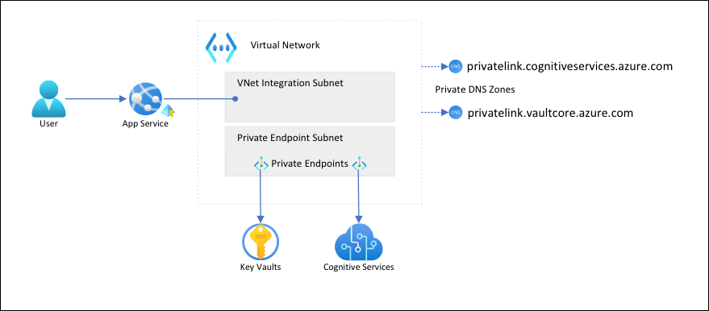

# Tutorial: Isolate back-end communication in Azure App Service with Virtual Network integration

In this article you will configure an App Service app with secure, network-isolated communication to backend services. The example scenario used is in [Tutorial: Secure Cognitive Service connection from App Service using Key Vault](tutorial-connect-msi-key-vault.md). When you're finished, you have an App Service app that accesses both Key Vault and Azure AI services through an [Azure virtual network](../virtual-network/virtual-networks-overview.md), and no other traffic is allowed to access those back-end resources. All traffic will be isolated within your virtual network using [virtual network integration](web-sites-integrate-with-vnet.md) and [private endpoints](../private-link/private-endpoint-overview.md).

As a multi-tenanted service, outbound network traffic from your App Service app to other Azure services shares the same environment with other apps or even other subscriptions. While the traffic itself can be encrypted, certain scenarios may require an extra level of security by isolating back-end communication from other network traffic. These scenarios are typically accessible to large enterprises with a high level of expertise, but App Service puts it within reach with virtual network integration.  



With this architecture: 

- Public traffic to the back-end services is blocked.
- Outbound traffic from App Service is routed to the virtual network and can reach the back-end services.
- App Service is able to perform DNS resolution to the back-end services through the private DNS zones.

What you will learn:

> [!div class="checklist"]
> * Create a virtual network and subnets for App Service virtual network integration
> * Create private DNS zones
> * Create private endpoints
> * Configure virtual network integration in App Service

## Prerequisites

The tutorial assumes that you have followed the [Tutorial: Secure Cognitive Service connection from App Service using Key Vault](tutorial-connect-msi-key-vault.md) and created the language detector app. 

The tutorial continues to use the following environment variables from the previous tutorial. Make sure you set them properly.

```azurecli-interactive
    groupName=myKVResourceGroup
    region=westeurope
    csResourceName=<cs-resource-name>
    appName=<app-name>
    vaultName=<vault-name>
```

## Create virtual network and subnets

1. Create a virtual network. Replace *\<virtual-network-name>* with a unique name.

    ```azurecli-interactive
    # Save vnet name as variable for convenience
    vnetName=<virtual-network-name>

    az network vnet create --resource-group $groupName --location $region --name $vnetName --address-prefixes 10.0.0.0/16
    ```

1. Create a subnet for the App Service virtual network integration.

    ```azurecli-interactive
    az network vnet subnet create --resource-group $groupName --vnet-name $vnetName --name vnet-integration-subnet --address-prefixes 10.0.0.0/24 --delegations Microsoft.Web/serverfarms --disable-private-endpoint-network-policies false
    ```

    For App Service, the virtual network integration subnet is recommended to have a CIDR block of `/26` at a minimum (see [Virtual network integration subnet requirements](overview-vnet-integration.md#subnet-requirements)). `/24` is more than sufficient. `--delegations Microsoft.Web/serverfarms` specifies that the subnet is [delegated for App Service virtual network integration](../virtual-network/subnet-delegation-overview.md).

1. Create another subnet for the private endpoints.

    ```azurecli-interactive
    az network vnet subnet create --resource-group $groupName --vnet-name $vnetName --name private-endpoint-subnet --address-prefixes 10.0.1.0/24 --disable-private-endpoint-network-policies true
    ```

    For private endpoint subnets, you must [disable private endpoint network policies](../private-link/disable-private-endpoint-network-policy.md).

## Create private DNS zones

Because your Key Vault and Azure AI services resources will sit behind [private endpoints](../private-link/private-endpoint-overview.md), you need to define [private DNS zones](../dns/private-dns-privatednszone.md) for them. These zones are used to host the DNS records for private endpoints and allow the clients to find the back-end services by name. 

1. Create two private DNS zones, one for your Azure AI services resource and one for your key vault.

    ```azurecli-interactive
    az network private-dns zone create --resource-group $groupName --name privatelink.cognitiveservices.azure.com
    az network private-dns zone create --resource-group $groupName --name privatelink.vaultcore.azure.net
    ```

    For more information on these settings, see [Azure Private Endpoint DNS configuration](../private-link/private-endpoint-dns.md#azure-services-dns-zone-configuration)

1. Link the private DNS zones to the virtual network.

    ```azurecli-interactive
    az network private-dns link vnet create --resource-group $groupName --name cognitiveservices-zonelink --zone-name privatelink.cognitiveservices.azure.com --virtual-network $vnetName --registration-enabled False
    az network private-dns link vnet create --resource-group $groupName --name vaultcore-zonelink --zone-name privatelink.vaultcore.azure.net --virtual-network $vnetName --registration-enabled False
    ```

## Create private endpoints

1. In the private endpoint subnet of your virtual network, create a private endpoint for your Cognitive Service.

    ```azurecli-interactive
    # Get Cognitive Services resource ID
    csResourceId=$(az cognitiveservices account show --resource-group $groupName --name $csResourceName --query id --output tsv)

    az network private-endpoint create --resource-group $groupName --name securecstext-pe --location $region --connection-name securecstext-pc --private-connection-resource-id $csResourceId --group-id account --vnet-name $vnetName --subnet private-endpoint-subnet
    ```

1. Create a DNS zone group for the Azure AI services private endpoint. DNS zone group is a link between the private DNS zone and the private endpoint. This link helps you to auto update the private DNS Zone when there is an update to the private endpoint.  

    ```azurecli-interactive
    az network private-endpoint dns-zone-group create --resource-group $groupName --endpoint-name securecstext-pe --name securecstext-zg --private-dns-zone privatelink.cognitiveservices.azure.com --zone-name privatelink.cognitiveservices.azure.com
    ```

1. Block public traffic to the Azure AI services resource.

    ```azurecli-interactive
    az rest --uri $csResourceId?api-version=2021-04-30 --method PATCH --body '{"properties":{"publicNetworkAccess":"Disabled"}}' --headers 'Content-Type=application/json'

    # Repeat following command until output is "Succeeded"
    az cognitiveservices account show --resource-group $groupName --name $csResourceName --query properties.provisioningState
    ```

    > [!NOTE]
    > Make sure the provisioning state of your change is `"Succeeded"`. Then you can observe the behavior change in the sample app. You can still load the app, but if you try click the **Detect** button, you get an `HTTP 500` error. The app has lost its connectivity to the Azure AI services resource through the shared networking.

1. Repeat the steps above for the key vault.

    ```azurecli-interactive
    # Create private endpoint for key vault
    vaultResourceId=$(az keyvault show --name $vaultName --query id --output tsv)
    az network private-endpoint create --resource-group $groupName --name securekeyvault-pe --location $region --connection-name securekeyvault-pc --private-connection-resource-id $vaultResourceId --group-id vault --vnet-name $vnetName --subnet private-endpoint-subnet
    # Create DNS zone group for the endpoint
    az network private-endpoint dns-zone-group create --resource-group $groupName --endpoint-name securekeyvault-pe --name securekeyvault-zg --private-dns-zone privatelink.vaultcore.azure.net --zone-name privatelink.vaultcore.azure.net
    # Block public traffic to key vault
    az keyvault update --name $vaultName --default-action Deny
    ```

1. Force an immediate refetch of the [key vault references](app-service-key-vault-references.md) in your app by resetting the app settings (for more information, see [Rotation](app-service-key-vault-references.md#rotation)).

    ```azurecli-interactive
    az webapp config appsettings set --resource-group $groupName --name $appName --settings CS_ACCOUNT_NAME="@Microsoft.KeyVault(SecretUri=$csResourceKVUri)" CS_ACCOUNT_KEY="@Microsoft.KeyVault(SecretUri=$csKeyKVUri)"
    ```

    <!-- If above is not run then it takes a whole day for references to update? https://learn.microsoft.com/azure/app-service/app-service-key-vault-references#rotation -->

    > [!NOTE]
    > Again, you can observe the behavior change in the sample app. You can no longer load the app because it can no longer access the key vault references. The app has lost its connectivity to the key vault through the shared networking.

The two private endpoints are only accessible to clients inside the virtual network you created. You can't even access the secrets in the key vault through **Secrets** page in the Azure portal, because the portal accesses them through the public internet (see [Manage the locked down resources](#manage-the-locked-down-resources)).

## Configure virtual network integration in your app

1. Scale the app up to a supported pricing tier (see [Integrate your app with an Azure virtual network](overview-vnet-integration.md)).

    ```azurecli-interactive
    az appservice plan update --name $appName --resource-group $groupName --sku S1
    ```

1. Unrelated to our scenario but also important, enforce HTTPS for inbound requests.

    ```azurecli-interactive
    az webapp update --resource-group $groupName --name $appName --https-only
    ```

1. Enable virtual network integration on your app.

    ```azurecli-interactive
    az webapp vnet-integration add --resource-group $groupName --name $appName --vnet $vnetName --subnet vnet-integration-subnet
    ```
    
    Virtual network integration allows outbound traffic to flow directly into the virtual network. By default, only local IP traffic defined in [RFC-1918](https://tools.ietf.org/html/rfc1918#section-3) is routed to the virtual network, which is what you need for the private endpoints. To route all your traffic to the virtual network, see [Manage virtual network integration routing](configure-vnet-integration-routing.md). Routing all traffic can also be used if you want to route internet traffic through your virtual network, such as through an [Azure Virtual Network NAT](../virtual-network/nat-gateway/nat-overview.md) or an [Azure Firewall](../firewall/overview.md).

1. In the browser, navigate to `<app-name>.azurewebsites.net` again and wait for the integration to take effect. If you get an HTTP 500 error, wait a few minutes and try again. If you can load the page and get detection results, then you're connecting to the Azure AI services endpoint with key vault references.

    >[!NOTE]
    > If keep getting HTTP 500 errors after a long time, it may help to force a refetch of the [key vault references](app-service-key-vault-references.md) again, like so:
    >
    > ```azurecli-interactive
    > az webapp config appsettings set --resource-group $groupName --name $appName --settings CS_ACCOUNT_NAME="@Microsoft.KeyVault(SecretUri=$csResourceKVUri)" CS_ACCOUNT_KEY="@Microsoft.KeyVault(SecretUri=$csKeyKVUri)"
    > ```


## Manage the locked down resources

Depending on your scenarios, you may not be able to manage the private endpoint protected resources through the Azure portal, Azure CLI, or Azure PowerShell (for example, Key Vault). These tools all make REST API calls to access the resources through the public internet, and are blocked by your configuration. Here are a few options for accessing the locked down resources:

- For Key Vault, add the public IP of your local machine to view or update the private endpoint protected secrets.
- If your on premises network is extended into the Azure virtual network through a [VPN gateway](../vpn-gateway/vpn-gateway-about-vpngateways.md) or [ExpressRoute](../expressroute/expressroute-introduction.md), you can manage the private endpoint protected resources directly from your on premises network. 
- Manage the private endpoint protected resources from a [jump server](https://wikipedia.org/wiki/Jump_server) in the virtual network.
- [Deploy Cloud Shell into the virtual network](../cloud-shell/private-vnet.md).

## Clean up resources

In the preceding steps, you created Azure resources in a resource group. If you don't expect to need these resources in the future, delete the resource group by running the following command in the Cloud Shell:

```azurecli-interactive
az group delete --name $groupName
```

This command may take a minute to run.

## Next steps

- [Integrate your app with an Azure virtual network](overview-vnet-integration.md)
- [App Service networking features](networking-features.md)
