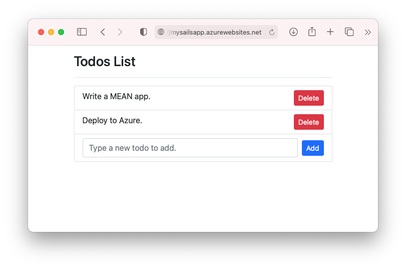
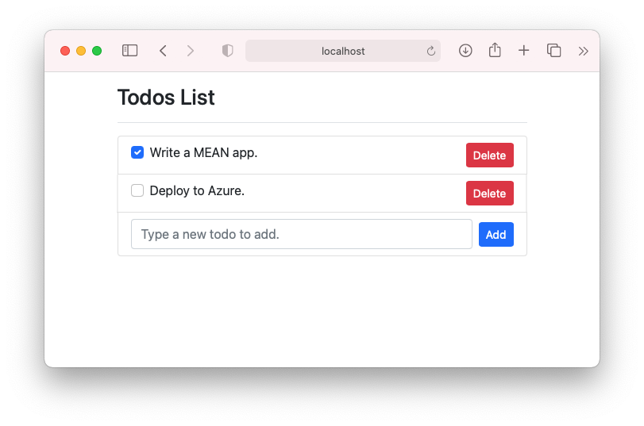
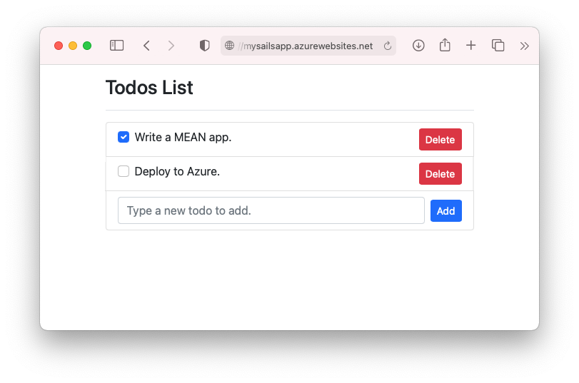
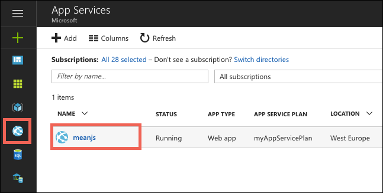
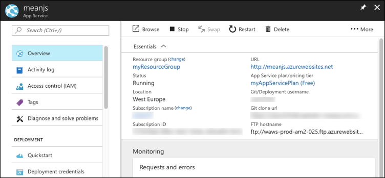

# Tutorial: Build a Node.js and MongoDB app in Azure

::: zone pivot="platform-windows"  

[Azure App Service](overview.md) provides a highly scalable, self-patching web hosting service. This tutorial shows how to create a Node.js app in App Service on Windows and connect it to a MongoDB database. When you're done, you'll have a MEAN application (MongoDB, Express, AngularJS, and Node.js) running in [Azure App Service](overview.md). The sample application uses a combination of [Sails.js](https://sailsjs.com/) and [Angular 12](https://angular.io/).

::: zone-end

::: zone pivot="platform-linux"


[Azure App Service](overview.md) provides a highly scalable, self-patching web hosting service using the Linux operating system. This tutorial shows how to create a Node.js app in App Service on Linux, connect it locally to a MongoDB database, then deploy it to a database in Azure Cosmos DB's API for MongoDB. When you're done, you'll have a MEAN application (MongoDB, Express, AngularJS, and Node.js) running in App Service on Linux. The sample application uses a combination of [Sails.js](https://sailsjs.com/) and [Angular 12](https://angular.io/).

::: zone-end



What you'll learn:

> [!div class="checklist"]
> * Create a MongoDB database in Azure
> * Connect a Node.js app to MongoDB
> * Deploy the app to Azure
> * Update the data model and redeploy the app
> * Stream diagnostic logs from Azure
> * Manage the app in the Azure portal

[!INCLUDE [quickstarts-free-trial-note](../../includes/quickstarts-free-trial-note.md)]

## Prerequisites

To complete this tutorial:

- [Install Git](https://git-scm.com/)
- [Install Node.js and NPM](https://nodejs.org/)
[!INCLUDE [azure-cli-prepare-your-environment-no-header.md](../../includes/azure-cli-prepare-your-environment-no-header.md)] 

## Create local Node.js app

In this step, you set up the local Node.js project.

### Clone the sample application

In the terminal window, `cd` to a working directory.  

Run the following command to clone the sample repository. 

```bash
git clone https://github.com/Azure-Samples/mean-todoapp.git
```

> [!NOTE]
> For information on how the sample app is created, see [https://github.com/Azure-Samples/mean-todoapp](https://github.com/Azure-Samples/mean-todoapp).

### Run the application

Run the following commands to install the required packages and start the application.

```bash
cd mean-todoapp
npm install
node app.js --alter
```

When the app is fully loaded, you see something similar to the following message:

<pre>
debug: -------------------------------------------------------
debug: :: Fri Jul 09 2021 13:10:34 GMT+0200 (Central European Summer Time)

debug: Environment : development
debug: Port        : 1337
debug: -------------------------------------------------------
</pre>

Navigate to `http://localhost:1337` in a browser. Add a few todo items.

The MEAN sample application stores user data in the database. By default, it uses a disk-based development database. If you can create and see todo items, then your app is reading and writing data.


To stop Node.js at any time, press `Ctrl+C` in the terminal. 

## Create production MongoDB

In this step, you create a MongoDB database in Azure. When your app is deployed to Azure, it uses this cloud database.

For MongoDB, this tutorial uses [Azure Cosmos DB](../cosmos-db/index.yml). Cosmos DB supports MongoDB client connections.

### Create a resource group

[!INCLUDE [Create resource group](../../includes/app-service-web-create-resource-group-no-h.md)] 

### Create a Cosmos DB account

> [!NOTE]
> There is a cost to creating the Azure Cosmos DB databases in this tutorial in your own Azure subscription. To use a free Azure Cosmos DB account for seven days, you can use the [Try Azure Cosmos DB for free](https://azure.microsoft.com/try/cosmosdb/) experience. Just click the **Create** button in the MongoDB tile to create a free MongoDB database on Azure. Once the database is created, navigate to **Connection String** in the portal and retrieve your Azure Cosmos DB connection string for use later in the tutorial.
>

In the Cloud Shell, create a Cosmos DB account with the [`az cosmosdb create`](/cli/azure/cosmosdb#az_cosmosdb_create) command.

In the following command, substitute a unique Cosmos DB name for the *\<cosmosdb-name>* placeholder. This name is used as the part of the Cosmos DB endpoint, `https://<cosmosdb-name>.documents.azure.com/`, so the name needs to be unique across all Cosmos DB accounts in Azure. The name must contain only lowercase letters, numbers, and the hyphen (-) character, and must be between 3 and 50 characters long.

```azurecli-interactive
az cosmosdb create --name <cosmosdb-name> --resource-group myResourceGroup --kind MongoDB
```

The *--kind MongoDB* parameter enables MongoDB client connections.

When the Cosmos DB account is created, the Azure CLI shows information similar to the following example:

<pre>
{
  "apiProperties": {
    "serverVersion": "3.6"
  },
  "backupPolicy": {
    "periodicModeProperties": {
      "backupIntervalInMinutes": 240,
      "backupRetentionIntervalInHours": 8,
      "backupStorageRedundancy": "Geo"
    },
    "type": "Periodic"
  },
  "capabilities": [
    {
      "name": "EnableMongo"
    }
  ],
  "connectorOffer": null,
  "consistencyPolicy": {
    "defaultConsistencyLevel": "Session",
    "maxIntervalInSeconds": 5,
    "maxStalenessPrefix": 100
  },
  "cors": [],
  "databaseAccountOfferType": "Standard",
  "defaultIdentity": "FirstPartyIdentity",
  "disableKeyBasedMetadataWriteAccess": false,
  "documentEndpoint": "https://&lt;cosmosdb-name&gt;.documents.azure.com:443/",
  ...
  &lt; Output truncated for readability &gt;
}
</pre>

## Connect app to production MongoDB

In this step, you connect your sample application to the Cosmos DB database you just created, using a MongoDB connection string. 

### Retrieve the database key

To connect to the Cosmos DB database, you need the database key. In the Cloud Shell, use the [`az cosmosdb keys list`](/cli/azure/cosmosdb#az_cosmosdb_keys_list) command to retrieve the primary key.

```azurecli-interactive
az cosmosdb keys list --name <cosmosdb-name> --resource-group myResourceGroup
```

The Azure CLI shows information similar to the following example:

<pre>
{
  "primaryMasterKey": "RS4CmUwzGRASJPMoc0kiEvdnKmxyRILC9BWisAYh3Hq4zBYKr0XQiSE4pqx3UchBeO4QRCzUt1i7w0rOkitoJw==",
  "primaryReadonlyMasterKey": "HvitsjIYz8TwRmIuPEUAALRwqgKOzJUjW22wPL2U8zoMVhGvregBkBk9LdMTxqBgDETSq7obbwZtdeFY7hElTg==",
  "secondaryMasterKey": "Lu9aeZTiXU4PjuuyGBbvS1N9IRG3oegIrIh95U6VOstf9bJiiIpw3IfwSUgQWSEYM3VeEyrhHJ4rn3Ci0vuFqA==",
  "secondaryReadonlyMasterKey": "LpsCicpVZqHRy7qbMgrzbRKjbYCwCKPQRl0QpgReAOxMcggTvxJFA94fTi0oQ7xtxpftTJcXkjTirQ0pT7QFrQ=="
}
</pre>

Copy the value of `primaryMasterKey`. You need this information in the next step.

<a name="devconfig"></a>
### Configure the connection string in your sample application

In your local repository, in _config/datastores.js_, replace the existing content with the following code and save your changes.

```javascript
module.exports.datastores = {
  default: {
    adapter: 'sails-mongo',
    url: process.env.MONGODB_URI,
    ssl: true,
  },
};
```

The `ssl: true` option is required because [Cosmos DB requires TLS/SSL](../cosmos-db/connect-mongodb-account.md#connection-string-requirements). `url` is set to an environment variable, which you will set next. 

In the terminal, set the `MONGODB_URI` environment variable. Be sure to replace the two \<cosmosdb-name> placeholders with your Cosmos DB database name, and replace the \<cosmosdb-key> placeholder with the key you copied in the previous step.

```bash
export MONGODB_URI=mongodb://<cosmosdb-name>:<cosmosdb-key>@<cosmosdb-name>.documents.azure.com:10250/todoapp
```

> [!NOTE]
> This connection string follows the format defined in the [Sails.js documentation](https://sailsjs.com/documentation/reference/configuration/sails-config-datastores#?the-connection-url).

### Test the application with MongoDB

In a local terminal window, run `node app.js --alter` again.

```bash
node app.js --alter
```

Navigate to `http://localhost:1337` again. If you can create and see todo items, then your app is reading and writing data using the Cosmos DB database in Azure. 

In the terminal, stop Node.js by typing `Ctrl+C`. 

## Deploy app to Azure

In this step, you deploy your MongoDB-connected Node.js application to Azure App Service.

### Configure a deployment user

[!INCLUDE [Configure deployment user](../../includes/configure-deployment-user-no-h.md)]

### Create an App Service plan

::: zone pivot="platform-windows"  

In the Cloud Shell, create an App Service plan with the [`az appservice plan create`](/cli/azure/appservice/plan) command.

The following example creates an App Service plan named `myAppServicePlan` in the **B1** pricing tier:

```azurecli-interactive
az appservice plan create --name myAppServicePlan --resource-group myResourceGroup --sku B1
```

When the App Service plan has been created, the Azure CLI shows information similar to the following example:

<pre>
{ 
  "freeOfferExpirationTime": null,
  "geoRegion": "UK West",
  "hostingEnvironmentProfile": null,
  "hyperV": false,
  "id": "/subscriptions/0000-0000/resourceGroups/myResourceGroup/providers/Microsoft.Web/serverfarms/myAppServicePlan",
  "isSpot": false,
  "isXenon": false,
  "kind": "app",
  "location": "ukwest",
  "maximumElasticWorkerCount": 1,
  "maximumNumberOfWorkers": 0,
  &lt; JSON data removed for brevity. &gt;
} 
</pre>

::: zone-end

::: zone pivot="platform-linux"

In the Cloud Shell, create an App Service plan with the [`az appservice plan create`](/cli/azure/appservice/plan) command.

<!-- [!INCLUDE [app-service-plan](app-service-plan.md)] -->

The following example creates an App Service plan named `myAppServicePlan` in the **B1** pricing tier:

```azurecli-interactive
az appservice plan create --name myAppServicePlan --resource-group myResourceGroup --sku B1 --is-linux
```

When the App Service plan has been created, the Azure CLI shows information similar to the following example:

<pre>
{ 
  "freeOfferExpirationTime": null,
  "geoRegion": "West Europe",
  "hostingEnvironmentProfile": null,
  "id": "/subscriptions/0000-0000/resourceGroups/myResourceGroup/providers/Microsoft.Web/serverfarms/myAppServicePlan",
  "kind": "linux",
  "location": "West Europe",
  "maximumNumberOfWorkers": 1,
  "name": "myAppServicePlan",
  &lt; JSON data removed for brevity. &gt;
  "targetWorkerSizeId": 0,
  "type": "Microsoft.Web/serverfarms",
  "workerTierName": null
} 
</pre>

::: zone-end

<a name="create"></a>
### Create a web app

::: zone pivot="platform-windows"  

[!INCLUDE [Create web app](../../includes/app-service-web-create-web-app-nodejs-no-h.md)] 

::: zone-end

::: zone pivot="platform-linux"

[!INCLUDE [Create web app](../../includes/app-service-web-create-web-app-nodejs-linux-no-h.md)] 

::: zone-end

### Configure an environment variable

Remember that the sample application is already configured to use the `MONGODB_URI` environment variable in `config/datastores.js`. In App Service, you inject this variable by using an [app setting](configure-common.md#configure-app-settings). 

To set app settings, use the [`az webapp config appsettings set`](/cli/azure/webapp/config/appsettings#az_webapp_config_appsettings_set) command in the Cloud Shell. 

The following example configures a `MONGODB_URI` app setting in your Azure app. Replace the *\<app-name>*, *\<cosmosdb-name>*, and *\<cosmosdb-key>* placeholders.

```azurecli-interactive
az webapp config appsettings set --name <app-name> --resource-group myResourceGroup --settings MONGODB_URI='mongodb://<cosmosdb-name>:<cosmosdb-key>@<cosmosdb-name>.documents.azure.com:10250/todoapp' DEPLOYMENT_BRANCH='main'
```

> [!NOTE]
> `DEPLOYMENT_BRANCH` is a special app setting that tells the deployment engine which Git branch you're deploying to in App Service.

### Push to Azure from Git

[!INCLUDE [app-service-plan-no-h](../../includes/app-service-web-git-push-to-azure-no-h.md)]

::: zone pivot="platform-windows"

<pre>
Enumerating objects: 5, done.
Counting objects: 100% (5/5), done.
Delta compression using up to 8 threads
Compressing objects: 100% (3/3), done.
Writing objects: 100% (3/3), 318 bytes | 318.00 KiB/s, done.
Total 3 (delta 2), reused 0 (delta 0), pack-reused 0
remote: Updating branch 'main'.
remote: Updating submodules.
remote: Preparing deployment for commit id '4eb0ca7190'.
remote: Generating deployment script.
remote: Running deployment command...
remote: Handling node.js deployment.
remote: Creating app_offline.htm
remote: KuduSync.NET from: 'D:\home\site\repository' to: 'D:\home\site\wwwroot'
remote: Copying file: 'package.json'
remote: Deleting app_offline.htm
remote: Looking for app.js/server.js under site root.
remote: Using start-up script app.js
remote: Generated web.config.
.
.
.
remote: Deployment successful.
To https://&lt;app-name&gt;.scm.azurewebsites.net/&lt;app-name&gt;.git
 * [new branch]      main -> main
</pre>

> [!TIP]
> During Git deployment, the deployment engine runs `npm install --production` as part of its build automation.
>
> - As defined in `package.json`, the `postinstall` script is picked up by `npm install` and runs `ng build` to generate the production files for Angular and deploy them to the [assets](https://sailsjs.com/documentation/concepts/assets) folder.
> - `scripts` in `package.json` can use tools that are installed in `node_modules/.bin`. Since `npm install` has installed `node_modules/.bin/ng` too, you can use it to deploy your Angular client files. This npm behavior is exactly the same in Azure App Service.
> Packages under `devDependencies` in `package.json` are not installed. Any package you need in the production environment needs to be moved under `dependencies`.
>
> If your app needs to bypass the default automation and run custom automation, see [Run Grunt/Bower/Gulp](configure-language-nodejs.md#run-gruntbowergulp).

::: zone-end

::: zone pivot="platform-linux"

<pre>
Enumerating objects: 5, done.
Counting objects: 100% (5/5), done.
Delta compression using up to 8 threads
Compressing objects: 100% (3/3), done.
Writing objects: 100% (3/3), 347 bytes | 347.00 KiB/s, done.
Total 3 (delta 2), reused 0 (delta 0), pack-reused 0
remote: Deploy Async
remote: Updating branch 'main'.
remote: Updating submodules.
remote: Preparing deployment for commit id 'f776be774a'.
remote: Repository path is /home/site/repository
remote: Running oryx build...
remote: Operation performed by Microsoft Oryx, https://github.com/Microsoft/Oryx
remote: You can report issues at https://github.com/Microsoft/Oryx/issues
remote: 
remote: Oryx Version: 0.2.20210420.1, Commit: 85c6e9278aae3980b86cb1d520aaad532c814ed7, ReleaseTagName: 20210420.1
remote: 
remote: Build Operation ID: |qwejn9R4StI=.5e8a3529_
remote: Repository Commit : f776be774a3ea8abc48e5ee2b5132c037a636f73
.
.
.
remote: Deployment successful.
remote: Deployment Logs : 'https://&lt;app-name&gt;.scm.azurewebsites.net/newui/jsonviewer?view_url=/api/deployments/a6fcf811136739f145e0de3be82ff195bca7a68b/log'
To https://&lt;app-name&gt;.scm.azurewebsites.net/&lt;app-name&gt;.git
   4f7e3ac..a6fcf81  main -> main
</pre>

> [!TIP]
> During Git deployment, the deployment engine runs `npm install` as part of its build automation.
>
> - As defined in `package.json`, the `postinstall` script is picked up by `npm install` and runs `ng build` to generate the production files for Angular and deploy them to the [assets](https://sailsjs.com/documentation/concepts/assets) folder.
> - `scripts` in `package.json` can use tools that are installed in `node_modules/.bin`. Since `npm install` has installed `node_modules/.bin/ng` too, you can use it to deploy your Angular client files. This npm behavior is exactly the same in Azure App Service.
> When build automation is complete, the whole completed repository is copied into the `/home/site/wwwroot` folder, out of which your app is hosted.
>
> If your app needs to bypass the default automation and run custom automation, see [Run Grunt/Bower/Gulp](configure-language-nodejs.md#run-gruntbowergulp).

::: zone-end

### Browse to the Azure app 

Browse to the deployed app using your web browser. 

```bash 
https://<app-name>.azurewebsites.net 
``` 

If you can create and see todo items in the browser, then your sample app in Azure has connectivity to the MongoDB (Cosmos DB) database. 


**Congratulations!** You're running a data-driven Node.js app in Azure App Service.

## Update data model and redeploy

In this step, you change the `Todo` data model and publish your change to Azure.

### Update the server-side model

In Sails.js, changing the server-side model and API code is as simple as changing the data model, because [Sails.js already defines the common routes](https://sailsjs.com/documentation/concepts/blueprints/blueprint-routes#?restful-routes) for a model by default. 

In your local repository, open _api/models/Todo.js_ and add a `done` attribute. When you're done, your schema code should look like this:

```javascript
module.exports = {

  attributes: {
    value: {type: 'string'},
    done: {type: 'boolean', defaultsTo: false}
  },

};
```

### Update the client code

There are three files you need to modify: the client model, the HTML template, and the component file. 

Open _client/src/app/todo.ts_ and add a `done` property. When you're done, your model show look like this:

```typescript
export class Todo {
    id!: String;
    value!: String;
    done!: Boolean;
}
```

Open _client/src/app/app.component.html_. Just above the only `<span>` element, add the following code to add a checkbox at the beginning of each todo item:

```html
<input class="form-check-input me-2" type="checkbox" [checked]="todo.done" (click)="toggleDone(todo.id, i)" [disabled]="isProcessing">
```

Open _client/src/app/app.component.ts_. Just above the last closing curly brace (`}`), insert the following method. It's called by the template code above when the checkbox is clicked and updates the server-side data.

```typescript
toggleDone(id:any, i:any) {
  console.log("Toggled checkbox for " + id);
  this.isProcessing = true;
  this.Todos[i].done = !this.Todos[i].done;
  this.restService.updateTodo(id, this.Todos[i])
  .subscribe((res) => {
      console.log('Data updated successfully!');
      this.isProcessing = false;
    }, (err) => {
      console.log(err);
      this.Todos[i].done = !this.Todos[i].done;
  });
}
```

### Test your changes locally

In the local terminal window, compile the updated Angular client code with the build script defined in `package.json`.

```bash
npm run build
```

Test your changes with `node app.js --alter` again. Since you changed your server-side model, the `--alter` flag lets `Sails.js` alter the data structure in your Cosmos DB database.

```bash
node app.js --alter
```

Navigate to `http://localhost:1337`. You should now see a checkbox in front of todo item. When you select or clear a checkbox, the Cosmos DB database in Azure is updated to indicate that the todo item is done.



In the terminal, stop Node.js by typing `Ctrl+C`. 

### Publish changes to Azure

In the local terminal window, commit your changes in Git, then push the code changes to Azure.

```bash
git commit -am "added done field"
git push azure main
```

Once the `git push` is complete, navigate to your Azure app and try out the new functionality.



If you added any articles earlier, you still can see them. Existing data in your Cosmos DB is not lost. Also, your updates to the data schema and leaves your existing data intact.

## Stream diagnostic logs 

::: zone pivot="platform-windows"  

While your Node.js application runs in Azure App Service, you can get the console logs piped to your terminal. That way, you can get the same diagnostic messages to help you debug application errors.

To start log streaming, use the [`az webapp log tail`](/cli/azure/webapp/log#az_webapp_log_tail) command in the Cloud Shell.

```azurecli-interactive
az webapp log tail --name <app-name> --resource-group myResourceGroup
``` 

Once log streaming has started, refresh your Azure app in the browser to get some web traffic. You now see console logs piped to your terminal.

Stop log streaming at any time by typing `Ctrl+C`. 

::: zone-end

::: zone pivot="platform-linux"

[!INCLUDE [Access diagnostic logs](../../includes/app-service-web-logs-access-no-h.md)]

::: zone-end

## Manage your Azure app

Go to the [Azure portal](https://portal.azure.com) to see the app you created.

From the left menu, click **App Services**, then click the name of your Azure app.



By default, the portal shows your app's **Overview** page. This page gives you a view of how your app is doing. Here, you can also perform basic management tasks like browse, stop, start, restart, and delete. The tabs on the left side of the page show the different configuration pages you can open.



[!INCLUDE [cli-samples-clean-up](../../includes/cli-samples-clean-up.md)]

<a name="next"></a>
## Next steps

What you learned:

> [!div class="checklist"]
> * Create a MongoDB database in Azure
> * Connect a Node.js app to MongoDB
> * Deploy the app to Azure
> * Update the data model and redeploy the app
> * Stream logs from Azure to your terminal
> * Manage the app in the Azure portal

Advance to the next tutorial to learn how to map a custom DNS name to the app.

> [!div class="nextstepaction"] 
> [Map an existing custom DNS name to Azure App Service](app-service-web-tutorial-custom-domain.md)

Or, check out other resources:

- [Configure Node.js app](configure-language-nodejs.md)
- [Environment variables and app settings reference](reference-app-settings.md)