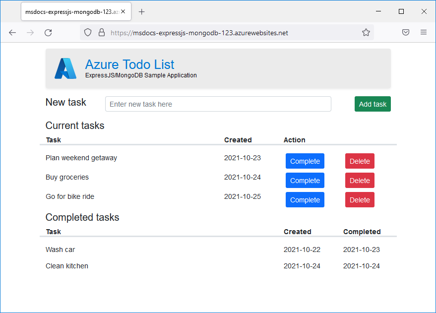
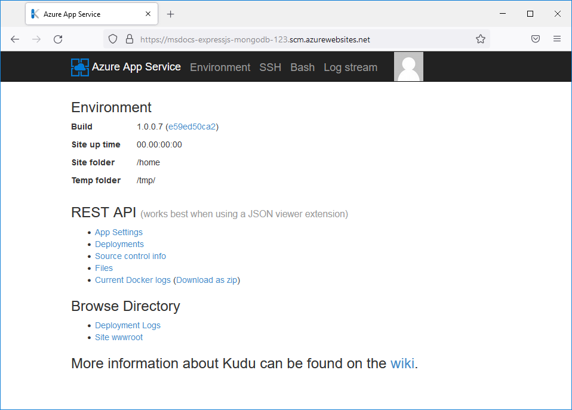
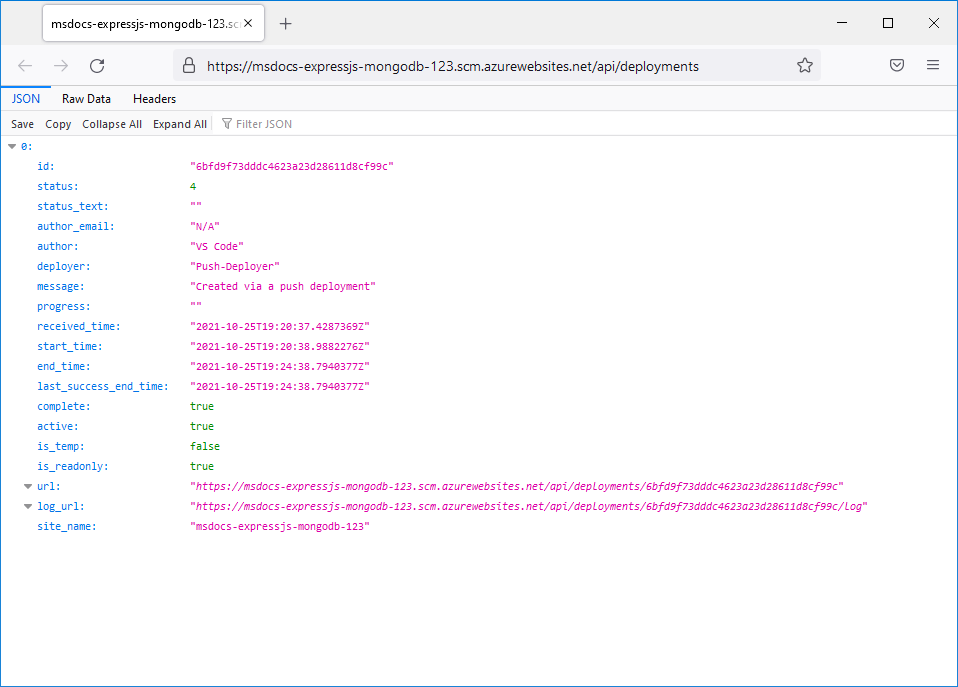
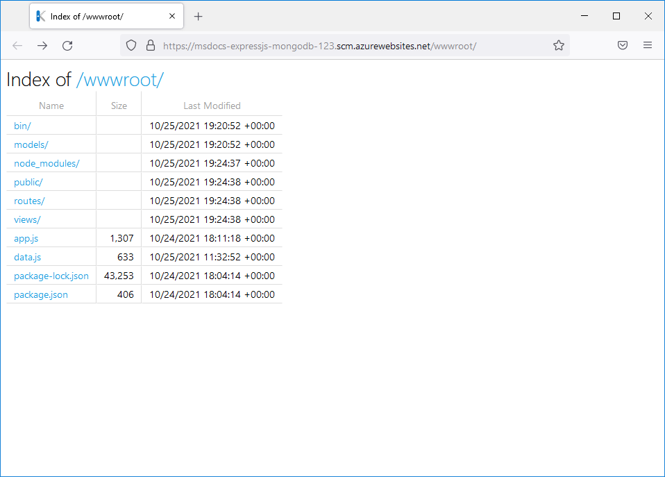

# Deploy a Node.js + MongoDB web app to Azure

In this tutorial, you'll deploy a sample **Express.js** app using a **MongoDB** database to Azure. The Express.js app will be hosted in Azure App Service, which supports hosting Node.js apps in both Linux (Node versions 12, 14, and 16) and Windows (versions 12 and 14) server environments. The MongoDB database will be hosted in Azure Cosmos DB, a cloud native database offering a [100% MongoDB compatible API](../cosmos-db/mongodb/mongodb-introduction.md).

:::image type="content" source="./media/tutorial-nodejs-mongodb-app/app-diagram.png" alt-text="A diagram showing how the Express.js app will be deployed to Azure App Service and the MongoDB data will be hosted inside of Azure Cosmos DB." lightbox="./media/tutorial-nodejs-mongodb-app/app-diagram-large.png":::

This article assumes you're already familiar with [Node.js development](/learn/paths/build-javascript-applications-nodejs/) and have Node and MongoDB installed locally. You'll also need an Azure account with an active subscription. If you don't have an Azure account, you [can create one for free](https://azure.microsoft.com/free/nodejs/).

## Sample application

To follow along with this tutorial, clone or download the sample application from the repository [https://github.com/Azure-Samples/msdocs-nodejs-mongodb-azure-sample-app](https://github.com/Azure-Samples/msdocs-nodejs-mongodb-azure-sample-app).

```bash
git clone https://github.com/Azure-Samples/msdocs-nodejs-mongodb-azure-sample-app.git
```

Follow these steps to run the application locally:

* Install the package dependencies by running `npm install`.
* Copy the `.env.sample` file to `.env` and populate the DATABASE_URL value with your MongoDB URL (for example *mongodb://localhost:27017/*).
* Start the application using `npm start`.
* To view the app, browse to `http://localhost:3000`.

## 1 - Create the Azure App Service

Azure App Service is used to host the Express.js web app. When setting up the App Service for the application, you'll specify:

* The **Name** for the web app. It's the name used as part of the DNS name for your webapp in the form of `https://<app-name>.azurewebsites.net`.
* The **Runtime** for the app. It's where you select the version of Node to use for your app.
* The **App Service plan** which defines the compute resources (CPU, memory) available for the application.
* The **Resource Group** for the app. A resource group lets you group (in a logical container) all the Azure resources needed for the application.

Create Azure resources using the [Azure portal](https://portal.azure.com/), VS Code using the [Azure Tools extension pack](https://marketplace.visualstudio.com/items?itemName=ms-vscode.vscode-node-azure-pack), or the Azure CLI.

### [Azure portal](#tab/azure-portal)

Sign in to the [Azure portal](https://portal.azure.com/) and follow these steps to create your Azure App Service resources.

| Instructions    | Screenshot |
|:----------------|-----------:|
| [!INCLUDE [Create app service step 1](<./includes/tutorial-nodejs-mongodb-app/create-app-service-azure-portal-1.md>)] | :::image type="content" source="./media/tutorial-nodejs-mongodb-app/create-app-service-azure-portal-1-240px.png" alt-text="A screenshot showing how to use the search box in the top tool bar to find App Services in Azure." lightbox="./media/tutorial-nodejs-mongodb-app/create-app-service-azure-portal-1.png"::: |
| [!INCLUDE [Create app service step 2](<./includes/tutorial-nodejs-mongodb-app/create-app-service-azure-portal-2.md>)] | :::image type="content" source="./media/tutorial-nodejs-mongodb-app/create-app-service-azure-portal-2-240px.png" alt-text="A screenshot showing the create button on the App Services page used to create a new web app." lightbox="./media/tutorial-nodejs-mongodb-app/create-app-service-azure-portal-2.png"::: |
| [!INCLUDE [Create app service step 3](<./includes/tutorial-nodejs-mongodb-app/create-app-service-azure-portal-3.md>)] | :::image type="content" source="./media/tutorial-nodejs-mongodb-app/create-app-service-azure-portal-3-240px.png" alt-text="A screenshot showing the form to fill out to create a web app in Azure." lightbox="./media/tutorial-nodejs-mongodb-app/create-app-service-azure-portal-3.png"::: |
| [!INCLUDE [Create app service step 4](<./includes/tutorial-nodejs-mongodb-app/create-app-service-azure-portal-4.md>)] | :::image type="content" source="./media/tutorial-nodejs-mongodb-app/create-app-service-azure-portal-4-240px.png" alt-text="A screenshot of the Spec Picker dialog that lets you select the App Service plan to use for your web app." lightbox="./media/tutorial-nodejs-mongodb-app/create-app-service-azure-portal-4.png"::: |
| [!INCLUDE [Create app service step 4](<./includes/tutorial-nodejs-mongodb-app/create-app-service-azure-portal-5.md>)] | :::image type="content" source="./media/tutorial-nodejs-mongodb-app/create-app-service-azure-portal-5-240px.png" alt-text="A screenshot of the main web app create page showing the button to select on to create your web app in Azure." lightbox="./media/tutorial-nodejs-mongodb-app/create-app-service-azure-portal-5.png"::: |

### [VS Code](#tab/vscode-aztools)

To create Azure resources in VS Code, you must have the [Azure Tools extension pack](https://marketplace.visualstudio.com/items?itemName=ms-vscode.vscode-node-azure-pack) installed and be signed into Azure from VS Code.

> [!div class="nextstepaction"]
> [Download Azure Tools extension pack](https://marketplace.visualstudio.com/items?itemName=ms-vscode.vscode-node-azure-pack)

| Instructions    | Screenshot |
|:----------------|-----------:|
| [!INCLUDE [Create app service step  1](<./includes/tutorial-nodejs-mongodb-app/create-app-service-visual-studio-code-01.md>)] | :::image type="content" source="./media/tutorial-nodejs-mongodb-app/create-app-service-visual-studio-code-01-240px.png" alt-text="A screenshot showing the location of the Azure Tools icon in the left toolbar." lightbox="./media/tutorial-nodejs-mongodb-app/create-app-service-visual-studio-code-01.png"::: |
| [!INCLUDE [Create app service step  2](<./includes/tutorial-nodejs-mongodb-app/create-app-service-visual-studio-code-02.md>)] | :::image type="content" source="./media/tutorial-nodejs-mongodb-app/create-app-service-visual-studio-code-02-240px.png" alt-text="A screenshot showing the App Service section of Azure Tools showing how to create a new web app." lightbox="./media/tutorial-nodejs-mongodb-app/create-app-service-visual-studio-code-02.png"::: |
| [!INCLUDE [Create app service step  3](<./includes/tutorial-nodejs-mongodb-app/create-app-service-visual-studio-code-03.md>)] | :::image type="content" source="./media/tutorial-nodejs-mongodb-app/create-app-service-visual-studio-code-03-240px.png" alt-text="A screenshot showing the dialog box used to enter the name of the web app in Azure." lightbox="./media/tutorial-nodejs-mongodb-app/create-app-service-visual-studio-code-03.png"::: |
| [!INCLUDE [Create app service step  4](<./includes/tutorial-nodejs-mongodb-app/create-app-service-visual-studio-code-04.md>)] | :::image type="content" source="./media/tutorial-nodejs-mongodb-app/create-app-service-visual-studio-code-04-240px.png" alt-text="A screenshot of dialog box used to select a resource group or create a new one for the web app." lightbox="./media/tutorial-nodejs-mongodb-app/create-app-service-visual-studio-code-04.png"::: |
| [!INCLUDE [Create app service step  5](<./includes/tutorial-nodejs-mongodb-app/create-app-service-visual-studio-code-05.md>)] | :::image type="content" source="./media/tutorial-nodejs-mongodb-app/create-app-service-visual-studio-code-05-240px.png" alt-text="A screenshot of the dialog box in VS Code used enter a name for the resource group." lightbox="./media/tutorial-nodejs-mongodb-app/create-app-service-visual-studio-code-05.png"::: |
| [!INCLUDE [Create app service step  6](<./includes/tutorial-nodejs-mongodb-app/create-app-service-visual-studio-code-06.md>)] | :::image type="content" source="./media/tutorial-nodejs-mongodb-app/create-app-service-visual-studio-code-06-240px.png" alt-text="A screenshot of the dialog box in VS Code used to select Node 14 LTS as the runtime for the web app." lightbox="./media/tutorial-nodejs-mongodb-app/create-app-service-visual-studio-code-06.png"::: |
| [!INCLUDE [Create app service step  7](<./includes/tutorial-nodejs-mongodb-app/create-app-service-visual-studio-code-07.md>)] | :::image type="content" source="./media/tutorial-nodejs-mongodb-app/create-app-service-visual-studio-code-07-240px.png" alt-text="A screenshot of the dialog in VS Code used to select operating system to use for hosting the web app." lightbox="./media/tutorial-nodejs-mongodb-app/create-app-service-visual-studio-code-07.png"::: |
| [!INCLUDE [Create app service step  8](<./includes/tutorial-nodejs-mongodb-app/create-app-service-visual-studio-code-08.md>)] | :::image type="content" source="./media/tutorial-nodejs-mongodb-app/create-app-service-visual-studio-code-08-240px.png" alt-text="A screenshot of the dialog in VS Code used to select location of the web app resources." lightbox="./media/tutorial-nodejs-mongodb-app/create-app-service-visual-studio-code-08.png"::: |
| [!INCLUDE [Create app service step  9](<./includes/tutorial-nodejs-mongodb-app/create-app-service-visual-studio-code-09.md>)] | :::image type="content" source="./media/tutorial-nodejs-mongodb-app/create-app-service-visual-studio-code-09-240px.png" alt-text="A screenshot of the dialog in VS Code used to select an App Service plan or create a new one." lightbox="./media/tutorial-nodejs-mongodb-app/create-app-service-visual-studio-code-09.png"::: |
| [!INCLUDE [Create app service step 10](<./includes/tutorial-nodejs-mongodb-app/create-app-service-visual-studio-code-10.md>)] | :::image type="content" source="./media/tutorial-nodejs-mongodb-app/create-app-service-visual-studio-code-10-240px.png" alt-text="A screenshot of the dialog in VS Code used to enter the name of the App Service plan." lightbox="./media/tutorial-nodejs-mongodb-app/create-app-service-visual-studio-code-10.png"::: |
| [!INCLUDE [Create app service step 11](<./includes/tutorial-nodejs-mongodb-app/create-app-service-visual-studio-code-11.md>)] | :::image type="content" source="./media/tutorial-nodejs-mongodb-app/create-app-service-visual-studio-code-11-240px.png" alt-text="A screenshot of the dialog in VS Code used to select the pricing tier of the App Service plan." lightbox="./media/tutorial-nodejs-mongodb-app/create-app-service-visual-studio-code-11.png"::: |
| [!INCLUDE [Create app service step 12](<./includes/tutorial-nodejs-mongodb-app/create-app-service-visual-studio-code-12.md>)] | :::image type="content" source="./media/tutorial-nodejs-mongodb-app/create-app-service-visual-studio-code-12-240px.png" alt-text="A screenshot of the dialog in VS Code asking if you want to create an App Insights resource for your web app." lightbox="./media/tutorial-nodejs-mongodb-app/create-app-service-visual-studio-code-12.png"::: |

### [Azure CLI](#tab/azure-cli)

[!INCLUDE [Create CLI](<./includes/tutorial-nodejs-mongodb-app/create-app-service-cli.md>)]

---

## 2 - Create an Azure Cosmos DB in MongoDB compatibility mode

Azure Cosmos DB is a fully managed NoSQL database for modern app development. Among its features are a 100% MongoDB compatible API allowing you to use your existing MongoDB tools, packages, and applications with Cosmos DB.

### [Azure portal](#tab/azure-portal)

You must sign in to the [Azure portal](https://portal.azure.com/) to finish these steps to create a Cosmos DB.

| Instructions    | Screenshot |
|:----------------|-----------:|
| [!INCLUDE [Create Cosmos DB step 1](<./includes/tutorial-nodejs-mongodb-app/create-cosmos-db-azure-portal-1.md>)] | :::image type="content" source="./media/tutorial-nodejs-mongodb-app/create-cosmos-db-azure-portal-1-240px.png" alt-text="A screenshot showing how to use the search box in the top tool bar to find Cosmos DB in Azure." lightbox="./media/tutorial-nodejs-mongodb-app/create-cosmos-db-azure-portal-1.png"::: |
| [!INCLUDE [Create Cosmos DB step 2](<./includes/tutorial-nodejs-mongodb-app/create-cosmos-db-azure-portal-2.md>)] | :::image type="content" source="./media/tutorial-nodejs-mongodb-app/create-cosmos-db-azure-portal-2-240px.png" alt-text="A screenshot showing the create button on the Cosmos DB page used to create a database." lightbox="./media/tutorial-nodejs-mongodb-app/create-cosmos-db-azure-portal-2.png"::: |
| [!INCLUDE [Create Cosmos DB step 3](<./includes/tutorial-nodejs-mongodb-app/create-cosmos-db-azure-portal-3.md>)] | :::image type="content" source="./media/tutorial-nodejs-mongodb-app/create-cosmos-db-azure-portal-3-240px.png" alt-text="A screenshot showing the page where you select the MongoDB API for your Cosmos DB." lightbox="./media/tutorial-nodejs-mongodb-app/create-cosmos-db-azure-portal-3.png"::: |
| [!INCLUDE [Create Cosmos DB step 4](<./includes/tutorial-nodejs-mongodb-app/create-cosmos-db-azure-portal-4.md>)] | :::image type="content" source="./media/tutorial-nodejs-mongodb-app/create-cosmos-db-azure-portal-4-240px.png" alt-text="A screenshot showing how to fill out the page to create a new Cosmos DB." lightbox="./media/tutorial-nodejs-mongodb-app/create-cosmos-db-azure-portal-4.png"::: |

### [VS Code](#tab/vscode-aztools)

| Instructions    | Screenshot |
|:----------------|-----------:|
| [!INCLUDE [Create Cosmos DB step 1](<./includes/tutorial-nodejs-mongodb-app/create-cosmos-db-visual-studio-code-1.md>)] | :::image type="content" source="./media/tutorial-nodejs-mongodb-app/create-cosmos-db-visual-studio-code-1-240px.png" alt-text="A screenshot showing the database component of the Azure Tools VS Code extension and the location of the button to create a new database." lightbox="./media/tutorial-nodejs-mongodb-app/create-cosmos-db-visual-studio-code-1.png"::: |
| [!INCLUDE [Create Cosmos DB step 2](<./includes/tutorial-nodejs-mongodb-app/create-cosmos-db-visual-studio-code-2.md>)] | :::image type="content" source="./media/tutorial-nodejs-mongodb-app/create-cosmos-db-visual-studio-code-2-240px.png" alt-text="A screenshot showing the dialog box used to select the subscription for the new database in Azure." lightbox="./media/tutorial-nodejs-mongodb-app/create-cosmos-db-visual-studio-code-2.png"::: |
| [!INCLUDE [Create Cosmos DB step 3](<./includes/tutorial-nodejs-mongodb-app/create-cosmos-db-visual-studio-code-3.md>)] | :::image type="content" source="./media/tutorial-nodejs-mongodb-app/create-cosmos-db-visual-studio-code-3-240px.png" alt-text="A screenshot showing the dialog box used to select the type of database you want to create in Azure." lightbox="./media/tutorial-nodejs-mongodb-app/create-cosmos-db-visual-studio-code-3.png"::: |
| [!INCLUDE [Create Cosmos DB step 4](<./includes/tutorial-nodejs-mongodb-app/create-cosmos-db-visual-studio-code-4.md>)] | :::image type="content" source="./media/tutorial-nodejs-mongodb-app/create-cosmos-db-visual-studio-code-4-240px.png" alt-text="A screenshot of dialog box used to enter the name of the new database in Visual Studio Code." lightbox="./media/tutorial-nodejs-mongodb-app/create-cosmos-db-visual-studio-code-4.png"::: |
| [!INCLUDE [Create Cosmos DB step 5](<./includes/tutorial-nodejs-mongodb-app/create-cosmos-db-visual-studio-code-5.md>)] | :::image type="content" source="./media/tutorial-nodejs-mongodb-app/create-cosmos-db-visual-studio-code-5-240px.png" alt-text="A screenshot of the dialog to select the throughput mode of the database." lightbox="./media/tutorial-nodejs-mongodb-app/create-cosmos-db-visual-studio-code-5.png"::: |
| [!INCLUDE [Create Cosmos DB step 6](<./includes/tutorial-nodejs-mongodb-app/create-cosmos-db-visual-studio-code-6.md>)] | :::image type="content" source="./media/tutorial-nodejs-mongodb-app/create-cosmos-db-visual-studio-code-6-240px.png" alt-text="A screenshot of the dialog in VS Code used to select resource group to put the new database in." lightbox="./media/tutorial-nodejs-mongodb-app/create-cosmos-db-visual-studio-code-6.png"::: |
| [!INCLUDE [Create Cosmos DB step 7](<./includes/tutorial-nodejs-mongodb-app/create-cosmos-db-visual-studio-code-7.md>)] | :::image type="content" source="./media/tutorial-nodejs-mongodb-app/create-cosmos-db-visual-studio-code-7-240px.png" alt-text="A screenshot of the dialog in VS Code used to select location for the new database." lightbox="./media/tutorial-nodejs-mongodb-app/create-cosmos-db-visual-studio-code-7.png"::: |

### [Azure CLI](#tab/azure-cli)

[!INCLUDE [Create Cosmos DB using CLI](<./includes/tutorial-nodejs-mongodb-app/create-cosmos-db-cli.md>)]

---

## 3 - Connect your App Service to your Cosmos DB

To connect to your Cosmos DB database, you need to provide the connection string for the database to your application. It's done in the sample application by reading the `DATABASE_URL` environment variable. When you locally run it, the sample application uses the [dotenv package](https://www.npmjs.com/package/dotenv) to read the connection string value from the `.env` file.

When you run in Azure, configuration values like connection strings can be stored in the *application settings* of the App Service hosting the web app. These values are then made available to your application as environment variables during runtime. In this way, the application uses the connection string from `process.env` the same way whether being run locally or in Azure. Further, it eliminates the need to manage and deploy environment specific config files with your application.

### [Azure portal](#tab/azure-portal)

| Instructions    | Screenshot |
|:----------------|-----------:|
| [!INCLUDE [Connection string step 1](<./includes/tutorial-nodejs-mongodb-app/connection-string-azure-portal-1.md>)] | :::image type="content" source="./media/tutorial-nodejs-mongodb-app/connection-string-azure-portal-1-240px.png" alt-text="A screenshot showing the location of the Cosmos DB connection string on the Cosmos DB quick start page." lightbox="./media/tutorial-nodejs-mongodb-app/connection-string-azure-portal-1.png"::: |
| [!INCLUDE [Connection string step 2](<./includes/tutorial-nodejs-mongodb-app/connection-string-azure-portal-2.md>)] | :::image type="content" source="./media/tutorial-nodejs-mongodb-app/connection-string-azure-portal-2-240px.png" alt-text="A screenshot showing how to search for and go to the App Service, where the connection string needs to store the connection string." lightbox="./media/tutorial-nodejs-mongodb-app/connection-string-azure-portal-2.png"::: |
| [!INCLUDE [Connection string step 3](<./includes/tutorial-nodejs-mongodb-app/connection-string-azure-portal-3.md>)] | :::image type="content" source="./media/tutorial-nodejs-mongodb-app/connection-string-azure-portal-3-240px.png" alt-text="A screenshot showing how to use the Application settings within an App Service." lightbox="./media/tutorial-nodejs-mongodb-app/connection-string-azure-portal-3.png"::: |
| [!INCLUDE [Connection string step 4](<./includes/tutorial-nodejs-mongodb-app/connection-string-azure-portal-4.md>)] | :::image type="content" source="./media/tutorial-nodejs-mongodb-app/connection-string-azure-portal-4-240px.png" alt-text="A screenshot showing the dialog used to set an application setting in Azure App Service." lightbox="./media/tutorial-nodejs-mongodb-app/connection-string-azure-portal-4.png"::: |

### [VS Code](#tab/vscode-aztools)

| Instructions    | Screenshot |
|:----------------|-----------:|
| [!INCLUDE [Connection string step 1](<./includes/tutorial-nodejs-mongodb-app/connection-string-visual-studio-code-1.md>)] | :::image type="content" source="./media/tutorial-nodejs-mongodb-app/connection-string-visual-studio-code-1-240px.png" alt-text="A screenshot showing how to copy the connection string for a Cosmos database to your clipboard in VS Code." lightbox="./media/tutorial-nodejs-mongodb-app/connection-string-visual-studio-code-1.png"::: |
| [!INCLUDE [Connection string step 2](<./includes/tutorial-nodejs-mongodb-app/connection-string-visual-studio-code-2.md>)] | :::image type="content" source="./media/tutorial-nodejs-mongodb-app/connection-string-visual-studio-code-2-240px.png" alt-text="A screenshot showing how to add a config setting to an App Service in VS Code." lightbox="./media/tutorial-nodejs-mongodb-app/connection-string-visual-studio-code-2.png"::: |
| [!INCLUDE [Connection string step 3](<./includes/tutorial-nodejs-mongodb-app/connection-string-visual-studio-code-3.md>)] | :::image type="content" source="./media/tutorial-nodejs-mongodb-app/connection-string-visual-studio-code-3-240px.png" alt-text="A screenshot showing the dialog box used to give a name to an app setting in VS Code." lightbox="./media/tutorial-nodejs-mongodb-app/connection-string-visual-studio-code-3.png"::: |
| [!INCLUDE [Connection string step 4](<./includes/tutorial-nodejs-mongodb-app/connection-string-visual-studio-code-4.md>)] | :::image type="content" source="./media/tutorial-nodejs-mongodb-app/connection-string-visual-studio-code-4-240px.png" alt-text="A screenshot showing the dialog used to set the value of an app setting in VS Code." lightbox="./media/tutorial-nodejs-mongodb-app/connection-string-visual-studio-code-4.png"::: |
| [!INCLUDE [Connection string step 4](<./includes/tutorial-nodejs-mongodb-app/connection-string-visual-studio-code-5.md>)] | :::image type="content" source="./media/tutorial-nodejs-mongodb-app/connection-string-visual-studio-code-5-240px.png" alt-text="A screenshot showing how to view an app setting for an App Service in VS Code." lightbox="./media/tutorial-nodejs-mongodb-app/connection-string-visual-studio-code-5.png"::: |

### [Azure CLI](#tab/azure-cli)

[!INCLUDE [Connection string using CLI](<./includes/tutorial-nodejs-mongodb-app/connection-string-cli.md>)]

---

## 4 - Deploy application code to Azure

Azure App service supports multiple methods to deploy your application code to Azure including support for GitHub Actions and all major CI/CD tools. This article focuses on how to deploy your code from your local workstation to Azure.

### [Deploy using VS Code](#tab/vscode-deploy)

To deploy your application code directly from VS Code, you must have the [Azure Tools extension pack](https://marketplace.visualstudio.com/items?itemName=ms-vscode.vscode-node-azure-pack) installed and be signed into Azure from VS Code.

> [!div class="nextstepaction"]
> [Download Azure Tools extension pack](https://marketplace.visualstudio.com/items?itemName=ms-vscode.vscode-node-azure-pack)

| Instructions    | Screenshot |
|:----------------|-----------:|
| [!INCLUDE [Deploy from VS Code 1](<./includes/tutorial-nodejs-mongodb-app/deploy-visual-studio-code-1.md>)] | :::image type="content" source="./media/tutorial-nodejs-mongodb-app/deploy-visual-studio-code-1-240px.png" alt-text="A screenshot showing the location of the Azure Tool icon in Visual Studio Code." lightbox="./media/tutorial-nodejs-mongodb-app/deploy-visual-studio-code-1.png"::: |
| [!INCLUDE [Deploy from VS Code 2](<./includes/tutorial-nodejs-mongodb-app/deploy-visual-studio-code-2.md>)] | :::image type="content" source="./media/tutorial-nodejs-mongodb-app/deploy-visual-studio-code-2-240px.png" alt-text="A screenshot showing how you deploy an application to Azure by right-clicking on a web app in VS Code and selecting deploy from the context menu." lightbox="./media/tutorial-nodejs-mongodb-app/deploy-visual-studio-code-2.png"::: |
| [!INCLUDE [Deploy from VS Code 3](<./includes/tutorial-nodejs-mongodb-app/deploy-visual-studio-code-3.md>)] | :::image type="content" source="./media/tutorial-nodejs-mongodb-app/deploy-visual-studio-code-3-240px.png" alt-text="A screenshot showing the dialog box used to select the deployment directory in VS Code." lightbox="./media/tutorial-nodejs-mongodb-app/deploy-visual-studio-code-3.png"::: |
| [!INCLUDE [Deploy from VS Code 3](<./includes/tutorial-nodejs-mongodb-app/deploy-visual-studio-code-4.md>)] | :::image type="content" source="./media/tutorial-nodejs-mongodb-app/deploy-visual-studio-code-4-240px.png" alt-text="A screenshot showing the Output window of VS Code while deploying an application to Azure." lightbox="./media/tutorial-nodejs-mongodb-app/deploy-visual-studio-code-4.png"::: |


### [Deploy using Local Git](#tab/local-git-deploy)

[!INCLUDE [Deploy using Local Git](<./includes/tutorial-nodejs-mongodb-app/deploy-local-git.md>)]

### [Deploy using a ZIP file](#tab/azure-cli-deploy)

[!INCLUDE [Deploy ZIP](<./includes/tutorial-nodejs-mongodb-app/deploy-zip-file.md>)]

---

## 5 - Browse to the application

The application will have a url of the form `https://<app name>.azurewebsites.net`. Browse to this URL to view the application.

Use the form elements in the application to add and complete tasks.



## 6 - Configure and view application logs

Azure App Service captures all messages logged to the console to assist you in diagnosing issues with your application. The sample app outputs console log messages in each of its endpoints to demonstrate this capability. For example, the `get` endpoint outputs a message about the number of tasks retrieved from the database and an error message appears if something goes wrong.

:::code language="javascript" source="~/msdocs-nodejs-mongodb-azure-sample-app/routes/index.js" range="7-21" highlight="8,12":::

The contents of the App Service diagnostic logs can be reviewed in the Azure portal, VS Code, or using the Azure CLI.

### [Azure portal](#tab/azure-portal)

| Instructions    | Screenshot |
|:----------------|-----------:|
| [!INCLUDE [Stream logs from Azure portal 1](<./includes/tutorial-nodejs-mongodb-app/stream-logs-azure-portal-1.md>)] | :::image type="content" source="./media/tutorial-nodejs-mongodb-app/stream-logs-azure-portal-1-240px.png" alt-text="A screenshot showing the location of the Azure Tool icon in Visual Studio Code." lightbox="./media/tutorial-nodejs-mongodb-app/stream-logs-azure-portal-1.png"::: |
| [!INCLUDE [Stream logs from Azure portal 2](<./includes/tutorial-nodejs-mongodb-app/stream-logs-azure-portal-2.md>)] | :::image type="content" source="./media/tutorial-nodejs-mongodb-app/stream-logs-azure-portal-2-240px.png" alt-text="A screenshot showing how you deploy an application to Azure by right-clicking on a web app in VS Code and selecting deploy from the context menu." lightbox="./media/tutorial-nodejs-mongodb-app//stream-logs-azure-portal-2.png"::: |

### [VS Code](#tab/vscode-aztools)

| Instructions    | Screenshot |
|:----------------|-----------:|
| [!INCLUDE [Stream logs from VS Code 1](<./includes/tutorial-nodejs-mongodb-app/stream-logs-visual-studio-code-1.md>)] | :::image type="content" source="./media/tutorial-nodejs-mongodb-app/stream-logs-visual-studio-code-1-240px.png" alt-text="A screenshot showing the location of the Azure Tool icon in Visual Studio Code." lightbox="./media/tutorial-nodejs-mongodb-app/stream-logs-visual-studio-code-1.png"::: |
| [!INCLUDE [Stream logs from VS Code 2](<./includes/tutorial-nodejs-mongodb-app/stream-logs-visual-studio-code-2.md>)] | :::image type="content" source="./media/tutorial-nodejs-mongodb-app/stream-logs-visual-studio-code-2-240px.png" alt-text="A screenshot showing how you deploy an application to Azure by right-clicking on a web app in VS Code and selecting deploy from the context menu." lightbox="./media/tutorial-nodejs-mongodb-app/stream-logs-visual-studio-code-2.png"::: |

### [Azure CLI](#tab/azure-cli)

[!INCLUDE [Stream Logs Azure CLI](<./includes/tutorial-nodejs-mongodb-app/stream-logs-cli.md>)]

---

## 7 - Inspect deployed files using Kudu

Azure App Service provides a web-based diagnostics console named [Kudu](./resources-kudu.md) that lets you examine the server hosting environment for your web app. Using Kudu, you can view the files deployed to Azure, review the deployment history of the application, and even open an SSH session into the hosting environment.

To access Kudu, go to one of the following URLs. You'll need to sign into the Kudu site with your Azure credentials.

* For apps deployed in Free, Shared, Basic, Standard, and Premium App Service plans - `https://<app-name>.scm.azurewebsites.net`.
* For apps deployed in Isolated service plans - `https://<app-name>.scm.<ase-name>.p.azurewebsites.net`.

From the main page in Kudu, you can access information about the application hosting environment, app settings, deployments, and browse the files in the wwwroot directory.



Selecting the *Deployments* link under the REST API header will show you a history of deployments of your web app.



Selecting the *Site wwwroot* link under the Browse Directory heading lets you browse and view the files on the web server.



## Clean up resources

When you're finished, you can delete all the resources from Azure by deleting the resource group for the application.

### [Azure portal](#tab/azure-portal)

Follow these steps while you're signed-in to the Azure portal to delete a resource group.

| Instructions    | Screenshot |
|:----------------|-----------:|
| [!INCLUDE [Remove resource group Azure portal 1](<./includes/tutorial-nodejs-mongodb-app/remove-resource-group-azure-portal-1.md>)] | :::image type="content" source="./media/tutorial-nodejs-mongodb-app/remove-resource-group-azure-portal-1-240px.png" alt-text="A screenshot showing how to search for and go to a resource group in the Azure portal." lightbox="./media/tutorial-nodejs-mongodb-app/remove-resource-group-azure-portal-1.png"::: |
| [!INCLUDE [Remove resource group Azure portal 2](<./includes/tutorial-nodejs-mongodb-app/remove-resource-group-azure-portal-2.md>)] | :::image type="content" source="./media/tutorial-nodejs-mongodb-app/remove-resource-group-azure-portal-2-240px.png" alt-text="A screenshot showing the location of the Delete Resource Group button in the Azure portal." lightbox="./media/tutorial-nodejs-mongodb-app/remove-resource-group-azure-portal-2.png"::: |
| [!INCLUDE [Remove resource group Azure portal 3](<./includes/tutorial-nodejs-mongodb-app/remove-resource-group-azure-portal-3.md>)] | :::image type="content" source="./media/tutorial-nodejs-mongodb-app/remove-resource-group-azure-portal-3-240px.png" alt-text="A screenshot of the confirmation dialog for deleting a resource group in the Azure portal." lightbox="./media/tutorial-nodejs-mongodb-app/remove-resource-group-azure-portal-3.png"::: |

### [VS Code](#tab/vscode-aztools)

| Instructions    | Screenshot |
|:----------------|-----------:|
| [!INCLUDE [Remove resource group VS Code 1](<./includes/tutorial-nodejs-mongodb-app/remove-resource-group-visual-studio-code-1.md>)] | :::image type="content" source="./media/tutorial-nodejs-mongodb-app/remove-resource-group-visual-studio-code-1-240px.png" alt-text="A screenshot showing how to delete a resource group in VS Code using the Azure Tools extention." lightbox="./media/tutorial-nodejs-mongodb-app/remove-resource-group-visual-studio-code-1.png"::: |
| [!INCLUDE [Remove resource group VS Code 2](<./includes/tutorial-nodejs-mongodb-app/remove-resource-group-visual-studio-code-2.md>)] | :::image type="content" source="./media/tutorial-nodejs-mongodb-app/remove-resource-group-visual-studio-code-2-240px.png" alt-text="A screenshot of the confirmation dialog for deleting a resource group from VS Code." lightbox="./media/tutorial-nodejs-mongodb-app/remove-resource-group-visual-studio-code-2.png"::: |

### [Azure CLI](#tab/azure-cli)

[!INCLUDE [Remove resource group CLI](<./includes/tutorial-nodejs-mongodb-app/remove-resource-group-cli.md>)]

---

## Next steps

> [!div class="nextstepaction"]
> [JavaScript on Azure developer center](/azure/developer/javascript)

> [!div class="nextstepaction"]
> [Configure Node.js app in App Service](./configure-language-nodejs.md)