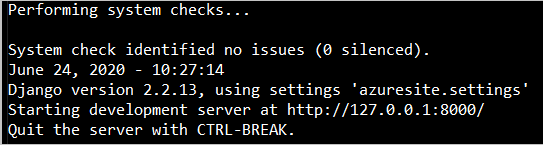
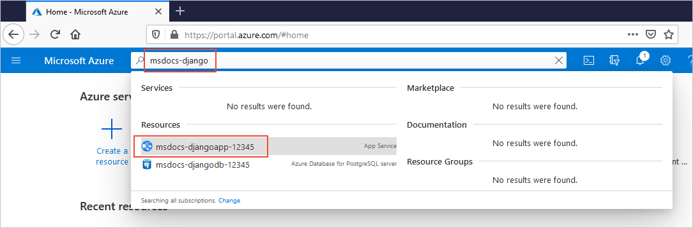
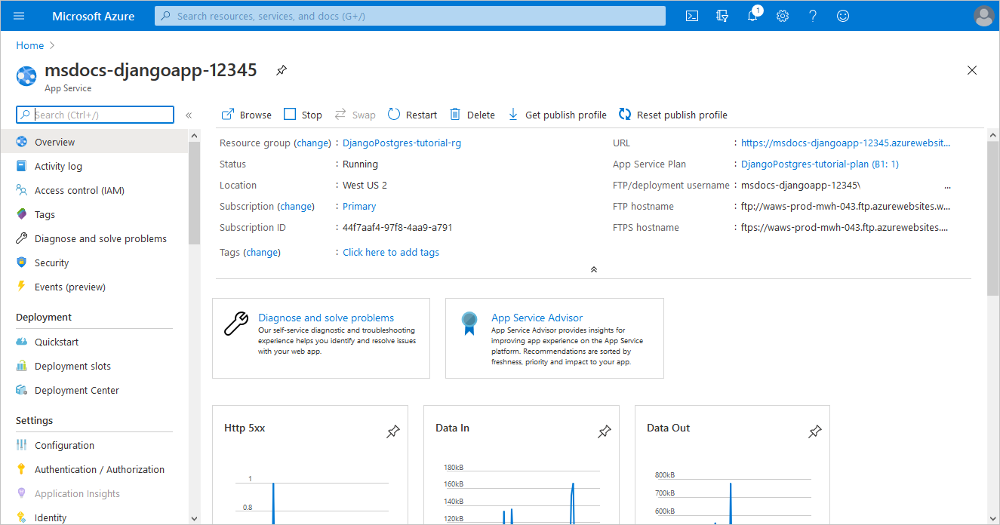

# Tutorial: Deploy a Django web app with PostgreSQL in Azure App Service

This tutorial shows how to deploy a data-driven Python [Django](https://www.djangoproject.com/) web app to [Azure App Service](overview.md) and connect it to an Azure Database for Postgres database. App Service provides a highly scalable, self-patching web hosting service.

In this tutorial, you use the Azure CLI to complete the following tasks:

> [!div class="checklist"]
> * Set up your initial environment with Python and the Azure CLI
> * Create an Azure Database for PostgreSQL database
> * Deploy code to Azure App Service and connect to PostgreSQL
> * Update your code and redeploy
> * View diagnostic logs
> * Manage the web app in the Azure portal

You can also use the [Azure portal version of this tutorial](/azure/developer/python/tutorial-python-postgresql-app-portal).


## 1. Set up your initial environment

1. Have an Azure account with an active subscription. [Create an account for free](https://azure.microsoft.com/free/?ref=microsoft.com&utm_source=microsoft.com&utm_medium=docs&utm_campaign=visualstudio).
1. Install <a href="https://www.python.org/downloads/" target="_blank">Python 3.6 or higher</a>.
1. Install the <a href="/cli/azure/install-azure-cli" target="_blank">Azure CLI</a> 2.18.0 or higher, with which you run commands in any shell to provision and configure Azure resources.

Open a terminal window and check your Python version is 3.6 or higher:

# [Bash](#tab/bash)

```bash
python3 --version
```

# [PowerShell](#tab/powershell)

```cmd
py -3 --version
```

# [Cmd](#tab/cmd)

```cmd
py -3 --version
```

---

Check that your Azure CLI version is 2.18.0 or higher:

```azurecli
az --version
```

If you need to upgrade, try the `az upgrade` command (requires version 2.11+) or see <a href="/cli/azure/install-azure-cli" target="_blank">Install the Azure CLI</a>.

Then sign in to Azure through the CLI:

```azurecli
az login
```

This command opens a browser to gather your credentials. When the command finishes, it shows JSON output containing information about your subscriptions.

Once signed in, you can run Azure commands with the Azure CLI to work with resources in your subscription.

Having issues? [Let us know](https://aka.ms/DjangoCLITutorialHelp).

## 2. Clone or download the sample app

# [Git clone](#tab/clone)

Clone the sample repository:

```terminal
git clone https://github.com/Azure-Samples/djangoapp
```

Then navigate into that folder:

```terminal
cd djangoapp
```

# [Download](#tab/download)

Visit [https://github.com/Azure-Samples/djangoapp](https://github.com/Azure-Samples/djangoapp), select **Clone**, and then select **Download ZIP**. 

Unpack the ZIP file into a folder named *djangoapp*. 

Then open a terminal window in that *djangoapp* folder.

---

The djangoapp sample contains the data-driven Django polls app you get by following [Writing your first Django app](https://docs.djangoproject.com/en/3.1/intro/tutorial01/) in the Django documentation. The completed app is provided here for your convenience.

The sample is also modified to run in a production environment like App Service:

- Production settings are in the *azuresite/production.py* file. Development settings are in *azuresite/settings.py*.
- The app uses production settings when the `WEBSITE_HOSTNAME` environment variable is set. Azure App Service automatically sets this variable to the URL of the web app, such as `msdocs-django.azurewebsites.net`.

The production settings are specific to configuring Django to run in any production environment and aren't particular to App Service. For more information, see the [Django deployment checklist](https://docs.djangoproject.com/en/3.1/howto/deployment/checklist/). Also see [Production settings for Django on Azure](configure-language-python.md#production-settings-for-django-apps) for details on some of the changes.

Having issues? [Let us know](https://aka.ms/DjangoCLITutorialHelp).

## 3. Create Postgres database in Azure

<!-- > [!NOTE]
> Before you create an Azure Database for PostgreSQL server, check which [compute generation](../postgresql/concepts-pricing-tiers.md#compute-generations-and-vcores) is available in your region. -->

Install the `db-up` extension for the Azure CLI:

```azurecli
az extension add --name db-up
```

If the `az` command is not recognized, be sure you have the Azure CLI installed as described in [Set up your initial environment](#1-set-up-your-initial-environment).

Then create the Postgres database in Azure with the [`az postgres up`](/cli/azure/ext/db-up/postgres#ext-db-up-az-postgres-up) command:

```azurecli
az postgres up --resource-group DjangoPostgres-tutorial-rg --location westus2 --sku-name B_Gen5_1 --server-name <postgres-server-name> --database-name pollsdb --admin-user <admin-username> --admin-password <admin-password> --ssl-enforcement Enabled
```

- **Replace** *\<postgres-server-name>* with a name that's **unique across all Azure** (the server endpoint becomes `https://<postgres-server-name>.postgres.database.azure.com`). A good pattern is to use a combination of your company name and another unique value.
- For *\<admin-username>* and *\<admin-password>*, specify credentials to create an administrator user for this Postgres server. The admin username can't be *azure_superuser*, *azure_pg_admin*, *admin*, *administrator*, *root*, *guest*, or *public*. It can't start with *pg_*. The password must contain **8 to 128 characters** from three of the following categories: English uppercase letters, English lowercase letters, numbers (0 through 9), and non-alphanumeric characters (for example, !, #, %). The password cannot contain username.
- Do not use the `$` character in the username or password. Later you create environment variables with these values where the `$` character has special meaning within the Linux container used to run Python apps.
- The B_Gen5_1 (Basic, Gen5, 1 core) [pricing tier](../postgresql/concepts-pricing-tiers.md) used here is the least expensive. For production databases, omit the `--sku-name` argument to use the GP_Gen5_2 (General Purpose, Gen 5, 2 cores) tier instead.

This command performs the following actions, which may take a few minutes:

- Create a [resource group](../azure-resource-manager/management/overview.md#terminology) called `DjangoPostgres-tutorial-rg`, if it doesn't already exist.
- Create a Postgres server named by the `--server-name` argument.
- Create an administrator account using the `--admin-user` and `--admin-password` arguments. You can omit these arguments to allow the command to generate unique credentials for you.
- Create a `pollsdb` database as named by the `--database-name` argument.
- Enable access from your local IP address.
- Enable access from Azure services.
- Create a database user with access to the `pollsdb` database.

You can do all the steps separately with other `az postgres` and `psql` commands, but `az postgres up` does all the steps together.

When the command completes, it outputs a JSON object that contains different connection strings for the database along with the server URL, a generated user name (such as "joyfulKoala@msdocs-djangodb-12345"), and a GUID password. **Copy the user name and password to a temporary text file** as you need them later in this tutorial.

<!-- not all locations support az postgres up -->
> [!TIP]
> `-l <location-name>`, can be set to any one of the [Azure regions](https://azure.microsoft.com/global-infrastructure/regions/). You can get the regions available to your subscription with the [`az account list-locations`](/cli/azure/account#az_account_list_locations) command. For production apps, put your database and your app in the same location.

Having issues? [Let us know](https://aka.ms/DjangoCLITutorialHelp).

## 4. Deploy the code to Azure App Service

In this section, you create app host in App Service app, connect this app to the Postgres database, then deploy your code to that host.

### 4.1 Create the App Service app

In the terminal, make sure you're in the *djangoapp* repository folder that contains the app code.

Create an App Service app (the host process) with the [`az webapp up`](/cli/azure/webapp#az_webapp_up) command:

```azurecli
az webapp up --resource-group DjangoPostgres-tutorial-rg --location westus2 --plan DjangoPostgres-tutorial-plan --sku B1 --name <app-name>
```
<!-- without --sku creates PremiumV2 plan -->

- For the `--location` argument, use the same location as you did for the database in the previous section.
- **Replace** *\<app-name>* with a unique name across all Azure (the server endpoint is `https://<app-name>.azurewebsites.net`). Allowed characters for *\<app-name>* are `A`-`Z`, `0`-`9`, and `-`. A good pattern is to use a combination of your company name and an app identifier.

This command performs the following actions, which may take a few minutes:

<!-- - Create the resource group if it doesn't exist. `--resource-group` is optional. -->
<!-- No it doesn't. az webapp up doesn't respect --resource-group -->
- Create the [resource group](../azure-resource-manager/management/overview.md#terminology) if it doesn't already exist. (In this command you use the same resource group in which you created the database earlier.)
- Create the [App Service plan](overview-hosting-plans.md) *DjangoPostgres-tutorial-plan* in the Basic pricing tier (B1), if it doesn't exist. `--plan` and `--sku` are optional.
- Create the App Service app if it doesn't exist.
- Enable default logging for the app, if not already enabled.
- Upload the repository using ZIP deployment with build automation enabled.
- Cache common parameters, such as the name of the resource group and App Service plan, into the file *.azure/config*. As a result, you don't need to specify all the same parameter with later commands. For example, to redeploy the app after making changes, you can just run `az webapp up` again without any parameters. Commands that come from CLI extensions, such as `az postgres up`, however, do not at present use the cache, which is why you needed to specify the resource group and location here with the initial use of `az webapp up`.

Upon successful deployment, the command generates JSON output like the following example:


Having issues? Refer first to the [Troubleshooting guide](configure-language-python.md#troubleshooting), otherwise, [let us know](https://aka.ms/DjangoCLITutorialHelp).

### 4.2 Configure environment variables to connect the database

With the code now deployed to App Service, the next step is to connect the app to the Postgres database in Azure.

The app code expects to find database information in four environment variables named `DBHOST`, `DBNAME`, `DBUSER`, and `DBPASS`.

To set environment variables in App Service, create "app settings" with the following [az webapp config appsettings set](/cli/azure/webapp/config/appsettings#az_webapp_config_appsettings_set) command.

```azurecli
az webapp config appsettings set --settings DBHOST="<postgres-server-name>" DBNAME="pollsdb" DBUSER="<username>" DBPASS="<password>"
```

- Replace *\<postgres-server-name>* with the name you used earlier with the `az postgres up` command. The code in *azuresite/production.py* automatically appends `.postgres.database.azure.com` to create the full Postgres server URL.
- Replace *\<username>* and *\<password>* with the administrator credentials that you used with the earlier `az postgres up` command, or those that `az postgres up` generated for you. The code in *azuresite/production.py* automatically constructs the full Postgres username from `DBUSER` and `DBHOST`, so don't include the `@server` portion. (Also, as noted earlier, you should not use the `$` character in either value as it has a special meaning for Linux environment variables.)
- The resource group and app names are drawn from the cached values in the *.azure/config* file.

In your Python code, you access these settings as environment variables with statements like `os.environ.get('DBHOST')`. For more information, see [Access environment variables](configure-language-python.md#access-environment-variables).

Having issues? Refer first to the [Troubleshooting guide](configure-language-python.md#troubleshooting), otherwise, [let us know](https://aka.ms/DjangoCLITutorialHelp).

### 4.3 Run Django database migrations

Django database migrations ensure that the schema in the PostgreSQL on Azure database match those described in your code.

1. Open an SSH session **in the browser** by navigating to the following URL and signing in with your Azure account credentials (not the database server credentials).

    ```
    https://<app-name>.scm.azurewebsites.net/webssh/host
    ```

    Replace `<app-name>` with the name used earlier in the `az webapp up` command.

    You can alternately connect to an SSH session with the [`az webapp ssh`](/cli/azure/webapp#az_webapp_ssh) command. On Windows, this command requires the Azure CLI 2.18.0 or higher.

    If you cannot connect to the SSH session, then the app itself has failed to start. [Check the diagnostic logs](#6-stream-diagnostic-logs) for details. For example, if you haven't created the necessary app settings in the previous section, the logs will indicate `KeyError: 'DBNAME'`.

1. In the SSH session, run the following commands (you can paste commands using **Ctrl**+**Shift**+**V**):

    ```bash
    # Change to the app folder
    cd $APP_PATH
    
    # Activate the venv
    source /antenv/bin/activate

    # Install requirements
    pip install -r requirements.txt

    # Run database migrations
    python manage.py migrate

    # Create the super user (follow prompts)
    python manage.py createsuperuser
    ```

    If you encounter any errors related to connecting to the database, check the values of the application settings created in the previous section.

1. The `createsuperuser` command prompts you for superuser credentials. For the purposes of this tutorial, use the default username `root`, press **Enter** for the email address to leave it blank, and enter `Pollsdb1` for the password.

1. If you see an error that the database is locked, make sure that you ran the `az webapp settings` command in the previous section. Without those settings, the migrate command cannot communicate with the database, resulting in the error.

Having issues? Refer first to the [Troubleshooting guide](configure-language-python.md#troubleshooting), otherwise, [let us know](https://aka.ms/DjangoCLITutorialHelp).
    
### 4.4 Create a poll question in the app

1. In a browser, open the URL `http://<app-name>.azurewebsites.net`. The app should display the message "Polls app" and "No polls are available" because there are no specific polls yet in the database.

    If you see "Application Error", then it's likely that you either didn't create the required settings in the previous step, [Configure environment variables to connect the database](#42-configure-environment-variables-to-connect-the-database), or that those value contain errors. Run the command `az webapp config appsettings list` to check the settings. You can also [check the diagnostic logs](#6-stream-diagnostic-logs) to see specific errors during app startup. For example, if you didn't create the settings, the logs will show the error, `KeyError: 'DBNAME'`.

    After updating the settings to correct any errors, give the app a minute to restart, then refresh the browser.

1. Browse to `http://<app-name>.azurewebsites.net/admin`. Sign in using Django superuser credentials from the previous section (`root` and `Pollsdb1`). Under **Polls**, select **Add** next to **Questions** and create a poll question with some choices.

1. Browse again to `http://<app-name>.azurewebsites.net` to confirm that the questions are now presented to the user. Answer questions however you like to generate some data in the database.

**Congratulations!** You're running a Python Django web app in Azure App Service for Linux, with an active Postgres database.

Having issues? [Let us know](https://aka.ms/DjangoCLITutorialHelp).

> [!NOTE]
> App Service detects a Django project by looking for a *wsgi.py* file in each subfolder, which `manage.py startproject` creates by default. When App Service finds that file, it loads the Django web app. For more information, see [Configure built-in Python image](configure-language-python.md).

## 5. Make code changes and redeploy

In this section, you make local changes to the app and redeploy the code to App Service. In the process, you set up a Python virtual environment that supports ongoing work.

### 5.1 Run the app locally

In a terminal window, run the following commands. Be sure to follow the prompts when creating the superuser:

# [bash](#tab/bash)

```bash
# Configure the Python virtual environment
python3 -m venv venv
source venv/bin/activate

# Install dependencies
pip install -r requirements.txt
# Run Django migrations
python manage.py migrate
# Create Django superuser (follow prompts)
python manage.py createsuperuser
# Run the dev server
python manage.py runserver
```

# [PowerShell](#tab/powershell)

```powershell
# Configure the Python virtual environment
py -3 -m venv venv
Set-ExecutionPolicy -Scope CurrentUser -ExecutionPolicy RemoteSigned -Force
venv\scripts\activate

# Install dependencies
pip install -r requirements.txt
# Run Django migrations
python manage.py migrate
# Create Django superuser (follow prompts)
python manage.py createsuperuser
# Run the dev server
python manage.py runserver
```

# [CMD](#tab/cmd)

```cmd
:: Configure the Python virtual environment
py -3 -m venv venv
venv\scripts\activate

:: Install dependencies
pip install -r requirements.txt
:: Run Django migrations
python manage.py migrate
:: Create Django superuser (follow prompts)
python manage.py createsuperuser
:: Run the dev server
python manage.py runserver
```
---

Once the web app is fully loaded, the Django development server provides the local app URL in the message, "Starting development server at http://127.0.0.1:8000/. Quit the server with CTRL-BREAK".



Test the app locally with the following steps:

1. Go to `http://localhost:8000` in a browser, which should display the message "No polls are available". 

1. Go to `http:///localhost:8000/admin` and sign in using the admin user you created previously. Under **Polls**, again select **Add** next to **Questions** and create a poll question with some choices. 

1. Go to *http:\//localhost:8000* again and answer the question to test the app. 

1. Stop the Django server by pressing **Ctrl**+**C**.

When running locally, the app is using a local Sqlite3 database and doesn't interfere with your production database. You can also use a local PostgreSQL database, if desired, to better simulate your production environment.

Having issues? [Let us know](https://aka.ms/DjangoCLITutorialHelp).

### 5.2 Update the app

In `polls/models.py`, locate the line that begins with `choice_text` and change the `max_length` parameter to 100:

```python
# Find this line of code and set max_length to 100 instead of 200
choice_text = models.CharField(max_length=100)
```

Because you changed the data model, create a new Django migration and migrate the database:

```
python manage.py makemigrations
python manage.py migrate
```

Run the development server again with `python manage.py runserver` and test the app at to *http:\//localhost:8000/admin*:

Stop the Django web server again with **Ctrl**+**C**.

Having issues? Refer first to the [Troubleshooting guide](configure-language-python.md#troubleshooting), otherwise, [let us know](https://aka.ms/DjangoCLITutorialHelp).

### 5.3 Redeploy the code to Azure

Run the following command in the repository root:

```azurecli
az webapp up
```

This command uses the parameters cached in the *.azure/config* file. Because App Service detects that the app already exists, it just redeploys the code.

Having issues? Refer first to the [Troubleshooting guide](configure-language-python.md#troubleshooting), otherwise, [let us know](https://aka.ms/DjangoCLITutorialHelp).

### 5.4 Rerun migrations in Azure

Because you made changes to the data model, you need to rerun database migrations in App Service.

Open an SSH session again in the browser by navigating to `https://<app-name>.scm.azurewebsites.net/webssh/host`. Then run the following commands:

```
cd $APP_PATH
source /antenv/bin/activate
pip install -r requirements.txt
python manage.py migrate
```

Having issues? Refer first to the [Troubleshooting guide](configure-language-python.md#troubleshooting), otherwise, [let us know](https://aka.ms/DjangoCLITutorialHelp).

### 5.5 Review app in production

Browse to `http://<app-name>.azurewebsites.net` and test the app again in production. (Because you changed only the length of a database field, the change is only noticeable if you try to enter a longer response when creating a question.)

Having issues? Refer first to the [Troubleshooting guide](configure-language-python.md#troubleshooting), otherwise, [let us know](https://aka.ms/DjangoCLITutorialHelp).

## 6. Stream diagnostic logs

You can access the console logs generated from inside the container that hosts the app on Azure.

Run the following Azure CLI command to see the log stream. This command uses parameters cached in the *.azure/config* file.

```azurecli
az webapp log tail
```

If you don't see console logs immediately, check again in 30 seconds.

To stop log streaming at any time, type **Ctrl**+**C**.

Having issues? [Let us know](https://aka.ms/DjangoCLITutorialHelp).

> [!NOTE]
> You can also inspect the log files from the browser at `https://<app-name>.scm.azurewebsites.net/api/logs/docker`.
>
> `az webapp up` turns on the default logging for you. For performance reasons, this logging turns itself off after some time, but turns back on each time you run `az webapp up` again. To turn it on manually, run the following command:
>
> ```azurecli
> az webapp log config --docker-container-logging filesystem
> ```

## 7. Manage your app in the Azure portal

In the [Azure portal](https://portal.azure.com), search for the app name and select the app in the results.



By default, the portal shows your app's **Overview** page, which provides a general performance view. Here, you can also perform basic management tasks like browse, stop, restart, and delete. The tabs on the left side of the page show the different configuration pages you can open.



Having issues? Refer first to the [Troubleshooting guide](configure-language-python.md#troubleshooting), otherwise, [let us know](https://aka.ms/DjangoCLITutorialHelp).

## 8. Clean up resources

If you'd like to keep the app or continue to the additional tutorials, skip ahead to [Next steps](#next-steps). Otherwise, to avoid incurring ongoing charges you can delete the resource group create for this tutorial:

```azurecli
az group delete --no-wait
```

The command uses the resource group name cached in the *.azure/config* file. By deleting the resource group, you also deallocate and delete all the resources contained within it.

Deleting all the resources can take some time. The `--no-wait` argument allows the command to return immediately.

Having issues? [Let us know](https://aka.ms/DjangoCLITutorialHelp).

## Next steps

Learn how to map a custom DNS name to your app:

> [!div class="nextstepaction"]
> [Tutorial: Map custom DNS name to your app](app-service-web-tutorial-custom-domain.md)

Learn how App Service runs a Python app:

> [!div class="nextstepaction"]
> [Configure Python app](configure-language-python.md)
