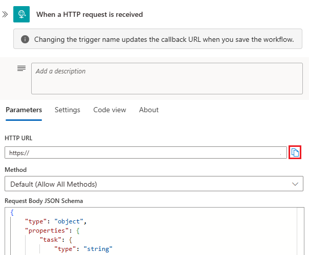
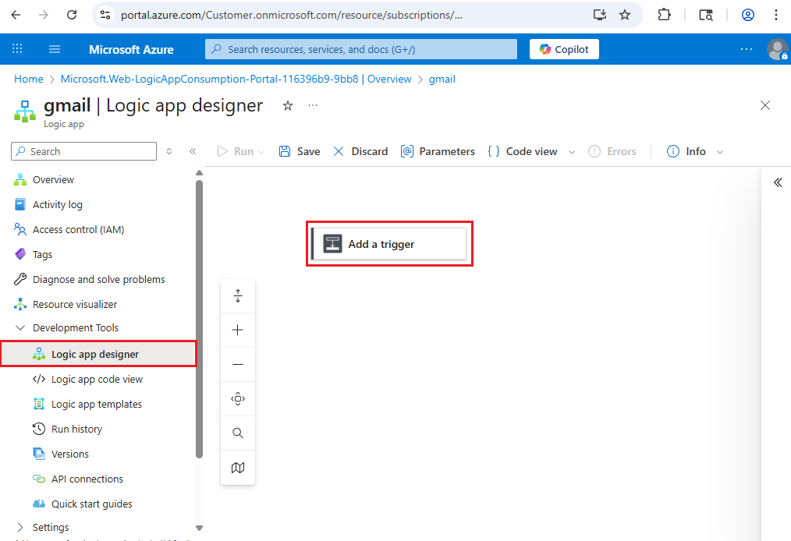
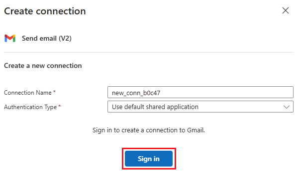
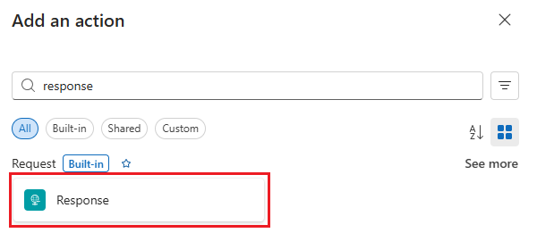

# Tutorial: Send email and invoke other business processes from App Service

In this tutorial, you learn how to integrate your App Service app with your business processes. This is common to web app scenarios, such as:

- Send confirmation email for a transaction
- Add user to Facebook group
- Connect to third-party systems like SAP, Salesforce, etc.
- Exchange standard B2B messages

In this tutorial, you send emails with Gmail from your App Service app by using [Azure Logic Apps](../logic-apps/logic-apps-overview.md). There are other ways to send emails from a web app, such as SMTP configuration provided by your language framework. However, Azure Logic Apps brings a lot more power to your App Service app without adding complexity to your code. Azure Logic Apps provides a simple configuration interface for the most popular business integrations, and your app can call them anytime with an HTTP request.

## Prerequisite

Deploy an app with the language framework of your choice to App Service. To follow a tutorial to deploy a sample app, see below:

### [ASP.NET](#tab/dotnet)

[Tutorial: Build an ASP.NET app in Azure with SQL Database](app-service-web-tutorial-dotnet-sqldatabase.md)

### [ASP.NET Core](#tab/dotnetcore)

[Tutorial: Build an ASP.NET Core and SQL Database app in Azure App Service](tutorial-dotnetcore-sqldb-app.md)

### [Node.js](#tab/node)

[Tutorial: Build a Node.js and MongoDB app in Azure](tutorial-nodejs-mongodb-app.md)

### [PHP](#tab/php)

[Tutorial: Build a PHP and MySQL app in Azure](tutorial-php-mysql-app.md)

### [Python](#tab/python)

[Tutorial: Run a Python (Django) web app with PostgreSQL in Azure App Service](tutorial-python-postgresql-app.md)

### [Ruby](#tab/ruby)

[Build a Ruby and Postgres app in Azure App Service on Linux](tutorial-ruby-postgres-app.md)

---

## Create the logic app

1. In the [Azure portal](https://portal.azure.com), create a Consumption logic app resource by following the instructions in [Create an example Consumption workflow](../logic-apps/quickstart-create-example-consumption-workflow.md). When page with the common triggers and templates gallery opens, return to this tutorial.

1. Under the **Start with a common trigger** section, select the trigger named **When an HTTP request is received** .

   

1. In the trigger information box, select **Use sample payload to generate schema**.

   

1. Copy the following sample JSON into the textbox and select **Done**.

    ```json
    {
        "task": "<description>",
        "due": "<date>",
        "email": "<email-address>"
    }
    ```

    The schema is now generated for the request data you want. In practice, you can just capture the actual request data your application code generates and let Azure generate the JSON schema for you.

1. On workflow designer toolbar, select **Save**.

    You can now see the URL of your HTTP request trigger. Select the copy icon to copy it for later use.

    

    This HTTP request definition is a trigger to anything you want to do in this logic app workflow, be it Gmail or anything else. Later you will invoke this URL in your App Service app. For more information on the request trigger, see the [HTTP request/response reference](../connectors/connectors-native-reqres.md).

1. Under the trigger, select **New step**. Under the **Choose an operation** search box, select **All**.

1. In the search box, enter **Gmail**. Find and select the action named **Send email (V2)**.

   > [!TIP]
   > You can search for other types of integrations, such as SendGrid, MailChimp, Microsoft 365, and SalesForce. For more information, see [Managed connectors for Azure Logic Apps](/connectors/connector-reference/connector-reference-logicapps-connectors).

1. In the **Gmail** action, select **Sign in** to authenticate access to the Gmail account from where you want to send the email.

   

1. After you sign in, select inside the **To** box, which automatically opens the dynamic content list. In this list, next to the **When an HTTP request is received** action, select **See more**.

   

   You should now see the three properties from your sample JSON data you used earlier. In this step, you use these properties from the HTTP request to construct an email.

1. For the **To** field value, select **email**. If you want, close the dynamic content list by selecting **Add dynamic content**.

   

1. From the **Add new parameter** list, select **Subject** and **Body**.

1. Select inside the **Subject** box, and in the same way, select **task**. With the cursor still in the **Subject** box, type **created**.

1. Select inside in the **Body** box, and in the same way, select **due**. Move the cursor to the left of **due**, and type **This work item is due on**.

   > [!TIP]
   > If you want to edit HTML content directly in the email body, on the designer toolbar, select **Code view**. Just make sure that you preserve the dynamic content code (for example, `@{triggerBody()?['due']}`)
   >
   >  

1. Next, add an asynchronous HTTP response to the HTTP trigger. Between the HTTP trigger and the Gmail action, select the **+** sign, and select **Add a parallel branch**.

   

1. In the search box, search for **response**, then select the **Response** action.

   

   By default, the response action sends an HTTP 200. That's good enough for this tutorial. For more information, see the [HTTP request/response reference](../connectors/connectors-native-reqres.md).

1. On the designer toolbar, select **Save** again.

## Add HTTP request code to app

Make sure you have copied the URL of the HTTP request trigger from earlier. Because it contains sensitive information, it's best practice that you don't put it into the code directly. With App Service, you can reference it as an environment variable instead, using app settings. 

In the [Cloud Shell](https://shell.azure.com), create the app setting with the following command (replace *\<app-name>*, *\<resource-group-name>*, and *\<logic-app-url>*):

```azurecli-interactive
az webapp config appsettings set --name <app-name> --resource-group <resource-group-name> --settings LOGIC_APP_URL="<your-logic-app-url>"
```

In your code, make a standard HTTP post to the URL using any HTTP client language that's available to your language framework, with the following configuration:

- The request body contains the same JSON format that you supplied to your logic app:

    ```json
    {
        "task": "<description>",
        "due": "<date>",
        "email": "<email-address>"
    }
    ```

- The request contains the heading `Content-Type: application/json`. 
- To optimize performance, send the request asynchronously if possible.

Click on the preferred language/framework tab below to see an example.

### [ASP.NET](#tab/dotnet)

In ASP.NET, you can send the HTTP post with the [System.Net.Http.HttpClient](/dotnet/api/system.net.http.httpclient) class. For example:

```csharp
// requires using System.Net.Http;
var client = new HttpClient();
// requires using System.Text.Json;
var jsonData = JsonSerializer.Serialize(new
{
    email = "a-valid@emailaddress.com",
    due = "4/1/2020",
    task = "My new task!"
});

HttpResponseMessage result = await client.PostAsync(
    // requires using System.Configuration;
    ConfigurationManager.AppSettings["LOGIC_APP_URL"],
    new StringContent(jsonData, Encoding.UTF8, "application/json"));
    
var statusCode = result.StatusCode.ToString();
```

If you're testing this code on the sample app for [Tutorial: Build an ASP.NET app in Azure with SQL Database](app-service-web-tutorial-dotnet-sqldatabase.md), you could use it to send an email confirmation in the [Create action](https://github.com/Azure-Samples/dotnet-sqldb-tutorial/blob/master/DotNetAppSqlDb/Controllers/TodosController.cs#L52-L63), after the `Todo` item is added. To use the asynchronous code above, convert the Create action to asynchronous.

### [ASP.NET Core](#tab/dotnetcore)

In ASP.NET Core, you can send the HTTP post with the [System.Net.Http.HttpClient](/dotnet/api/system.net.http.httpclient) class. For example:

```csharp
// requires using System.Net.Http;
var client = new HttpClient();
// requires using System.Text.Json;
var jsonData = JsonSerializer.Serialize(new
{
    email = "a-valid@emailaddress.com",
    due = "4/1/2020",
    task = "My new task!"
});

HttpResponseMessage result = await client.PostAsync(
    // Requires DI configuration to access app settings. See https://learn.microsoft.com/azure/app-service/configure-language-dotnetcore#access-environment-variables
    _configuration["LOGIC_APP_URL"],
    new StringContent(jsonData, Encoding.UTF8, "application/json"));
    
var statusCode = result.StatusCode.ToString();
```

> [!NOTE]
> This code is written for simplicity of demonstration. In practice, don't instantiate an `HttpClient` object for each request. Follow the guidance at [Use IHttpClientFactory to implement resilient HTTP requests](/dotnet/architecture/microservices/implement-resilient-applications/use-httpclientfactory-to-implement-resilient-http-requests).

If you're testing this code on the sample app for [Tutorial: Build an ASP.NET Core and SQL Database app in Azure App Service](tutorial-dotnetcore-sqldb-app.md), you could use it to send an email confirmation in the [Create action](https://github.com/Azure-Samples/dotnetcore-sqldb-tutorial/blob/master/Controllers/TodosController.cs#L56-L65), after the `Todo` item is added.

### [Node.js](#tab/node)

In Node.js, you can send the HTTP post easily with an npm package like [axios](https://www.npmjs.com/package/axios). For example:

```javascript
// Requires npm install --save axios
const axios = require('axios');

var jsonData = {
        email: "a-valid@emailaddress.com",
        due: "4/1/2020",
        task: "My new task!"
};

(async function(data) {
    try {
        const response = await axios.post(process.env.LOGIC_APP_URL, jsonData);
        console.log(response.status);
    } catch (error) {
        console.log(error);
    }
})(jsonData);

```

If you're testing this code on the sample app for [Tutorial: Build a Node.js and MongoDB app in Azure](tutorial-nodejs-mongodb-app.md), you could use it to send an email confirmation in the [create function](https://github.com/Azure-Samples/meanjs/blob/master/modules/articles/server/controllers/articles.server.controller.js#L14-L27), after [the article is saved successfully](https://github.com/Azure-Samples/meanjs/blob/master/modules/articles/server/controllers/articles.server.controller.js#L24).

### [PHP](#tab/php)

In PHP, you can send the HTTP post easily with [Guzzle](http://docs.guzzlephp.org/en/stable/index.html). For example:

```php
// Requires composer require guzzlehttp/guzzle:~6.0
use GuzzleHttp\Client;
...
$client = new Client();
$options = [
    'json' => [ 
        'email' => 'a-valid@emailaddress.com',
        'due' => '4/1/2020',
        'task' => "My new task!"
    ]
];

$promise = $client-> postAsync(getenv($LOGIC_APP_URL), $options)->then( 
    function ($response) {
        return $response->getStatusCode();
    }, function ($exception) {
        return $exception->getResponse();
    }
);

$response = $promise->wait();
// Requires Laravel to run Log::info(). Check the documentation of your preferred framework for logging instructions.
Log::info(print_r($response, TRUE));
```

If you're testing this code on the sample app for [Tutorial: Build a PHP and MySQL app in Azure](tutorial-php-mysql-app.md), you could use it to send an email confirmation in the [Route::post function](https://github.com/Azure-Samples/laravel-tasks/blob/master/routes/web.php#L30-L48), just before the return statement.

### [Python](#tab/python)

In Python, you can send the HTTP post easily with [requests](https://pypi.org/project/requests/). For example:

```python
# Requires pip install requests && pip freeze > requirements.txt
import requests
import os
...
payload = {
    "email": "a-valid@emailaddress.com",
    "due": "4/1/2020",
    "task": "My new task!"
}
response = requests.post(os.environ['LOGIC_APP_URL'], data = payload)
print(response.status_code)
```
<!-- ```python
# Requires pip install aiohttp && pip freeze > requirements.txt
import aiohttp
...
payload = {
        'email': 'a-valid@emailaddress.com',
        'due': '4/1/2020',
        'task': 'My new task!'
}
async with aiohttp.post('http://httpbin.org/post', data=json.dump(payload)) as resp:
    print(await resp.status())
``` -->

If you're testing this code on the sample app for [Tutorial: Run a Python (Django) web app with PostgreSQL in Azure App Service](tutorial-python-postgresql-app.md), you could use it to send an email confirmation in the [Route::post function](https://github.com/Azure-Samples/laravel-tasks/blob/master/routes/web.php#L30-L48), just before the return statement.

### [Ruby](#tab/ruby)

In Ruby, you can send the HTTP post easily with JSONClient. For example:

```ruby
clnt = JSONClient.new
body = { 
    'email' => 'a-valid@emailaddress.com',
    'due' => '4/1/2020',
    'task' => "My new task!"
}

connection = clnt.post_async(ENV['LOGIC_APP_URL'], body)
```

If you're testing this code on the sample app for [Build a Ruby and Postgres app in Azure App Service on Linux](tutorial-ruby-postgres-app.md), you could use it to send an email confirmation in the [create](https://github.com/Azure-Samples/rubyrails-tasks/blob/master/app/controllers/tasks_controller.rb#L26-L38) action, [when @task.save succeeds](https://github.com/Azure-Samples/rubyrails-tasks/blob/master/app/controllers/tasks_controller.rb#L30).

---

## Next steps

- [Tutorial: Host a RESTful API with CORS in Azure App Service](app-service-web-tutorial-rest-api.md)
- [HTTP request/response reference for Logic Apps](../connectors/connectors-native-reqres.md)
- [Quickstart: Create an example Consumption workflow in multi-tenant Azure Logic Apps - Azure portal](../logic-apps/quickstart-create-example-consumption-workflow.md)
- [Environment variables and app settings reference](reference-app-settings.md)
