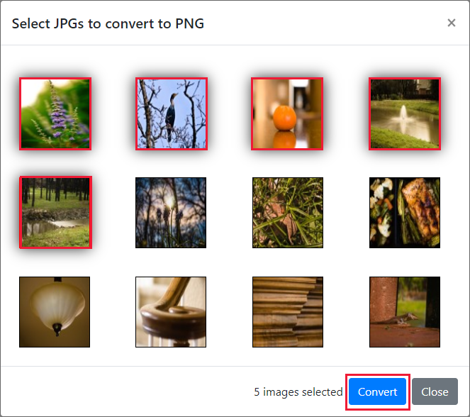
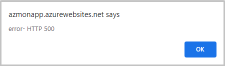
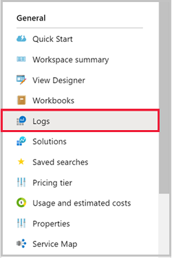
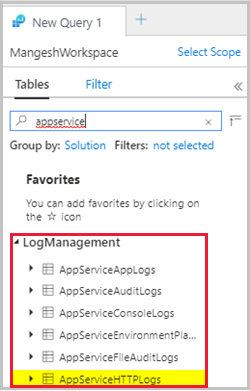
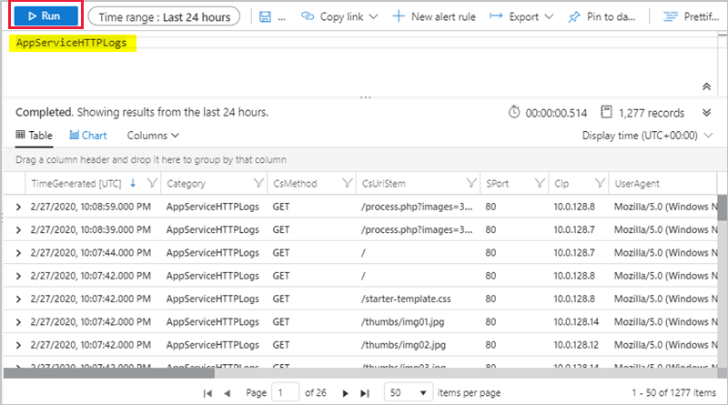
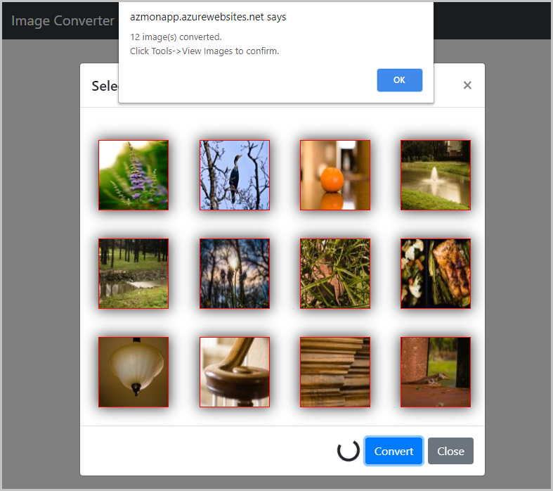

# Tutorial: Troubleshoot an App Service app with Azure Monitor

This tutorial shows how to troubleshoot an [App Service](overview.md) app using [Azure Monitor](../azure-monitor/overview.md). The sample app includes code meant to exhaust memory and cause HTTP 500 errors, so you can diagnose and fix the problem using Azure Monitor. When you're finished, you have a sample app running on App Service on Linux integrated with [Azure Monitor](../azure-monitor/overview.md).

[Azure Monitor](../azure-monitor/overview.md) maximizes the availability and performance of your applications and services by delivering a comprehensive solution for collecting, analyzing, and acting on telemetry from your cloud and on-premises environments.

In this tutorial, you learn how to:

> [!div class="checklist"]
> * Configure a web app with Azure Monitor
> * Send console logs to Log Analytics
> * Use Log queries to identify and troubleshoot web app errors

You can follow the steps in this tutorial on macOS, Linux, Windows.

[!INCLUDE [quickstarts-free-trial-note](../../includes/quickstarts-free-trial-note.md)]

## Prerequisites

To complete this tutorial, you need:

- [Azure subscription](https://azure.microsoft.com/free/?ref=microsoft.com&utm_source=microsoft.com&utm_medium=docs&utm_campaign=visualstudio)

- [Git](https://git-scm.com/)

[!INCLUDE [azure-cli-prepare-your-environment-no-header.md](~/articles/reusable-content/azure-cli/azure-cli-prepare-your-environment-no-header.md)]

## Create Azure resources

First, you run several commands locally to set up a sample app to use with this tutorial. The commands create Azure resources, create a deployment user, and deploy the sample app to Azure. You're prompted for the password supplied as a part of the creation of the deployment user. 

```azurecli
az group create --name myResourceGroup --location "South Central US"
az webapp deployment user set --user-name <username> --password <password>
az appservice plan create --name myAppServicePlan --resource-group myResourceGroup --sku B1 --is-linux
az webapp create --resource-group myResourceGroup --plan myAppServicePlan --name <app-name> --runtime "PHP|8.1" --deployment-local-git
az webapp config appsettings set --name <app-name> --resource-group myResourceGroup --settings DEPLOYMENT_BRANCH='main'
git clone https://github.com/Azure-Samples/App-Service-Troubleshoot-Azure-Monitor
cd App-Service-Troubleshoot-Azure-Monitor
git branch -m main
git remote add azure <url-from-app-webapp-create>
git push azure main
```

## Configure Azure Monitor

### Create a Log Analytics Workspace

Now that you've deployed the sample app to Azure App Service, you configure monitoring capability to troubleshoot the app when problems arise. Azure Monitor stores log data in a Log Analytics workspace. A workspace is a container that includes data and configuration information.

In this step, you create a Log Analytics workspace to configure Azure Monitor with your app.

```azurecli
az monitor log-analytics workspace create --resource-group myResourceGroup --workspace-name myMonitorWorkspace
```

> [!NOTE]
> [For Azure Monitor Log Analytics, you pay for data ingestion and data retention.](https://azure.microsoft.com/pricing/details/monitor/)
>

### Create a diagnostic setting

Diagnostic settings can be used to collect metrics for certain Azure services into Azure Monitor Logs for analysis with other monitoring data using log queries. For this tutorial, you enable the web server and standard output/error logs. See [supported log types](./troubleshoot-diagnostic-logs.md#supported-log-types) for a complete list of log types and descriptions.

You run the following commands to create diagnostic settings for AppServiceConsoleLogs (standard output/error) and AppServiceHTTPLogs (web server logs). Replace _\<app-name>_ and _\<workspace-name>_ with your values. 

> [!NOTE]
> The first two commands, `resourceID` and `workspaceID`, are variables to be used in the [az monitor diagnostic-settings create](/cli/azure/monitor/diagnostic-settings#az-monitor-diagnostic-settings-create) command. See [Create diagnostic settings using Azure CLI](../azure-monitor/essentials/create-diagnostic-settings.md?tabs=cli) for more information on this command.
>

```azurecli
resourceID=$(az webapp show -g myResourceGroup -n <app-name> --query id --output tsv)

workspaceID=$(az monitor log-analytics workspace show -g myResourceGroup --workspace-name <workspace-name> --query id --output tsv)

az monitor diagnostic-settings create --resource $resourceID \
 --workspace $workspaceID \
 -n myMonitorLogs \
 --logs '[{"category": "AppServiceConsoleLogs", "enabled": true},
  {"category": "AppServiceHTTPLogs", "enabled": true}]'
```

## Troubleshoot the app

Browse to `http://<app-name>.azurewebsites.net`.

The sample app, ImageConverter, converts included images from `JPG` to `PNG`. A bug has been deliberately placed in the code for this tutorial. If you select enough images, the app produces an HTTP 500 error during image conversion. Imagine this scenario wasn't considered during the development phase. You'll use Azure Monitor to troubleshoot the error.

### Verify the app works

To convert images, click `Tools` and select `Convert to PNG`.


Select the first two images and click `convert`. This converts successfully.


### Break the app

Now that you've verified the app by converting two images successfully, we try to convert the first five images.



This action fails and produces a `HTTP 500` error that wasn't tested during development.



## Use log query to view Azure Monitor logs

Let's see what logs are available in the Log Analytics workspace. 

Click this [Log Analytics workspace link](https://portal.azure.com/#blade/HubsExtension/BrowseResourceBlade/resourceType/Microsoft.OperationalInsights%2Fworkspaces) to access your workspace in the Azure portal.

In the Azure portal, select your Log Analytics workspace.

### Log queries

Log queries help you to fully apply the value of the data collected in Azure Monitor Logs. You use log queries to identify the logs in both AppServiceHTTPLogs and AppServiceConsoleLogs. See the [log query overview](../azure-monitor/logs/log-query-overview.md) for more information on log queries.

### View AppServiceHTTPLogs with log query

Now that we've accessed the app, let's view the data associated with HTTP requests, found in the `AppServiceHTTPLogs`.

1. Click `Logs` from the left-hand navigation.



2. Search for `appservice` and double-click `AppServiceHTTPLogs`.



3. Click `Run`.



The `AppServiceHTTPLogs` query returns all requests in the past 24-hours. The column `ScStatus` contains the HTTP status. To diagnose the `HTTP 500` errors, limit the `ScStatus` to 500 and run the query, as shown below:

```kusto
AppServiceHTTPLogs
| where ScStatus == 500
```

### View AppServiceConsoleLogs with log query

Now that you've confirmed the HTTP 500s, let's take a look at the standard output/errors from the app. These logs are found in `AppServiceConsoleLogs'.

(1) Click `+` to create a new query. 

(2) Double-click the `AppServiceConsoleLogs` table and click `Run`. 

Since converting five images results in server errors, you can see if the app is also writing errors by filtering `ResultDescription` for errors, as show below:

```kusto
AppServiceConsoleLogs |
where ResultDescription  contains "error" 
```

In the `ResultDescription` column, you see the following error:

```output
PHP Fatal error:  Allowed memory size of 134217728 bytes exhausted 
(tried to allocate 16384 bytes) in /home/site/wwwroot/process.php on line 20, 
referer: http://<app-name>.azurewebsites.net/
```

### Join AppServiceHTTPLogs and AppServiceConsoleLogs

Now that you've identified both HTTP 500s and standard errors, you need to confirm if there's a correlation between these messages. Next, you join the tables together based on the time stamp, `TimeGenerated`.

> [!NOTE]
> A query has been prepared for you that does the following:
>
> - Filters HTTPLogs for 500 errors
> - Queries console logs
> - Joins the tables on `TimeGenerated`
>

Run the following query:

```kusto
let myHttp = AppServiceHTTPLogs | where  ScStatus == 500 | project TimeGen=substring(TimeGenerated, 0, 19), CsUriStem, ScStatus;  

let myConsole = AppServiceConsoleLogs | project TimeGen=substring(TimeGenerated, 0, 19), ResultDescription;

myHttp | join myConsole on TimeGen | project TimeGen, CsUriStem, ScStatus, ResultDescription;
```

In the `ResultDescription` column, you'll see the following error at the same time as web server errors:

```output
PHP Fatal error:  Allowed memory size of 134217728 bytes exhausted 
(tried to allocate 16384 bytes) in /home/site/wwwroot/process.php on line 20, 
referer: http://<app-name>.azurewebsites.net/
```

The message states memory has been exhausted on line 20 of `process.php`. You've now confirmed that the application produced an error during the HTTP 500 error. Let's take a look at the code to identify the problem.

## Identify the error

In the local directory, open the `process.php` and look at line 20. 

```php
imagepng($imgArray[$x], $filename);
```

The first argument, `$imgArray[$x]`, is a variable holding all JPGs (in-memory) needing conversion. However, `imagepng` only needs the image being converted and not all images. Pre-loading images is not necessary and may be causing the memory exhaustion, leading to HTTP 500s. Let's update the code to load images on-demand to see if it resolves the issue. Next, you improve the code to address the memory problem.

## Fix the app

### Update locally and redeploy the code

You make the following changes to `process.php` to handle the memory exhaustion:

```php
<?php

//Retrieve query parameters
$maxImages = $_GET['images'];
$imgNames  = explode(",",$_GET['imgNames']);

//Load JPEGs into an array (in memory)
for ($x=0; $x<$maxImages; $x++){
    $filename = './images/converted_' . substr($imgNames[$x],0,-4) . '.png';
    imagepng(imagecreatefromjpeg("./images/" . $imgNames[$x]), $filename);
}
```

Commit your changes in Git, and then push the code changes to Azure.

```bash
git commit -am "Load images on-demand in process.php"
git push azure main
```

### Browse to the Azure app

Browse to `http://<app-name>.azurewebsites.net`. 

Converting images should not longer produce the HTTP 500 errors.



[!INCLUDE [cli-samples-clean-up](../../includes/cli-samples-clean-up.md)]

Delete the diagnostic setting with the following command:

```azurecli
az monitor diagnostic-settings delete --resource $resourceID -n myMonitorLogs
```
What you learned:

> [!div class="checklist"]
> * Configured a web app with Azure Monitor
> * Sent logs to Log Analytics
> * Used log queries to identify and troubleshoot web app errors

## <a name="nextsteps"></a> Next steps
* [Query logs with Azure Monitor](../azure-monitor/logs/log-query-overview.md)
* [Troubleshooting Azure App Service in Visual Studio](troubleshoot-dotnet-visual-studio.md)
* [Analyze app Logs in HDInsight](https://gallery.technet.microsoft.com/scriptcenter/Analyses-Windows-Azure-web-0b27d413)
* [Tutorial: Run a load test to identify performance bottlenecks in a web app](../load-testing/tutorial-identify-bottlenecks-azure-portal.md)
